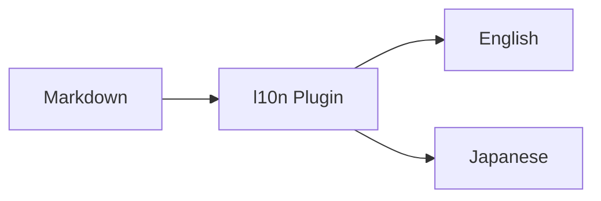
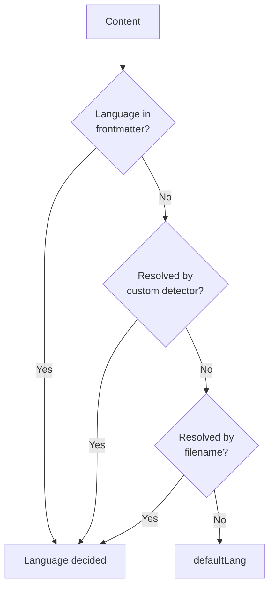
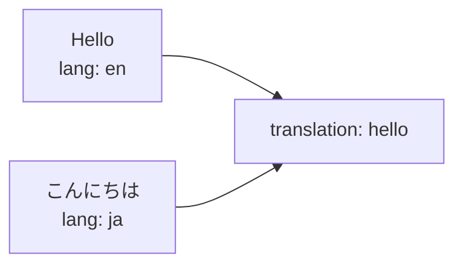
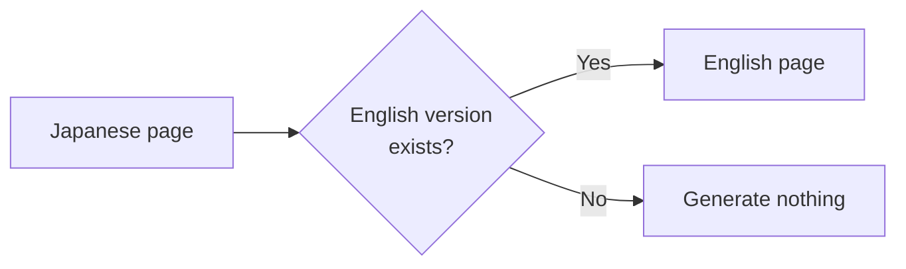
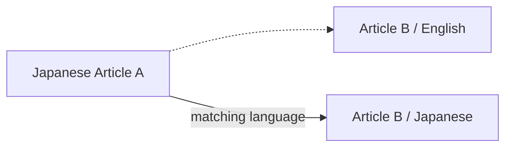
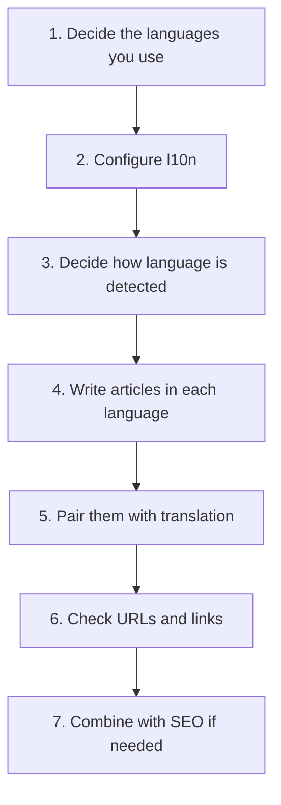

# Localization

Riebeckite localizes **content**. With `@riebeckite/plugin-l10n` it can keep several language versions of the same note side by side, prefix non-default languages in the URL, add a language switcher, and emit `hreflang` links. It does not translate Riebeckite's own interface strings.



The plugin handles per-content language detection, language-specific URLs, translations of the same content, in-site links, the language switcher, and `hreflang` for SEO.

The `starter` preset and above register it with seven languages:

```text
en
ja
zh-CN
es
de
fr
ko
```

`minimal` does not. You do not need articles in every language; configure only the languages you actually use.

## Basic setup

Add the `l10n` plugin to `riebeckite.config.ts`:

```ts
import { l10n } from "@riebeckite/plugin-l10n";

export default defineConfig({
  plugins: [l10n({ defaultLang: "ja", languages: ["ja", "en", "zh-CN"] })],
});
```

`defaultLang` must appear in `languages`. In this example the default is `ja` and the recognized languages are `ja`, `en`, and `zh-CN`.

`defaultLang` is also used when a content's language cannot be determined by any other method.

## How a note's language is detected

The plugin looks for four signals, in this precedence order:

1. **Frontmatter** — `lang:` anywhere in the file.
2. **Custom detector** — if you provide `detect`.
3. **Filename** — `note.ja.md` (recommended), and also `note-en.md` / `note_ja.md`, or BCP 47 tags such as `note.en-US.md`, `note.zh-CN.md`.
4. **`defaultLang`** — used when nothing above matched.



The first method that resolves the content decides its language.

The filename suffix is the only implicit signal the plugin infers from the path; a language directory such as `content/en/note.md` is not treated as a locale. Signals can be mixed; a conflict emits `L10N_LANGUAGE_CONFLICT`, which becomes a build failure with `strict: true`.

## Setting the language in frontmatter

The most explicit signal is the frontmatter `lang`:

```md
---
title: Hello
lang: ja
publish: true
---

This is a Japanese article.
```

This content is treated as Japanese. Use it when you want to state the language independently of the file's location or name.

## Splitting by filename

When several languages live in the same directory, split them by filename suffix:

```text
README.md
README.ja.md
```

The `.ja` in `README.ja.md` marks the content as Japanese. The `defaultLang` language does not get a suffix.

`.lang` is recommended, but `-lang` and `_lang` are treated the same way. This keeps the original and its translation close together:

```text
docs/
├─ README.md
├─ README.ja.md
├─ installation.md
└─ installation.ja.md
```

## Directories are not used

A layout that separates languages by directory (`en/note.md`, `ja/note.md`) is **not** used for language detection. Restricting the implicit rule to the filename suffix lets a WikiLink resolve uniquely even when the same-named article exists in several languages. Specify the language through the filename suffix or the frontmatter `lang`.

## Grouping translations

Translation identity is independent of the file's path or name. Give the same `translation` value to every language version.

For example, the Japanese version:

```md
---
title: こんにちは
publish: true
lang: ja
translation: hello
---

日本語の記事です。
```

And the matching English version:

```md
---
title: Hello
publish: true
lang: en
translation: hello
---

This is the English version.
```

Because both carry

```yaml
translation: hello
```

they are treated as translations of the same content.



A duplicate `translation + lang` pair emits `L10N_DUPLICATE_TRANSLATION` (again a build failure under `strict: true`). Use `translation` when the files have unrelated paths or names.

For a convention the plugin does not know, supply `detect`. Its language is considered after frontmatter and before filename, and its `translationId` is explicit:

```ts
l10n({
  defaultLang: "ja",
  languages: ["ja", "en", "fr"],
  detect: ({ path }) =>
    path.startsWith("French/") ? { lang: "fr", translationId: "hello" } : undefined,
});
```

## `lang` vs `translation`

The two fields have different roles:

| Field | Meaning |
| --- | --- |
| `lang` | What language this page is written in |
| `translation` | Which pages are translations of one another |

For example,

```yaml
lang: ja
translation: getting-started
```

means:

```text
Language of this page
  → Japanese

Translation group
  → getting-started
```

`translation` is not itself a language name; pages that represent the same content share the same value.

## When a translation is missing

You do not need every language version for every piece of content:

```text
article-a.md       Japanese
article-a.en.md    English
article-b.md       Japanese
```

is fine. When `article-b` has no English version, Riebeckite does not generate an English page for it automatically.



The l10n plugin works with existing translation relationships; it is not a content translator.

## URLs

The l10n plugin uses each content's language to resolve its public URL. Localization is therefore not just a language label in the UI:

```text
Content
  ↓
Language detection
  ↓
Public Location
  ↓
URL
```

The default language keeps Core's resolved URL (`/about`); other languages are prefixed (`/en/about`). The plugin augments the existing content-location resolver rather than adding a router, so it composes with URL plugins such as `@riebeckite/plugin-permalink`.

Do not build a URL from the filename yourself on the site side; use the Public Location Riebeckite resolved. See [Content System](../framework/content-system.md) for how public locations work.

No fallback pages are generated. If a translation is missing, the original target stays linked and internal helpers report the absence:

- `getLocalization(manifest, slug)` returns `availableLanguages` and language-to-href `translations` only for notes that exist.
- `getLocalizedContent(manifest, slug, lang)` returns `null` for a missing translation.

## In-site links

On a multilingual site, links in the body text also take the language into account. When a Japanese article links to another article that has a Japanese version, the link can be resolved to that language:



This avoids a link in an article body dropping the reader back into another language.

Before the content graph is built, WikiLink targets are switched to the source note's language when that translation exists; otherwise the original target remains. The rendered article rewrites both Obsidian WikiLinks (after `@riebeckite/plugin-obsidian-markdown` resolves them) and Markdown links to an existing translation in the current page's language, preserving query strings and fragments. External, fragment-only, unknown, and asset URLs are left unchanged.

## Language switcher

Content that shares the same `translation` becomes a candidate for the language switcher. For content with

```text
translation: hello

├─ lang: en
├─ lang: ja
└─ lang: de
```

each can be treated as another language version of the same content. **Only translations that actually exist are candidates.** No fallback page is generated for a language that is missing.

`l10n(...)` publishes a built-in, styled `LanguageSwitcher` in the standard `article.metadata` layout slot. A standard site renders that slot, so no l10n-specific integration is needed. The switcher is omitted on a page with fewer than two real translations.

```ts
// Keep URLs and metadata but do not render UI.
l10n({ defaultLang: "ja", languages: ["ja", "en"], ui: false });

// Use another standard slot, or replace the component.
l10n({
  defaultLang: "ja",
  languages: ["ja", "en"],
  ui: {
    slot: "article.footer",
    render: ({ localization }) => `<p>${localization.lang}</p>`,
  },
});
```

Themes can restyle the default component through its `.l10n-switcher` classes. `ui.render` is framework-neutral HTML, so a custom site can supply its own server-rendered component.

## SEO

Combined with the SEO plugin, translation relationships can be emitted as `hreflang`:

```text
English page
   ↕
translation relationship
   ↕
Japanese page
   ↓
SEO
   ↓
hreflang
```

This tells search engines that the pages are language versions of the same content. Each translated entry receives one `<link rel="alternate" hreflang="…">` per existing translation through Core's head-tag extension point. The site shell renders those tags and selects `<html lang>` for a request.

## Recommended layout

For an English/Japanese site, a layout such as the following works well:

```text
content/
├─ getting-started.md
├─ getting-started.ja.md
├─ installation.md
├─ installation.ja.md
└─ faq.ja.md
```

Then state the translation relationship in frontmatter. The English version:

```md
---
title: Getting Started
lang: en
translation: getting-started
publish: true
---
```

The Japanese version:

```md
---
title: はじめに
lang: ja
translation: getting-started
publish: true
---
```

`faq.ja.md`, which has no translation yet, can be published in Japanese alone.

## Introduction flow

When building a multilingual site, it helps to decide things in this order:



## Summary

Riebeckite localization is easier to reason about when you separate three things:

```text
lang
  → what language this content is in

translation
  → which content is a translation of which

Public Location
  → at which URL that language's content is published
```

The language is decided in this precedence order:

```text
frontmatter
    ↓
custom detector
    ↓
filename
    ↓
defaultLang
```

Translation relationships are stated with `translation`, and only translations that actually exist are used. Riebeckite never generates a missing translation automatically.

## Options reference

| Option | Purpose |
| --- | --- |
| `defaultLang` | The language that keeps unprefixed URLs. Required |
| `languages` | The recognized languages. Only these are treated as locales |
| `strict` | Turn language conflicts and duplicate translations into build failures |
| `ui` | `false` to disable the switcher, or `{ slot, render }` to customize it |
| `detect` | Custom detection: returns `{ lang, translationId }` or `undefined` |

The full option list and implementation notes are in the plugin README.

## See also

- [Configuration](../reference/configuration.md) — `plugins` and `content`
- [Plugin API](../reference/plugin-api.md) — public-location resolution
- [Content System](../framework/content-system.md) — how resolved locations reach pages
