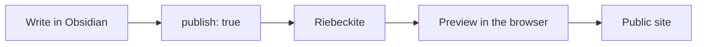
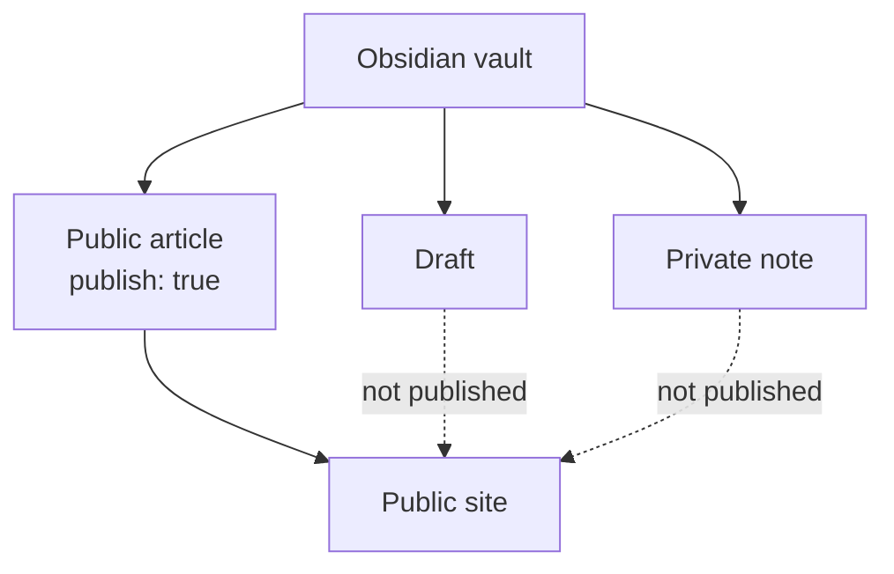
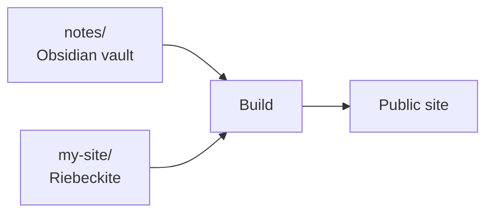
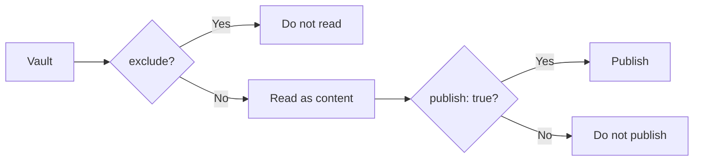
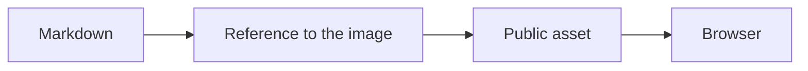
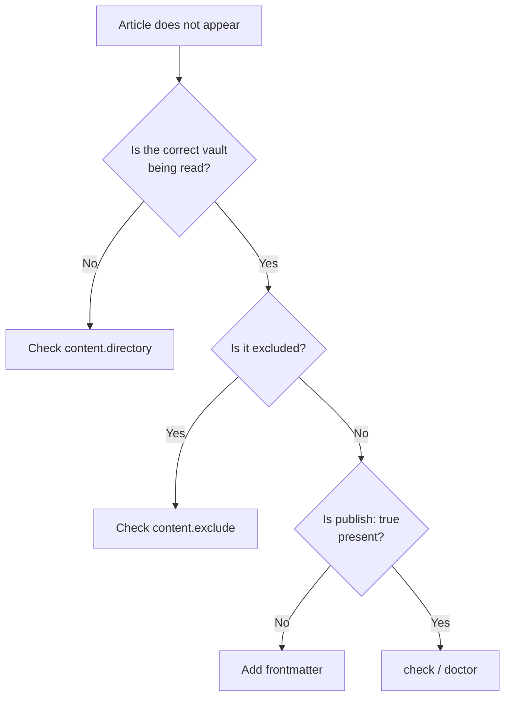
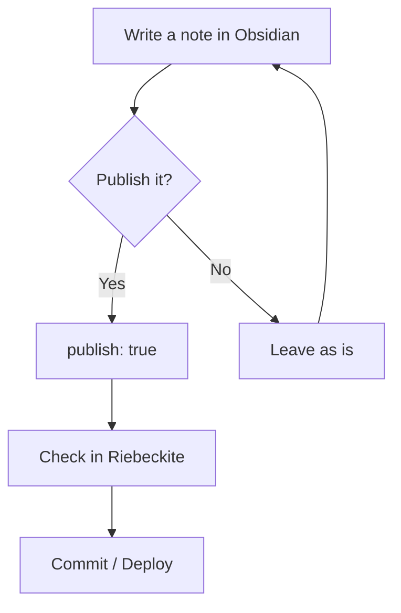

# Publishing Obsidian notes

Riebeckite can use your everyday Obsidian vault as the place where articles
live. You do not have to rebuild an existing vault for Riebeckite, or convert
your Markdown into another format.

The basic flow is:



Point Riebeckite at the vault and add `publish: true` only to the notes you
want to make public.

## The basic idea

Riebeckite turns Markdown files from a configured folder into a site. An Obsidian vault is also a Markdown folder, so you can point `content.directory` at the vault.

You do not have to rebuild an existing vault for Riebeckite. Riebeckite reads Markdown from the configured folder; it does not rewrite your notes as part of normal `dev`, `check`, `doctor`, `inspect`, or `build` commands. Keep using Obsidian as your editor, and opt in only the notes you want to publish.

Each note decides whether it is published through frontmatter.

```md
---
title: Published note
publish: true
---
```

Notes without `publish: true` are not published by the default explicit publish strategy. This lets you keep private notes and public articles in the same vault.

## Using an existing vault as-is

An Obsidian vault is a folder full of Markdown files, and Riebeckite also reads
Markdown from a specified folder, so pointing `content.directory` at the vault
is enough to use it as content.

For example, an existing vault such as:

```text
notes/
|- Welcome.md
|- Programming/
|  `- Flutter.md
|- private/
|  `- memo.md
`- .obsidian/
```

can be read by Riebeckite without changes. Running the usual:

```text
dev
check
doctor
inspect
build
```

does not reorganize the vault or rewrite its Markdown on your behalf. You keep
editing notes in Obsidian exactly as before.

## Templater templates

When the vault has the Obsidian Templater plugin configured, Riebeckite reads
`.obsidian/plugins/templater-obsidian/data.json` and excludes the configured
`templates_folder` before scanning Markdown or parsing frontmatter. Templates
therefore do not enter the content manifest, SSG, or the development server.

Riebeckite does not execute Templater code. A Templater expression in an
ordinary note remains ordinary Markdown and does not exclude that note. If the
Templater setting or its template folder is unavailable, no automatic exclusion
is applied; use `content.exclude` when you want to exclude a folder explicitly.

## Choosing which notes to publish

The default publish rule makes a note public only when its frontmatter
contains:

```yaml
publish: true
```

For example:

```md
---
title: Published note
publish: true
---

This note is published.
```

By contrast:

```md
---
title: Private note
---

This is a private note.
```

has no `publish: true`, so it is not published.



This is why you can keep published articles and private notes in the same
vault.

## Where to put the vault

There are two broad ways to place the vault.

### Pattern A: Make the site's `content/` the vault

This is the simplest setup. Open the generated site's `content/` folder as an Obsidian vault.

```text
my-site/
|- content/              <- open this folder in Obsidian
|  |- Welcome.md
|  `- Articles/
|     `- FirstArticle.md
|
|- riebeckite.config.ts
`- package.json
```

The default configuration works for this pattern.

```ts
content: {
  directory: "content",
},
```

If you are combining Riebeckite and Obsidian for the first time, this is the
simplest approach.

```text
my-site/content/
       |
Obsidian vault
       |
Riebeckite content
```

The same folder plays both roles.

Use this pattern first if you only want to try Riebeckite.

### Pattern B: Keep the vault and site in separate folders

If you already have an Obsidian vault, place the site next to it.

```text
workspace/
|- notes/                <- existing Obsidian vault
|  |- Welcome.md
|  |- Programming/
|  `- .obsidian/
|
`- my-site/              <- Riebeckite site
   |- app/
   |- riebeckite.config.ts
   `- package.json
```

In `my-site/riebeckite.config.ts`, point `content.directory` at the vault.

```ts
content: {
  directory: "../notes",
},
```

`../notes` means "the `notes` folder one level above the site". For more advanced separation, see [Separating content from the site](./content-repositories.md).



You do not need to copy the vault into the site directory.

This pattern is safe for an existing vault as long as you understand the publish rule: only notes with `publish: true` become public by default. Riebeckite reads the vault during preview and build; it does not reorganize the vault or edit Markdown files for you.

If you also want to separate the repositories themselves, see
[Separating content from the site](./content-repositories.md).

## Which pattern to choose?

When unsure, use these criteria.

| Situation | Recommendation |
| --- | --- |
| New to Riebeckite | Make `content/` the vault |
| You already have a vault | Point `content.directory` at the existing vault |
| You want separate Git history for vault and site | Separate the repositories |
| You want the vault in a private repository | Separate the repositories |

If you already have a vault, you do not need to move it just for Riebeckite.

## Writing notes in Obsidian

For a note you want to publish, add at least these frontmatter fields.

```md
---
title: Article title
publish: true
---

Write the article body here.
```

Write the body as normal Markdown.

```md
# Heading

Write the article body here.

## Next heading

Write more of the article body here.
```

Obsidian WikiLinks also work.

```md
See [[another note]] for details.
```

The corresponding plugin resolves the public link using Riebeckite's content
information.

### File names and URLs

The file name becomes part of the URL. For example, `content/my-note.md` becomes `/my-note`. Non-English file names can work, but short lowercase English names are easier to share as URLs.

A clear name such as:

```text
getting-started.md
```

is easier to manage in both the vault and the site.

However, Riebeckite treats the final URL as a resolved public location, so do
not assume:

```text
physical path of the file
=
public URL
```

A plugin or configuration may change the public location. To learn how URLs
work, see the [Content System](../framework/content-system.md).

## Obsidian configuration files

A vault normally contains:

```text
.obsidian/
```

This is Obsidian's own configuration, not an article. You can exclude it from
`content.exclude` when needed.

```ts
content: {
  directory: "../notes",

  exclude: [
    ".obsidian/**",
  ],
},
```

If you also do not want templates or a private directory read as content:

```ts
content: {
  directory: "../notes",

  exclude: [
    ".obsidian/**",
    "Templates/**",
    "private/**",
  ],
},
```

## `exclude` and `publish: true`

These two settings play different roles.



`exclude` specifies **what Riebeckite should not read as content**.

`publish: true` specifies **which of the content that was read should be
published**.

For example, directories that the site clearly will not handle:

```text
.obsidian/
Templates/
private/
```

can be excluded, while the remaining notes opt into publication with
`publish: true`.

## Keeping private notes private

Do not add `publish: true` to private notes.

```md
---
title: Private note
---

This content is not published.
```

Under the default publish rule, this note is not published to the site. A
public article, on the other hand, is written as:

```md
---
title: Public article
publish: true
---

This content is published.
```

When you work with a private vault, it is easier to manage if you **explicitly
mark only the notes you want to publish**.

## Links from public articles to private notes

A public article may accidentally link to a private note:

```md
[[Private note]]
```

Before publishing, check for problems with:

```sh
npm exec riebeckite doctor
```

If you use a plugin that diagnoses the consistency of in-site links, it can
also detect WikiLinks whose public destination does not exist.

The private note itself will not be published. Avoid linking from public articles to private notes, and run `doctor` before publishing.

## Images and attachments

Keep images and attachments inside the vault.

```text
notes/
|- article.md
`- images/
   `- photo.jpg
```

Reference them from Markdown:

```md

```

If you use an Obsidian attachments folder, keep that folder inside the vault. Files outside the vault may not be found during the build.

Here it is important to separate two things: **being able to reference an image
from Markdown** and **the image file itself existing in the public site**.



Files outside the vault, or files that are not present in the build's public
output, cannot be displayed. When you publish attachments to the site, also
confirm that the published assets are actually included in the output.

## Duplicate names and ambiguous links

Riebeckite resolves `[[links]]` against note paths, aliases, and attachment names. When two notes, two aliases, or two attachments share the same name, a bare name cannot identify one target. Riebeckite never guesses: the link stays unresolved and `doctor` reports it as ambiguous.

```text
x/dup.md
y/dup.md
```

```md
[[dup]]     <- ambiguous
[[x/dup]]   <- explicit, resolves to x/dup.md
```

Add the folder to the link, or rename one of the files, so every published link points at exactly one target.

## Checking the site

Once you have written an article, start the development server in the
Riebeckite site directory.

```sh
npm exec riebeckite dev
```

Check the published article in the browser. To verify that there are no
problems:

```sh
npm exec riebeckite check
npm exec riebeckite doctor
```

To see which content Riebeckite actually recognizes:

```sh
npm exec -- riebeckite inspect content --list
```

## When an article does not appear

When an article does not appear, checking in the following order narrows down
the cause.



The resolved content directory can be confirmed with:

```sh
npm exec riebeckite inspect config
```

The content that was read can be confirmed with:

```sh
npm exec -- riebeckite inspect content --list
```

## Everyday use

After setup, almost no special operation is needed.



In other words, your everyday writing process stays almost the same. **Write in
Obsidian and add `publish: true` only to the notes you want to publish.**
Riebeckite uses that vault as the content source for the public site.

## Check before publishing

```sh
npm exec riebeckite check
npm exec riebeckite doctor
npm exec riebeckite build
```

`check` validates configuration, `doctor` inspects content and links, and `build` writes the publishable files.

## Summary

The relationship between Obsidian and Riebeckite is simple.

```text
Obsidian vault
      |
Markdown
      |
Riebeckite
      |
Notes with publish: true
      |
Public site
```

You do not have to rebuild an existing vault for Riebeckite. If you are
starting fresh, you can use:

```text
my-site/content/
  -> Obsidian vault
```

If you already have a vault:

```text
notes/
  -> existing vault

my-site/
  -> Riebeckite site
```

**Keep the vault location and the publication scope separate.**

- `content.directory` -> which vault to read
- `exclude` -> what not to read as content
- `publish: true` -> what to publish to the site

By setting these three separately, you can keep private notes in your everyday
Obsidian vault while publishing only the articles you want with Riebeckite.

### Next steps

- [Writing content](./writing-content.md)
- [Separating content from the site](./content-repositories.md)
- [Content System](../framework/content-system.md)
