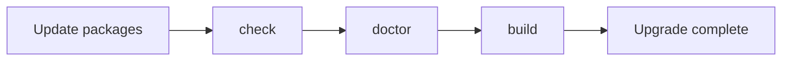
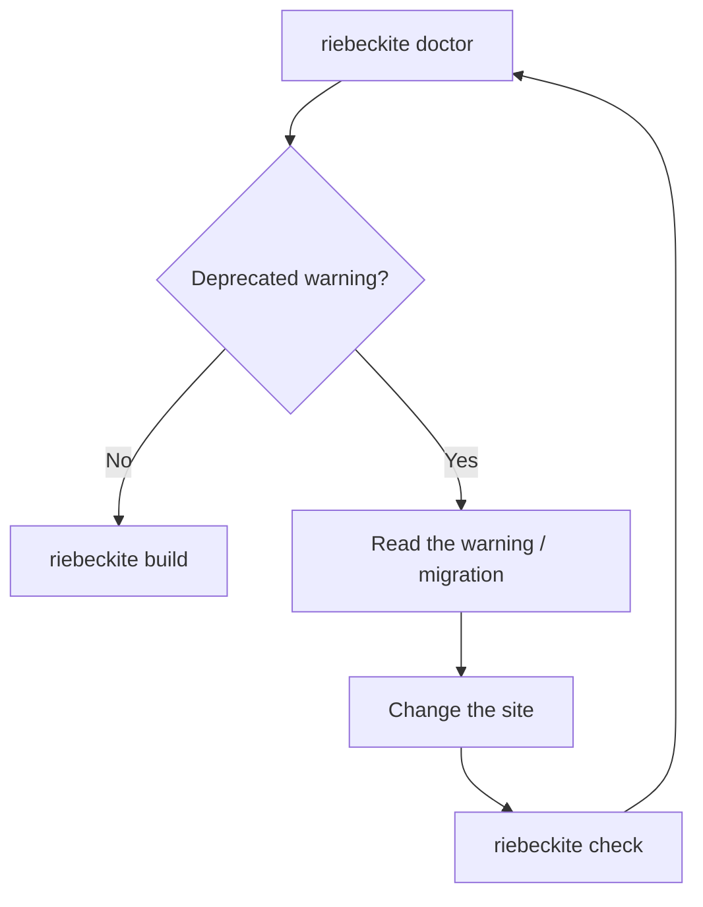
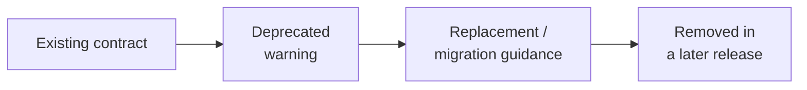
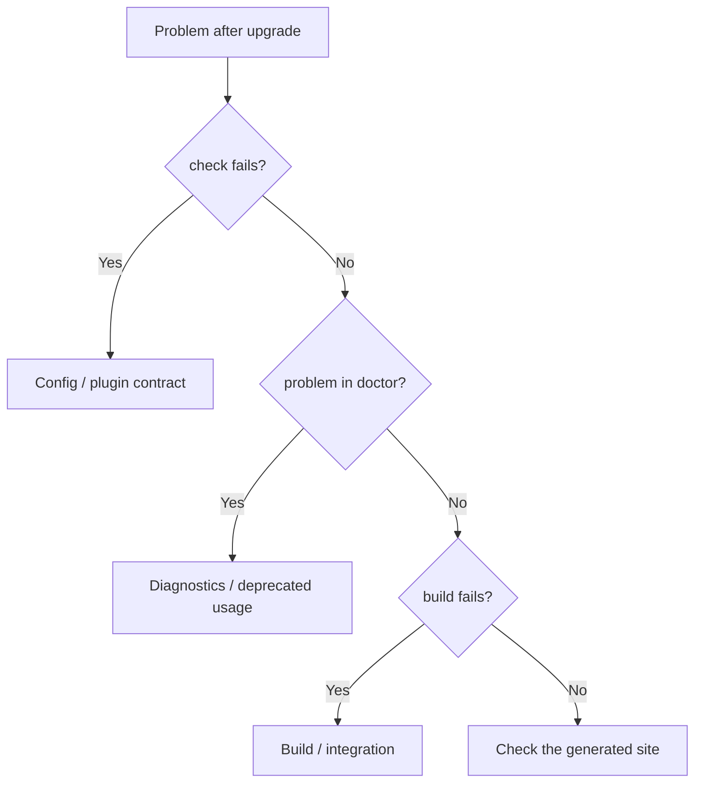

# Upgrading Riebeckite

Use this guide when updating an existing site to a newer Riebeckite version.

The basic order is:

```text
Check the current version
        ↓
Update packages
        ↓
riebeckite check
        ↓
riebeckite doctor
        ↓
riebeckite build
        ↓
Review deprecation warnings
```

Riebeckite is currently pre-1.0. When you upgrade, do not only bump the
package version; check `doctor` for deprecated usage as well.

## 1. Check the current version

First, look at the Riebeckite packages the site currently uses:

```sh
npm ls @riebeckite/core @riebeckite/cli @riebeckite/honox
```

If you use plugins or themes, check their versions too.

Committing the state before the upgrade makes it easier to review the changes
and to roll back if something goes wrong.

## 2. Update the Riebeckite packages

Update the Riebeckite packages the site uses together. The target packages
include:

```text
@riebeckite/core
@riebeckite/cli
@riebeckite/honox
@riebeckite/plugin-*
@riebeckite/theme-*
```

Check which packages the site actually uses and update the ones you need.

## 3. Validate the site

After updating the packages, run the normal validation commands for your site:

```sh
npm exec riebeckite check
npm exec riebeckite doctor
npm exec riebeckite build
```

Each command checks something different:

| Command | What it mainly checks |
| --- | --- |
| `check` | Whether the config and plugin contract are correct |
| `doctor` | Site problems, including deprecated usage |
| `build` | Whether the site can actually be generated |



Do not stop just because `check` succeeded; confirm `doctor` and an actual
`build` as well.

## Reviewing deprecation warnings

After upgrading, run:

```sh
npm exec riebeckite doctor
```

If you use an old contract, the `Deprecated usage` check shows a warning.

Deprecated means:

**it still works for now, but it is no longer the preferred contract.**

Being deprecated does not mean the build suddenly fails in that release.

```text
Now
  → still usable
  → a warning in doctor

Later
  → may be removed
  → migrate before then
```

### Information shown in a warning

A deprecation warning normally includes the following information:

- what is deprecated;
- when it became deprecated;
- what to use instead, if there is a replacement;
- what migration action to take;
- where to read more;
- the planned removal version, when one has been decided.

For example, you judge the needed change from information such as:

```text
Deprecated:
  oldOption

Replacement:
  newOption

Action:
  change the config to newOption

Removal:
  0.x.x
```

### When a deprecation warning appears

Review the target shown in the warning. Things that may need to change
include:

- Config
- Plugin API
- Theme API
- CLI option
- scaffold output
- package reference

If a replacement is shown, change to the new contract. If migration
documentation is shown, follow those steps.

After the change, run the commands again:

```sh
npm exec riebeckite check
npm exec riebeckite doctor
npm exec riebeckite build
```



## Warning vs. error

Deprecated usage is basically a warning. A `doctor` result that contains only
deprecation warnings is treated as a success.

Errors, on the other hand, are used for problems that prevent Riebeckite from
handling the site correctly. For example:

```text
invalid configuration
missing dependency
content problems that block inspection
APIs that have already been removed
```

| State | Meaning | Action |
| --- | --- | --- |
| Warning | It works now, but needs review | Plan the migration |
| Error | The current site has a problem | Fix it before finishing the upgrade |

A deprecation warning does not mean the site stops working immediately. But if
a planned removal version is shown, migrate before then.

## Deprecation policy

Riebeckite distinguishes the state of API and config changes as follows:

| Term | Meaning |
| --- | --- |
| Deprecated | Currently supported, but scheduled to change or be removed |
| Removed | No longer supported |
| Breaking Change | A change that may require updates on the site side |
| Migration | The steps to move from the old contract to the new one |

### Deprecated

A deprecated contract can still be used for the time being. But it may be
removed in the future, so migrate when practical.

```text
Supported
   ↓
Deprecated
   ↓
Migration window
   ↓
Removed
```

### Removed

A removed contract is no longer supported. Continued usage may fail:

- validation
- build
- runtime checks

If a contract that showed a deprecation warning is left in place for a long
time, a future upgrade may reach its removal.

### Breaking Change

A breaking change is a change that may require updates to:

- site
- config
- plugin
- theme
- deployment

It is not always a simple API rename. If migration documentation exists, read
it.

## Pre-1.0 compatibility

Riebeckite is currently pre-1.0, so the project does not promise the same
compatibility window as a stable 1.x SemVer line. Even so, unless there is a
security or correctness reason, the project does not:

```text
mark something deprecated
      ↓
remove it in the same release
```

When possible, it takes these steps:



In other words, the policy is to provide a window for users to move to the new
contract.

## Reading migration notes

If an upgrade causes problems, check `doctor` first:

```sh
npm exec riebeckite doctor
```

A `doctor` warning directly points at **the old element the current site
actually uses**. So rather than reading all the migration documentation from
the start, this order is more efficient:

```text
doctor
   ↓
deprecation warning
   ↓
the matching migration documentation
   ↓
change the site
```

### When a replacement exists

If the warning shows a direct replacement, review it:

```text
old contract
     ↓
replacement
     ↓
new contract
```

### When no replacement exists

Not every breaking change is a one-to-one replacement like:

```text
oldA → newA
```

If there is no direct replacement, do not force a substitute API; follow the
action described in the migration. Migrations can include things such as:

```text
remove an old setting

change the configuration method itself

change the plugin structure

update generated files
```

## Migration is not automatic

Riebeckite does not currently provide an automatic migration command such as:

```sh
riebeckite migrate
```

It also does not automatically rewrite the site's config or code. Apply
migrations manually after reviewing the content:

```text
Review the warning
      ↓
Read the migration
      ↓
Change manually
      ↓
Review the diff
      ↓
check / doctor / build
      ↓
Commit
```

Not rewriting automatically lets you confirm for yourself what changed in the
site because of the upgrade.

## Commit changes separately

After applying a migration, committing the change makes the next upgrade
easier to review. For example, if you keep:

```text
1. The state before the upgrade
2. The package version update
3. The migration
```

traceable in Git history, isolating problems becomes easier.

## When an upgrade causes problems

Where you look depends on the kind of problem:



First, confirm where the problem occurs among:

```sh
npm exec riebeckite check
npm exec riebeckite doctor
npm exec riebeckite build
```

For a deprecation warning, migrate. For an error, resolve the problem indicated
by that diagnostic first.

## Upgrade checklist

When updating Riebeckite, check the following:

- checked the current Riebeckite package versions
- committed the changes before the upgrade
- updated the Riebeckite packages in use
- `riebeckite check` succeeded
- checked `riebeckite doctor`
- reviewed the deprecation warning contents
- applied the needed migrations
- `riebeckite build` succeeded
- checked the generated site
- committed the upgrade and migration changes

## UI architecture cleanup

This major release removes compatibility for the former article UI contracts.

| Old | New | Action |
| --- | --- | --- |
| `article.after-header` | `article.header` | Render it before the site heading. |
| `article.after-meta` | `article.metadata` | Render it with article metadata. |
| `bodySlots.properties` | `bodySlots["article.metadata"]` | Remove the custom properties branch from the Site. |
| `properties({ position, render })` | `properties({ ... })` | Remove both options; the plugin always contributes metadata. |
| `injectBreadcrumbNav` and `injectShareControls` | manifest body slots | Remove imports and let the Site render standard slots. |
| `article-shell*`, `article-frontmatter*`, `.prose` | `rb-*`, `site-article-frontmatter*`, `[data-slot="article-body"]` | Update Site CSS and client selectors. |
| `callout*` and `is-collapsed` | `rr-callout*` | Update Theme CSS to use `rr-callout__*`, `rr-callout--*`, and `data-callout`. |

The standard article slots are `article.header`, `article.metadata`,
`article.aside`, `article.before-content`, `article.after-content`, and
`article.footer`. Plugins only publish fragments; HonoX routes and Site
components choose their placement.

Render them with the public `ContentSlot` and `ArticleBody` primitives from
`@riebeckite/honox/ui`. Reading `bodySlots` directly and `ArticleContent
html=...` still work, but prefer `ArticleBody` for rendered Markdown HTML.

## Summary

Upgrading Riebeckite does not end with changing the package version:

```text
Update packages
      ↓
check
      ↓
doctor
      ↓
Review deprecated usage
      ↓
Migrate if needed
      ↓
build
      ↓
Check the site
```

The distinctions worth remembering are:

```text
Deprecated
  → usable now
  → migrate in preparation for the future

Removed
  → no longer supported

Warning
  → review / migrate

Error
  → fix before finishing the upgrade
```

Riebeckite is pre-1.0, so breaking changes can occur, but unless there is a
security or correctness reason, it takes the **Deprecated → Warning /
Migration → Removed** steps as far as possible.
