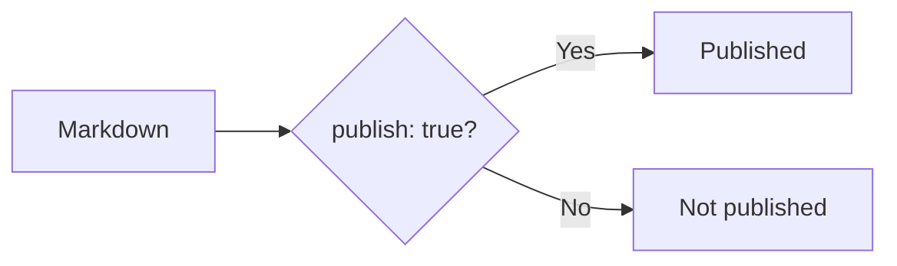
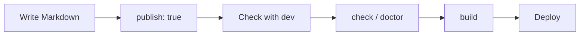

# Writing content

This guide covers the basics of writing articles for a Riebeckite site. It is aimed at users who are new to Markdown or static publishing.

Even if you are new to Markdown, the flow is:

```text
Create the article file
      ↓
Write the title
      ↓
Write the body
      ↓
Preview in the browser
      ↓
Publish
```

## Where articles live

By default, articles live in the `content/` folder.

```text
my-site/
├─ content/
│  ├─ index.md
│  └─ first-post.md
│
├─ riebeckite.config.ts
└─ package.json
```

`first-post.md` is shown at `/first-post`. `index.md` is a useful name for the top page.

You can also use a folder other than `content/`. If you want to publish an existing Obsidian vault, see [Publishing Obsidian notes](./obsidian.md).

## The smallest article

A published article starts with frontmatter.

```md
---
title: First post
publish: true
---

# First post

Write the article body here.
```

- `title`: the article title used by the site
- `publish: true`: marks the article as published

Files without `publish: true` can be kept as drafts.

## Frontmatter

The block at the top of the file,

```md
---
title: First post
publish: true
---
```

is called **frontmatter**. Frontmatter describes the article, not the article content itself.

```text
Markdown File
│
├─ Frontmatter
│    ├─ title
│    └─ publish
│
└─ Body
     ├─ Heading
     ├─ Paragraph
     ├─ Link
     └─ Image
```

To begin with, two fields are enough:

| Field | Meaning |
| --- | --- |
| `title` | The article title |
| `publish: true` | Publish this article |

For example,

```md
---
title: Getting started with Flutter
publish: true
---
```

publishes an article titled "Getting started with Flutter".

## Common Markdown

```md
# Main heading

## Section heading

Body text. Use a blank line to start a new paragraph.

- List item
- Another item

[External link](https://example.com)


```

Heading levels are controlled by the number of `#` characters. Whether to repeat the article title as a top-level heading in the body depends on your site design.

### Headings

```md
# Main heading

## Section heading

### Subsection heading
```

The number of `#` characters sets the heading level.

### Paragraphs

Ordinary sentences become a paragraph.

```md
This is the first paragraph.

A blank line starts the next paragraph.
```

### Lists

```md
- Flutter
- TypeScript
- HonoX
```

Numbered lists also work.

```md
1. Write the article
2. Check it in the browser
3. Publish
```

### Emphasis

```md
**bold**

*italic*
```

### Code

Inline code is wrapped in backticks.

```md
Add `publish: true`.
```

Multi-line code goes in a code block.

````md
```ts
const message = "Hello";
console.log(message);
```
````

## File names and URLs

In the standard setup, the logical path of the content determines where it is published.

File names become URL paths.

|File|URL|
|---|---|
|`content/index.md`|`/`|
|`content/about.md`|`/about`|
|`content/posts/first.md`|`/posts/first`|

For readable URLs, use lowercase letters, numbers, and hyphens in file names.

Names such as the following are easy to manage:

```text
about.md
getting-started.md
first-post.md
```

However, Riebeckite resolves the public location as:

```text
File path
      ↓
Content
      ↓
Public Location
      ↓
Public URL
```

So **the physical file path is not always the URL as-is.** A plugin or configuration can change the public location. See [Content System](../framework/content-system.md) for the details.

## Published articles and drafts

By default, only articles with

```yaml
publish: true
```

are published.

Published article:

```md
---
title: Published article
publish: true
---
```

Draft:

```md
---
title: Draft article
---
```

Drafts are not emitted as public pages.



Because of this, you can keep published articles and drafts together in the same `content/` folder:

```text
content/
├─ published-post.md
├─ draft-post.md
└─ another-draft.md
```

## Internal links

Normal Markdown links work.

```md
[Profile](/about)
```

Obsidian-style WikiLinks can also be used when the configured plugins support them.

```md
[[about]]
[[about|Profile]]
```

```text
[[about]]
      ↓
Resolve the matching content
      ↓
Public URL
```

Riebeckite resolves the final in-site link from the resolved content information, so links keep working even when a plugin or localization setting changes the public URL.

## Images

A nearby image folder is easy to manage.

```text
content/
├─ first-post.md
└─ images/
   └─ photo.jpg
```

Reference the image from the article.

```md

```

Put a description inside `[]` so the meaning is clear even when the image cannot be displayed.

```md

```

### About image files

Writing an image link in Markdown does not by itself make the image file exist:

```text
Markdown
   ↓
Image URL
   ↓
Image exists in the published site
   ↓
Displayed in the browser
```

Make sure the image is included in the public output according to your site setup. If you use attachments from an Obsidian vault, see [Publishing Obsidian notes](./obsidian.md).

## A complete example

Combining everything so far, an article can look like this:

```md
---
title: Trying Riebeckite
publish: true
---

# Trying Riebeckite

I built my first site with Riebeckite.

## What I used

- Markdown
- Riebeckite
- HonoX

## Related articles

The details are collected in [[configuration|the configuration article]].

## External links

[Riebeckite on GitHub](https://github.com/Rerurate514/riebeckite)
```

After the frontmatter, you can write the article as ordinary Markdown.

## Check before publishing

After adding articles, run these commands from the site folder.

```sh
npm exec riebeckite check
npm exec riebeckite doctor
npm exec riebeckite dev
```

Use `dev` to preview the site in a browser and check the title, headings, body, links, images, and code blocks. When it looks good, build it.

```sh
npm exec riebeckite build
```

The roles differ:

| Command | Main check |
| --- | --- |
| `check` | Whether the config and plugin settings are correct |
| `doctor` | Whether the content and site have problems |
| `dev` | Whether the actual rendering looks right in the browser |

If you use a plugin that diagnoses in-site links, it can also find internal links that point to pages that do not exist.

## Checking which articles are recognized

If an article does not appear, use:

```sh
npm exec -- riebeckite inspect content --list
```

This shows which content Riebeckite recognizes. When an article cannot be found, checking in this order makes the cause easier to isolate:

```text
content.directory
      ↓
exclude
      ↓
Recognized as content
      ↓
publish condition
      ↓
Public site
```

## Build the site

Once the browser preview looks right, build the site.

```sh
npm exec riebeckite build
```

The basic flow is:



## What to learn first

You do not need to learn every feature to write articles with Riebeckite. Start with:

```md
---
title: Article title
publish: true
---

# Article title

Write the body.
```

Then add Markdown, WikiLinks, images, frontmatter, plugins, and localization as needed:

```text
Markdown
WikiLink
Images
Frontmatter
Plugins
Localization
```

## Summary

The basic flow of writing content with Riebeckite is simple:

```text
Create a .md file in content/
        ↓
Add a title
        ↓
Add publish: true
        ↓
Write the body in Markdown
        ↓
Check with dev
        ↓
check / doctor
        ↓
build
```

To separate published articles from drafts, the first thing to remember is

```yaml
publish: true
```

The final public URL of an article is determined by the **Public Location** that Riebeckite resolves. While writing ordinary articles you do not need to think too much about how URLs are produced.

## Next steps

- [Fast path to publishing a site](../getting-started/deployment.md)
- [Publishing Obsidian notes](./obsidian.md)
- [Localization](./localization.md)
- [Configuration](../reference/configuration.md)
