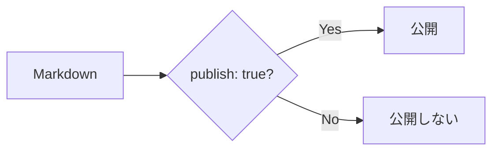
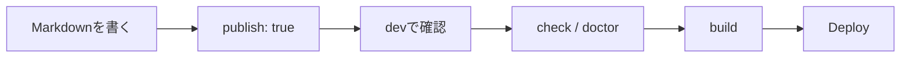

# 記事の書き方ガイド

Riebeckite で公開する記事の基本的な書き方を説明します。

Markdown に慣れていなくても、

```text
記事ファイルを作る
      ↓
タイトルを書く
      ↓
本文を書く
      ↓
ブラウザで確認
      ↓
公開
```

まで進められる内容です。

## 記事を置く場所

標準では、記事を `content/` に置きます。

```text
my-site/
├─ content/
│  ├─ index.md
│  └─ first-post.md
│
├─ riebeckite.config.ts
└─ package.json
```

たとえば、

```text
content/first-post.md
```

を作れば、Riebeckite が記事として読み込みます。

`content/` 以外のフォルダを使うこともできます。既存の Obsidian Vault などを使いたい場合は [Obsidian のノートをサイトにするガイド](./obsidian.md) を参照してください。

## 最初の記事を書く

まず、

```text
content/first-post.md
```

を作ります。

内容は次のようにします。

```md
---
title: 最初の記事
publish: true
---

# 最初の記事

はじめての記事です。

Riebeckite で Markdown を公開してみます。
```

これだけで、公開できる最小の記事になります。

## Frontmatter

記事の先頭にある、

```md
---
title: 最初の記事
publish: true
---
```

の部分を **Frontmatter** と呼びます。

Frontmatter には、記事そのものではなく、記事についての情報を書きます。

```text
Markdown File
│
├─ Frontmatter
│    ├─ title
│    └─ publish
│
└─ 本文
     ├─ 見出し
     ├─ 段落
     ├─ リンク
     └─ 画像
```

最初は次の2つを覚えておけば十分です。

| 項目 | 意味 |
| --- | --- |
| `title` | 記事のタイトル |
| `publish: true` | この記事を公開する |

たとえば、

```md
---
title: Flutter を始めた
publish: true
---
```

なら、「Flutter を始めた」というタイトルの記事を公開します。

## 記事を公開する

既定の公開ルールでは、

```yaml
publish: true
```

がある記事だけが公開されます。

公開する記事は、

```md
---
title: 公開する記事
publish: true
---

この記事は公開します。
```

とします。

## 下書きにする

まだ公開したくない記事には `publish: true` を付けません。

```md
---
title: まだ出さない記事
---

書きかけの記事です。
```

このファイルは Content として管理できますが、既定の公開ルールでは公開ページになりません。



そのため、

```text
content/
├─ published-post.md
├─ draft-post.md
└─ another-draft.md
```

のように、公開記事と下書きを同じ `content/` に置いておくこともできます。

## Markdown の基本

本文は通常の Markdown で書きます。

### 見出し

```md
# 大見出し

## 中見出し

### 小見出し
```

`#` の数によって見出しの階層が変わります。

### 段落

普通に文章を書けば段落になります。

```md
最初の段落です。

空行を入れると、次の段落になります。
```

### 箇条書き

```md
- Flutter
- TypeScript
- HonoX
```

番号付きのリストも書けます。

```md
1. 記事を書く
2. ブラウザで確認する
3. 公開する
```

### 強調

```md
**太字**

*斜体*
```

### コード

文章中のコードはバッククォートで囲みます。

```md
`publish: true` を追加します。
```

複数行のコードはコードブロックにできます。

````md
```ts
const message = "Hello";
console.log(message);
```
````

## リンクを書く

外部 Site へのリンクは通常の Markdown Link を使います。

```md
[Example](https://example.com)
```

Site 内の記事へリンクする場合も Markdown Link を利用できます。

```md
[プロフィール](/about)
```

## WikiLink

Obsidian 形式の WikiLink に対応した Plugin を利用している構成では、

```md
[[about]]
```

のようなリンクも利用できます。

表示する文字を変更する場合は、

```md
[[about|プロフィール]]
```

と書けます。

```text
[[about]]
      ↓
対応するContentを解決
      ↓
公開先のURL
```

Riebeckite では、最終的な Site 内リンクは解決済みの Content 情報を使って扱われます。

そのため、Plugin や多言語設定などによって公開 URL が変わる場合でも、対応する仕組みからリンクを解決できます。

## ファイル名と URL

標準的な構成では、Content の論理的な Path が公開先を決める基準になります。

たとえば基本的な構成では、

| ファイル | 公開先の例 |
| --- | --- |
| `content/index.md` | `/` |
| `content/about.md` | `/about` |
| `content/posts/first.md` | `/posts/first` |

のようになります。

そのため、ファイル名には、

```text
about.md
getting-started.md
first-post.md
```

のような分かりやすい名前を付けると管理しやすくなります。

英小文字・数字・ハイフンを使った名前にしておくのも扱いやすい方法です。

ただし、Riebeckite では、

```text
ファイルPath
      ↓
Content
      ↓
Public Location
      ↓
公開URL
```

として公開先が解決されます。

そのため、

**ファイルの物理 Path が常にそのまま URL になるわけではありません。**

Plugin や設定によって Public Location が変更されることがあります。

詳しい仕組みは [Content System](../framework/content-system.md) を参照してください。

## 画像を使う

Markdown では次のように画像を書けます。

```md

```

`[]` の中には、画像が表示できない場合にも内容が分かる説明を書いてください。

たとえば、

```md

```

のようにします。

## 画像ファイルについて

Markdown に画像へのリンクを書くだけでは、画像ファイルそのものが自動的に存在することにはなりません。

```text
Markdown
   ↓
画像URL
   ↓
公開Siteに画像が存在
   ↓
Browserで表示
```

利用している Site 構成に合わせて、画像が公開 Output に含まれるようにしてください。

Obsidian Vault の添付ファイルを利用する場合は [Obsidian のノートをサイトにするガイド](./obsidian.md) も参照してください。

## 記事を書いてみる

ここまでを組み合わせると、たとえば次のような記事を書けます。

```md
---
title: Riebeckite を使ってみた
publish: true
---

# Riebeckite を使ってみた

Riebeckite で最初のサイトを作ってみました。

## 使ったもの

- Markdown
- Riebeckite
- HonoX

## 関連記事

詳しい設定は [[configuration|設定についての記事]] にまとめています。

## 外部リンク

[Riebeckite の GitHub](https://github.com/Rerurate514/riebeckite)
```

Frontmatter の後は、通常の Markdown として記事を書いていけば問題ありません。

## 公開前にブラウザで確認する

記事を書いたら Development Server を起動します。

```sh
npm exec riebeckite dev
```

Browser で記事を開き、

- タイトル
- 見出し
- 本文
- リンク
- 画像
- コードブロック

などが想定どおり表示されているか確認します。

## 問題がないか確認する

公開前には、

```sh
npm exec riebeckite check
npm exec riebeckite doctor
```

を実行します。

役割は次のように異なります。

| Command | 主に確認すること |
| --- | --- |
| `check` | Config や Plugin の設定が正しいか |
| `doctor` | Content や Site に問題がないか |
| `dev` | Browser で実際の表示を確認する |

Site 内リンクの整合性を診断する Plugin を利用している場合は、存在しない内部リンクなども確認できます。

## どの記事が認識されているか確認する

記事が表示されない場合は、

```sh
npm exec -- riebeckite inspect content --list
```

を利用できます。

これによって、Riebeckite がどの Content を認識しているか確認できます。

記事が見つからない場合は、

```text
content.directory
      ↓
exclude
      ↓
Contentとして認識
      ↓
publish条件
      ↓
Public Site
```

の順番で確認すると原因を切り分けやすくなります。

## Site をビルドする

Browser で確認して問題がなければ、Site をビルドします。

```sh
npm exec riebeckite build
```

基本的な流れは、



となります。

## 最初はこれだけ覚えればよい

Riebeckite で記事を書くために、最初からすべての機能を覚える必要はありません。

まずは、

```md
---
title: 記事のタイトル
publish: true
---

# 記事のタイトル

本文を書きます。
```

という形だけ覚えておけば記事を公開できます。

その後、必要に応じて、

```text
Markdown
WikiLink
画像
Frontmatter
Plugin
多言語対応
```

などを追加していけば十分です。

## まとめ

Riebeckite で記事を書く基本的な流れはシンプルです。

```text
content/ に .md を作る
        ↓
title を付ける
        ↓
publish: true を付ける
        ↓
Markdown で本文を書く
        ↓
dev で確認
        ↓
check / doctor
        ↓
build
```

公開する記事と下書きを分けるために、まず覚えておきたいのは、

```yaml
publish: true
```

です。

そして、記事の公開 URL は最終的に Riebeckite が解決した **Public Location** で決まります。通常の記事を書く段階では URL の仕組みを意識しすぎる必要はありません。

### 次に読むもの

- [サイト公開までの最短ガイド](../getting-started/deployment.md)
- [Obsidian のノートをサイトにするガイド](./obsidian.md)
- [Localization](./localization.md)
- [Configuration](../reference/configuration.md)
