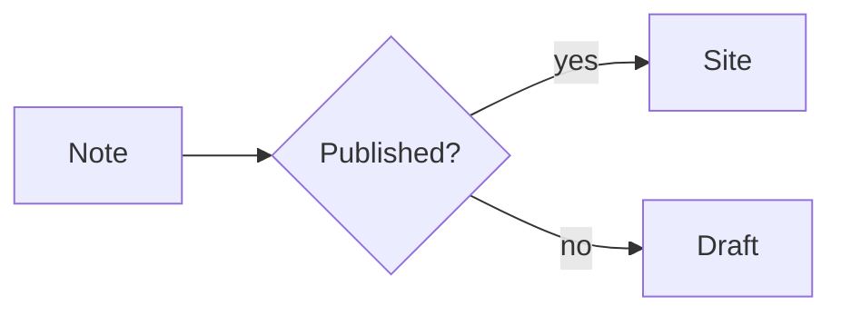
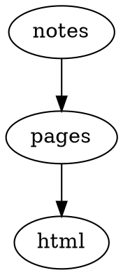
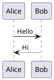

# Plugin Showcase

Plugin catalog は [Plugins](./README.ja.md) にあります。このページでは、Plugin が実際に何を生成するかを確認できます。各項目では Markdown のソースと、Riebeckite 上での実行例を並べています。

> 生成される `showcase` preset では、ここにあるような例をローカルで確認できます。

## Obsidian Markdown

### Callouts — [`obsidian-markdown`](./obsidian-markdown.ja.md)

#### ソース

````md
> [!tip] 試してみる
> Callout は `[!type]` マーカー付きの block quote です。
> `[!info]`、`[!warning]`、`[!question]` も同じように表示されます。
````

#### 実行例

> [!tip] 試してみる
> Callout は `[!type]` マーカー付きの block quote です。
> `[!info]`、`[!warning]`、`[!question]` も同じように表示されます。

### WikiLinks と埋め込み — [`obsidian-markdown`](./obsidian-markdown.ja.md)

#### ソース

````md
[[README]] と [[plugins/README|Plugin catalog]] への WikiLink。
````

#### 実行例

[[README]] と [[plugins/README|Plugin catalog]] への WikiLink。

## Code

### Toolbar 付きコード — [`code-enhance`](./code-enhance.ja.md)

行番号、ファイル名バー、行ハイライト、copy button を確認できます。

#### ソース

````md
```ts title="hello.ts"
export function hello(name: string): string {
  return `こんにちは、${name}`;
}
```
````

#### 実行例

```ts title="hello.ts"
export function hello(name: string): string {
  return `こんにちは、${name}`;
}
```

### Code tabs — [`code-tabs`](./code-tabs.ja.md)

隣り合った `tab="..."` 付き code fence が、1 つの tab group になります。

#### ソース

````md
```ts tab="React"
const greeting = "Hello from React";
```

```js tab="Vanilla"
console.log("Hello from JavaScript");
```
````

#### 実行例

```ts tab="React"
const greeting = "Hello from React";
```

```js tab="Vanilla"
console.log("Hello from JavaScript");
```

### Code annotations

`diff` フェンスに対象言語を指定して、追加行と削除行を表示します。

#### ソース

````md
```diff js
const kept = true;
+ const added = "new line";
- const removed = false;
```
````

#### 実行例

```diff js
const kept = true;
+ const added = "new line";
- const removed = false;
```

## インライン表現

### Highlight

`==text==` で囲んだ範囲をインラインで強調します。

#### ソース

````md
この文は ==強調== され、ほかはそのまま表示されます。
````

#### 実行例

この文は ==強調== され、ほかはそのまま表示されます。

### Sidenotes

脚注記法が、本文の横に並ぶ補足へ変換されます。

#### ソース

````md
本文中で補足を参照します。[^1]

[^1]: ここが sidenote の本文です。
````

#### 実行例

本文中で補足を参照します。[^1]

[^1]: ここが sidenote の本文です。

### Shortcodes

`::name` と `:::name` のディレクティブで、badge、kbd、note などを差し込みます。

#### ソース

````md
::badge[Stable]{variant=success}

::kbd[Ctrl+Shift+P]

:::note[補足]
本文をそのまま書けます。
:::
````

#### 実行例

::badge[Stable]{variant=success}

::kbd[Ctrl+Shift+P]

:::note[補足]
本文をそのまま書けます。
:::

## 図表

### Mermaid — [`mermaid`](./mermaid.ja.md)

#### ソース

````md

````

#### 実行例


### D2 — [`d2`](./d2.ja.md)

#### ソース

````md
```d2
site: Riebeckite
content -> build -> deploy
```
````

#### 実行例

```d2
site: Riebeckite
content -> build -> deploy
```

### Graphviz / DOT — [`graphviz`](./graphviz.ja.md)

#### ソース

````md

````

#### 実行例


### Chart.js — [`chartjs`](./chartjs.ja.md)

#### ソース

````md
```chart
{
  "type": "bar",
  "data": {
    "labels": ["Mon", "Tue", "Wed"],
    "datasets": [{ "label": "Visits", "data": [12, 19, 8] }]
  }
}
```
````

#### 実行例

```chart
{
  "type": "bar",
  "data": {
    "labels": ["Mon", "Tue", "Wed"],
    "datasets": [{ "label": "Visits", "data": [12, 19, 8] }]
  }
}
```

### Vega-Lite — [`vega-lite`](./vega-lite.ja.md)

#### ソース

````md
```vega-lite
{
  "title": "Revenue",
  "data": { "values": [{ "category": "A", "value": 28 }, { "category": "B", "value": 55 }] },
  "mark": "bar",
  "encoding": {
    "x": { "field": "category", "type": "nominal" },
    "y": { "field": "value", "type": "quantitative" }
  }
}
```
````

#### 実行例

```vega-lite
{
  "title": "Revenue",
  "data": { "values": [{ "category": "A", "value": 28 }, { "category": "B", "value": 55 }] },
  "mark": "bar",
  "encoding": {
    "x": { "field": "category", "type": "nominal" },
    "y": { "field": "value", "type": "quantitative" }
  }
}
```

### WaveDrom — [`wavedrom`](./wavedrom.ja.md)

#### ソース

````md
```wavedrom
{ "signal": [
  { "name": "clk", "wave": "p......" },
  { "name": "bus", "wave": "x.34.5x", "data": "head body tail" }
] }
```
````

#### 実行例

```wavedrom
{ "signal": [
  { "name": "clk", "wave": "p......" },
  { "name": "bus", "wave": "x.34.5x", "data": "head body tail" }
] }
```

### Markmap — [`markmap`](./markmap.ja.md)

#### ソース

````md
```markmap
# Project

## Design

### Notation
### Rendering

## Delivery
```
````

#### 実行例

```markmap
# Project

## Design

### Notation
### Rendering

## Delivery
```

### Marp slides — [`marp`](./marp.ja.md)

#### ソース

````md
```marp title="Intro deck"
# First slide

- a bullet

---

# Second slide
```
````

#### 実行例

```marp title="Intro deck"
# First slide

- a bullet

---

# Second slide
```

### Maps — [`map`](./map.ja.md)

静的な fallback を先に表示し、JavaScript が有効な環境では interactive map に拡張します。

#### ソース

````md
```map
center: 35.6812, 139.7671
zoom: 13
label: Tokyo Station
markers:
  - 35.6812, 139.7671 | Tokyo Station
  - 35.6586, 139.7454 | Tokyo Tower
```
````

#### 実行例

```map
center: 35.6812, 139.7671
zoom: 13
label: Tokyo Station
markers:
  - 35.6812, 139.7671 | Tokyo Station
  - 35.6586, 139.7454 | Tokyo Tower
```

### QR codes — [`qr-code`](./qr-code.ja.md)

Build 時に inline SVG として生成します。

#### ソース

````md
```qr
# caption: Project page
https://example.com/
```
````

#### 実行例

```qr
# caption: Project page
https://example.com/
```

### PlantUML — [`plantuml`](./plantuml.ja.md)

図はビルド時に PlantUML サーバーの画像 URL へ変換されます。表示にはそのサーバーへ到達できる必要があります。

#### ソース

````md

````

#### 実行例


### Canvas — [`canvas`](./canvas.ja.md)

JSON Canvas をコードフェンスへ直接書くか、`![[diagram.canvas]]` で Canvas ファイルを埋め込みます。

#### ソース

````md
```canvas
{
  "nodes": [
    { "id": "note", "type": "text", "x": 0, "y": 0, "width": 240, "height": 100, "text": "Note" }
  ],
  "edges": []
}
```
````

#### 実行例

```canvas
{
  "nodes": [
    { "id": "note", "type": "text", "x": 0, "y": 0, "width": 240, "height": 100, "text": "Note" }
  ],
  "edges": []
}
```

## Media

### Rich embeds — [`rich-embed`](./rich-embed.ja.md)

URL を YouTube、Vimeo、Spotify、CodePen、Gist などの埋め込みに変換します。

#### ソース

````md
```embed
https://www.youtube.com/watch?v=dQw4w9WgXcQ
title: Demo video
caption: A short caption
aspect: 16/9
```
````

#### 実行例

```embed
https://www.youtube.com/watch?v=dQw4w9WgXcQ
title: Demo video
caption: A short caption
aspect: 16/9
```

### Gallery cards — [`gallery`](./gallery.ja.md)

#### ソース

````md
```gallery
columns: 3
items:
  - title: Default
    description: A clean, typographic theme.
    href: https://riebeckite.dev/docs/themes/default
  - title: Minimal
    description: Stripped back to the essentials.
    href: https://riebeckite.dev/docs/themes/minimal
  - title: Gruvbox
    description: A warm, high-contrast palette.
    href: https://riebeckite.dev/docs/themes/gruvbox
```
````

#### 実行例

```gallery
columns: 3
items:
  - title: Default
    description: A clean, typographic theme.
    href: https://riebeckite.dev/docs/themes/default
  - title: Minimal
    description: Stripped back to the essentials.
    href: https://riebeckite.dev/docs/themes/minimal
  - title: Gruvbox
    description: A warm, high-contrast palette.
    href: https://riebeckite.dev/docs/themes/gruvbox
```

### Excalidraw — [`excalidraw`](./excalidraw.ja.md)

Excalidraw 形式のノートを埋め込むと、ブラウザ側で SVG に置き換わります。このサイトでは `assets/HW.md` の図を埋め込んでいます。

#### ソース

````md
![[HW]]
````

#### 実行例

![[HW]]

### Responsive image — [`responsive-image`](./responsive-image.ja.md)

画像を `![[...]]` で埋め込むと、対応する候補画像がある場合は `<picture>` と複数サイズの候補に展開されます。

#### ソース

````md
![[riebeckite-logo-horizontal.png]]
````

#### 実行例

![[riebeckite-logo-horizontal.png]]

### AutoCardLink

`cardlink` フェンスに URL とメタ情報を書くと、リンクカードになります。

#### ソース

````md
```cardlink
url: https://example.com/riebeckite
title: Riebeckite
description: Markdown から静的サイトを作るツール
host: example.com
```
````

#### 実行例

```cardlink
url: https://example.com/riebeckite
title: Riebeckite
description: Markdown から静的サイトを作るツール
host: example.com
```

## ナレッジとデータ

### Dataview — [`dataview`](./dataview.ja.md)

#### ソース

````md
```dataview
TABLE file.name AS "Name", status
FROM #project
WHERE status = "active"
SORT file.name asc
LIMIT 10
```
````

#### 実行例

```dataview
TABLE file.name AS "Name", status
FROM #project
WHERE status = "active"
SORT file.name asc
LIMIT 10
```

### Query — [`query`](./query.ja.md)

#### ソース

````md
```query
sort:
  field: title
  order: asc
limit: 5
```
````

#### 実行例

```query
sort:
  field: title
  order: asc
limit: 5
```

### Bases — [`bases`](./bases.ja.md)

#### ソース

````md
```base
filters:
  and:
    - file.hasTag("featured")
properties:
  file.name:
    displayName: Title
views:
  - type: table
    name: Featured
    limit: 10
```
````

#### 実行例

```base
filters:
  and:
    - file.hasTag("featured")
properties:
  file.name:
    displayName: Title
views:
  - type: table
    name: Featured
    limit: 10
```

### Kanban boards — [`kanban`](./kanban.ja.md)

本文に `##` 見出しの列と task list を置くと board になります。

#### ソース

````md
## Backlog

- [ ] Draft the release notes
- [ ] Link to [[README]]

## Done

- [x] Publish the fixture
````

#### 実行例

```kanban
## Backlog

- [ ] Draft the release notes
- [ ] Link to [[README]]

## Done

- [x] Publish the fixture
```

### Flashcards

`front :: back` を並べた `flashcards` フェンスが、学習用のデッキになります。JavaScript が無効な環境でも静的なリストとして読めます。

#### ソース

````md
```flashcards
Riebeckite とは？ :: Markdown から静的サイトを作るツール

公開の単位は？ :: Note
```
````

#### 実行例

```flashcards
Riebeckite とは？ :: Markdown から静的サイトを作るツール

公開の単位は？ :: Note
```

### ExcaliBrain — [`excalibrain`](./excalibrain.ja.md)

ノートごとの関係を 7 つの領域に分けて表示します。`excalibrain` フェンスの中身は読みません。フェンスは「ここに描画する」という位置だけを決め、マップの中身はそのページ自身のリンクから組み立てます。

#### ソース

````md
```excalibrain
```
````

#### 実行例

```excalibrain
```

上のマップには、このページの WikiLink から推論した関係が入ります。各 Plugin ページへは Markdown の相対リンクでリンクしているため、`child` に入るのは WikiLink で指定したページだけです。`parent` にはこのページへ WikiLink でリンクしているページが、`sibling` には `parent` が WikiLink でリンクしているページが並びます。

## ページやサイト全体に作用する Plugin

次の Plugin は 1 つの Markdown 断片では表現できません。このページ上でも検索 box、目次、color mode toggle などとして確認できます。

| Plugin | 確認するもの |
| --- | --- |
| [`search`](./search.ja.md) | サイトを絞り込む検索ボックス |
| [`toc`](./toc.ja.md) | スクロール位置に追従する目次 |
| [`backlinks`](./backlinks.ja.md) | このノートを参照するノートの一覧 |
| [`related-posts`](./related-posts.ja.md) | note 末尾の関連記事一覧 |
| [`properties`](./properties.ja.md) | フロントマターのプロパティ一覧 |
| breadcrumbs | ページ階層のパンくず |
| share | note の共有ボタン |
| hover-preview | リンク先を表示するホバープレビュー |
| [`local-graph`](./local-graph.ja.md) | 周辺ノートのミニグラフ |
| [`garden-explorer`](./garden-explorer.ja.md) | graph と検索の explorer Page Type |
| [`taxonomy`](./taxonomy.ja.md) | tag と folder の一覧 Page Type |
| [`docs`](./docs.ja.md) | Docs の sidebar と previous/next |
| folder-pages | folder ごとの index Page Type |
| [`lightbox`](./lightbox.ja.md) | 画像を拡大する操作 |
| [`diff`](./diff.ja.md) / [`changelog`](./changelog.ja.md) | note ごとの git history |
| [`l10n`](./l10n.ja.md) | 翻訳ページ上の language switcher |
| [`color-mode`](./color-mode.ja.md) | light / dark / system の切り替え |

## ビルド時・メタデータに作用する Plugin

本文には現れず、生成物や head、リダイレクトとして結果が出る Plugin です。

| Plugin | 生成されるもの |
| --- | --- |
| [`seo`](./seo.ja.md) | sitemap.xml / robots.txt / feed / head の canonical と OGP |
| webmention | webmentions.json と送受信のエンドポイント |
| [`alias`](./alias.ja.md) | 別名からのリダイレクト |
| series | `series` frontmatter による前後ナビ |
| [`recent-posts`](./recent-posts.ja.md) | 最新記事の一覧（Site が配置） |
| [`daily-notes`](./daily-notes.ja.md) | デイリーノートの短いスニペット（Site が配置） |
| rename | 旧パスからのリダイレクト |
| [`deploy`](./deploy.ja.md) | 各ホスト向けのデプロイ設定ファイル |
| [`diagnostics`](./diagnostics.ja.md) | 孤立ノートや未使用アセットの診断 |
| [`quality`](./quality.ja.md) | 見出し順や重複 id などの品質チェック |

## 関連

- [Plugin catalog](./README.ja.md)
- [Writing a Plugin](./writing-a-plugin.ja.md)
- [Plugin API](../reference/plugin-api.ja.md)
