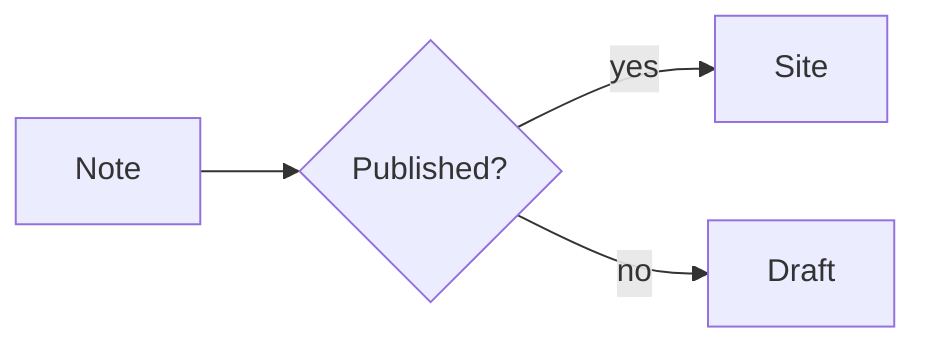
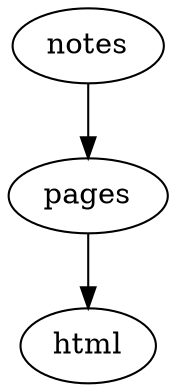
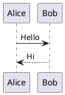

# Plugin Showcase

The Plugin catalog lives in [Plugins](./README.md). This page shows what each Plugin actually produces. Each entry pairs the Markdown source with the result rendered by Riebeckite.

> The generated `showcase` preset lets you try examples like these locally.

## Obsidian Markdown

### Callouts — [`obsidian-markdown`](./obsidian-markdown.md)

#### Source

````md
> [!tip] Try it
> A callout is a block quote with a `[!type]` marker.
> `[!info]`, `[!warning]`, and `[!question]` render the same way.
````

#### Rendered

> [!tip] Try it
> A callout is a block quote with a `[!type]` marker.
> `[!info]`, `[!warning]`, and `[!question]` render the same way.

### WikiLinks and embeds — [`obsidian-markdown`](./obsidian-markdown.md)

#### Source

````md
A WikiLink to [[README]] and to [[plugins/README|Plugin catalog]].
````

#### Rendered

A WikiLink to [[README]] and to [[plugins/README|Plugin catalog]].

## Code

### Code with a toolbar — [`code-enhance`](./code-enhance.md)

Line numbers, a filename bar, line highlighting, and a copy button.

#### Source

````md
```ts title="hello.ts"
export function hello(name: string): string {
  return `Hello, ${name}`;
}
```
````

#### Rendered

```ts title="hello.ts"
export function hello(name: string): string {
  return `Hello, ${name}`;
}
```

### Code tabs — [`code-tabs`](./code-tabs.md)

Adjacent code fences with `tab="..."` become a single tab group.

#### Source

````md
```ts tab="React"
const greeting = "Hello from React";
```

```js tab="Vanilla"
console.log("Hello from JavaScript");
```
````

#### Rendered

```ts tab="React"
const greeting = "Hello from React";
```

```js tab="Vanilla"
console.log("Hello from JavaScript");
```

### Code annotations

Fence metadata and inline comments express line highlighting, additions, removals, and focus.

#### Source

````md
```js {2}
const first = 1;
const second = 2;
const third = 3;
```

```js
const kept = true;
const added = "new line"; // [!code ++]
const removed = false; // [!code --]
```

```js
const focused = 1; // [!code focus]
const plain = 2;
```
````

#### Rendered

```js {2}
const first = 1;
const second = 2;
const third = 3;
```

```js
const kept = true;
const added = "new line"; // [!code ++]
const removed = false; // [!code --]
```

```js
const focused = 1; // [!code focus]
const plain = 2;
```

## Inline

### Highlight

Text wrapped in `==...==` is emphasized inline.

#### Source

````md
This sentence contains an ==emphasized== span; the rest stays unchanged.
````

#### Rendered

This sentence contains an ==emphasized== span; the rest stays unchanged.

### Sidenotes

Footnote syntax becomes a side note next to the body.

#### Source

````md
We reference a side note here.[^1]

[^1]: This is the side note body.
````

#### Rendered

We reference a side note here.[^1]

[^1]: This is the side note body.

### Shortcodes

`::name` and `:::name` directives insert badges, keyboard keys, notes, and more.

#### Source

````md
::badge[Stable]{variant=success}

::kbd[Ctrl+Shift+P]

:::note[Note]
You can write body text as-is.
:::
````

#### Rendered

::badge[Stable]{variant=success}

::kbd[Ctrl+Shift+P]

:::note[Note]
You can write body text as-is.
:::

## Diagrams

### Mermaid — [`mermaid`](./mermaid.md)

#### Source

````md

````

#### Rendered


### D2 — [`d2`](./d2.md)

#### Source

````md
```d2
site: Riebeckite
content -> build -> deploy
```
````

#### Rendered

```d2
site: Riebeckite
content -> build -> deploy
```

### Graphviz / DOT — [`graphviz`](./graphviz.md)

#### Source

````md

````

#### Rendered


### Chart.js — [`chartjs`](./chartjs.md)

#### Source

````md
```chart
{
  "type": "bar",
  "data": {
    "labels": ["Mon", "Tue", "Wed"],
    "datasets": [{ "label": "Visits", "data": [12, 19, 8] }]
  }
}
```
````

#### Rendered

```chart
{
  "type": "bar",
  "data": {
    "labels": ["Mon", "Tue", "Wed"],
    "datasets": [{ "label": "Visits", "data": [12, 19, 8] }]
  }
}
```

### Vega-Lite — [`vega-lite`](./vega-lite.md)

#### Source

````md
```vega-lite
{
  "title": "Revenue",
  "data": { "values": [{ "category": "A", "value": 28 }, { "category": "B", "value": 55 }] },
  "mark": "bar",
  "encoding": {
    "x": { "field": "category", "type": "nominal" },
    "y": { "field": "value", "type": "quantitative" }
  }
}
```
````

#### Rendered

```vega-lite
{
  "title": "Revenue",
  "data": { "values": [{ "category": "A", "value": 28 }, { "category": "B", "value": 55 }] },
  "mark": "bar",
  "encoding": {
    "x": { "field": "category", "type": "nominal" },
    "y": { "field": "value", "type": "quantitative" }
  }
}
```

### WaveDrom — [`wavedrom`](./wavedrom.md)

#### Source

````md
```wavedrom
{ "signal": [
  { "name": "clk", "wave": "p......" },
  { "name": "bus", "wave": "x.34.5x", "data": "head body tail" }
] }
```
````

#### Rendered

```wavedrom
{ "signal": [
  { "name": "clk", "wave": "p......" },
  { "name": "bus", "wave": "x.34.5x", "data": "head body tail" }
] }
```

### Markmap — [`markmap`](./markmap.md)

#### Source

````md
```markmap
# Project

## Design

### Notation
### Rendering

## Delivery
```
````

#### Rendered

```markmap
# Project

## Design

### Notation
### Rendering

## Delivery
```

### Marp slides — [`marp`](./marp.md)

#### Source

````md
```marp title="Intro deck"
# First slide

- a bullet

---

# Second slide
```
````

#### Rendered

```marp title="Intro deck"
# First slide

- a bullet

---

# Second slide
```

### Maps — [`map`](./map.md)

A static fallback renders first, then expands to an interactive map where JavaScript is available.

#### Source

````md
```map
center: 35.6812, 139.7671
zoom: 13
label: Tokyo Station
markers:
  - 35.6812, 139.7671 | Tokyo Station
  - 35.6586, 139.7454 | Tokyo Tower
```
````

#### Rendered

```map
center: 35.6812, 139.7671
zoom: 13
label: Tokyo Station
markers:
  - 35.6812, 139.7671 | Tokyo Station
  - 35.6586, 139.7454 | Tokyo Tower
```

### QR codes — [`qr-code`](./qr-code.md)

Generated as inline SVG at build time.

#### Source

````md
```qr
# caption: Project page
https://example.com/
```
````

#### Rendered

```qr
# caption: Project page
https://example.com/
```

### PlantUML — [`plantuml`](./plantuml.md)

The diagram becomes an image URL pointing at a PlantUML server at build time. Viewing it requires reaching that server.

#### Source

````md

````

#### Rendered


### Canvas — [`canvas`](./canvas.md)

Write JSON Canvas directly in a code fence, or embed a Canvas file with `![[diagram.canvas]]`.

#### Source

````md
```canvas
{
  "nodes": [
    { "id": "note", "type": "text", "x": 0, "y": 0, "width": 240, "height": 100, "text": "Note" }
  ],
  "edges": []
}
```
````

#### Rendered

```canvas
{
  "nodes": [
    { "id": "note", "type": "text", "x": 0, "y": 0, "width": 240, "height": 100, "text": "Note" }
  ],
  "edges": []
}
```

## Media

### Rich embeds — [`rich-embed`](./rich-embed.md)

Turn a URL into an embed for YouTube, Vimeo, Spotify, CodePen, Gist, and more.

#### Source

````md
```embed
https://www.youtube.com/watch?v=dQw4w9WgXcQ
title: Demo video
caption: A short caption
aspect: 16/9
```
````

#### Rendered

```embed
https://www.youtube.com/watch?v=dQw4w9WgXcQ
title: Demo video
caption: A short caption
aspect: 16/9
```

### Gallery cards — [`gallery`](./gallery.md)

#### Source

````md
```gallery
columns: 3
items:
  - title: Default
    description: A clean, typographic theme.
    href: https://riebeckite.dev/docs/themes/default
  - title: Minimal
    description: Stripped back to the essentials.
    href: https://riebeckite.dev/docs/themes/minimal
  - title: Gruvbox
    description: A warm, high-contrast palette.
    href: https://riebeckite.dev/docs/themes/gruvbox
```
````

#### Rendered

```gallery
columns: 3
items:
  - title: Default
    description: A clean, typographic theme.
    href: https://riebeckite.dev/docs/themes/default
  - title: Minimal
    description: Stripped back to the essentials.
    href: https://riebeckite.dev/docs/themes/minimal
  - title: Gruvbox
    description: A warm, high-contrast palette.
    href: https://riebeckite.dev/docs/themes/gruvbox
```

### Excalidraw — [`excalidraw`](./excalidraw.md)

Embedding an Excalidraw note replaces it with an SVG in the browser. This site embeds the drawing in `assets/HW.md`.

#### Source

````md
![[HW]]
````

#### Rendered

![[HW]]

### Responsive image — [`responsive-image`](./responsive-image.md)

Embedding an image with `![[...]]` expands to a `<picture>` element with multiple size candidates when the variants exist.

#### Source

````md
![[riebeckite-logo-horizontal.png]]
````

#### Rendered

![[riebeckite-logo-horizontal.png]]

### AutoCardLink

A `cardlink` fence with a URL and metadata becomes a link card.

#### Source

````md
```cardlink
url: https://example.com/riebeckite
title: Riebeckite
description: A tool that builds a static site from Markdown
host: example.com
```
````

#### Rendered

```cardlink
url: https://example.com/riebeckite
title: Riebeckite
description: A tool that builds a static site from Markdown
host: example.com
```

## Knowledge and data

### Dataview — [`dataview`](./dataview.md)

#### Source

````md
```dataview
TABLE file.name AS "Name", status
FROM #project
WHERE status = "active"
SORT file.name asc
LIMIT 10
```
````

#### Rendered

```dataview
TABLE file.name AS "Name", status
FROM #project
WHERE status = "active"
SORT file.name asc
LIMIT 10
```

### Query — [`query`](./query.md)

#### Source

````md
```query
sort:
  field: title
  order: asc
limit: 5
```
````

#### Rendered

```query
sort:
  field: title
  order: asc
limit: 5
```

### Bases — [`bases`](./bases.md)

#### Source

````md
```base
filters:
  and:
    - file.hasTag("featured")
properties:
  file.name:
    displayName: Title
views:
  - type: table
    name: Featured
    limit: 10
```
````

#### Rendered

```base
filters:
  and:
    - file.hasTag("featured")
properties:
  file.name:
    displayName: Title
views:
  - type: table
    name: Featured
    limit: 10
```

### Kanban boards — [`kanban`](./kanban.md)

Put `##` column headings and task lists in the body to get a board.

#### Source

````md
## Backlog

- [ ] Draft the release notes
- [ ] Link to [[README]]

## Done

- [x] Publish the fixture
````

#### Rendered

```kanban
## Backlog

- [ ] Draft the release notes
- [ ] Link to [[README]]

## Done

- [x] Publish the fixture
```

### Flashcards

A `flashcards` fence of `front :: back` pairs becomes a study deck. It still reads as a static list without JavaScript.

#### Source

````md
```flashcards
What is Riebeckite? :: A tool that builds a static site from Markdown

What is the unit of publishing? :: A note
```
````

#### Rendered

```flashcards
What is Riebeckite? :: A tool that builds a static site from Markdown

What is the unit of publishing? :: A note
```

### ExcaliBrain — [`excalibrain`](./excalibrain.md)

Shows each note's relationships across seven regions. The body of the `excalibrain` fence is ignored; the fence only marks where to draw, and the map is assembled from the page's own links.

#### Source

````md
```excalibrain
```
````

#### Rendered

```excalibrain
```

The map above is built from this page's WikiLinks. Because each Plugin page is linked with a Markdown relative link, only pages named by WikiLink appear under `child`. `parent` lists pages that WikiLink to this page, and `sibling` lists pages that those `parent` pages WikiLink to.

## Plugins that act on the page or site

These Plugins cannot be expressed by a single Markdown fragment. They are visible on this page as the search box, table of contents, color mode toggle, and so on.

| Plugin | What to look for |
| --- | --- |
| [`search`](./search.md) | A search box that filters the site |
| [`toc`](./toc.md) | A table of contents that follows scroll position |
| [`backlinks`](./backlinks.md) | A list of notes that reference this note |
| [`related-posts`](./related-posts.md) | Related notes at the bottom of a note |
| [`properties`](./properties.md) | A list of frontmatter properties |
| breadcrumbs | Page hierarchy breadcrumbs |
| share | Share controls for a note |
| hover-preview | A hover preview of link targets |
| [`local-graph`](./local-graph.md) | A mini graph of nearby notes |
| [`garden-explorer`](./garden-explorer.md) | The explorer Page Type with a graph and search |
| [`taxonomy`](./taxonomy.md) | The tag and folder listing Page Types |
| [`docs`](./docs.md) | The Docs sidebar and previous/next links |
| folder-pages | An index Page Type for each folder |
| [`lightbox`](./lightbox.md) | Click to enlarge an image |
| [`diff`](./diff.md) / [`changelog`](./changelog.md) | Per-note git history |
| [`l10n`](./l10n.md) | The language switcher on translated pages |
| [`color-mode`](./color-mode.md) | Light / dark / system switching |

## Plugins that act at build time or on metadata

These Plugins do not appear in the body. Their results show up as generated files, head tags, or redirects.

| Plugin | What it generates |
| --- | --- |
| [`seo`](./seo.md) | sitemap.xml / robots.txt / feeds, plus canonical and OGP head tags |
| webmention | webmentions.json and the send/receive endpoints |
| [`alias`](./alias.md) | Redirects from alternative names |
| series | Previous/next navigation from `series` frontmatter |
| [`recent-posts`](./recent-posts.md) | A list of recent notes, placed by the site |
| [`daily-notes`](./daily-notes.md) | Short snippets from Daily Notes, placed by the site |
| rename | Redirects from old paths |
| [`deploy`](./deploy.md) | Deployment config files for each host |
| [`diagnostics`](./diagnostics.md) | Diagnostics for orphan notes and unused assets |
| [`quality`](./quality.md) | Quality checks such as heading order and duplicate ids |

## Related

- [Plugin catalog](./README.md)
- [Writing a Plugin](./writing-a-plugin.md)
- [Plugin API](../reference/plugin-api.md)
