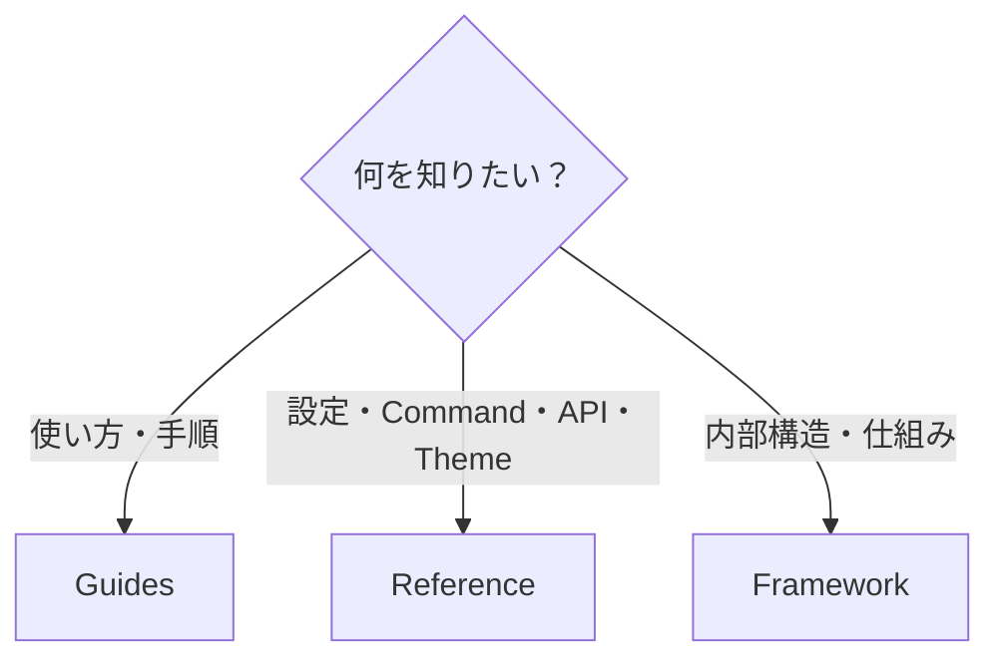
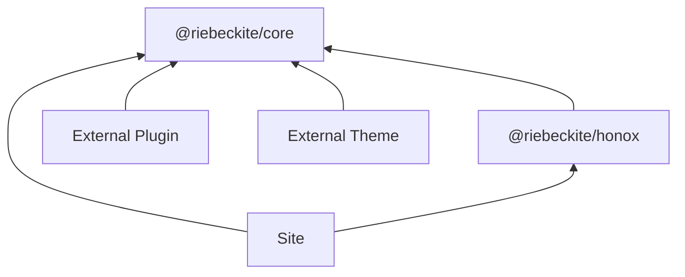
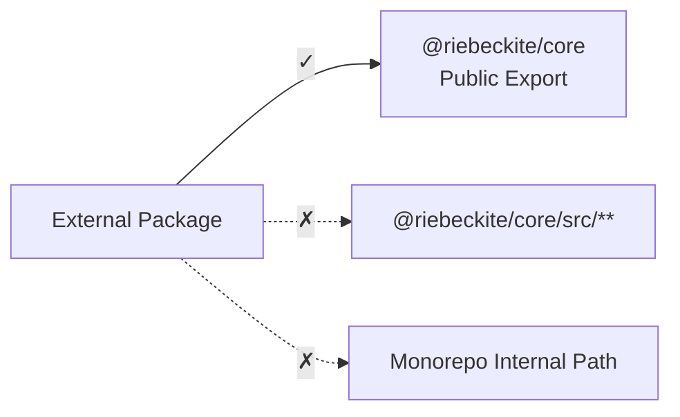
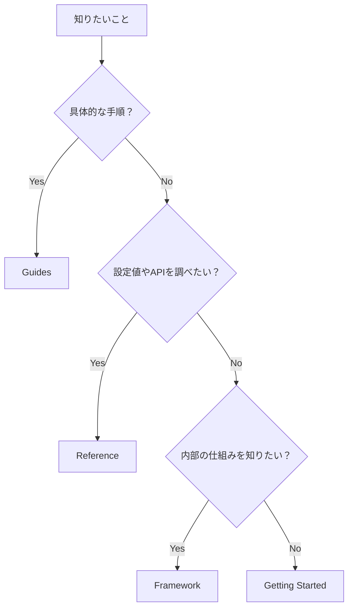

# Reference

Reference は、Riebeckite の**設定値・CLI・公開 API・Theme・内部構造を調べるための章**です。

「どう使えばいいか」という手順を知りたい場合は [Guides](../guides/README.md) を参照してください。



Reference は最初から順番に読む必要はありません。設定項目や API を確認したくなったときに、必要なページを参照してください。

## ページ

| 知りたいこと | ページ |
| --- | --- |
| `riebeckite.config.ts` の設定 | [Configuration](./configuration.md) |
| `riebeckite.config.ts` の全フィールド | [Configuration リファレンス](./configuration-reference.md) |
| CLI Command とその役割 | [CLI](./cli.md) |
| Plugin の Public API | [Plugin API](./plugin-api.md) |
| Theme の Public API | [Theme API](./theme-api.md) |
| Riebeckite の内部構造 | [Framework](../framework/README.md) |
| Theme の作り方 | [Themes](../themes/README.md) |

### Configuration

[Configuration](./configuration.md) では、

- `site`
- `content`
- `markdown`
- `theme`
- `plugins`
- `appRoot`
- `configRoot`
- `contentRoot`

など、Riebeckite の設定とその解決方法を確認できます。

### CLI

[CLI](./cli.md) では、

```text
init
dev
check
doctor
build
profile
inspect
```

の各 Command と、その役割を確認できます。

### Plugin API

[Plugin API](./plugin-api.md) では、

- `definePlugin`
- Lifecycle Hook
- Content Hook
- Renderer
- Page Type
- Assets
- Client Entry
- Endpoint
- Diagnostics

など、Plugin が利用できる Public Contract を確認できます。

Plugin の仕組みそのものを理解したい場合は [Plugin System](../framework/plugin-system.md) を参照してください。

### Theme API

[Theme API](./theme-api.md) では、

- `defineTheme`
- Design Token
- Color Mode
- Typography
- Article Layout
- CSS Contract
- Theme Package

など、Theme が利用できる Public Contract を確認できます。

Theme の設計思想や仕組みを理解したい場合は [Theme System](../framework/theme-system.md) を参照してください。

## 公開 Package

Riebeckite の外部 Plugin / Theme / Site は、**公開 Package と公開 Export だけ**に依存してください。

主な Package は次のとおりです。

| Package | 用途 |
| --- | --- |
| `@riebeckite/core` | Config、Content、Plugin、Theme、Pipeline などの共通 API |
| `@riebeckite/cli` | `riebeckite` CLI |
| `@riebeckite/honox` | HonoX / Vite Integration と Scaffold。`server` subpath に route / SSG helper（`resolveRiebeckiteRoute`、`resolveRiebeckiteContentRequest`、`contentRouteSsgParams`、`riebeniteSsgParams`）、`ui` subpath に article / site の UI primitive（`Article`、`ArticleBody`、`PageBody`、`ArticleContent`、`ContentSlot`、`hasSlot` と各種 Props 型）を公開 |
| `@riebeckite/test` | テスト helper（`assertGolden`、`assertGoldenJson`）。`e2e` subpath に packed tarball の外部 site engine |
| `@riebeckite/plugin-*` | 各 Plugin |
| `@riebeckite/theme-*` | 各 Theme |

依存関係は概ね次のようになります。



外部 Package から Riebeckite monorepo の内部実装へ直接依存しないことが重要です。

## Public API と Internal API

外部 Package では Package の Public Export を利用します。

たとえば、

```ts
import {
  definePlugin,
  escapeHtml,
} from "@riebeckite/core";
```

のように Import します。

一方、次のような Import は使用しないでください。

```ts
import {
  something,
} from "@riebeckite/core/src/...";
```

また、

```text
../../../../packages/core/...
```

のような Riebeckite monorepo 内部の Path にも依存しません。



Public API は外部利用を前提とした Contract です。

`src/**` や monorepo 内部 Path は実装詳細であり、Package の更新によって変更される可能性があります。

## `@riebeckite/core`

`@riebeckite/core` は、Riebeckite の Framework 非依存な Public API を提供します。

主な Export は次のとおりです。

### Config

```text
defineConfig
resolveConfig
resolveConfigModule
isPublished
isExcluded
```

Config の宣言、解決、Publication Policy などに使用します。

詳しくは [Configuration](./configuration.md) を参照してください。

### Content

```text
ContentManager
ContentCollection
ContentGraph
ContentQuery
buildContentCollections
fingerprintContentEntries
resolveDefaultContentLocation
```

Content の読み込み、解決、Collection、Graph、Query、Public Location などに使用します。

仕組みについては [Content System](../framework/content-system.md) を参照してください。

### Plugins

```text
definePlugin
resolvePlugins
defineEndpoint
createStyleAsset
createClientEntry
appendContentBodySlot
createPluginMemo
stableStringify
```

Plugin の定義や解決、Endpoint などに使用します。

Plugin を作成する場合は [Plugin API](./plugin-api.md) と [プラグイン作成の詳細](../framework/plugin-system.md) を参照してください。

### Themes

```text
defineTheme
RiebeckiteTheme
ThemeDesignTokens
ThemeColorMode
ThemeTypographyPreset
ThemeArticleLayoutPreset
```

Theme の定義と Presentation Contract に使用します。

Theme を作成する場合は [Theme API](./theme-api.md) と [テーマ作成の詳細](../framework/theme-system.md) を参照してください。

### Pipeline

```text
Pipeline
MarkdownPipeline
HtmlPipeline
```

Markdown / HTML の処理 Pipeline を拡張するときに使用します。

通常の Site 利用で直接扱う必要はありません。

### Utilities

```text
escapeHtml
escapeHtmlAttribute
normalizeTag
calculateReadingTime
stripHtml
```

Plugin や Integration から利用できる共通 Utility です。

### Observability

```text
Logger
Tracer
TraceSpan
TraceSink
```

Log や Trace を Framework と統合するための型です。

詳しくは [Observability](../framework/observability.md) を参照してください。

## どのドキュメントを見るべきか

迷った場合は、次の基準で選べます。



簡単に分けると、

```text
サイトを作り始めたい
  → Getting Started

具体的な作業手順を知りたい
  → Guides

設定・CLI・APIを調べたい
  → Reference

Riebeckiteの内部構造を理解したい
  → Framework
```

です。

Reference は **API の使い方を探すための索引**として使い、設計思想や内部実装の説明は Framework、実際の作業手順は Guides と役割を分けています。
