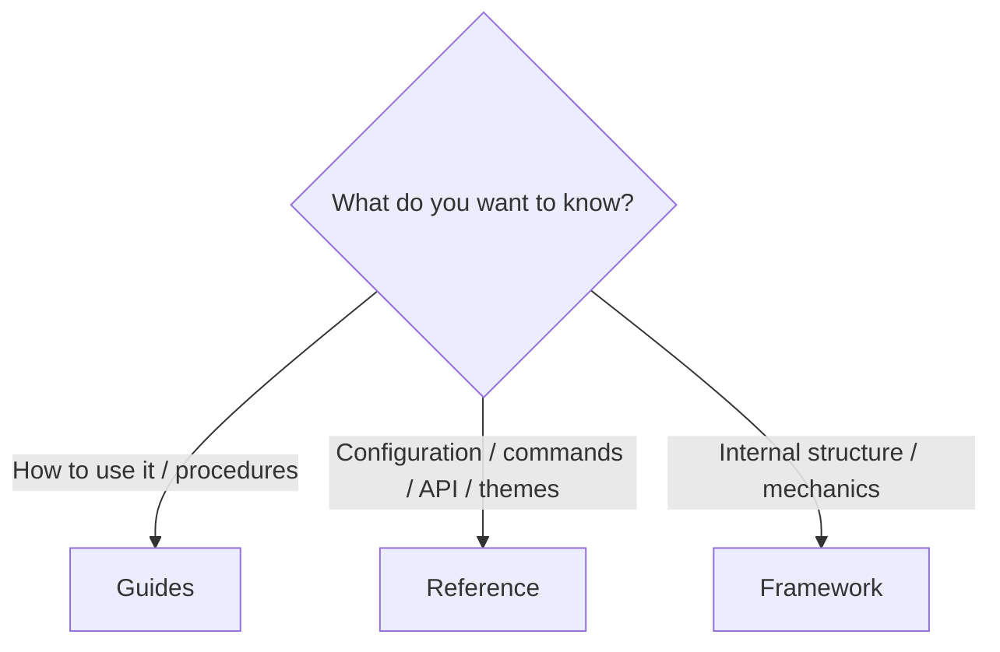
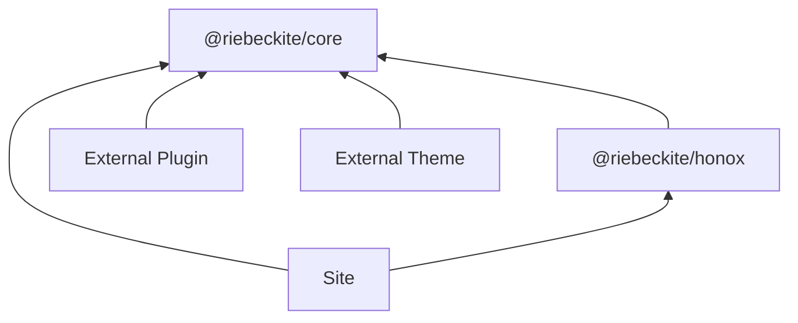
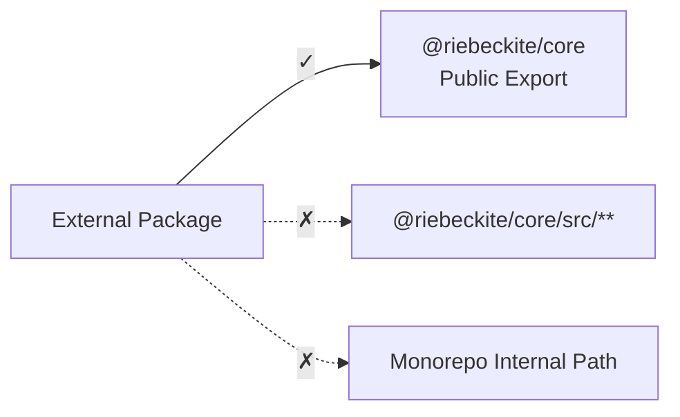
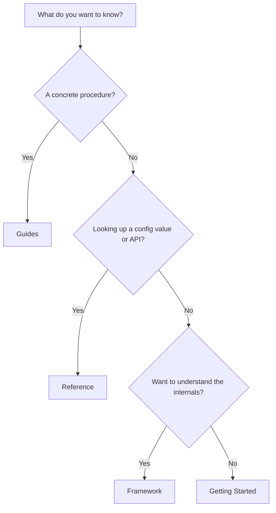

# Reference

Reference is for factual lookup: configuration keys, CLI commands, public exports, Plugin API, Theme API, Theme customization, and internal architecture. Use [Guides](../guides/README.md) when you want a task-oriented walkthrough.



You do not have to read Reference from start to finish. When you want to check a configuration field or an API, open the page you need.

## Reference pages

| Page | Use it for |
| --- | --- |
| [Configuration](./configuration.md) | `riebeckite.config.ts`, roots, content, theme, plugins |
| [Configuration reference](./configuration-reference.md) | Every `riebeckite.config.ts` field, its type, and its default |
| [CLI](./cli.md) | `dev`, `check`, `doctor`, `build`, `profile`, `inspect` |
| [Plugin API](./plugin-api.md) | `definePlugin`, lifecycle hooks, assets, endpoints, diagnostics |
| [Theme API](./theme-api.md) | `defineTheme`, CSS contract, tokens, color mode, package shape |
| [Framework](../framework/README.md) | Riebeckite's internal structure |
| [Themes](../themes/README.md) | How to build a theme |

### Configuration

In [Configuration](./configuration.md) you can check Riebeckite's settings and how they are resolved, including:

- `site`
- `content`
- `markdown`
- `theme`
- `plugins`
- `appRoot`
- `configRoot`
- `contentRoot`

### CLI

In [CLI](./cli.md) you can check each command and its role:

```text
init
dev
check
doctor
build
profile
inspect
```

### Plugin API

In [Plugin API](./plugin-api.md) you can check the public contracts a plugin can use:

- `definePlugin`
- Lifecycle hooks
- Content hooks
- Renderer
- Page Type
- Assets
- Client Entry
- Endpoint
- Diagnostics

To understand how plugins work, see [Plugin System](../framework/plugin-system.md).

### Theme API

In [Theme API](./theme-api.md) you can check the public contracts a theme can use:

- `defineTheme`
- Design tokens
- Color Mode
- Typography
- Article Layout
- CSS contract
- Theme package

To understand the design philosophy and mechanics of themes, see [Theme System](../framework/theme-system.md).

## Public packages and imports

External plugins and themes should depend on public packages and public exports only.

| Package | Public surface |
| --- | --- |
| `@riebeckite/core` | `defineConfig`, `definePlugin`, `defineTheme`, content APIs, pipeline APIs, diagnostics, observability types |
| `@riebeckite/cli` | `riebeckite` CLI binary |
| `@riebeckite/honox` | HonoX integration and scaffolding support; the `server` subpath exports the route/SSG helpers (`resolveRiebeckiteRoute`, `resolveRiebeckiteContentRequest`, `resolveRiebeckiteHomeRequest`, `contentRouteSsgParams`, `riebeniteSsgParams`), and the `ui` subpath exports the article/site UI primitives (`Article`, `ArticleBody`, `PageBody`, `ArticleContent`, `ContentSlot`, `hasSlot`, and their props) |
| `@riebeckite/test` | Test helpers (`assertGolden`, `assertGoldenJson`); the `e2e` subpath exports the packed-tarball external-site engine |
| `@riebeckite/plugin-*` | Plugin factory and documented subpath exports |
| `@riebeckite/theme-*` | Theme factory and CSS exports |

The dependencies are roughly as follows.



It is important that external packages do not depend directly on Riebeckite monorepo internals.

## Public API and internal API

External packages use a package's public exports. For example:

```ts
import {
  definePlugin,
  escapeHtml,
} from "@riebeckite/core";
```

Do not use imports such as:

```ts
import {
  something,
} from "@riebeckite/core/src/...";
```

Nor should you depend on Riebeckite monorepo-internal paths such as:

```text
../../../../packages/core/...
```



Do not import from `@riebeckite/core/src/**` or from monorepo-internal paths in external packages.

The public API is a contract intended for external use. `src/**` and monorepo-internal paths are implementation details and may change between package releases.

## `@riebeckite/core`

`@riebeckite/core` provides Riebeckite's framework-independent public API.

### Important core exports

- Config: `defineConfig`, `resolveConfig`, `resolveConfigModule`, `isPublished`, `isExcluded`
- Content: `ContentManager`, `ContentCollection`, `ContentGraph`, `ContentQuery`, `buildContentCollections`, `fingerprintContentEntries`, `resolveDefaultContentLocation`
- Plugins: `definePlugin`, `resolvePlugins`, `defineEndpoint`, `createStyleAsset`, `createClientEntry`, `appendContentBodySlot`, `createPluginMemo`, `stableStringify`
- Themes: `defineTheme`, `RiebeckiteTheme`, `ThemeDesignTokens`, `ThemeColorMode`, `ThemeTypographyPreset`, `ThemeArticleLayoutPreset`
- Pipeline: `Pipeline`, `MarkdownPipeline`, `HtmlPipeline`
- Utilities: `escapeHtml`, `escapeHtmlAttribute`, `normalizeTag`, `calculateReadingTime`, `stripHtml`
- Observability: `Logger`, `Tracer`, `TraceSpan`, `TraceSink`

### Config

```text
defineConfig
resolveConfig
resolveConfigModule
isPublished
isExcluded
```

Used to declare and resolve config and for publication policy. See [Configuration](./configuration.md) for details.

### Content

```text
ContentManager
ContentCollection
ContentGraph
ContentQuery
buildContentCollections
fingerprintContentEntries
resolveDefaultContentLocation
```

Used to load and resolve content and for collections, the content graph, queries, and public locations. See [Content System](../framework/content-system.md) for the mechanics.

### Plugins

```text
definePlugin
resolvePlugins
defineEndpoint
createStyleAsset
createClientEntry
appendContentBodySlot
createPluginMemo
stableStringify
```

Used to define and resolve plugins, endpoints, and more. To build a plugin, see [Plugin API](./plugin-api.md) and [Plugins in Depth](../framework/plugin-system.md).

### Themes

```text
defineTheme
RiebeckiteTheme
ThemeDesignTokens
ThemeColorMode
ThemeTypographyPreset
ThemeArticleLayoutPreset
```

Used to define themes and the presentation contract. To build a theme, see [Theme API](./theme-api.md) and [Themes in Depth](../framework/theme-system.md).

### Pipeline

```text
Pipeline
MarkdownPipeline
HtmlPipeline
```

Used to extend the Markdown/HTML processing pipeline. You do not normally need to handle these directly for ordinary site use.

### Utilities

```text
escapeHtml
escapeHtmlAttribute
normalizeTag
calculateReadingTime
stripHtml
```

Shared utilities available to plugins and integrations.

### Observability

```text
Logger
Tracer
TraceSpan
TraceSink
```

Types for integrating logging and tracing with the framework. See [Observability](../framework/observability.md) for details.

## Which documentation should you read?

When in doubt, use the following criteria.



Put simply:

```text
Want to start building a site
  → Getting Started

Want a concrete procedure
  → Guides

Want to look up configuration, CLI, or API
  → Reference

Want to understand Riebeckite's internals
  → Framework
```

Reference is an **index for looking up how to use the API**, while design philosophy and internal implementation live in Framework, and concrete procedures live in Guides.
