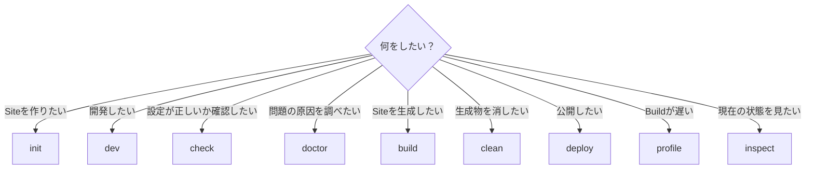
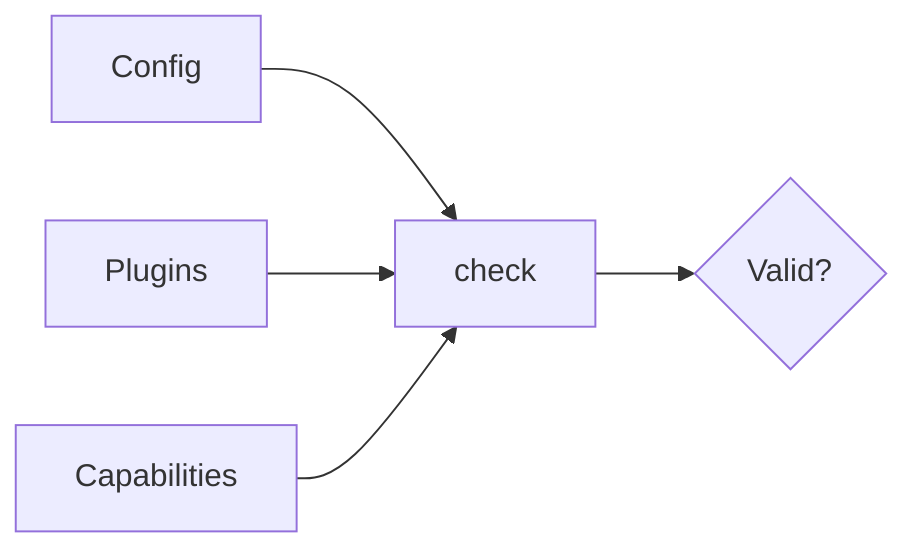
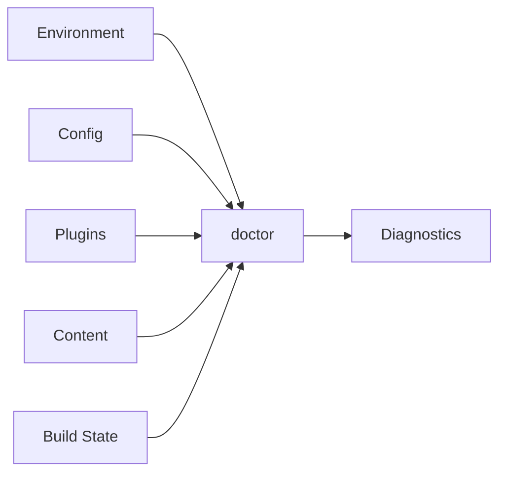
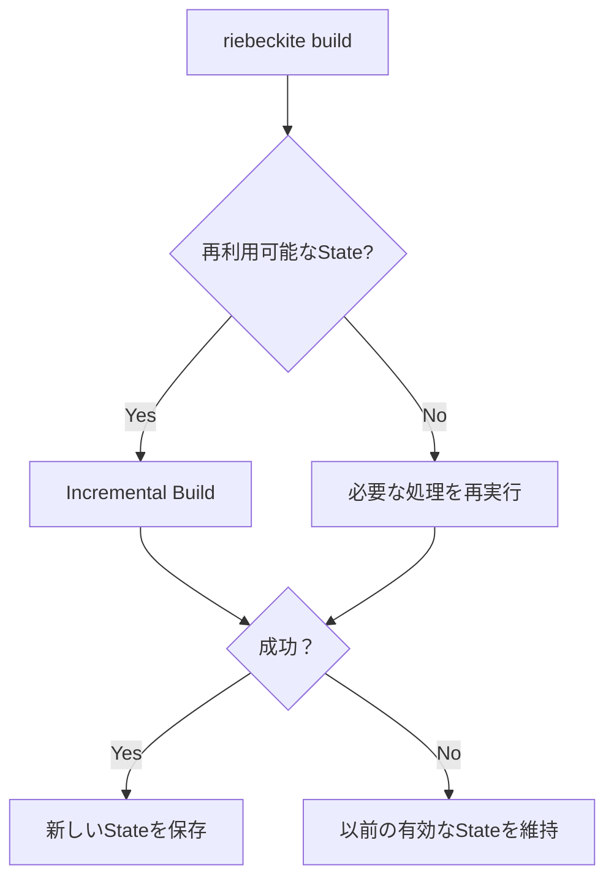
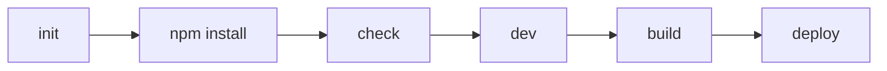
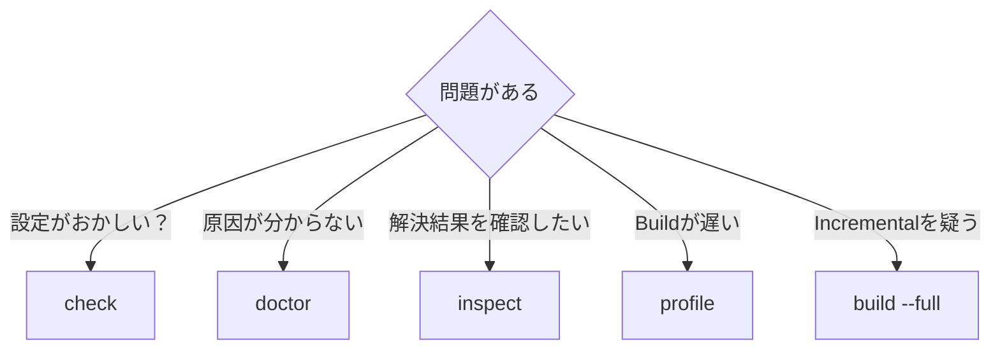

# CLI Reference

Riebeckite CLI は、Site の作成、開発、検証、診断、Build、公開などを行うためのコマンドです。

基本的には **Riebeckite Site の application directory で実行します。**

```sh id="vgst3p"
npm exec riebeckite <command>
```

CLI は current working directory から application root を解決します。

## コマンド一覧

```text id="7uw50m"
riebeckite init [directory] [--preset <name>] [--utilities <names>] [--force] [--list-presets]

riebeckite dev
riebeckite check
riebeckite doctor
riebeckite build [--full]
riebeckite clean [--output | --all]
riebeckite deploy [--dry-run | setup | domain]
riebeckite profile [--full]

riebeckite inspect config
riebeckite inspect plugins
riebeckite inspect content [--list]
riebeckite inspect graph
riebeckite inspect build
```

それぞれの役割は次のとおりです。

| Command | 何をする？ | Build State |
| --- | --- | --- |
| `init` | 新しい Site を作る | 変更しない |
| `dev` | 開発環境を起動する | Integration に依存 |
| `check` | 設定が正しいか検証する | 変更しない |
| `doctor` | Project 全体の問題を診断する | 変更しない |
| `build` | Site を Build する | 成功時のみ更新 |
| `clean` | Riebeckite が管理する状態を削除する。`--output` は Build 出力のみ、`--all` は両方を削除する | 変更しない |
| `deploy` | 生成物を Cloudflare Workers へ公開する。`--dry-run` は検証のみ、`setup` は GitHub Actions の継続デプロイを準備する、`domain` は Custom Domain を設定する | 変更しない |
| `profile` | Build の性能を調査する | Build に依存 |
| `inspect` | 現在の解決結果を見る | 変更しない |

## どのコマンドを使う？

目的から選ぶと分かりやすくなります。



特に混同しやすいのが `check`、`doctor`、`inspect`、`build` です。

簡単に分けると、

```text id="1djofm"
check
  → 正しい？

doctor
  → 問題はない？

inspect
  → 今どうなっている？

build
  → 実際に生成する
```

と考えると分かりやすいです。

## `init`

新しい Riebeckite Site を作成します。

```sh id="18r7wl"
npm exec riebeckite init
```

別のディレクトリへ作成する場合は、

```sh id="81jmbp"
npm exec riebeckite init my-site
```

のように指定します。

生成される Site には、基本的な

- Riebeckite config
- Vite / HonoX application
- route
- stylesheet
- 初期 content

が含まれます。

生成された Site は Riebeckite monorepo に依存しない、自己完結した application です。

### Preset を選ぶ

```sh id="vt7gdb"
npm exec riebeckite init my-site --preset starter
```

`--preset` で Site の初期構成を選択できます。

既定値は `starter` です。

利用できる preset は、

```sh id="b0n6ph"
npm exec riebeckite init --list-presets
```

で確認できます。

### Project file を選ぶ

preset とは別に、任意の project file を生成できます。

```sh id="pf8k21"
npm exec riebeckite init my-site --utilities editorconfig,npmrc,vscode
```

`--utilities` には `editorconfig`、`gitattributes`、`biome`、`npmrc`、`vscode` をカンマ区切りで指定します。既定では `editorconfig,gitattributes,biome` を生成し、`npmrc` と `vscode` は生成しません。`none` を指定すると project file を生成しません。

| 名前 | ファイル |
| --- | --- |
| `editorconfig` | `.editorconfig` |
| `gitattributes` | `.gitattributes` |
| `biome` | `biome.json` |
| `npmrc` | `.npmrc` |
| `vscode` | `.vscode/settings.json` |

`create-riebeckite` の対話式では `Extra project files` の質問で個別に選択できます。

### 既存ファイルがある場合

`init` は、生成対象となるファイルがすでに存在する場合、そのまま上書きしません。

意図的に上書きする場合は、

```sh id="l5kjod"
npm exec riebeckite init my-site --force
```

を使用します。

`--force` は既存ファイルへ影響するため、内容を確認してから使用してください。

### `create-riebeckite`

同じ Site generator は `create-riebeckite` からも利用できます。

```sh id="kyw0rx"
npx create-riebeckite
```

`--preset` や `--list-presets` も同様に利用できます。

対話式では、Content source に続いてデプロイ設定を尋ねられます。

| 選択肢 | 生成されるもの |
| --- | --- |
| `Cloudflare Workers` | Wrangler の依存と `wrangler.jsonc`。依存関係のインストール後に `Deploy now?` を確認 |
| `GitHub Actions` | `wrangler.jsonc` と `.github/workflows/deploy.yml` |
| `Not now` | デプロイ設定を追加しない |

`Cloudflare Workers` で `Deploy now?` に `Yes` と答えると、生成後に build と `riebeckite deploy` が続けて実行されます。`Later` の場合は生成だけを行い、次を実行して公開します。

```sh
npm run build
npm exec riebeckite deploy
```

Site を生成した後は依存関係を install し、

```sh id="gzg1my"
npm install
npm exec riebeckite check
npm exec riebeckite build
```

で正常に構成されていることを確認できます。

## `dev`

開発環境を起動します。

```sh id="ujiy7q"
npm exec riebeckite dev
```

Riebeckite Integration の development workflow を利用して Site を起動します。

実際の development server や Build State の扱いは、使用している Integration に依存します。

通常の HonoX Site では、開発中のページ確認にこのコマンドを使用します。

## `check`

Config、Plugin、Capability の設定が有効か検証します。

```sh id="5a2lrf"
npm exec riebeckite check
```

たとえば、

- config の形式が正しいか
- Plugin の設定が正しいか
- 必要な capability が成立しているか

などを確認します。



`check` が成功したからといって、Site がすでに Build / Deploy されていることを意味するわけではありません。

`check` が保証するのは **Configuration が有効であること**です。

### Plugin Option Validation

Plugin の option validation も `check` の一部として実行されます。

Plugin は `validateOptions` を使って、自身の設定を検証できます。

たとえば Analytics Plugin なら、

- provider
- collector URL

などの設定を検証できます。

不正な Plugin 設定は、実際の Build より前に `check` で検出できます。

## `doctor`

Project の状態を広く診断します。

```sh id="zruccx"
npm exec riebeckite doctor
```

`doctor` は、

- environment
- config
- Plugin
- content
- Build State

などを確認します。



1つの診断に失敗しても、安全に続行できる独立した診断は可能な限り継続します。

Health check が失敗した場合は non-zero status で終了します。

## `build`

Site を Build します。

```sh id="iznhhd"
npm exec riebeckite build
```

通常は incremental state を利用して、再利用可能な処理を省略します。



Build State は **Build が成功した場合だけ**更新されます。

失敗した Build が以前の正常な state を壊すことはありません。

### Full Build

incremental state の再利用を避けたい場合は、

```sh id="wpr38p"
npm exec -- riebeckite build --full
```

を使用します。

Build の再現確認や incremental behavior の問題を切り分ける場合に利用できます。

詳しくは [Build System](../framework/build-system.ja.md) を参照してください。

## `clean`

Riebeckite が生成・管理する再生成可能な状態を削除します。

```sh id="cln001"
npm exec riebeckite clean
```

option を指定しない場合は、application directory 配下の managed state root（`.riebeckite/`）を削除します。ここには Build State、Plugin Cache、persistent content cache、SSG output cache が含まれます。

Build 出力だけを削除する場合は、

```sh id="cln002"
npm exec -- riebeckite clean --output
```

managed state と Build 出力の両方を削除する場合は、

```sh id="cln003"
npm exec -- riebeckite clean --all
```

を使用します。

削除対象の配置は解決済みの Configuration から取得するため、Build 出力の場所を hard-code しません。対象が存在しない場合もエラーにせず、再実行しても成功します。Content、Config、Theme / Plugin の source、`public/` の asset、Git の metadata は削除しません。application root の外を指す path は削除せず、symlink / junction は link 先を辿らずに link 自体だけを削除します。`app/.riebeckite/` の generated source は、次の `dev` や `build` で再生成されるため残します。

incremental state や persistent cache、以前の Build 出力に依存せずに Site を再現したい場合は、cold build として

```sh id="cln004"
npm exec -- riebeckite clean --all
npm exec riebeckite build
```

を実行します。Build が遅い、または incremental reuse が疑わしいときの切り分けにも利用できます。既定の配置ではこれらの cache は `.riebeckite/` 配下にあります。別の場所に cache directory を設定している場合、その場所は `clean` の削除対象に含まれません。

## `deploy`

Build 済みの生成物を Cloudflare Workers へ公開します。

```sh id="k4n8we"
npm exec riebeckite deploy
```

`deploy` は Wrangler を呼び出して `dist/` を公開します。初回は Wrangler の OAuth で Cloudflare にログインし、`wrangler.jsonc` が無い場合はプロジェクト名から生成します。公開 URL は `https://<worker-name>.<account>.workers.dev` です。`create-riebeckite` で `Cloudflare Workers` を選ぶと、Wrangler の依存と `wrangler.jsonc` を含む、このコマンドを実行できるサイトが生成されます。

`deploy` は Build を行いません。先に `npm exec riebeckite build` を実行してください。

Cloudflare へ接続せずに設定とアセットを検証する場合は、

```sh id="d9x2qb"
npm exec -- riebeckite deploy --dry-run
```

を使用します。`npm exec` は `--dry-run` を自身の option として解釈する場合があるため、`--` で区切ってください。

push ごとに自動で deploy したい場合は GitHub Actions を利用できます。詳しくは [Deployment](../guides/deployment/README.ja.md) を参照してください。

### `deploy setup`

すでに Local-first で公開している Site に、GitHub Actions による継続デプロイを追加します。

```sh id="k4n8ws"
npm exec riebeckite deploy setup
```

`deploy setup` は、Git Repository と GitHub Remote を検出し、GitHub CLI（`gh`）と Wrangler のログインを確認し、`create-riebeckite` と同じテンプレートから `.github/workflows/deploy.yml` を作成します。Wrangler のログイン状態から Cloudflare Account を取得し、複数ある場合は選択します。最後に `CLOUDFLARE_ACCOUNT_ID` と `CLOUDFLARE_API_TOKEN` を Repository Secret として登録します。

Token は hidden prompt、または non-interactive 用の環境変数 `CLOUDFLARE_API_TOKEN` から読み取り、standard input 経由で `gh secret set` へ渡します。command line の引数には載せず、ファイルにも書き込みません。

GitHub Repository の作成と push は行いません。Riebeckite 以外の既存 workflow を検出した場合は、上書きせずそのまま報告し、secret の登録には進まずに停止します。再実行すると、一致する workflow と登録済みの secret は検出され、残りの手順だけを実行します。別の deployment workflow が既にある場合は、置き換えるか削除してから再実行してください。

`deploy setup` は Wrangler のログインを使うため、Wrangler の依存が Site に install されている必要があります。`create-riebeckite` で `Cloudflare Workers` を選んだ Site には含まれています。

### `deploy domain`

`deploy` が公開する Worker に Cloudflare Workers の Custom Domain を設定します。

```sh id="d0main"
npm exec riebeckite deploy domain
```

`deploy domain` は Site の Wrangler 設定（`wrangler.jsonc` または `wrangler.json`）を読み、`custom_domain: true` を持つ `routes` エントリを追加します。引数は取りません。`docs.example.com` のような hostname を対話的に入力し、変更内容を表示して確認したうえで書き込みます。

初回の `deploy` の後で実行してください。Wrangler 設定が無い場合や terminal が interactive でない場合は、hint を表示して停止します。`wrangler.toml` は変更しません。書き込み後は `Deploy now?` を確認し、選ばなかった場合は `npm exec riebeckite deploy` を案内します。再実行すると設定済みの domain を検出し、書き込みを省略します。

## `profile`

Build のどこに時間がかかっているか調査します。

```sh id="5pvcmf"
npm exec riebeckite profile
```

Trace を収集し、Build phase や Plugin 処理などの performance report を表示します。

incremental reuse を避けて計測する場合は、

```sh id="mqr87f"
npm exec -- riebeckite profile --full
```

を使用します。

`profile` は性能調査のための command であり、Configuration validity を確認するための command ではありません。

report では Plugin cache と Content cache を分けて表示します。Content cache には miss / bypass の理由も含まれるため、なぜ再利用されなかったのかを確認できます。

## `inspect`

Riebeckite が現在認識している状態を確認します。

```sh id="enl4wg"
npm exec riebeckite inspect plugins
```

Inspector は **read-only** です。

実行しても、

- Build
- Build State の書き込み
- Plugin Cache の書き込み
- Asset emission
- Vite / HonoX Build
- Artifact render
- Config の自動修正

を行いません。

### Config

```sh id="c3x2ak"
npm exec riebeckite inspect config
```

解決済みの Configuration を確認します。

### Plugins

```sh id="wnn5fz"
npm exec riebeckite inspect plugins
```

現在有効な Plugin を確認します。

### Content

```sh id="qqht5s"
npm exec -- riebeckite inspect content --list
```

現在の Content entry と解決済みの canonical permalink などを確認します。

特定の記事がどの URL として認識されているか確認したい場合に便利です。

### Graph

```sh id="s8q7lx"
npm exec riebeckite inspect graph
```

Content Graph を確認します。

WikiLink、backlink、graph extension などを調査するときに利用できます。

### Build

```sh id="y2uc9f"
npm exec riebeckite inspect build
```

現在の incremental Build State を確認します。

State が存在しない場合や壊れている場合も、新しい state を生成せず、その状態と理由を表示します。

Inspector の詳しい設計については [Inspector](../framework/inspector.ja.md) を参照してください。

## Error の表示

CLI command が失敗した場合は、可能な範囲で構造化されたエラー情報を表示します。

主に、

- Error 名
- Message
- Error code
- File path
- 修正方法の hint

などです。

原因となった error がネストしている場合は、

```text id="bf6q65"
Caused by:
```

として表示されます。

単に「失敗した」と表示するのではなく、**何が失敗し、どこを確認すればよいか**が分かることを目標としています。

## 通常の Workflow

新しく Site を作る場合は、次のような流れになります。



`build` の後は `npm exec riebeckite deploy` で生成物を公開できます。

問題が発生した場合は、目的に応じて `doctor`、`inspect`、`profile` を使います。



迷った場合は、

**作るなら `init`、開発するなら `dev`、検証するなら `check`、診断するなら `doctor`、見るだけなら `inspect`、生成するなら `build`、公開するなら `deploy`、速度を調べるなら `profile`、状態を消すなら `clean`**

と覚えておくと、各 command の役割を区別しやすくなります。

診断結果については [Diagnostics](../framework/diagnostics.ja.md)、非推奨 API からの移行については [Upgrading](../guides/upgrading.ja.md)、Build State については [Build System](../framework/build-system.ja.md) を参照してください。
