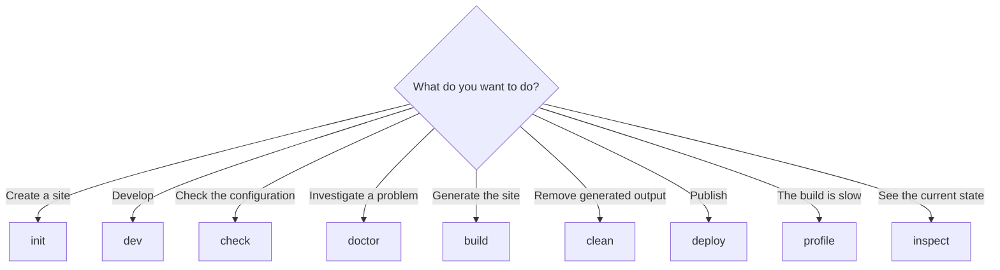
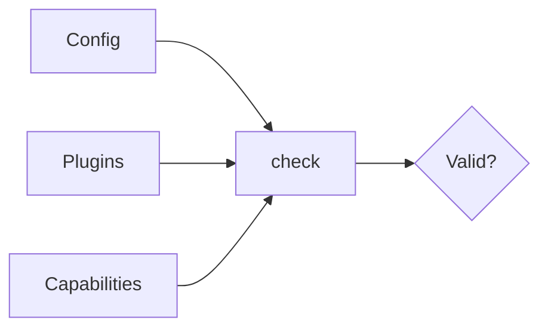
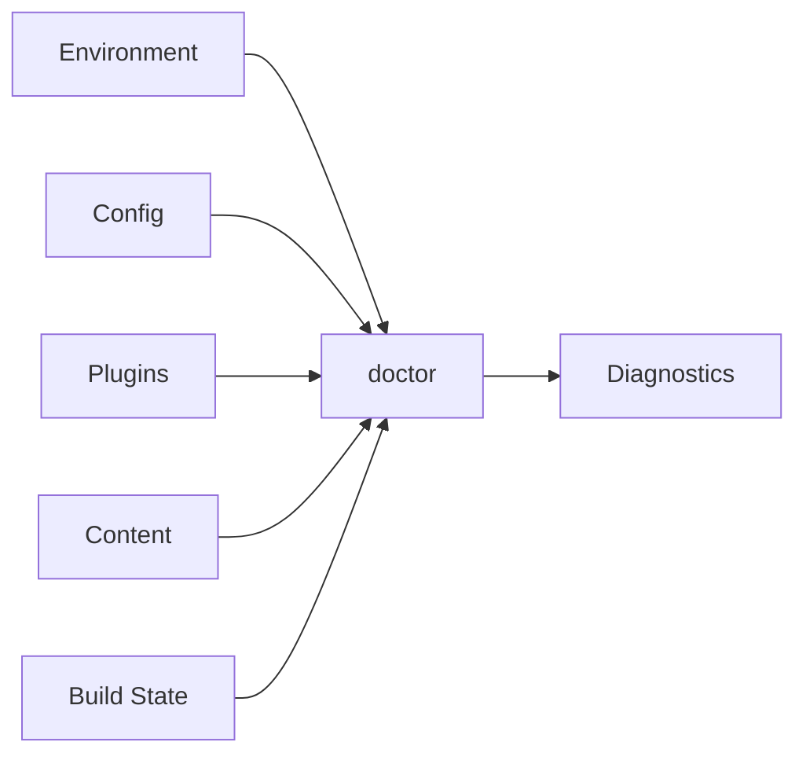
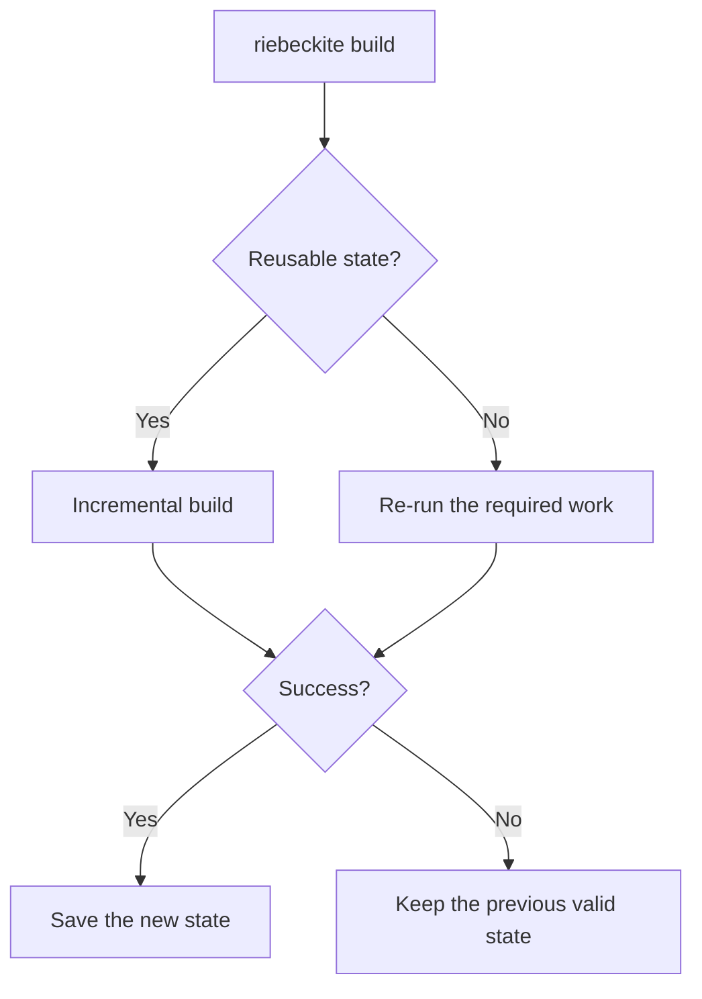
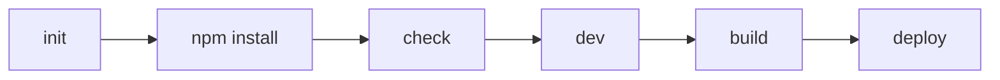
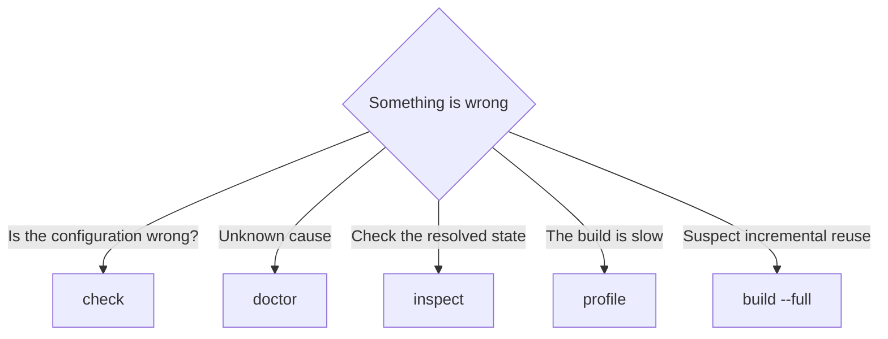

# CLI Reference

Run commands from an application directory. The CLI resolves the application root from the current working directory and reports command errors safely with a non-zero exit code.

```sh
npm exec riebeckite <command>
```

## Command list

```text
riebeckite init [directory] [--preset <name>] [--utilities <names>] [--force] [--list-presets]
riebeckite dev
riebeckite check
riebeckite doctor
riebeckite build [--full]
riebeckite clean [--output | --all]
riebeckite deploy [--dry-run | setup | domain]
riebeckite profile [--full]
riebeckite inspect [config | plugins | content [--list] | graph | build]
```

## Command contracts

| Command | Purpose | Writes build state? |
| --- | --- | --- |
| `init` | scaffold a self-contained site from a preset | no |
| `dev` | start the integration development workflow | integration-dependent |
| `check` | validate app configuration, content root availability, plugin options, and capability resolution | no |
| `doctor` | diagnose environment, project discovery, configuration, plugins, content source readability, and build state | no |
| `build` | run the build path; `--full` bypasses incremental reuse | yes, on success |
| `clean` | remove Riebeckite-managed state (`--all` also removes the build output; `--output` removes only the build output) | no |
| `deploy` | publish the existing build output to Cloudflare Workers via Wrangler; `--dry-run` validates without uploading; `setup` prepares GitHub Actions continuous deployment; `domain` adds a Cloudflare Workers Custom Domain | no |
| `profile` | run tracing-based performance reporting; `--full` uses a full path | build-dependent |
| `inspect` | display factual resolved state | no |

## Which command should I use?

Choosing by goal makes the difference clearer.



`check`, `doctor`, `inspect`, and `build` are especially easy to confuse. A simple split:

```text
check
  → Is it correct?

doctor
  → Are there problems?

inspect
  → What is the current state?

build
  → Actually generate the output
```

## `init`

`init` scaffolds a self-contained site (configuration, Vite/HonoX application shell, routes, stylesheet, and starter content) in the target directory, which defaults to the current directory. The generated site is a self-contained application that does not depend on the Riebeckite monorepo.

```sh
npm exec riebeckite init
```

Pass a directory to create the site somewhere else:

```sh
npm exec riebeckite init my-site
```

Install dependencies, then run `check` and `build` in the generated site.

### Choosing a preset

The composition is selected with `--preset <name>` (default: `starter`).

```sh
npm exec riebeckite init my-site --preset starter
```

Run `--list-presets` to see the available presets and their descriptions.

```sh
npm exec riebeckite init --list-presets
```

### Choosing project files

Project files are selected separately from the preset with `--utilities <names>`, a comma-separated list of `editorconfig`, `gitattributes`, `biome`, `npmrc`, and `vscode`.

```sh
npm exec riebeckite init my-site --utilities editorconfig,npmrc,vscode
```

| Name | File |
| --- | --- |
| `editorconfig` | `.editorconfig` |
| `gitattributes` | `.gitattributes` |
| `biome` | `biome.json` |
| `npmrc` | `.npmrc` |
| `vscode` | `.vscode/settings.json` |

The default is `editorconfig,gitattributes,biome`, and `none` writes none. In interactive mode the `Extra project files` prompt pre-selects the default set.

### When files already exist

`init` refuses to write into a directory that already contains generated files unless `--force` is passed.

```sh
npm exec riebeckite init my-site --force
```

Because `--force` affects existing files, review their contents before using it.

### `create-riebeckite`

The `create-riebeckite` package runs the same generator through `npx create-riebeckite` and accepts the same `--preset` / `--list-presets` flags.

```sh
npx create-riebeckite
```

In interactive mode it asks for the content source and then for the deployment:

| Choice | What is generated |
| --- | --- |
| `Cloudflare Workers` | the Wrangler dependency and `wrangler.jsonc`; after installing dependencies it offers `Deploy now?` |
| `GitHub Actions` | `wrangler.jsonc` and `.github/workflows/deploy.yml` |
| `Not now` | no deployment files |

Choosing `Yes` at `Deploy now?` runs the build and `riebeckite deploy` right after scaffolding. Choosing `Later` only generates the site; publish it with:

```sh
npm run build
npm exec riebeckite deploy
```

After generating the site, install dependencies and verify the setup:

```sh
npm install
npm exec riebeckite check
npm exec riebeckite build
```

## `dev`

`dev` starts the development environment.

```sh
npm exec riebeckite dev
```

It starts the site through the Riebeckite integration's development workflow. The actual development server and how build state is handled depend on the integration in use. For an ordinary HonoX site, use this command to preview pages while developing.

## `check`

`check` validates that the configuration, plugins, and capabilities are set up correctly.

```sh
npm exec riebeckite check
```

For example, it confirms:

- the config format is valid
- plugin configuration is valid
- required capabilities are resolved



`check` establishes basic project validity, not that output has been built or deployed. What `check` guarantees is that the configuration is valid.

### Plugin option validation

Plugin option validation runs as part of `check`. Each plugin's `validateOptions` (the analytics plugin, for example, validates its provider and collector URL) contributes to configuration validity, so an invalid plugin setup fails `check` before any build starts.

## `doctor`

`doctor` diagnoses the project broadly.

```sh
npm exec riebeckite doctor
```

It checks the environment, config, plugins, content, and build state.



`doctor` continues independent checks where possible and exits unsuccessfully when health checks fail.

## `build`

`build` builds the site.

```sh
npm exec riebeckite build
```

Normally it reuses incremental state and skips work that can be reused.



Build state is updated only when the build succeeds, so a failed build never corrupts the previous good state.

### Full build

To avoid reusing incremental state:

```sh
npm exec -- riebeckite build --full
```

Use this to reproduce a build or to isolate problems with incremental behavior. See [Build system](../framework/build-system.md) for details.

## `clean`

`clean` removes Riebeckite-managed artifacts instead of user content.

```sh
npm exec riebeckite clean
```

With no options it removes the managed state root (`.riebeckite/` under the application directory), which holds the build state, plugin cache, persistent content cache, and SSG output cache.

To remove only the build output directory:

```sh
npm exec -- riebeckite clean --output
```

To remove both the managed state and the build output:

```sh
npm exec -- riebeckite clean --all
```

The output location is resolved from project configuration rather than hard-coded, so an integration-defined location is honored. Missing targets are not an error, so `clean` is safe to run repeatedly, including from CI and troubleshooting scripts. It never removes content, configuration, theme or plugin sources, `public/` assets, or Git metadata. It refuses to delete anything outside the application directory, and symlinks or junctions are removed as links, so their targets are never deleted. Generated source entries under `app/.riebeckite/` are left in place because the integration regenerates them on the next `dev` or `build`.

To reproduce a site without relying on incremental state, persistent caches, or previous output, run a cold build:

```sh
npm exec -- riebeckite clean --all
npm exec riebeckite build
```

This is also useful when the build is slow or incremental reuse is suspect. In the default layout those caches live under `.riebeckite/`; a cache directory configured elsewhere is not removed by `clean`.

## `deploy`

`deploy` publishes the `dist/` produced by `build` to Cloudflare Workers by invoking Wrangler. It creates `wrangler.jsonc` from the site folder name when the file is missing, opens the Wrangler login on the first run, and forwards `--dry-run` for validation without uploading.

`deploy` never rebuilds content, so run `npm exec riebeckite build` first.

To validate the configuration and assets without connecting to Cloudflare:

```sh
npm exec -- riebeckite deploy --dry-run
```

Because `npm` consumes a bare `--dry-run`, pass it as `npm exec -- riebeckite deploy --dry-run`. A site generated with `create-riebeckite`'s `Cloudflare Workers` choice already includes the Wrangler dependency and `wrangler.jsonc`.

To deploy automatically on every push, use GitHub Actions. See [Deployment](../guides/deployment/README.md).

### `deploy setup`

`deploy setup` prepares continuous deployment to GitHub Actions for a project that is already a Git repository and published with Local-first.

```sh
npm exec riebeckite deploy setup
```

It detects the Git repository and the GitHub remote, checks the GitHub CLI (`gh`) and Wrangler logins, creates `.github/workflows/deploy.yml` from the same template used by `create-riebeckite`, reads the Cloudflare account from your Wrangler login (asking you to choose when there is more than one), and registers `CLOUDFLARE_ACCOUNT_ID` and `CLOUDFLARE_API_TOKEN` as repository secrets. The token is read from a hidden prompt or from `CLOUDFLARE_API_TOKEN` in the environment and is sent to `gh secret set` through standard input; it is never passed as a command argument or written to disk. The command does not create a GitHub repository and does not push. An existing non-Riebeckite workflow is reported and left unchanged, and the command stops before registering any secrets. Wrangler must be installed in the site (Local-first sites already have it). Run it again any time: a matching workflow and existing secrets are detected and skipped, so only the remaining steps run. If a different deployment workflow already exists, replace or remove it before running `deploy setup` again.

### `deploy domain`

`deploy domain` configures a Cloudflare Workers Custom Domain for the Worker that `deploy` publishes.

```sh
npm exec riebeckite deploy domain
```

Run it after the first `deploy`, because it reads the existing Wrangler configuration (`wrangler.jsonc` or `wrangler.json`) in the site and adds a declarative `routes` entry with `custom_domain: true`. It takes no arguments: the command prompts for a hostname such as `docs.example.com`, shows the planned change, and asks for confirmation before writing. A `wrangler.toml` is left unchanged, and the command stops with a hint when no Wrangler configuration exists or the terminal is not interactive. After writing, it offers `Deploy now?` and otherwise prints the `npm exec riebeckite deploy` command. Running it again detects an already-configured domain and skips the write.

## `profile`

`profile` investigates where build time is spent.

```sh
npm exec riebeckite profile
```

It collects traces and displays a performance report covering build phases and plugin processing. The report separates Plugin cache activity from Content cache activity; the Content cache part also includes the reason for each miss or bypass, so you can see why an entry was not reused.

To measure without incremental reuse:

```sh
npm exec -- riebeckite profile --full
```

`profile` is a performance-investigation command, not a way to check configuration validity.

## `inspect`

`inspect` shows the state Riebeckite currently recognizes.

```sh
npm exec riebeckite inspect plugins
```

The inspector is deliberately read-only: it must not trigger a build, write caches/assets/state, invoke Vite/HonoX builds, render special artifacts, or auto-fix problems. In particular, running it does not perform:

- a build
- build state writes
- plugin cache writes
- asset emission
- Vite / HonoX builds
- artifact rendering
- automatic config fixes

### Config

```sh
npm exec riebeckite inspect config
```

Shows the resolved configuration.

### Plugins

```sh
npm exec riebeckite inspect plugins
```

Shows the currently active plugins.

### Content

```sh
npm exec -- riebeckite inspect content --list
```

Shows the current content entries and their resolved canonical permalinks. This is useful for confirming which URL a particular article is recognized as.

### Graph

```sh
npm exec riebeckite inspect graph
```

Shows the content graph. Use it when investigating WikiLinks, backlinks, or graph extensions.

### Build

```sh
npm exec riebeckite inspect build
```

Shows the current incremental build state. When the state is missing or broken, it does not create a new state; it reports that state and the reason.

See [Inspector](../framework/inspector.md) for the inspector's design.

## Error display

Command failures are reported with the error name, message, and, when present, the error `code`, file path, and a remediation `hint`. Nested causes are printed as `Caused by:` lines.

```text
Caused by:
```

The goal is not merely to say "it failed" but to make clear what failed and where to look.

## Common workflow

Broken WikiLinks, missing referenced assets, publish-boundary warnings, and other content-integrity findings come from the build path or from plugins such as `@riebeckite/plugin-diagnostics`. Use `inspect content --list` and `inspect graph` to confirm what Riebeckite loaded, then run `build` or the relevant plugin diagnostics for rendered-content problems.

```sh
pnpm exec riebeckite check
pnpm exec riebeckite doctor
pnpm exec riebeckite inspect plugins
pnpm exec riebeckite build
pnpm exec riebeckite deploy
```

For a new site, the flow looks like this:



After `build`, publish the output with `npm exec riebeckite deploy`.

When a problem occurs, use `doctor`, `inspect`, or `profile` depending on the goal:



Choose `inspect content --list` for item-level content output and `inspect graph` when investigating links or graph extensions. Use [Diagnostics](../framework/diagnostics.md) for interpretation, [Upgrading](../guides/upgrading.md) for deprecation and migration guidance, and [Build system](../framework/build-system.md) for state semantics.
