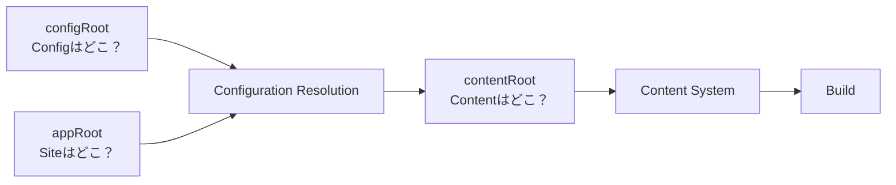

# Configuration

Riebeckite の設定は `riebeckite.config.ts` に記述します。

基本的な Site では、`defineConfig()` を使って次のように設定します。

```ts id="vps2rj"
import { defineConfig } from "@riebeckite/core";

export default defineConfig({
  site: {
    title: "My site",
    baseUrl: "https://example.com",
  },

  content: {
    directory: "content",
    exclude: ["drafts/**"],
    filters: {
      publishStrategy: "explicit",
    },
  },

  theme: {
    colorMode: "system",
    articleLayout: "article",
  },

  plugins: [],
});
```

必須なのは `site` です。

そのほかは必要に応じて設定します。

| Field | 用途 |
| --- | --- |
| `site` | Site の基本情報 |
| `content` | コンテンツの場所と公開条件 |
| `theme` | Theme の設定 |
| `plugins` | 使用する Plugin |
| `cache` | build cache の設定 |

Config は Content や Plugin の処理が始まる前に Integration によって解決されます。


## このセクションの構成

- [ナビゲーションの設定](./configuration/navigation.ja.md)
- [Content の設定と ContentSource](./configuration/content.ja.md)
- [3つの Root と外部 Vault](./configuration/roots.ja.md)
- [Attachment・Media と公開](./configuration/assets.ja.md)
- [Build cache](./configuration/cache.ja.md)
- [Plugin の設定](./configuration/plugins.ja.md)
- [Theme の設定](./configuration/theme.ja.md)
- [外部 Vault のトラブルシュート](./configuration/troubleshooting.ja.md)

## Config の検証

Configuration に問題がある場合は `ConfigValidationError` として報告されます。

不正な Configuration を無視してそのまま起動するのではなく、早い段階で失敗させます。

Config を変更した後は、

```sh id="khhx15"
npm exec riebeckite check
```

を実行してください。


## まとめ

Configuration では、Site と Content の場所を混同しないことが重要です。



基本的には、

```text id="htn7yn"
appRoot
  = Site Application の場所

configRoot
  = Config の場所

contentRoot
  = Markdown / Vault の場所
```

と覚えておけば十分です。

通常の Site では3つの違いを意識する必要はほとんどありません。

外部 Vault、別 repository の Content、特殊な monorepo 構成を使う場合だけ、この境界を意識してください。

Config の変更後は `riebeckite check`、実際にどう解決されたか確認したい場合は `riebeckite inspect config` を使用してください。
