# Configuration

Riebeckite の設定は `riebeckite.config.ts` に記述します。

基本的な Site では、`defineConfig()` を使って次のように設定します。

```ts id="vps2rj"
import { defineConfig } from "@riebeckite/core";

export default defineConfig({
  site: {
    title: "My site",
    baseUrl: "https://example.com",
  },

  content: {
    directory: "content",
    exclude: ["drafts/**"],
    filters: {
      publishStrategy: "explicit",
    },
  },

  theme: {
    colorMode: "system",
    articleLayout: "article",
  },

  plugins: [],
});
```

必須なのは `site` です。

そのほかは必要に応じて設定します。

| Field | 用途 |
| --- | --- |
| `site` | Site の基本情報 |
| `content` | コンテンツの場所と公開条件 |
| `theme` | Theme の設定 |
| `plugins` | 使用する Plugin |
| `cache` | build cache の設定 |

Config は Content や Plugin の処理が始まる前に Integration によって解決されます。

## Navigation の設定

Navigation はトップレベルの Config 項目ではなく、**`@riebeckite/plugin-navigation`** Plugin が提供します。Plugin は `{ primary, secondary }` という意味的なモデルを返し、**Site の shell がそれを描画・配置**します。`primary` と `secondary` は目立たせ方の違いを表すもので、配置そのものではありません。Plugin API に `header` / `footer` というキーはありません。

```ts
import { defineConfig } from "@riebeckite/core";
import { navigation } from "@riebeckite/plugin-navigation";

export default defineConfig({
  site: { title: "My site", baseUrl: "https://example.com" },
  plugins: [navigation()],
});
```

### 引数なしの導出

引数なしで呼び出すと、Vault の **discoverable entries**（`manifest.discoverableEntries`。public かつ discoverable で、draft や非 routable な Content を除く）から `primary` を導出します。専用の Vault ファイルを要求せず、既存の Riebeckite の情報を再利用します。

- folder 構造（folder はセクションになり、ネストした folder は `children` になります）
- README / index の解決（`index` または `README` のノートがその folder を表し、folder の `href` になります）
- README / index を持たない folder は、リンクを持たない label になります
- ルート直下の README / index は Navigation には現れません
- ページの `title`（無い場合は slug のセグメントを整形）
- `permalink`

**Riebeckite 専用の Vault ファイル（`navigation.md` など）も、必須の frontmatter も必要ありません。**

導出は表示中の言語に追従します。`l10n` Plugin が付与する言語 metadata をもとに同じ翻訳の entry をひとつの項目へ集約し、現在の言語の `href` だけを使います。`/ja/guide/` を表示しているときに `/en/...` が混ざることはありません。`l10n` を使っていない Vault では、これまでどおり全 entry が対象になります。

### 手動リンクと補助リンク

`items` を渡すと、導出された `primary` を置き換えます。`secondary` には、Site がより控えめに表示する補助リンクを渡します。

```ts
navigation({
  items: [
    { label: "Guide", href: "/guide" },
    {
      label: "Notes",
      href: "/notes/planning",
      children: [
        { label: "Planning", href: "/notes/planning" },
        { label: "Writing", href: "/notes/writing" },
      ],
    },
  ],
  secondary: [
    { label: "GitHub", href: "https://github.com/example/site", external: true },
  ],
});
```

### NavigationItem

各リンクは `NavigationItem` として設定します。

| Field | 型 | 説明 |
| --- | --- | --- |
| `label` | `string` | リンクに表示する名前 |
| `href` | `string` | 遷移先の path または URL |
| `children` | `NavigationItem[]` | 子項目。サブメニューとして表示されます |
| `external` | `boolean` | `true` の場合は別タブで開きます |

手動指定の item では `label` と `href` が必須です。index ノートを持たない導出 folder は label のみで描画されるため、導出モデルでは `href` は省略可能です。

### 配置

配置は Plugin ではなく Site の shell が決めます。Reference Site では `primary` を header、`secondary` を footer に表示します。Site タイトルがすでに Home へのリンクになっている shell では、`href: "/"` の item を表示しないことがあります。

### サブメニューを作る

`children` を使うと、Navigation を入れ子にできます。

```ts
{
  label: "Notes",
  href: "/notes/planning",
  children: [
    { label: "Planning", href: "/notes/planning" },
    { label: "Writing", href: "/notes/writing" },
  ],
}
```

`children` はサブメニューとして表示されます。

### 外部サイトへリンクする

外部サイトへのリンクには `external: true` を指定できます。

```ts
{
  label: "GitHub",
  href: "https://github.com/example/site",
  external: true,
}
```

この場合は別タブで開き、リンクに `rel="noreferrer"` が付きます。

### 現在のページを示す

現在表示しているページに対応するリンクが自動的に active になります。

たとえば、

```ts
{ label: "Guide", href: "/guide" }
```

という項目がある場合、次のようなページで active になります。

```text
/guide
/guide/getting-started
/en/guide
/en/guide/getting-started
```

末尾の `/` や先頭の locale は判定時に調整されるため、`/guide/` と `/en/guide` のような違いを意識する必要はありません。

active なリンクには `aria-current="page"` が付きます。

外部 URL など `/` から始まらない `href` と、`external: true` の項目は active 判定の対象になりません。

### モバイルでの表示

画面が狭い場合、Site の Navigation は `Menu` から開閉できる表示になります。

Navigation の内容や HTML 構造が別のものになるわけではなく、画面幅に応じて CSS で表示方法が変わります。

### 設定の検証

`navigation` の Option は Plugin の読み込み時に検証されます。

主な条件は次のとおりです。

- `label` は空でない文字列
- `href` は空でない文字列
- `external` を指定する場合は `boolean`
- `children` に祖先の項目を含めることはできない

不正な設定は Plugin の読み込み時にエラーになります。

### Plugin のページは自動追加されない

Plugin は Vault の discoverable entries からリンクを導出します。Plugin が生成するページを自動で surface することはありません。

たとえば、次のようなものは自動的には追加されません。

- Search
- Tag / Folder 一覧
- Taxonomy のページ
- Plugin の Page Type
- Breadcrumbs
- Backlinks
- Related Posts
- その他の Content graph 機能

Plugin が作るページを表示したい場合は、そのページへのリンクを `navigation({ items })` に追加してください。

Navigation と Plugin の役割の違いについては、[サイトのカスタマイズ](../guides/customizing-your-site.md#navigation-を変える) を参照してください。

### エクスポートされる helper と型

`@riebeckite/plugin-navigation` は `navigation`、`buildNavigation`、`resolveSiteNavigation`、`NAVIGATION_PLUGIN_NAME` と、型 `NavigationItem`、`NavigationOptions`、`SiteNavigation` をエクスポートします。

## Content の設定

通常は `content.directory` で Markdown などを読み込むディレクトリを指定します。

```ts id="dn44si"
content: {
  directory: "content",
}
```

標準的な Site なら、

```text id="w3ifap"
my-site/
├─ app/
├─ content/
├─ public/
├─ package.json
├─ vite.config.ts
└─ riebeckite.config.ts
```

のような構成になります。

### 除外するファイル

`exclude` を使うと、Content System に読み込ませないファイルを指定できます。

```ts id="4kv6vn"
content: {
  directory: "content",
  exclude: [
    "drafts/**",
    "Templates/**",
  ],
}
```

`exclude` に一致したファイルは、コンテンツとして処理される前に除外されます。

内部では `isExcluded` がこの判定を行います。

### 公開条件

どのコンテンツを公開するかは、既定では `publishStrategy` で設定します。

```ts id="hp9zx8"
content: {
  filters: {
    publishStrategy: "explicit",
  },
}
```

公開判定には frontmatter も利用されます。

```yaml id="osj0d5"
---
publish: true
---
```

現在の公開状態は Core で一度だけ解決され、Plugin には次の manifest view として渡されます。

| View | 含まれるもの | 用途 |
| --- | --- | --- |
| `manifest.publicEntries` | ルーティングできるページ。`public` と `unlisted` | ページ表示、SSG の path 列挙 |
| `manifest.discoverableEntries` | 発見可能な `public` ページだけ | docs navigation、search、feed、sitemap、taxonomy、graph、backlinks、related/recent |

frontmatter で明示的な公開状態を指定できます。

| Frontmatter | 結果 |
| --- | --- |
| `visibility: public` | URL で表示でき、一覧や検索にも出る |
| `visibility: unlisted` | URL を知っていれば表示できるが、一覧や検索には出ない |
| `visibility: draft` | URL でも表示されず、一覧や検索にも出ない |
| `publishAt: 2026-01-01T00:00:00.000Z` | build 時刻がその日時より前なら非公開、以後の build で `public` になる |
| `visibility` / `publishAt` なし | `publishStrategy` に従う。`explicit` は `publish: true` が必要。`selective` は `private: true` と `draft: true` を除外する |

`visibility` や `publishAt` が不正な場合、推測せず build を失敗させます。scheduled publishing は build 時刻だけで判定します。Riebeckite は runtime timer を起動しません。

`exclude` と `publishStrategy` は似ていますが、役割が異なります。

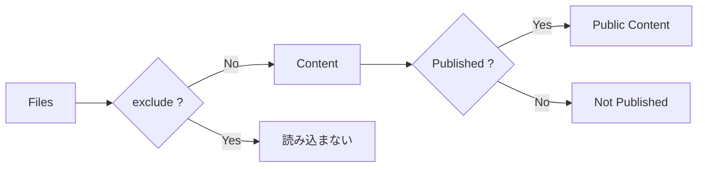

`exclude` は **Content System に入れるか**、`publishStrategy` や `visibility` は **Site でどう扱うか**を決めます。`exclude` されたファイルは link resolution や graph、diagnostics にも現れません。一方、`draft`、`unlisted`、公開前の `publishAt` は raw manifest には残りますが、Core が route 用 view と discovery 用 view から適切に外します。

## ContentSource

通常は `content.directory` を使用しますが、独自の読み込み元を使用する場合は `content.source` を指定できます。

```text id="rbdlxj"
content.directory
    ↓
標準 filesystem ContentSource
```

または、

```text id="hrp9p5"
content.source
    ↓
独自 ContentSource
```

のどちらかです。

同じコンテンツに対して2つの reader を動かすための設定ではありません。

`content.source` を指定する場合は、標準 filesystem reader を置き換えるものとして扱います。

## 3つの Root

外部 Vault や monorepo 構成を扱う場合に重要なのが、

- `appRoot`
- `configRoot`
- `contentRoot`

の違いです。

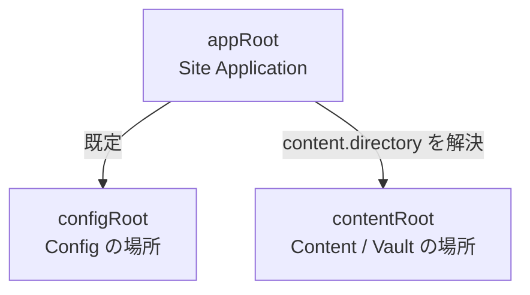

| 名前 | 何を表す？ | 既定値 / 基準 |
| --- | --- | --- |
| `appRoot` | HonoX / Vite Site の root | Vite `root` |
| `configRoot` | `riebeckite.config.*` を探す場所 | `appRoot` |
| `contentRoot` | 実際にコンテンツを読む場所 | `path.resolve(appRoot, content.directory)` |

この3つは別の役割を持ちます。

## appRoot

`appRoot` は **Site Application の基準となるディレクトリ**です。

たとえば、

```text id="xkjg5v"
site/
├─ app/
├─ public/
├─ package.json
├─ vite.config.ts
└─ riebeckite.config.ts
```

なら通常、

```text id="2hwbbd"
appRoot = site/
```

です。

`appRoot` は、

- `app/`
- `public/`
- route
- generated styles
- Build 設定

など Site Application の基準になります。

## configRoot

`configRoot` は、

```text id="53pg8g"
riebeckite.config.ts
riebeckite.config.js
riebeckite.config.mjs
```

を探す基準です。

通常は `appRoot` と同じです。

```text id="7uqfyx"
appRoot
   └─ riebeckite.config.ts
```

特殊な repository 構成で config を別の場所へ置く場合のみ変更します。

**`configRoot` を変更しても `content.directory` の基準は変わらない**点に注意してください。

## contentRoot

`contentRoot` は、実際に Markdown や asset を読み込む場所です。

相対 `content.directory` は常に `appRoot` を基準に解決されます。

```ts id="jgnfqm"
content: {
  directory: "../vault",
}
```

なら、

```text id="y6zaw5"
contentRoot
  = path.resolve(appRoot, "../vault")
```

となります。

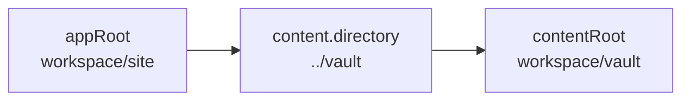

`process.cwd()` を基準にするわけではありません。

そのため CLI を別の directory から実行しても、同じ Site Application を解決できれば同じ Vault を参照できます。

## 外部 Vault を使う

Obsidian Vault を Site と独立して管理したい場合は、Site の外へ置く構成を推奨します。

たとえば、

```text id="bgmthg"
workspace/
├─ site/
│  ├─ package.json
│  ├─ vite.config.ts
│  ├─ riebeckite.config.ts
│  ├─ app/
│  └─ public/
│
└─ vault/
   ├─ index.md
   ├─ notes/
   ├─ attachments/
   └─ media/
```

という構成です。

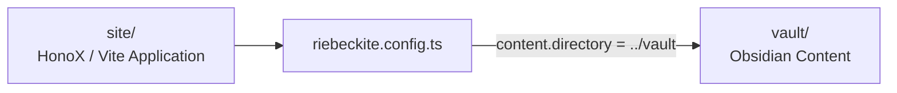

Site と Vault の役割が明確に分離されます。

```text id="wx10hc"
site/
  → Application

vault/
  → Source Content
```

Vault を Vite application root にする必要はありません。

## 外部 Vault の設定例

```ts id="p5vg19"
// site/riebeckite.config.ts

import { defineConfig } from "@riebeckite/core";
import { attachment } from "@riebeckite/plugin-attachment";
import { media } from "@riebeckite/plugin-media";
import { obsidianMarkdown } from "@riebeckite/plugin-obsidian-markdown";

export default defineConfig({
  site: {
    title: "My notes",
  },

  content: {
    directory: "../vault",
    exclude: [
      ".obsidian/**",
      "Templates/**",
    ],
  },

  plugins: [
    obsidianMarkdown(),
    media(),
    attachment(),
  ],
});
```

この場合、

```text id="9w7l08"
appRoot
  = workspace/site

content.directory
  = ../vault

contentRoot
  = workspace/vault
```

となります。

絶対パスを指定することもできます。

```ts id="vmohm9"
content: {
  directory: "C:/Users/example/Documents/vault",
}
```

ただし絶対パスは開発 PC や CI で場所が変わると使えなくなるため、通常は Site からの相対パスを推奨します。

## `process.cwd()` に依存しない

Content directory を次のように組み立てることは避けてください。

```ts id="i3cfla"
directory: path.resolve(
  process.cwd(),
  "../vault",
)
```

CLI をどこから実行したかによって結果が変化するためです。

また、

```text id="p2j2rb"
appRoot = Vault
```

とする必要もありません。

Vault は **source data**、`appRoot` は **Site Application** です。

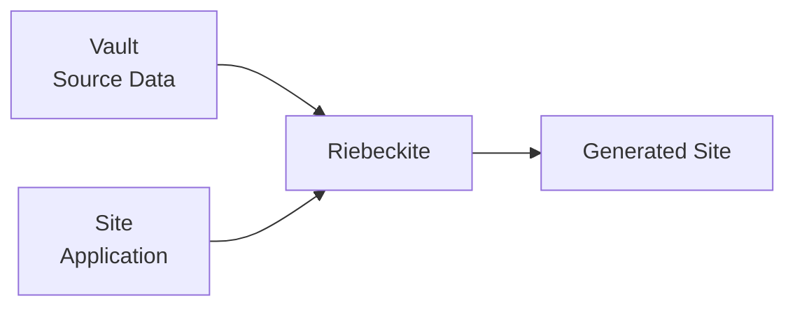

この境界を維持してください。

## Application から ContentManager を使う

通常、HonoX Integration が `contentRoot` を自動的に解決します。

しかし Site の route などで直接 `ContentManager` を作る場合は、Integration と同じ絶対 path を使用する必要があります。

たとえば、

```ts id="veou0j"
// site/app/config.ts

import path from "node:path";
import { fileURLToPath } from "node:url";
import { resolveConfigModule } from "@riebeckite/core";
import * as rawConfigModule from "../riebeckite.config";

const appRoot = fileURLToPath(
  new URL("../", import.meta.url),
);

const rawConfig = resolveConfigModule(
  rawConfigModule,
);

export const config = {
  ...rawConfig,

  content: {
    ...rawConfig.content,

    directory: path.resolve(
      appRoot,
      rawConfig.content.directory,
    ),
  },
};
```

この時点で、

```ts id="9pr6g1"
config.content.directory
```

は絶対パスです。

そのため、別の基準からもう一度 `path.resolve()` しないでください。

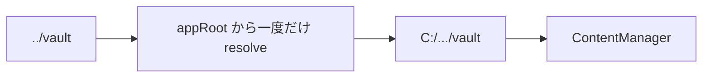

## Attachment と Media

Obsidian の attachment や media も `contentRoot` を基準に扱います。

ここで attachment / media とは **Markdown でも画像でもないファイル**です。Vault 内の画像（png、jpg、svg など）は content image として別の扱いになるため、混同しないよう次の節で分けて説明します。

たとえば Vault に、

```text id="qv3qcs"
vault/
├─ notes/
│  └─ report.md
├─ attachments/
│  └─ report.pdf
└─ media/
   └─ interview.mp3
```

があるとします。

Markdown では、

```md id="csovb2"
![[attachments/report.pdf]]

![[media/interview.mp3]]
```

のように参照できます。

`obsidianMarkdown()` はこれらを Vault からの相対 logical path として扱います。

`attachment()` と `media()` が対応する embed を描画します。

公開 URL は安定した形式になります。

```text id="j9hboh"
/assets/attachments/<Vault からの相対 logical path>
```

たとえば、

```text id="pfr5c3"
attachments/report.pdf

↓

/assets/attachments/attachments/report.pdf
```

のように logical path を維持します。

## Asset URL と実ファイルは別

ここは特に重要です。

URL を生成することと、そのファイルが Site へ公開されることは別のことです。

Asset は次の3種類に分かれ、公開を担当する場所も異なります。

| 種類 | 対象 | 公開 URL | 公開を担当する場所 |
| --- | --- | --- | --- |
| Content image | Vault 内の画像 | `/<Vault からの相対 logical path>` | Riebeckite の build |
| Attachment / Media | Markdown でも画像でもないファイル | `/assets/attachments/<Vault からの相対 logical path>` | Site Application |
| Static asset | Site Application 自身が管理するファイル | `/` 配下 | Vite の `public/` |

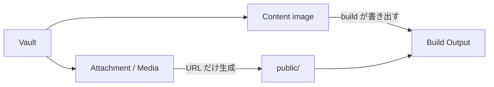

### Content image は build で公開される

`obsidianMarkdown()` は、公開ページから参照されている image を build の出力として書き出します。

Site Application が何もしなくても、その image は build output に含まれ、生成された URL から取得できます。

たとえば、

```text id="b1t4hs"
assets/logo.png

↓

/assets/logo.png
```

という論理 path をそのまま公開します。

開発サーバーでも、同じ論理 path のまま Content から直接配信されます。

参照されていない image、非公開ページからの image は書き出されません。どの image を書き出すかは公開ページと参照関係から決まります。

### Attachment と Media の公開は Site Application の担当

Attachment と Media については、URL を生成しただけでは実ファイルは公開されません。

Plugin が、

```text id="8m59d5"
/assets/attachments/attachments/report.pdf
```

という URL を生成したからといって、`report.pdf` が自動的に Vite の `public/` へコピーされるわけではありません。

Site Application は、公開する必要がある asset だけを、

```text id="5jd2hq"
public/assets/attachments/
```

へコピーしてください。

その際も Vault からの相対 logical path を維持します。

参照 Application の `build_images.ts` は、実際に参照されている attachment だけを差分コピーする実装例です。

### `public/` を使う Static asset

`public/` は Site Application 自身が管理する asset 用の directory です。

`public/` 以下のファイルは、Vite の build でそのまま build output へコピーされます。

Content から取り込んだ画像や attachment をここへまとめて置くのではなく、上記のように公開する対象を絞って配置します。

## Vault 全体を公開しない

次のような実装は避けてください。

```text id="wp29zc"
vault/**
   ↓
public/**
```

Vault 全体をそのまま `public/` へコピーすると、

- 非公開の記事
- 未公開ページからしか参照されていない画像
- 未参照の attachment
- `.obsidian/` の metadata
- 公開するつもりのないファイル

まで公開される可能性があります。

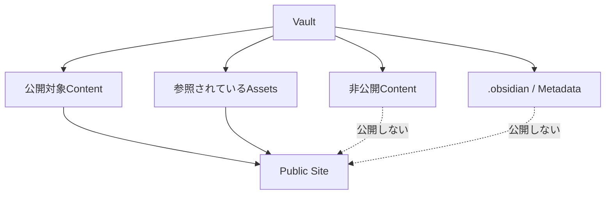

**必要な asset だけを公開する**ことが重要です。

Content image は build が公開対象を判断します。Attachment と Media をどの範囲で公開するかは Site Application 側の責務です。

## Build cache

`cache` は build 時に使う永続 cache の設定です。省略可能で、既定では Integration が適切な directory を決めます。

| Field | 既定値 | 説明 |
| --- | --- | --- |
| `cache.enabled` | `true` | `false` にすると永続 cache を無効化し、毎回すべてを再生成します。 |
| `cache.directory` | `<buildDirectory>/cache` | cache の保存先を上書きします。cache を別の場所へ移したり共有したい場合に指定します。未指定なら Integration の既定値を使います。 |

cache には build 間で再利用する処理済み Content や Plugin の結果が入ります。無効化や保存先の変更は build の速度にだけ影響し、出力は変わりません。cold build でも同じ結果になります。

## Plugin の設定

Plugin は `plugins` に指定します。

```ts id="93f0rv"
plugins: [
  obsidianMarkdown(),
  media(),
  attachment(),
]
```

条件によって Plugin を切り替えることもできます。

`PluginInput` では、

```text id="r4h4s2"
false
null
undefined
```

を無効な Plugin input として扱えます。

たとえば、

```ts id="7tk1jx"
plugins: [
  enableAnalytics && analytics(),
]
```

のような conditional configuration が可能です。

Config resolve 時に無効な input は除外され、有効な Plugin は安定した順序で整理されます。

その後 capability の整合性が検証されます。

## Theme の設定

Theme は `theme` で設定します。

```ts id="pgj2be"
theme: {
  colorMode: "system",
  articleLayout: "article",
}
```

raw configuration または宣言済み Theme を利用できます。

Theme は presentation の設定です。

HonoX、Vite、Cloudflare など Integration 固有の設定を Core configuration へ入れないでください。

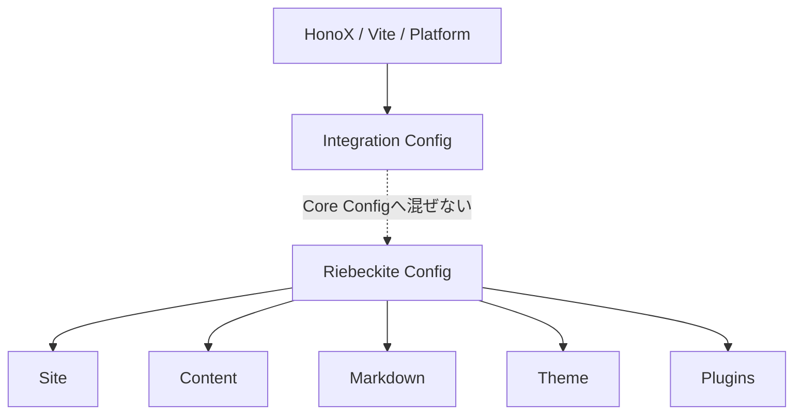

## Config の検証

Configuration に問題がある場合は `ConfigValidationError` として報告されます。

不正な Configuration を無視してそのまま起動するのではなく、早い段階で失敗させます。

Config を変更した後は、

```sh id="khhx15"
npm exec riebeckite check
```

を実行してください。

## 外部 Vault のトラブルシュート

外部 Vault や複雑な directory 構成を使っている場合は、次の順番で確認すると原因を切り分けやすくなります。

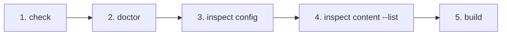

### 1. Config を検証する

```sh id="7x4ypg"
npm exec riebeckite check
```

Config と Plugin contract が正しいか確認します。

### 2. Content Source を診断する

```sh id="t7e22k"
npm exec riebeckite doctor
```

filesystem content source が存在しない、読み込めないなどの問題を確認します。

### 3. 解決された Directory を確認する

```sh id="rgnpgo"
npm exec riebeckite inspect config
```

`content.directory` が期待する絶対 path に解決されているか確認します。

### 4. Content を確認する

```sh id="4ssq64"
npm exec -- riebeckite inspect content --list
```

WikiLink や embed を調査する前に、期待する logical path と content が認識されていることを確認します。

### 5. 実際に Build する

```sh id="9wnm73"
npm exec riebeckite build
```

最後に Integration、SSG、route rendering まで含めて確認します。

## Config を Site の外へ置く

通常、

```text id="4p7m8h"
appRoot
  = configRoot
```

ですが、意図的に `riebeckite.config.ts` を別の directory に置くこともできます。

その場合は `riebeckiteVite()` に `configRoot` を指定します。

ただし、

```text id="8y2qf9"
appRoot
  → Site Application

configRoot
  → Config

contentRoot
  → Content / Vault
```

という役割は変わりません。

特に `appRoot` を Vault 側へ変更しないでください。

相対 `content.directory` は、`configRoot` ではなく引き続き **`appRoot` を基準**に指定します。

## まとめ

Configuration では、Site と Content の場所を混同しないことが重要です。

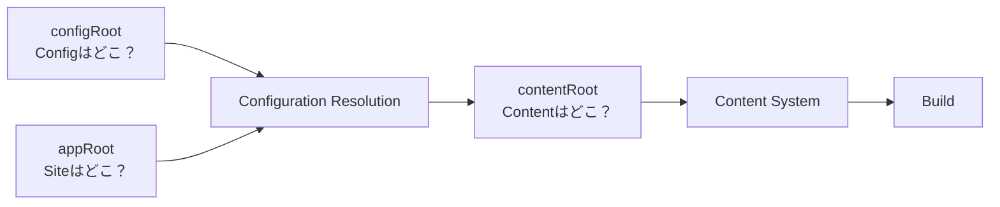

基本的には、

```text id="htn7yn"
appRoot
  = Site Application の場所

configRoot
  = Config の場所

contentRoot
  = Markdown / Vault の場所
```

と覚えておけば十分です。

通常の Site では3つの違いを意識する必要はほとんどありません。

外部 Vault、別 repository の Content、特殊な monorepo 構成を使う場合だけ、この境界を意識してください。

Config の変更後は `riebeckite check`、実際にどう解決されたか確認したい場合は `riebeckite inspect config` を使用してください。
