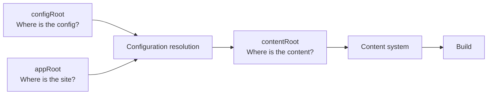

# Configuration

Create configuration with `defineConfig` and let the integration resolve it before content or plugins run. The required top-level field is `site`; optional sections are `content`, `theme`, `plugins`, and `cache`.

```ts
import { defineConfig } from "@riebeckite/core";

export default defineConfig({
  site: { title: "My site", baseUrl: "https://example.com" },
  content: {
    directory: "content",
    exclude: ["drafts/**"],
    filters: { publishStrategy: "explicit" },
  },
  theme: { colorMode: "system", articleLayout: "article" },
  plugins: [],
});
```

## How this section is organized

- [Navigation](./configuration/navigation.md)
- [Content selection and ContentSource](./configuration/content.md)
- [Filesystem roots and external vaults](./configuration/roots.md)
- [Attachments, media, and publishing](./configuration/assets.md)
- [Build cache](./configuration/cache.md)
- [Plugin configuration](./configuration/plugins.md)
- [Theme configuration](./configuration/theme.md)
- [Troubleshooting an external vault](./configuration/troubleshooting.md)

## Config validation

Configuration errors are reported as `ConfigValidationError`; do not catch and hide them. Run `riebeckite check` after changes.

```sh
npm exec riebeckite check
```

## Summary

Configuration keeps the site and its content separate:



```text
appRoot     = where the site application lives

configRoot  = where riebeckite.config.* lives

contentRoot = where the Markdown or vault lives
```

Relative `content.directory` values resolve against `appRoot`, never
`configRoot` or `process.cwd()`. Most sites never need to think about the three
boundaries. They matter only when you use an external vault, keep content in a
separate repository, or work in an unusual monorepo layout.
