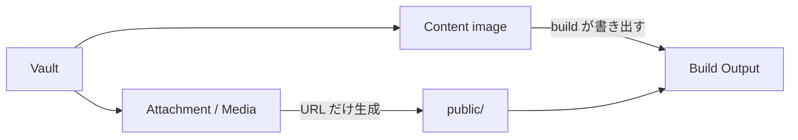
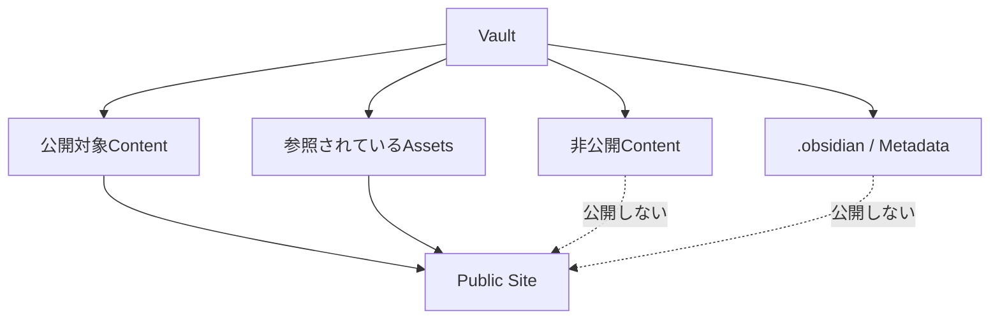

# Attachment と Media

Obsidian の attachment や media も `contentRoot` を基準に扱います。

ここで attachment / media とは **Markdown でも画像でもないファイル**です。Vault 内の画像（png、jpg、svg など）は content image として別の扱いになるため、混同しないよう次の節で分けて説明します。

たとえば Vault に、

```text id="qv3qcs"
vault/
├─ notes/
│  └─ report.md
├─ attachments/
│  └─ report.pdf
└─ media/
   └─ interview.mp3
```

があるとします。

Markdown では、

```md id="csovb2"
![[attachments/report.pdf]]

![[media/interview.mp3]]
```

のように参照できます。

`obsidianMarkdown()` はこれらを Vault からの相対 logical path として扱います。

`attachment()` と `media()` が対応する embed を描画します。

公開 URL は安定した形式になります。

```text id="j9hboh"
/assets/attachments/<Vault からの相対 logical path>
```

たとえば、

```text id="pfr5c3"
attachments/report.pdf

↓

/assets/attachments/attachments/report.pdf
```

のように logical path を維持します。


## Asset URL と実ファイルは別

ここは特に重要です。

URL を生成することと、そのファイルが Site へ公開されることは別のことです。

Asset は次の3種類に分かれ、公開を担当する場所も異なります。

| 種類 | 対象 | 公開 URL | 公開を担当する場所 |
| --- | --- | --- | --- |
| Content image | Vault 内の画像 | `/<Vault からの相対 logical path>` | Riebeckite の build |
| Attachment / Media | Markdown でも画像でもないファイル | `/assets/attachments/<Vault からの相対 logical path>` | Site Application |
| Static asset | Site Application 自身が管理するファイル | `/` 配下 | Vite の `public/` |



### Content image は build で公開される

`obsidianMarkdown()` は、公開ページから参照されている image を build の出力として書き出します。

Site Application が何もしなくても、その image は build output に含まれ、生成された URL から取得できます。

たとえば、

```text id="b1t4hs"
assets/logo.png

↓

/assets/logo.png
```

という論理 path をそのまま公開します。

開発サーバーでも、同じ論理 path のまま Content から直接配信されます。

参照されていない image、非公開ページからの image は書き出されません。どの image を書き出すかは公開ページと参照関係から決まります。

### Attachment と Media の公開は Site Application の担当

Attachment と Media については、URL を生成しただけでは実ファイルは公開されません。

Plugin が、

```text id="8m59d5"
/assets/attachments/attachments/report.pdf
```

という URL を生成したからといって、`report.pdf` が自動的に Vite の `public/` へコピーされるわけではありません。

Site Application は、公開する必要がある asset だけを、

```text id="5jd2hq"
public/assets/attachments/
```

へコピーしてください。

その際も Vault からの相対 logical path を維持します。

参照 Application の `build_images.ts` は、実際に参照されている attachment だけを差分コピーする実装例です。

### `public/` を使う Static asset

`public/` は Site Application 自身が管理する asset 用の directory です。

`public/` 以下のファイルは、Vite の build でそのまま build output へコピーされます。

Content から取り込んだ画像や attachment をここへまとめて置くのではなく、上記のように公開する対象を絞って配置します。


## Vault 全体を公開しない

次のような実装は避けてください。

```text id="wp29zc"
vault/**
   ↓
public/**
```

Vault 全体をそのまま `public/` へコピーすると、

- 非公開の記事
- 未公開ページからしか参照されていない画像
- 未参照の attachment
- `.obsidian/` の metadata
- 公開するつもりのないファイル

まで公開される可能性があります。



**必要な asset だけを公開する**ことが重要です。

Content image は build が公開対象を判断します。Attachment と Media をどの範囲で公開するかは Site Application 側の責務です。
