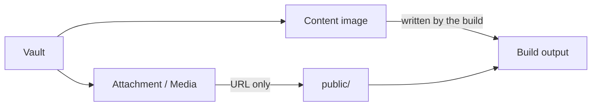
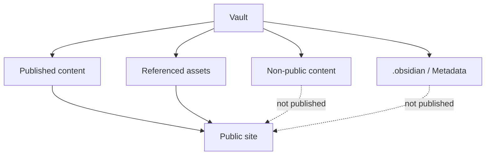

# Attachments, media, and publishing

## Attachments and media

An attachment or media file is a vault file that is **neither Markdown nor an
image**. Images in the vault are handled separately as content images, so keep
the two apart.

`obsidianMarkdown()` gives vault files logical paths relative to
`contentRoot`. For example, `![[attachments/report.pdf]]` is rendered by
`attachment()` and `![[media/interview.mp3]]` by `media()`. Their generated
URLs use this stable public shape:

```text
/assets/attachments/<logical-path-relative-to-the-vault>
```

`attachment()` reads the embedded file size from the resolved vault root and
rejects paths outside it. `media()` renders supported audio and video formats
using the same logical path.

## Asset URLs and published files

Generating a URL and publishing the file are two separate things. Assets fall
into three kinds, each published by a different owner:

|Kind|Subject|Public URL|Published by|
| --- | --- | --- | --- |
|Content image|An image in the vault|`/<logical-path-relative-to-the-vault>`|The Riebeckite build|
|Attachment / Media|A file that is neither Markdown nor an image|`/assets/attachments/<logical-path-relative-to-the-vault>`|The site application|
|Static asset|A file the site application owns|anywhere under `/`|Vite's `public/` directory|



### Content images are published by the build

`obsidianMarkdown()` writes every image referenced from a public page as build
output. The image reaches the build output and is reachable through the
generated URL without any action from the site application, keeping its logical
path intact:

```text
assets/logo.png

↓

/assets/logo.png
```

During development the same logical path is served directly from the content
source. Images that nothing references, and images referenced only from
non-public pages, are not written.

### Publishing attachments and media is the site's responsibility

For attachments and media, generating a URL does **not** copy the binary file
into the Vite public directory. The site application must copy only the assets
it intends to publish to `public/assets/attachments/`, preserving their logical
vault-relative paths. The reference application's
`build_images.ts` shows an
incremental, referenced-attachment-only implementation.

### Static assets in `public/`

`public/` is where the site application keeps its own assets. Everything below
it is copied into the build output as-is. Keep it for site-owned files instead
of dumping every vault image or attachment there, so the published set stays
narrow.

## Vaults are not published wholesale

Do not copy the whole vault as a shortcut:

```text
vault/**
   ↓
public/**
```

That can expose private notes, images referenced only from non-public pages,
unreferenced attachments, and `.obsidian` metadata.



The build emits images
referenced by published content. Attachment cards and audio/video embeds render
URLs under `/assets/attachments/<logical path>`, and the site application must
copy those files into `public/assets/attachments/` before build if you want them
served after deployment. See [Separate Content Repository](../../guides/deployment/separate-content-repository.md#4-3-content-images-and-attachments-are-published-differently) for the detailed data flow.
