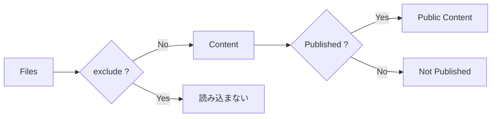

# Content の設定

通常は `content.directory` で Markdown などを読み込むディレクトリを指定します。

```ts id="dn44si"
content: {
  directory: "content",
}
```

標準的な Site なら、

```text id="w3ifap"
my-site/
├─ app/
├─ content/
├─ public/
├─ package.json
├─ vite.config.ts
└─ riebeckite.config.ts
```

のような構成になります。

## 除外するファイル

`exclude` を使うと、Content System に読み込ませないファイルを指定できます。

```ts id="4kv6vn"
content: {
  directory: "content",
  exclude: [
    "drafts/**",
    "Templates/**",
  ],
}
```

`exclude` に一致したファイルは、コンテンツとして処理される前に除外されます。

内部では `isExcluded` がこの判定を行います。

## 公開条件

どのコンテンツを公開するかは、既定では `publishStrategy` で設定します。

```ts id="hp9zx8"
content: {
  filters: {
    publishStrategy: "explicit",
  },
}
```

公開判定には frontmatter も利用されます。

```yaml id="osj0d5"
---
publish: true
---
```

現在の公開状態は Core で一度だけ解決され、Plugin には次の manifest view として渡されます。

| View | 含まれるもの | 用途 |
| --- | --- | --- |
| `manifest.publicEntries` | ルーティングできるページ。`public` と `unlisted` | ページ表示、SSG の path 列挙 |
| `manifest.discoverableEntries` | 発見可能な `public` ページだけ | docs navigation、search、feed、sitemap、taxonomy、graph、backlinks、related/recent |

frontmatter で明示的な公開状態を指定できます。

| Frontmatter | 結果 |
| --- | --- |
| `visibility: public` | URL で表示でき、一覧や検索にも出る |
| `visibility: unlisted` | URL を知っていれば表示できるが、一覧や検索には出ない |
| `visibility: draft` | URL でも表示されず、一覧や検索にも出ない |
| `publishAt: 2026-01-01T00:00:00.000Z` | build 時刻がその日時より前なら非公開、以後の build で `public` になる |
| `visibility` / `publishAt` なし | `publishStrategy` に従う。`explicit` は `publish: true` が必要。`selective` は `private: true` と `draft: true` を除外する |

`visibility` や `publishAt` が不正な場合、推測せず build を失敗させます。scheduled publishing は build 時刻だけで判定します。Riebeckite は runtime timer を起動しません。

`exclude` と `publishStrategy` は似ていますが、役割が異なります。



`exclude` は **Content System に入れるか**、`publishStrategy` や `visibility` は **Site でどう扱うか**を決めます。`exclude` されたファイルは link resolution や graph、diagnostics にも現れません。一方、`draft`、`unlisted`、公開前の `publishAt` は raw manifest には残りますが、Core が route 用 view と discovery 用 view から適切に外します。


## ContentSource

通常は `content.directory` を使用しますが、独自の読み込み元を使用する場合は `content.source` を指定できます。

```text id="rbdlxj"
content.directory
    ↓
標準 filesystem ContentSource
```

または、

```text id="hrp9p5"
content.source
    ↓
独自 ContentSource
```

のどちらかです。

同じコンテンツに対して2つの reader を動かすための設定ではありません。

`content.source` を指定する場合は、標準 filesystem reader を置き換えるものとして扱います。
