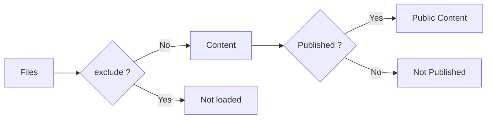

# Content selection

`content.directory` selects the default filesystem location. Use `content.source` to provide a different `ContentSource`; do not configure two competing readers. `exclude` removes matching material before it becomes content. `filters.publishStrategy` controls the default publishing policy, and frontmatter can override the resolved publishing state.

## Excluding files

`exclude` takes glob patterns matched against logical paths. `*` matches within
one path segment, `**` matches across segments, and `?` matches one character.

```ts
content: {
  directory: "content",
  exclude: ["drafts/**", "**/private/**", ".obsidian/**"],
}
```

Excluded files never enter the content pipeline, so they are unavailable for
links, graph analysis, and diagnostics. This differs from `draft` and `unlisted`,
which stay in the content system but are hidden from routes or discovery.
`exclude` runs before publishing is resolved:



## ContentSource

`content.directory` selects the default filesystem reader. Set `content.source`
to replace that reader with another implementation, such as a remote store:

```text
content.directory  →  default filesystem ContentSource

content.source     →  custom ContentSource
```

Use one or the other. `content.source` is not a second reader for the same
content; it stands in for the filesystem reader. The `ContentSource` contract is
listed in the [Configuration reference](../configuration-reference.md#contentsource).

## Publishing state

Publishing is resolved once in Core and exposed to plugins as two manifest views:

| View | Contains | Use for |
| --- | --- | --- |
| `manifest.publicEntries` | Routable entries: public and unlisted | page rendering and SSG paths |
| `manifest.discoverableEntries` | Public entries only | docs navigation, search, feeds, sitemap, taxonomy, graphs, backlinks, related/recent lists |

The default `publishStrategy` still applies when no explicit visibility is set.

| Frontmatter | Result |
| --- | --- |
| `visibility: public` | routable and discoverable |
| `visibility: unlisted` | routable by direct URL, but excluded from discovery surfaces |
| `visibility: draft` | not routable and not discoverable |
| `publishAt: 2026-01-01T00:00:00.000Z` | hidden before the build time, public on the first build after that time |
| no `visibility` / `publishAt` | falls back to `publishStrategy` (`explicit` requires `publish: true`; `selective` excludes `private: true` and `draft: true`) |

Malformed `visibility` or `publishAt` values fail the build instead of being guessed. Scheduled publishing is build-time only: Riebeckite does not start a runtime timer.

`exclude` is different from publishing. Excluded files never enter the content pipeline, so they are unavailable for links, metadata, graph analysis, and diagnostics. Draft, unlisted, and scheduled-before entries remain in the raw manifest for internal processing, but Core keeps them out of the route or discovery views according to the table above.
