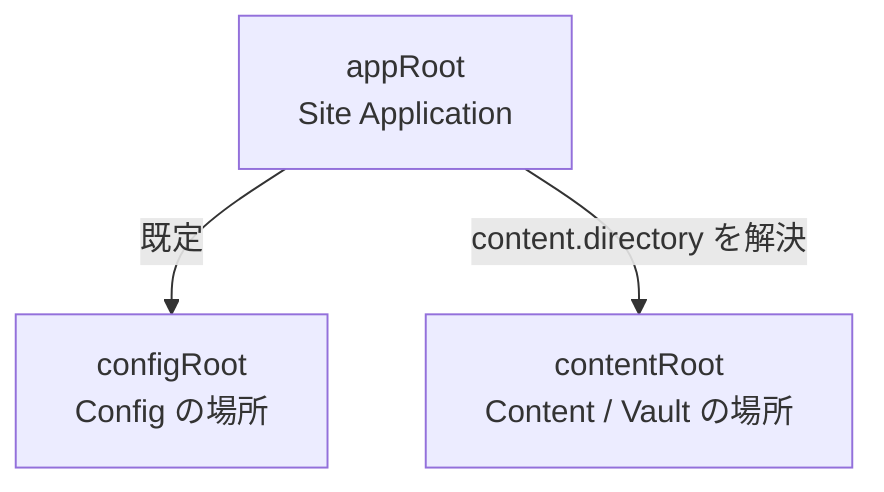
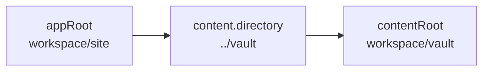
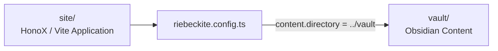
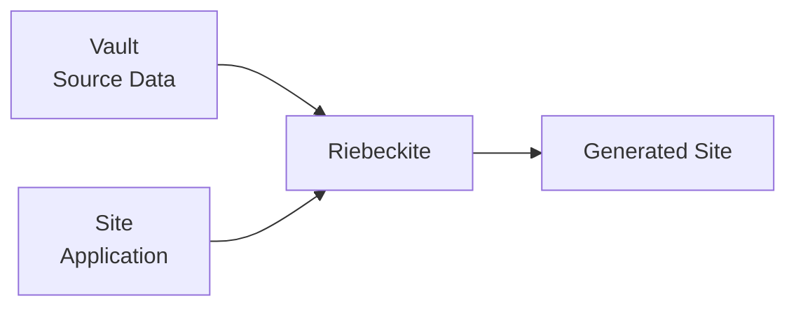
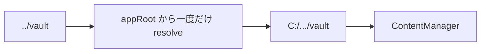

# 3つの Root

外部 Vault や monorepo 構成を扱う場合に重要なのが、

- `appRoot`
- `configRoot`
- `contentRoot`

の違いです。



| 名前 | 何を表す？ | 既定値 / 基準 |
| --- | --- | --- |
| `appRoot` | HonoX / Vite Site の root | Vite `root` |
| `configRoot` | `riebeckite.config.*` を探す場所 | `appRoot` |
| `contentRoot` | 実際にコンテンツを読む場所 | `path.resolve(appRoot, content.directory)` |

この3つは別の役割を持ちます。


## appRoot

`appRoot` は **Site Application の基準となるディレクトリ**です。

たとえば、

```text id="xkjg5v"
site/
├─ app/
├─ public/
├─ package.json
├─ vite.config.ts
└─ riebeckite.config.ts
```

なら通常、

```text id="2hwbbd"
appRoot = site/
```

です。

`appRoot` は、

- `app/`
- `public/`
- route
- generated styles
- Build 設定

など Site Application の基準になります。


## configRoot

`configRoot` は、

```text id="53pg8g"
riebeckite.config.ts
riebeckite.config.js
riebeckite.config.mjs
```

を探す基準です。

通常は `appRoot` と同じです。

```text id="7uqfyx"
appRoot
   └─ riebeckite.config.ts
```

特殊な repository 構成で config を別の場所へ置く場合のみ変更します。

**`configRoot` を変更しても `content.directory` の基準は変わらない**点に注意してください。


## contentRoot

`contentRoot` は、実際に Markdown や asset を読み込む場所です。

相対 `content.directory` は常に `appRoot` を基準に解決されます。

```ts id="jgnfqm"
content: {
  directory: "../vault",
}
```

なら、

```text id="y6zaw5"
contentRoot
  = path.resolve(appRoot, "../vault")
```

となります。



`process.cwd()` を基準にするわけではありません。

そのため CLI を別の directory から実行しても、同じ Site Application を解決できれば同じ Vault を参照できます。


## 外部 Vault を使う

Obsidian Vault を Site と独立して管理したい場合は、Site の外へ置く構成を推奨します。

たとえば、

```text id="bgmthg"
workspace/
├─ site/
│  ├─ package.json
│  ├─ vite.config.ts
│  ├─ riebeckite.config.ts
│  ├─ app/
│  └─ public/
│
└─ vault/
   ├─ index.md
   ├─ notes/
   ├─ attachments/
   └─ media/
```

という構成です。



Site と Vault の役割が明確に分離されます。

```text id="wx10hc"
site/
  → Application

vault/
  → Source Content
```

Vault を Vite application root にする必要はありません。


## 外部 Vault の設定例

```ts id="p5vg19"
// site/riebeckite.config.ts

import { defineConfig } from "@riebeckite/core";
import { attachment } from "@riebeckite/plugin-attachment";
import { media } from "@riebeckite/plugin-media";
import { obsidianMarkdown } from "@riebeckite/plugin-obsidian-markdown";

export default defineConfig({
  site: {
    title: "My notes",
  },

  content: {
    directory: "../vault",
    exclude: [
      ".obsidian/**",
      "Templates/**",
    ],
  },

  plugins: [
    obsidianMarkdown(),
    media(),
    attachment(),
  ],
});
```

この場合、

```text id="9w7l08"
appRoot
  = workspace/site

content.directory
  = ../vault

contentRoot
  = workspace/vault
```

となります。

絶対パスを指定することもできます。

```ts id="vmohm9"
content: {
  directory: "C:/Users/example/Documents/vault",
}
```

ただし絶対パスは開発 PC や CI で場所が変わると使えなくなるため、通常は Site からの相対パスを推奨します。


## `process.cwd()` に依存しない

Content directory を次のように組み立てることは避けてください。

```ts id="i3cfla"
directory: path.resolve(
  process.cwd(),
  "../vault",
)
```

CLI をどこから実行したかによって結果が変化するためです。

また、

```text id="p2j2rb"
appRoot = Vault
```

とする必要もありません。

Vault は **source data**、`appRoot` は **Site Application** です。



この境界を維持してください。


## Application から ContentManager を使う

通常、HonoX Integration が `contentRoot` を自動的に解決します。解決済みの値は Framework 所有の module として公開されるため、Site が `riebeckite.config.ts` を読み直す必要はありません。

```ts id="veou0j"
import { config } from "virtual:riebeckite/config";
import { content } from "virtual:riebeckite/content";
```

`config.content.directory` は絶対パスで、`content` はそれに結びついた `ContentManager` です。そのため、別の基準からもう一度 `path.resolve()` しないでください。この module は `riebeckiteVite()` が解決します。Vite の外で動く script（`tsx` で起動する Node script など）は `@riebeckite/honox/runtime` の `resolveHonoxConfig` で同じ値を解決できます。

```ts id="9pr6g1"
import { fileURLToPath } from "node:url";
import { resolveConfigModule } from "@riebeckite/core";
import { resolveHonoxConfig } from "@riebeckite/honox/runtime";
import * as rawConfigModule from "../riebeckite.config";

const appRoot = fileURLToPath(new URL("../", import.meta.url));
export const config = resolveHonoxConfig(
  resolveConfigModule(rawConfigModule),
  appRoot,
);
```



## Config を Site の外へ置く

通常、

```text id="4p7m8h"
appRoot
  = configRoot
```

ですが、意図的に `riebeckite.config.ts` を別の directory に置くこともできます。

その場合は `riebeckiteVite()` に `configRoot` を指定します。

ただし、

```text id="8y2qf9"
appRoot
  → Site Application

configRoot
  → Config

contentRoot
  → Content / Vault
```

という役割は変わりません。

特に `appRoot` を Vault 側へ変更しないでください。

相対 `content.directory` は、`configRoot` ではなく引き続き **`appRoot` を基準**に指定します。
