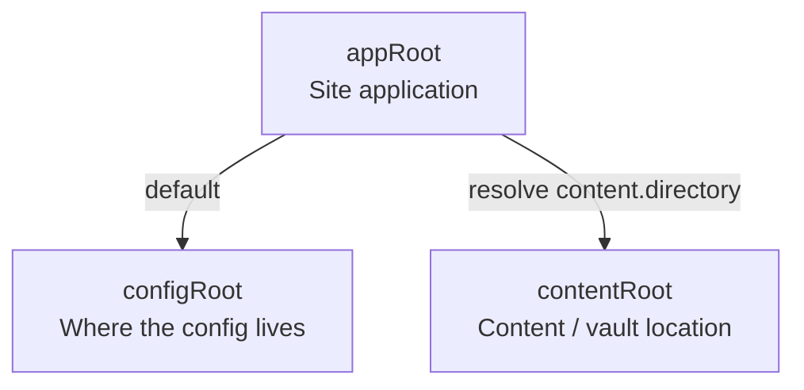
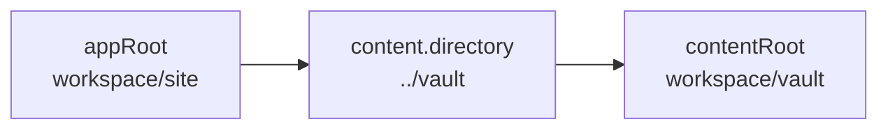
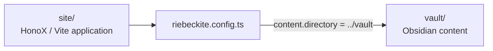
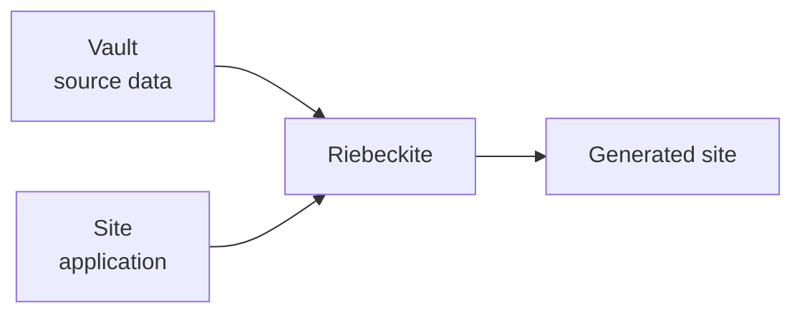
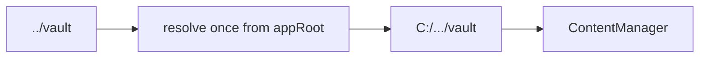

# Filesystem roots and external vaults

Riebeckite keeps the site application and its source material separate. The
following names describe different directories and must not be used
interchangeably:



| Name | Responsibility | Default / resolution base |
| --- | --- | --- |
| `appRoot` | The HonoX/Vite application: `app/`, `public/`, routes, generated styles, and build output configuration | Vite's `root` |
| `configRoot` | Directory containing `riebeckite.config.ts`, `.js`, or `.mjs` | `appRoot` |
| `contentRoot` | Absolute filesystem root for the configured content directory or Obsidian vault | `path.resolve(appRoot, content.directory)` |

`configRoot` determines where the config module is imported from. It does
**not** change the base for a relative `content.directory`: that base is always
`appRoot`. The integration resolves all three roots before running content or
plugins, and CLI commands reuse that result. Consequently, execution from a
nested directory, CI working directory, or editor task does not change which
vault is read.

## appRoot

`appRoot` is the base directory of the **site application**. For a layout such
as:

```text
site/
├─ app/
├─ public/
├─ package.json
├─ vite.config.ts
└─ riebeckite.config.ts
```

`appRoot` is normally `site/`. It is the base for `app/`, `public/`, routes,
generated styles, and build configuration.

## configRoot

`configRoot` is the base used to find `riebeckite.config.ts`,
`riebeckite.config.js`, or `riebeckite.config.mjs`. It is normally the same as
`appRoot`:

```text
appRoot
   └─ riebeckite.config.ts
```

Change it only when a repository layout deliberately places the config
elsewhere. **Changing `configRoot` does not change the base for
`content.directory`.**

## contentRoot

`contentRoot` is where Markdown and assets are actually read from. A relative
`content.directory` is always resolved against `appRoot`:

```ts
content: {
  directory: "../vault",
}
```

so:

```text
contentRoot
  = path.resolve(appRoot, "../vault")
```



The base is not `process.cwd()`. Running the CLI from another directory
therefore still reads the same vault as long as it resolves to the same site
application.

## Recommended layout

Keep an Obsidian vault outside the site when it is used independently by
Obsidian, shared by multiple site applications, or stored in another Git
repository:

```text
workspace/
├─ site/
│  ├─ package.json
│  ├─ vite.config.ts
│  ├─ riebeckite.config.ts
│  ├─ app/
│  └─ public/
└─ vault/
   ├─ index.md
   ├─ notes/
   ├─ attachments/
   └─ media/
```



The site and vault roles stay separate:

```text
site/
  → application

vault/
  → source content
```

The vault does not need to be the Vite application root.

With this layout, the site configuration is explicit and portable:

```ts
// site/riebeckite.config.ts
import { defineConfig } from "@riebeckite/core";
import { attachment } from "@riebeckite/plugin-attachment";
import { media } from "@riebeckite/plugin-media";
import { obsidianMarkdown } from "@riebeckite/plugin-obsidian-markdown";

export default defineConfig({
  site: { title: "My notes" },
  content: {
    directory: "../vault",
    exclude: [".obsidian/**", "Templates/**"],
  },
  plugins: [obsidianMarkdown(), media(), attachment()],
});
```

In this layout:

```text
appRoot
  = workspace/site

content.directory
  = ../vault

contentRoot
  = workspace/vault
```

An absolute `directory` is also valid:

```ts
content: {
  directory: "C:/Users/example/Documents/vault",
}
```

but an absolute path stops working when the location changes between developer
machines and CI, so a path relative to the site is normally preferred. Do not
derive the value with `process.cwd()`, and do not make `appRoot` point to the
vault. The vault is source data; Vite's application root must remain the site.

## Not depending on process.cwd()

Avoid building the content directory like this:

```ts
directory: path.resolve(
  process.cwd(),
  "../vault",
)
```

The result changes depending on where the CLI is invoked. You also do not need:

```text
appRoot = Vault
```

The vault is **source data**; `appRoot` is the **site application**:



Keep this boundary.

## Application-side content access

The HonoX integration resolves the content root automatically. An application
that constructs `ContentManager` for routes or islands must use the same
resolved absolute directory instead of the raw relative config value:

```ts
// site/app/config.ts
import path from "node:path";
import { fileURLToPath } from "node:url";
import { resolveConfigModule } from "@riebeckite/core";
import * as rawConfigModule from "../riebeckite.config";

const appRoot = fileURLToPath(new URL("../", import.meta.url));
const rawConfig = resolveConfigModule(rawConfigModule);

export const config = {
  ...rawConfig,
  content: {
    ...rawConfig.content,
    directory: path.resolve(appRoot, rawConfig.content.directory),
  },
};
```

After this step `config.content.directory` is absolute, so resolving it against
a second base is an error-prone duplicate transformation:



If `content.source` is configured, it replaces the filesystem reader; do not use
it as a second reader for the same vault.

## Placing the config outside the site

Normally:

```text
appRoot
  = configRoot
```

You can deliberately place `riebeckite.config.ts` in another directory by
passing `configRoot` to `riebeckiteVite()`.

The roles do not change:

```text
appRoot
  → site application

configRoot
  → config

contentRoot
  → content / vault
```

In particular, do not change `appRoot` to point at the vault. A relative
`content.directory` is still resolved against **`appRoot`**, not `configRoot`.
