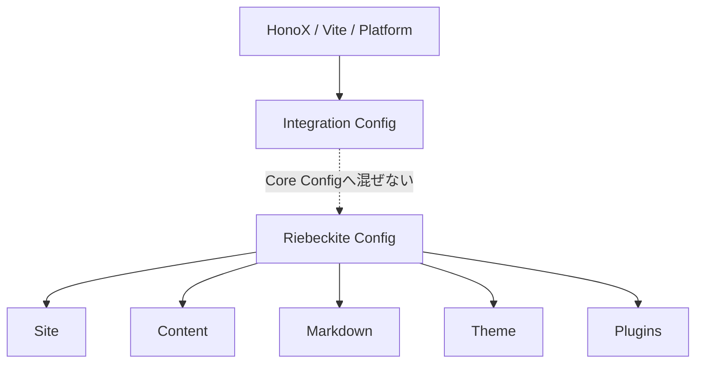

# Theme の設定

Theme は `theme` で設定します。

```ts id="pgj2be"
theme: {
  colorMode: "system",
  articleLayout: "article",
}
```

raw configuration または宣言済み Theme を利用できます。

Theme は presentation の設定です。

HonoX、Vite、Cloudflare など Integration 固有の設定を Core configuration へ入れないでください。


