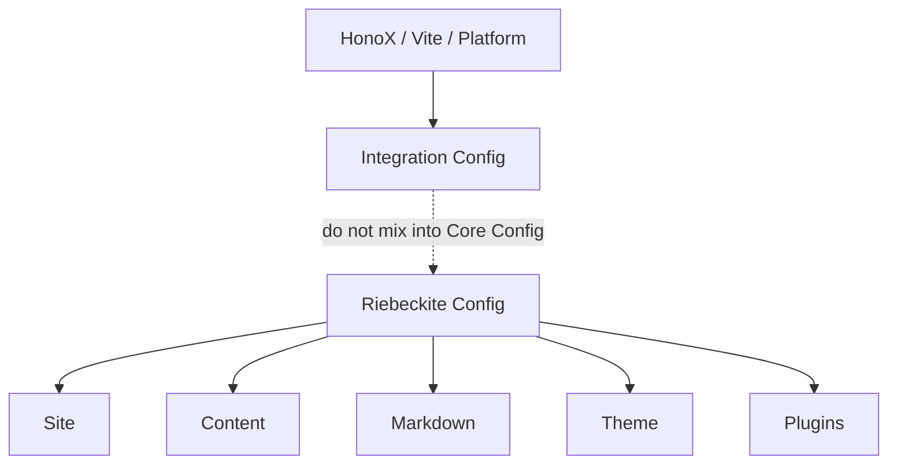

# Theme configuration

Configure the theme with `theme`:

```ts
theme: {
  colorMode: "system",
  articleLayout: "article",
}
```

You can use a raw theme configuration or a declared theme.

A theme is a presentation setting. Do not put integration-specific settings (HonoX, Vite, Cloudflare, and so on) into the Core configuration.


