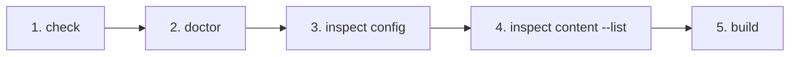

# 外部 Vault のトラブルシュート

外部 Vault や複雑な directory 構成を使っている場合は、次の順番で確認すると原因を切り分けやすくなります。



## 1. Config を検証する

```sh id="7x4ypg"
npm exec riebeckite check
```

Config と Plugin contract が正しいか確認します。

## 2. Content Source を診断する

```sh id="t7e22k"
npm exec riebeckite doctor
```

filesystem content source が存在しない、読み込めないなどの問題を確認します。

## 3. 解決された Directory を確認する

```sh id="rgnpgo"
npm exec riebeckite inspect config
```

`content.directory` が期待する絶対 path に解決されているか確認します。

## 4. Content を確認する

```sh id="4ssq64"
npm exec -- riebeckite inspect content --list
```

WikiLink や embed を調査する前に、期待する logical path と content が認識されていることを確認します。

## 5. 実際に Build する

```sh id="9wnm73"
npm exec riebeckite build
```

最後に Integration、SSG、route rendering まで含めて確認します。
