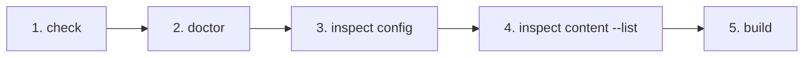

# Troubleshooting an external vault

## Verification and troubleshooting

Run the CLI from a nested application directory to prove that configuration is
not tied to the current working directory:

```sh
cd site/app
npm exec riebeckite check
npm exec riebeckite doctor
npm exec riebeckite inspect config
npm exec -- riebeckite inspect content --list
npm exec riebeckite build
```



Use the results in this order:

1. `check` validates the config and plugin contracts.
2. `doctor` reports an unreadable or invalid filesystem content source.
3. `inspect config` confirms the resolved directory.
4. `inspect content --list` confirms the expected logical paths before you
   diagnose a WikiLink or embed.
5. `build` verifies the integration and route rendering.

If `riebeckite.config.ts` intentionally lives outside the Vite application,
pass `configRoot` to `riebeckiteVite()`. Keep `appRoot` set to the site root and
keep relative `content.directory` values relative to that root.
