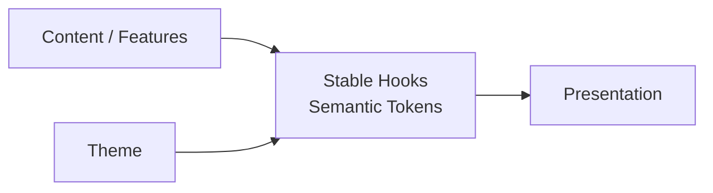
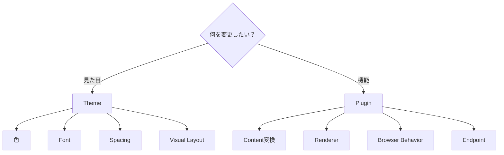
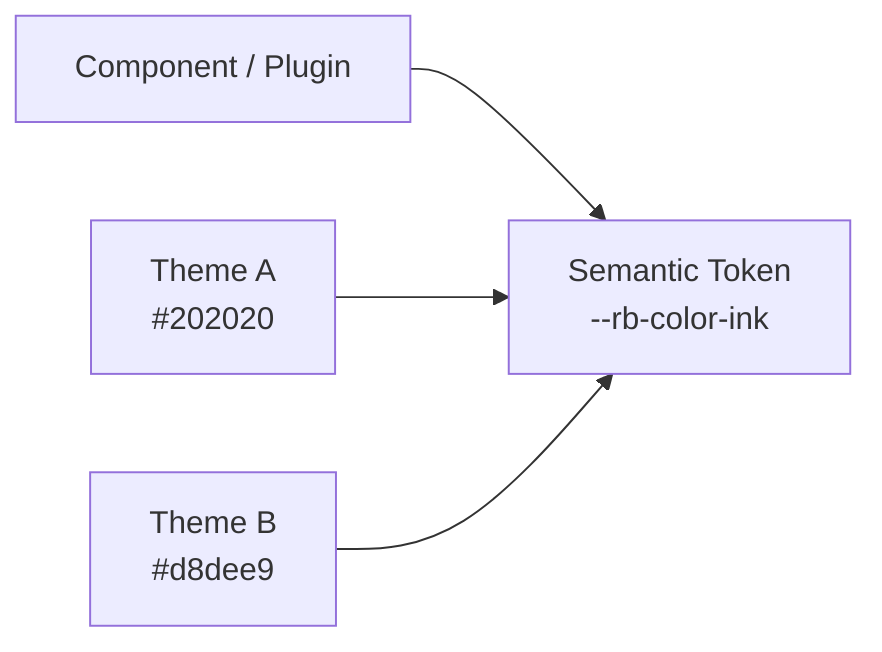
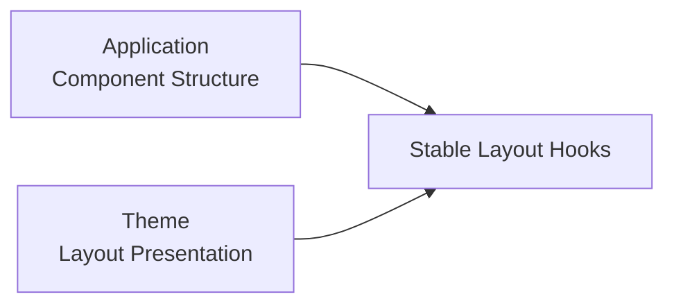
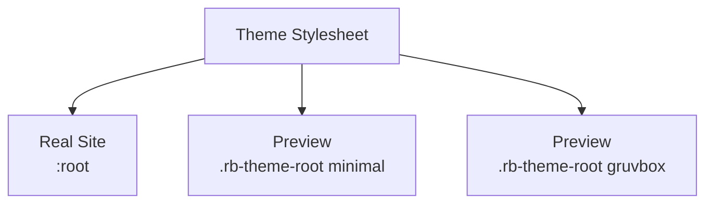
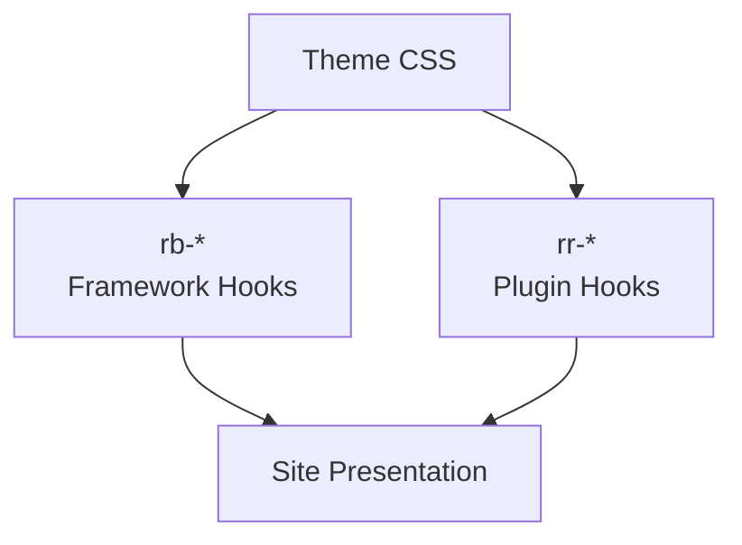
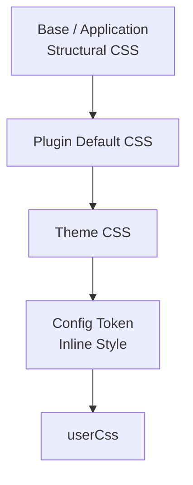
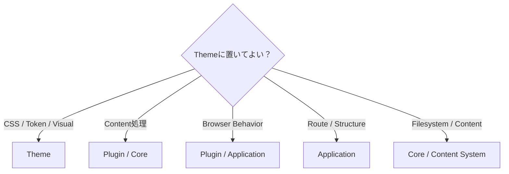
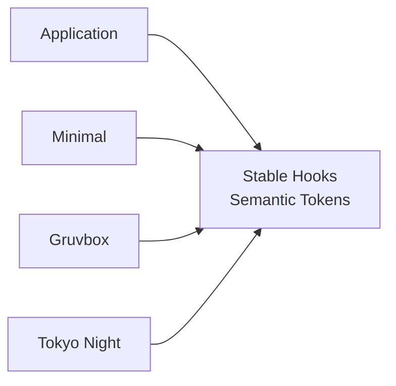
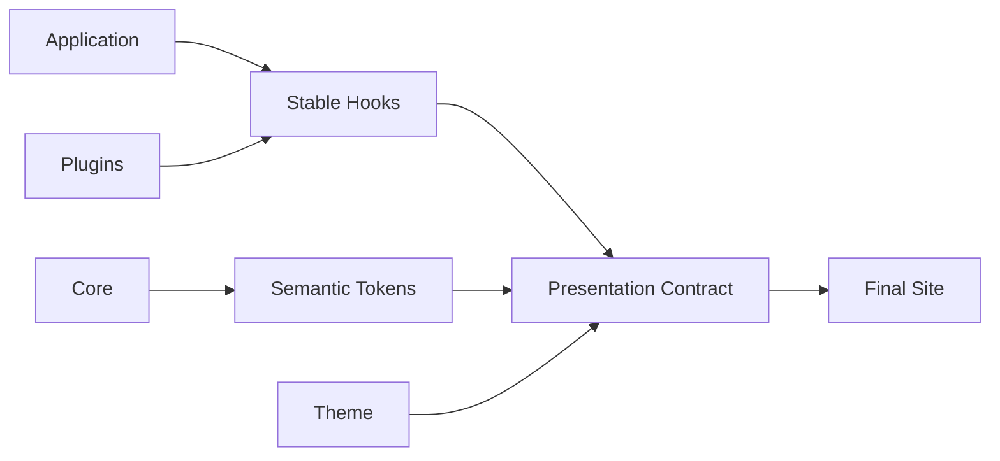

# Theme System

Riebeckite Theme は、Site や Plugin の**見た目を変更するための仕組み**です。

Theme は機能そのものを差し替えるものではありません。

たとえば Theme では、

- 色
- フォント
- 余白
- レイアウトの見た目
- Article や Sidebar の装飾
- Plugin UI の見た目

などを変更できます。

一方で、

- Content の意味
- Route
- Component の構造
- Browser の動作
- Plugin の機能

は変更しません。



この境界によって、Application や Plugin の機能を変更せずに Theme を交換できます。

# Theme と Plugin の違い

迷った場合は、まず「機能を変えたいのか、見た目を変えたいのか」を考えます。



**見た目だけを変更するために Plugin を作らず、機能を追加するために Theme を拡張しません。**

# 最小の Theme

Theme は `defineTheme()` で作成します。

```ts id="z0z78e"
import { defineTheme } from "@riebeckite/core";

export function minimalTheme() {
  return defineTheme({
    name: "minimal",

    styles: [
      {
        moduleSpecifier:
          "@riebeckite/theme-minimal/style.css",
      },
    ],
  });
}
```

Site では `theme` に指定します。

```ts id="ps7zv1"
export default defineConfig({
  theme: minimalTheme(),
});
```

これだけで Theme の stylesheet が Site に組み込まれます。

# Theme が扱えるもの

Theme の主な Contract は次のとおりです。

| 分類 | 主な設定 |
| --- | --- |
| Identity | `name` |
| Theme 固有設定 | `options` |
| CSS | `styles[].moduleSpecifier` |
| Color Mode | `colorMode` |
| Typography | `typography` |
| Article Layout | `articleLayout` |
| Design Token | `tokens` |
| User CSS | `userCss` |
| Theme 固有属性 | `data-*` attributes |

Theme はこれらを使って Presentation を変更します。

# Design Tokens

Riebeckite では、Component や Plugin が特定 Theme の色を直接参照するのではなく、**Semantic Design Token** を利用します。

たとえば、

```css id="vp9a0g"
.rr-example {
  color: var(--rb-color-ink);
  background: var(--rb-color-surface);
}
```

のように書きます。

次のように Theme 固有の色を直接書くことは避けます。

```css id="ucsgx9"
.rr-example {
  color: #171717;
  background: #f6efe2;
}
```

Theme が変わったときに Plugin 側まで変更する必要が出てしまうためです。



Component は「文字色」という意味だけを参照し、実際の色は Theme が決めます。

# Token の種類

Core の `ThemeDesignTokens` には、大きく3種類の Token があります。

## Color

```text id="hwz8k3"
paper
ink
muted
accent
border
borderStrong
surface
surfaceHover
overlay
danger
success
codeBackground
```

## Typography

```text id="8en3hl"
bodyFont
headingFont
monoFont
```

## Layout

```text id="pwn80n"
pageMaxWidth
articleMaxWidth
sidebarWidth
contentGap
```

CSS では `--rb-*` Custom Property として利用します。

```css id="m3xggn"
@layer base {
  :is(:root, .rb-theme-root)
    [data-theme-name="minimal"] {
    --rb-color-paper: #fafafa;
    --rb-color-ink: #202020;
    --rb-color-accent: #555;

    --rb-font-body:
      system-ui, sans-serif;

    --rb-layout-article-max: 48rem;
  }
}
```

`--rb-*` は Framework が提供する Semantic Token です。

Plugin 固有の意味を持つ Token は `--rr-*` として Plugin 側が所有し、必要に応じて `--rb-*` を fallback として利用できます。

# Color Mode

Theme は3種類の Color Mode を扱えます。

```ts id="csm5c6"
type ThemeColorMode =
  | "light"
  | "dark"
  | "system";
```

| Mode | 動作 |
| --- | --- |
| `light` | Light Theme を使用 |
| `dark` | Dark Theme を使用 |
| `system` | OS の設定に従う |

Theme は `data-theme` と Semantic Token を使って配色を切り替えます。

個別 Component に Light / Dark の色を直接 hardcode しないでください。

# Color Mode の仕組み

Light、Dark、System は CSS 上では次の状態として扱います。

```css id="nw1xrv"
/* Light */
:is(:root, .rb-theme-root)
[data-theme-name="<name>"] {
  /* ... */
}

/* Dark */
:is(:root, .rb-theme-root)
[data-theme-name="<name>"]
[data-theme="dark"] {
  /* ... */
}

/* System */
@media (prefers-color-scheme: dark) {
  :is(:root, .rb-theme-root)
  [data-theme-name="<name>"]
  :not([data-theme]) {
    /* ... */
  }
}
```

`system` の場合、`data-theme` を付けないことが重要です。

```text id="em0o5z"
light
  → data-theme="light"

dark
  → data-theme="dark"

system
  → data-theme を削除
```

空文字を設定するのとは異なります。

```html id="7jpx2k"
<html data-theme="">
```

では `[data-theme]` に一致するため、System 用の Media Query が正しく機能しません。

実行時に `system` へ戻す場合も、

```ts id="0tw3aa"
delete document.documentElement.dataset.theme;
```

のように属性そのものを削除します。

`@riebeckite/plugin-color-mode` がこの Contract の参照実装です。

# Typography

Theme は Typography Preset を提供できます。

```ts id="kyyomq"
type ThemeTypographyPreset =
  | "system"
  | "serif"
  | "sans";
```

Preset は、

- Body
- Heading
- Code

などの Semantic Font Token に反映されます。

Theme は個々の Component に Font を直接設定するのではなく、可能な限り Semantic Token を通して Typography を統一します。

# Article Layout

Theme は Article Layout の Presentation を変更できます。

```ts id="c69dlz"
type ThemeArticleLayoutPreset =
  | "article"
  | "sidebar"
  | "full-width";
```

ただし Theme が変更するのは**レイアウトの見た目**です。

Route や Component Tree 自体を Theme が差し替えるわけではありません。



# Theme Root

Theme の CSS は、Document 全体へ無条件に適用しません。

各 Theme は **Theme Root** の内側だけを対象にします。

基本 selector は次の形です。

```css id="l84p42"
:is(:root, .rb-theme-root)
[data-theme-name="<name>"]
```

`<name>` は Theme の `name` です。

たとえば、

```text id="09cf2y"
riebeckite
minimal
gruvbox
sakura
tokyonight
rerurate
```

などです。

# なぜ Theme Root が必要なのか

通常の Site では Application が `<html>` に Theme 名を設定します。

```html id="4v4fpo"
<html data-theme-name="minimal">
```

この場合は `:root` が一致します。

一方、Theme Gallery のように1ページで複数 Theme を表示したい場合があります。

```html id="5yyh67"
<div
  class="rb-theme-root"
  data-theme-name="minimal"
>
  ...
</div>

<div
  class="rb-theme-root"
  data-theme-name="gruvbox"
>
  ...
</div>
```

同じ stylesheet を Preview 内でも利用できます。



このため Theme CSS を裸の `:root` に書かないことが重要です。

# Theme Selector

Theme が定義するルールは Theme Root の内側に限定します。

```css id="33dppk"
/* Light */
:is(:root, .rb-theme-root)
[data-theme-name="<name>"] {
  /* ... */
}

/* Dark */
:is(:root, .rb-theme-root)
[data-theme-name="<name>"]
[data-theme="dark"] {
  /* ... */
}

/* Typography */
:is(:root, .rb-theme-root)
[data-theme-name="<name>"]
[data-typography="serif"] {
  /* ... */
}

/* Theme option */
:is(:root, .rb-theme-root)
[data-theme-name="<name>"]
[data-tokyonight-neon="on"] {
  /* ... */
}
```

子要素や擬似要素も同じ Root に閉じ込めます。

```css id="fepgnc"
:is(:root, .rb-theme-root)
[data-theme-name="<name>"]
:focus-visible {
  /* ... */
}

:is(:root, .rb-theme-root)
[data-theme-name="<name>"]
::selection {
  /* ... */
}
```

これにより、Theme Preview の CSS がページの他の部分へ漏れることを防ぎます。

# Styles

Theme の stylesheet は Host Bundler が解決できる Module Specifier として宣言します。

```ts id="kz2hpi"
styles: [
  {
    moduleSpecifier:
      "@riebeckite/theme-example/style.css",
  },
]
```

これは「CSS ファイルを Application directory へコピーする」という Contract ではありません。

Integration が Module Specifier を解決し、Site の stylesheet として組み込みます。

# Site 内 Theme

Theme は npm package として公開しなくても利用できます。

Site 内だけで使う Theme も作れます。

```ts id="pzvj0n"
// site/extensions/local-theme.ts

return defineTheme({
  name: "site-local",

  styles: [
    {
      moduleSpecifier:
        "/extensions/theme.css",
    },
  ],

  attributes: {
    "data-site-local": "on",
  },
});
```

Site-local Theme でも、

- `name`
- `styles`
- `attributes`
- `tokens`

は Published Theme と同じ `resolveThemeConfig` の仕組みで解決・sanitize・適用されます。

# Theme Attributes

Theme 固有の設定を CSS へ渡す場合は、安全な `data-*` Attribute を利用できます。

```ts id="dhy9s4"
return defineTheme({
  name: "newspaper",

  attributes: {
    "data-newspaper-density":
      "compact",
  },
});
```

CSS では、

```css id="ym84dm"
:is(:root, .rb-theme-root)
[data-theme-name="newspaper"]
[data-newspaper-density="compact"] {
  /* ... */
}
```

のように利用できます。

Theme API から、

```text id="5vgpr4"
class
style
id
lang
```

などを任意に変更する設計にはしません。

Framework が所有する Attribute と Theme 固有 Attribute の namespace を分離します。

# Theme 固有 Options

Theme 固有の機能は Theme Factory の Option として定義します。

```ts id="i7yem2"
type NewspaperOptions = {
  density?:
    | "compact"
    | "comfortable";
};

export function newspaperTheme(
  options: NewspaperOptions = {},
) {
  return defineTheme({
    name: "newspaper",

    options,

    attributes: {
      "data-newspaper-density":
        options.density ?? "comfortable",
    },

    styles: [
      {
        moduleSpecifier:
          "@riebeckite/theme-newspaper/style.css",
      },
    ],
  });
}
```

Theme 固有の概念は Core の `ThemeConfig` へ追加しません。

```text id="1etjdh"
newspaperTheme の density
  → newspaperTheme が所有

tokyonightTheme の neon
  → tokyonightTheme が所有
```

Core は個別 Theme の機能を知りません。

# Stable CSS Hooks

Theme は Application や Plugin の内部 Markup に依存するのではなく、文書化された **Stable CSS Hook** を利用します。

Riebeckite では主に2つの namespace を使います。

| Namespace | 所有者 | 用途 |
| --- | --- | --- |
| `rb-*` | Framework | Site の構造 |
| `rr-*` | Plugin / Feature | Plugin UI |

Framework の代表的な Stable Hook は、

```text id="fahf95"
.rb-theme-root
.rb-site
.rb-article
.rb-article-layout
.rb-article-header
.rb-article-body
.rb-article-content
.rb-article-meta
.rb-article-footer
.rb-sidebar
.rb-site-header
.rb-nav
.rb-nav__list
.rb-nav__item
.rb-nav__link
.rb-nav__link--active
.rb-nav__children
.rb-nav__mobile
.rb-nav__toggle
.rb-site-footer
```

です。

`.rb-article-content` はレンダリングされた Markdown 本文の wrapper で、Markdown のセマンティックなベースライン（リストマーカーと字下げ、見出し、段落とブロックの余白、表、図、定義リスト、インラインコード、整形済みブロック）を持ちます。`.rb-article-body` はその wrapper を含む article body のシェルです。`.rb-article-content` を出力するのは公開 primitive の `ArticleBody` です。このベースラインはレイヤー化されているため、テーマが見た目を再宣言するのではなく、`--rb-*` トークンとレイヤー外のキャラクター規則で表現します。

Plugin では、

```text id="jvm00r"
.rr-search
.rr-callout
.rr-table-of-contents
.rr-backlinks
.rr-local-graph
.rr-code
.rr-code-tabs
.rr-lightbox
.rr-excalidraw
.rr-mermaid
.rr-query
.rr-cardlink
.rr-diff-history
.rr-attachment
.rr-media
.rr-recent-posts
.rr-garden-explorer
```

などの Root Hook を提供できます。



Theme はこの Stable Hook を対象にします。

# Plugin 内部の Class

Plugin が BEM を使って、

```text id="cf1uz0"
.rr-search
.rr-search__input
.rr-search__result
.rr-search--loading
```

のような Class を持つ場合があります。

基本的には、

```text id="r2p6sm"
.rr-search
```

が Theme 向けの Public Hook です。

`__input` や `--loading` のような内部 Class は、Plugin が明示的に文書化していない限り Implementation Detail として扱います。

`.sr-only` のような一般的な Helper Class も Plugin Hook ではありません。

# Character Layer

Theme は Token の値を変更するだけではありません。

Stable Hook を利用して、Site に視覚的な個性を与えることもできます。

たとえば、

- Article の Border
- Header の装飾
- Sidebar の背景
- Code Block の形
- Plugin Card の見た目

などです。

```css id="0r1pvg"
[data-theme-name="example"]
.rb-article {
  /* visual character */
}

[data-theme-name="example"]
.rr-callout {
  /* visual character */
}
```

ただし対象にするのは Stable Hook だけです。

新しい `rb-*` や `rr-*` Class を Theme 側で勝手に定義して、Framework Contract のように扱わないでください。

Character Layer も Presentation 専用です。

Content、Structure、Behavior を変更するものではありません。

# CSS Layer

Token の定義は `@layer base` に置きます。

```css id="yzyq6g"
@layer base {
  :is(:root, .rb-theme-root)
  [data-theme-name="example"] {
    --rb-color-paper: #fff;
    --rb-color-ink: #111;
  }
}
```

一方、Stable Hook に対する Theme の Character Rule は **unlayered** にします。

Application の Structural CSS や Plugin CSS も unlayered であるため、Theme CSS の読み込み順によって適切に上書きできます。

通常は `!important` を使用しません。

# Font

Theme package は必要に応じて Self-hosted Web Font を含められます。

たとえば、

```text id="mtpf4x"
theme/
└─ styles/
   └─ fonts/
```

のように Theme package 内へ配置し、CSS の相対 `url()` で参照できます。

Font を同梱する場合は License File も含めてください。

Latin subset のような比較的小さい Web Font は同梱できますが、日本語などの CJK Font はサイズが大きいため、基本的には System Font Stack へ fallback します。

# CSS Cascade

Riebeckite では CSS の読み込み順も Contract の一部です。



優先順は、

```text id="qq3vby"
Base / Application CSS
        ↓
Plugin Default CSS
        ↓
Theme CSS
        ↓
Config Token Inline Style
        ↓
userCss
```

です。

これは偶然の読み込み順ではなく、Presentation Extension の Contract です。

`@riebeckite/honox` は、

```text id="49ck0i"
.riebeckite/plugin-styles.css
.riebeckite/theme-styles.css
```

を生成します。

Site は Plugin Stylesheet を Theme Stylesheet より先に読み込みます。

そのため、

```text id="qzwp1u"
Plugin
  → 標準の見た目

Theme
  → Plugin の見た目を変更

userCss
  → Site 利用者が最終調整
```

という関係になります。

生成された stylesheet を直接編集したり、Import 順を入れ替えたりしないでください。

通常は `!important` に依存せず、この Cascade で Override します。

# Theme がしてはいけないこと

Theme の責務は Presentation です。

そのため、次の処理は Theme に置きません。

- Component Replacement
- JSX Injection
- Route の追加
- Plugin の追加・削除
- Client Script の実行
- DOM Transformation
- Island の登録
- Filesystem Access
- ContentManager Access



見た目を実現するために JavaScript や DOM 操作が必要になった場合、その部分は Theme ではなく Plugin または Application の責務です。

# Theme Package の例

公開 Theme は、たとえば次のように構成できます。

```text id="4hx4zz"
packages/themes/example/
├─ index.ts
├─ package.json
├─ style.css
├─ README_ja.md
└─ README.md
```

Theme が Font などを持つ場合は必要に応じて追加します。

```text id="hs5y9a"
packages/themes/example/
├─ index.ts
├─ package.json
├─ style.css
├─ styles/
│  └─ fonts/
├─ README_ja.md
└─ README.md
```

# Repository 外で Theme を配布する

外部 Theme は Riebeckite monorepo 内部へ依存させません。

基本的には、

```text id="txlfzo"
@riebeckite/core
```

の Public API だけに依存し、`defineTheme()` を使います。

Stylesheet は Theme package 自身の Export として公開します。

たとえば、

```text id="uwoc8f"
./style.css
```

を `package.json` の `exports` へ定義します。

monorepo 内部の path や、

```text id="v9czqn"
@riebeckite/core/src/**
```

のような Internal API を参照しないでください。

# Theme を交換できる理由

Theme System の最も重要な目的は、**Application Logic を変更せずに Theme を交換できること**です。



Application と Plugin は、

```text id="s1q47e"
Stable CSS Hooks
Semantic Design Tokens
```

という共通 Contract を提供します。

Theme はその Contract に対して CSS を適用します。

そのため Theme が変わっても、

- Route
- Content
- Manifest
- Content Graph
- Plugin Behavior
- Client Behavior

を変更する必要はありません。

Theme 固有 Option も、その Theme を選択したときだけ意味を持ち、Core や他の Theme には漏れません。

# Theme System の基本

Theme System 全体は次のようになります。



Theme は Site の機能を所有するのではなく、Framework と Plugin が公開した **Presentation Contract** に対して見た目を与えます。

基本原則は、

**機能は Plugin / Application、構造は Framework / Application、見た目は Theme**

です。

この境界を維持することで、Theme を自由に交換しながら、同じ Content、Plugin、Route、Application Logic をそのまま利用できます。

## 関連

- [Architecture](../framework/architecture.md)
- [Plugin System](./plugin-api.md)
- [Configuration](./configuration.md)
- [Framework Reference](./README.md)
