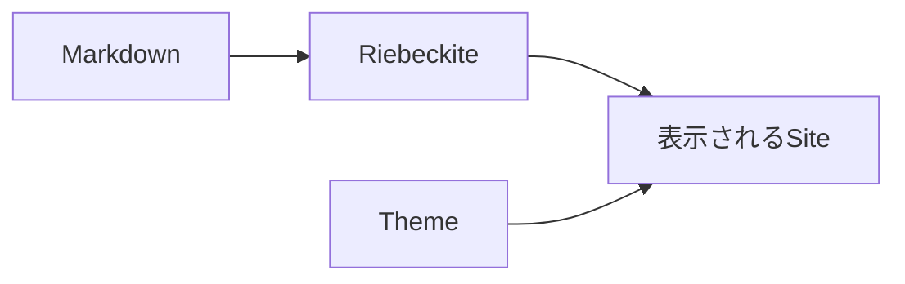
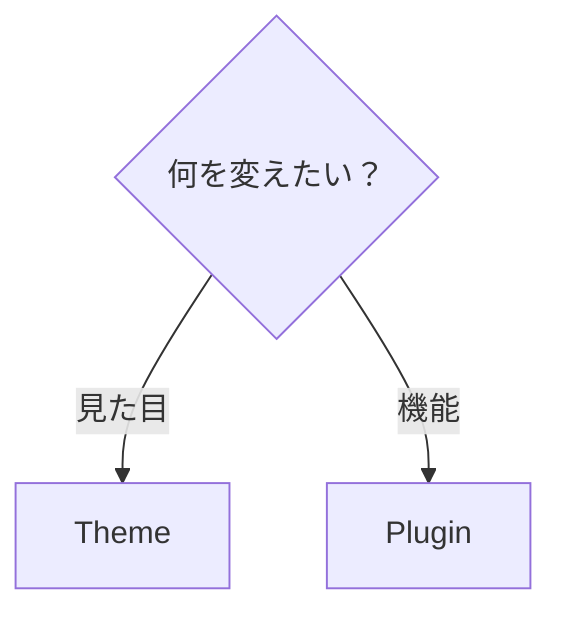
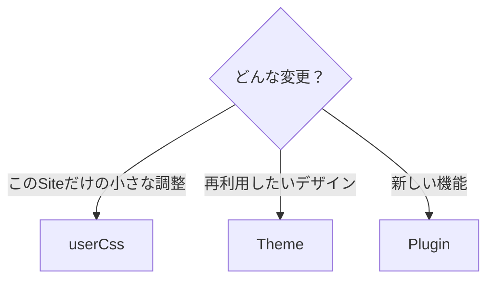
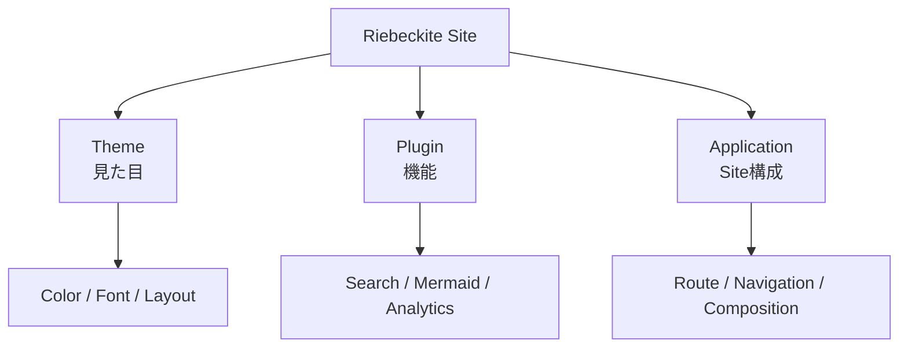

# Themes

Theme は、Riebeckite Site の**見た目を変更する仕組み**です。

Theme を変更すると、

- 色
- フォント
- 文字サイズ
- 余白
- 記事幅
- Sidebar の幅
- Light / Dark Mode
- 記事全体の視覚的な雰囲気

などを変更できます。



Theme は Content の意味や Site の機能を変更するものではありません。

検索、図表、WikiLink、Analytics などの**機能を追加したい場合は [Plugins](../plugins/README.ja.md)** を利用します。

## Theme と Plugin の違い

迷った場合は、「見た目を変えたいのか」「機能を追加したいのか」で考えます。

| やりたいこと | 使うもの |
| --- | --- |
| 色を変える | Theme |
| フォントを変える | Theme |
| 記事幅を変える | Theme |
| Dark Mode に対応する | Theme |
| Site 全体のデザインを変える | Theme |
| Mermaid を表示する | Plugin |
| 検索を追加する | Plugin |
| Analytics を追加する | Plugin |
| Markdown の処理を拡張する | Plugin |



# 最初から Theme は設定されている

`create-riebeckite` で生成した Site には、通常すでに Theme が設定されています。

Preset によって既定の Theme が異なります。

| Preset | Theme |
| --- | --- |
| `minimal` | `@riebeckite/theme-minimal` |
| `starter` | `@riebeckite/theme-default` |
| `showcase` | `@riebeckite/theme-default` |

そのため、最初から Theme を追加しなくても Site を利用できます。

見た目を変更したくなったときに、別の Theme へ切り替えれば十分です。

# Theme を変更する

別の Theme を使う場合は、大きく2つの手順があります。

```text id="2ktbhc"
1. Theme Packageをインストール

2. riebeckite.config.tsでThemeを指定
```

## 1. Theme をインストールする

たとえば Minimal Theme を利用する場合は、

```bash id="a50wvc"
npm install @riebeckite/theme-minimal
```

を実行します。

## 2. Theme を設定する

Theme の Factory を Import し、`riebeckite.config.ts` の `theme` に指定します。

```ts id="etjv95"
import { defineConfig } from "@riebeckite/core";
import { minimalTheme } from "@riebeckite/theme-minimal";

export default defineConfig({
  theme: minimalTheme(),
});
```

これで Site 全体に Minimal Theme が適用されます。

```text id="1eek1b"
@riebeckite/theme-minimal
        ↓
minimalTheme()
        ↓
riebeckite.config.ts
        ↓
Site
```

# Theme の Option

Theme によっては Option を指定できます。

たとえば Default Theme では、次のように設定できます。

```ts id="z6x59h"
import { defineConfig } from "@riebeckite/core";
import { defaultTheme } from "@riebeckite/theme-default";

export default defineConfig({
  theme: defaultTheme({
    colorMode: "system",
    typography: "system",
    articleLayout: "article",
    userCss: ["/extensions/custom.css"],
  }),
});
```

Theme ごとに利用できる Option は異なる場合があります。

正確な Factory 名と Option は、それぞれの Package README を確認してください。

# Color Mode

Theme は共通設定として Color Mode を扱えます。

たとえば、

```ts id="i6fj09"
defaultTheme({
  colorMode: "system",
});
```

のように指定します。

Riebeckite の Theme Contract では、

```text id="svx24i"
light
dark
system
```

の Color Mode を扱います。

`system` は Browser / OS 側の設定に合わせるための Mode です。

Color Mode の詳しい Contract は [Theme API](../reference/theme-api.ja.md) を参照してください。

# Typography

文字の雰囲気も Theme の一部です。

たとえば、

```ts id="02tw4s"
defaultTheme({
  typography: "system",
});
```

のように設定します。

Theme Contract では Typography Preset として、

```text id="tsjddr"
system
serif
sans
```

を扱えます。

実際の Font や細かな Typography は Theme が決定します。

# Article Layout

記事部分の Layout も Theme から設定できます。

```ts id="7cczqi"
defaultTheme({
  articleLayout: "article",
});
```

Theme Contract では、

```text id="n1pwde"
article
sidebar
full-width
```

の Layout Preset を扱えます。

Site の用途や記事の種類に合わせて選択できます。

# 少しだけ見た目を変更する

Theme を丸ごと作るほどではない小さな変更には `userCss` を利用できます。

```ts id="cmf9rk"
defaultTheme({
  userCss: [
    "/extensions/custom.css",
  ],
});
```

たとえば、

```css id="z91hlo"
.rb-article {
  font-size: 1.05rem;
}
```

のような Site 固有の調整を追加できます。

`userCss` は Theme の Style より後に適用されるため、Site 固有の調整に向いています。

# `userCss` と Theme の使い分け

目安は次のとおりです。



| 変更 | 向いている方法 |
| --- | --- |
| 記事の余白を少し変える | `userCss` |
| 特定要素の文字サイズを変える | `userCss` |
| Site 固有の装飾を加える | `userCss` |
| 色・文字・Layout を一式まとめる | Theme |
| 複数 Site で同じ Design を使う | Theme |
| 他の利用者へ配布する | Theme |
| JavaScript の機能を追加する | Plugin |

最初は `userCss` で調整し、変更が大きくなったら Theme として整理する方法もあります。

# 公式 Theme

Riebeckite には複数の公式 Theme があります。

| Theme | Package | Factory | 特徴 |
| --- | --- | --- | --- |
| [Default](./default.ja.md) | `@riebeckite/theme-default` | `defaultTheme()` | 標準の出発点。読みやすさと設定のしやすさを重視 |
| [Minimal](./minimal.ja.md) | `@riebeckite/theme-minimal` | `minimalTheme()` | 装飾を抑えた小さな Theme |
| [Gruvbox](./gruvbox.ja.md) | `@riebeckite/theme-gruvbox` | `gruvboxTheme()` | Gruvbox 風の暖かい高コントラスト配色 |
| [Rerurate](./rerurate.ja.md) | `@riebeckite/theme-rerurate` | `rerurateTheme()` | Rerurate の視覚文法に基づく Theme |
| [Sakura](./sakura.ja.md) | `@riebeckite/theme-sakura` | `sakuraTheme()` | 桜をモチーフにした配色 |
| [Tokyo Night](./tokyonight.ja.md) | `@riebeckite/theme-tokyonight` | `tokyonightTheme()` | Tokyo Night 風の暗色・Editor 風 Theme |

各 Theme の正確な Export 名と Option は、それぞれの正本ページを参照してください。Package README は正本ページから生成されます。

# Default

[Default](./default.ja.md) は、Riebeckite の標準的な Theme です。

```ts id="vms7th"
import { defaultTheme } from "@riebeckite/theme-default";

export default defineConfig({
  theme: defaultTheme(),
});
```

特定のデザインへ大きく寄せず、Riebeckite Site の出発点として利用できます。

`starter` と `showcase` Preset では Default Theme が利用されます。

# Minimal

[Minimal](./minimal.ja.md) は、装飾を抑えた Theme です。

```ts id="vdwwym"
import { minimalTheme } from "@riebeckite/theme-minimal";

export default defineConfig({
  theme: minimalTheme(),
});
```

`minimal` Preset ではこの Theme が利用されます。

# Gruvbox

[Gruvbox](./gruvbox.ja.md) は、Gruvbox をもとにした暖色系の Theme です。

```ts id="w7gdho"
import { gruvboxTheme } from "@riebeckite/theme-gruvbox";

export default defineConfig({
  theme: gruvboxTheme(),
});
```

暖かい色と高いコントラストを持つ配色を利用します。

# Rerurate

[Rerurate](./rerurate.ja.md) は、Rerurate の視覚文法をもとにした Theme です。

```ts id="htrd9r"
import { rerurateTheme } from "@riebeckite/theme-rerurate";

export default defineConfig({
  theme: rerurateTheme(),
});
```

# Sakura

[Sakura](./sakura.ja.md) は、桜をモチーフにした Theme です。

```ts id="czj6ks"
import { sakuraTheme } from "@riebeckite/theme-sakura";

export default defineConfig({
  theme: sakuraTheme(),
});
```

# Tokyo Night

[Tokyo Night](./tokyonight.ja.md) は、Tokyo Night をもとにした暗色系 Theme です。

```ts id="suxi7w"
import { tokyonightTheme } from "@riebeckite/theme-tokyonight";

export default defineConfig({
  theme: tokyonightTheme(),
});
```

Editor のような暗色系の見た目を利用できます。

# Theme を切り替える

Theme は `riebeckite.config.ts` の `theme` を変更することで切り替えられます。

たとえば Default Theme から Minimal Theme へ変更するなら、

```ts id="ql7x6k"
// Before
theme: defaultTheme(),
```

を、

```ts id="85hdqx"
// After
theme: minimalTheme(),
```

へ変更します。

もちろん、新しい Theme Package がまだ入っていない場合は先にインストールしてください。

変更後は、

```sh id="3p2sgb"
npm exec riebeckite dev
```

で実際の表示を確認します。

# Theme が変更するもの

Theme の責任範囲は **Presentation** です。

```text id="33th07"
Theme

├─ Color
├─ Typography
├─ Spacing
├─ Layout
├─ Design Token
└─ CSS
```

一方で、

```text id="8ocgkk"
検索機能
Markdown変換
WikiLink
Analytics
新しいPage
Browser上のInteractiveな処理
```

などは Theme の責任ではありません。

これらには Plugin や Application を利用します。



# Theme を自作する

既存 Theme の `userCss` だけでは足りず、再利用できる Design としてまとめたい場合は、自分で Theme を作成できます。

まず [Writing a Theme](./writing-a-theme.ja.md) を参照してください。

```text id="8d9b1f"
Themeを使いたい
  → このページ

Themeを作りたい
  → Writing a Theme

正確なAPIを確認したい
  → Theme API

内部の仕組みを知りたい
  → Framework / Theme System
```

Theme の公開 Contract を確認したい場合は [Theme API](../reference/theme-api.ja.md)、Riebeckite 内部で Theme がどのように扱われるか知りたい場合は [Framework / Theme System](../framework/theme-system.ja.md) を参照してください。

# まとめ

Theme は Riebeckite Site の**見た目を担当する仕組み**です。

```text id="x4a0p4"
見た目を変える
  → Theme

小さなSite固有調整
  → userCss

機能を追加する
  → Plugin

SiteのPageや構成を作る
  → Application
```

既存 Theme を使う場合は、

```text id="4u2l5e"
Packageをinstall
      ↓
Factoryをimport
      ↓
config.themeに指定
      ↓
devで確認
```

という流れになります。

Theme ごとの正確な Factory 名と Option は、それぞれの正本ページを確認してください。

## 次に読むページ

- [Writing a Theme](./writing-a-theme.ja.md) — Theme を自作する
- [Theme API](../reference/theme-api.ja.md) — Theme の公開 Contract
- [Framework / Theme System](../framework/theme-system.ja.md) — Theme の内部設計
- [Plugins](../plugins/README.ja.md) — Site に機能を追加する
