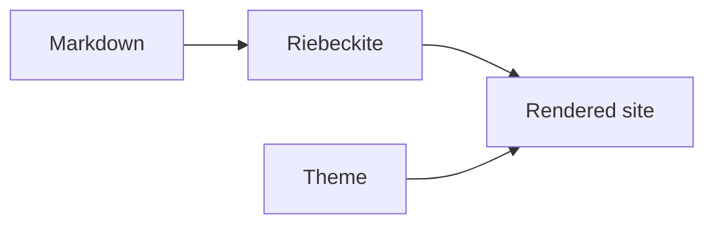
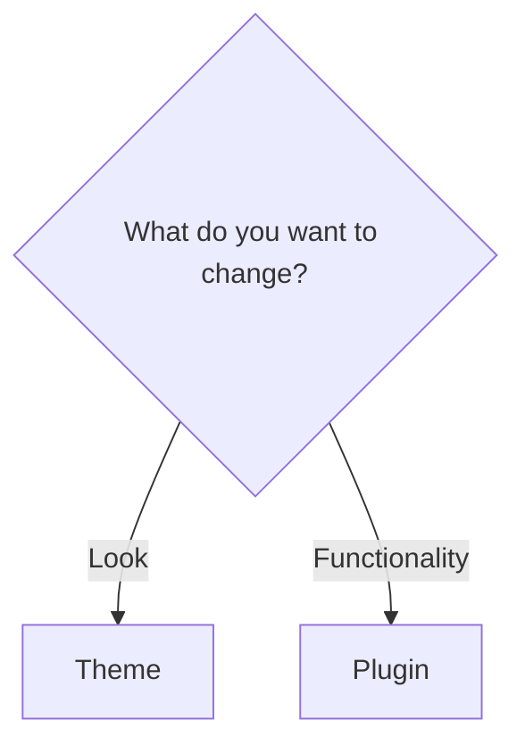
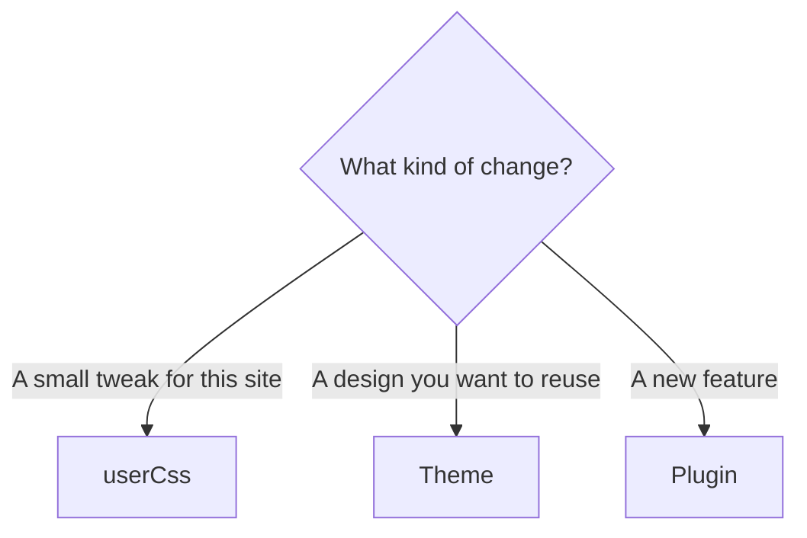
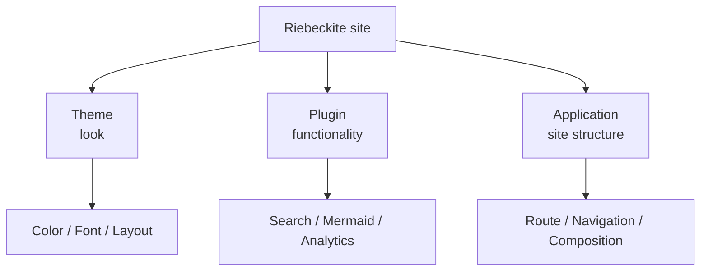

# Themes

Themes change how a Riebeckite site looks: colors, typography, spacing, layout, and article presentation. They do not add Markdown syntax, search, diagrams, or other features; use a [Plugin](../plugins/README.md) for those.

Changing the theme lets you adjust:

- colors
- fonts
- text size
- spacing
- article width
- sidebar width
- light / dark mode
- the overall visual mood of articles



A theme does not change the meaning of content or the functionality of the site. When you want to add features such as search, diagrams, WikiLinks, or analytics, use a [Plugin](../plugins/README.md).

## Themes vs. plugins

When in doubt, decide whether you want to change the look or add functionality.

| Goal | Use |
| --- | --- |
| Change colors | Theme |
| Change fonts | Theme |
| Change article width | Theme |
| Support dark mode | Theme |
| Change the whole site design | Theme |
| Show Mermaid diagrams | Plugin |
| Add search | Plugin |
| Add analytics | Plugin |
| Extend Markdown processing | Plugin |



## A theme is already configured

Sites generated with `create-riebeckite` usually already have a theme. The preset decides the default:

| Preset | Theme |
| --- | --- |
| `minimal` | `@riebeckite/theme-minimal` |
| `starter` | `@riebeckite/theme-default` |
| `showcase` | `@riebeckite/theme-default` |

So you can use a generated site without adding a theme. When you want a different look, it is enough to switch to another theme.

## Install a theme

Most generated sites already include a theme. `minimal` uses `@riebeckite/theme-minimal`; `starter` and `showcase` use `@riebeckite/theme-default`.

To add another theme, install its package:

```sh
npm install @riebeckite/theme-minimal
```

There are two broad steps to use a different theme:

```text
1. Install the theme package

2. Specify the theme in riebeckite.config.ts
```

## Configure the theme

Import the theme factory and assign it to `theme` in `riebeckite.config.ts`:

```ts
import { defineConfig } from "@riebeckite/core";
import { minimalTheme } from "@riebeckite/theme-minimal";

export default defineConfig({
  theme: minimalTheme(),
});
```

This applies the Minimal theme to the whole site:

```text
@riebeckite/theme-minimal
        ↓
minimalTheme()
        ↓
riebeckite.config.ts
        ↓
Site
```

Some themes accept options. For example:

```ts
import { defaultTheme } from "@riebeckite/theme-default";

export default defineConfig({
  theme: defaultTheme({
    colorMode: "system",
    typography: "system",
    articleLayout: "article",
    userCss: ["/extensions/custom.css"],
  }),
});
```

The options available depend on the theme. Check each package README for the exact factory name and options.

`userCss` is useful for small site-specific tweaks. If you want a reusable visual language, create a theme instead.

## Color mode

A theme can handle color mode as a common setting. For example:

```ts
defaultTheme({
  colorMode: "system",
});
```

The Riebeckite theme contract handles three color modes:

```text
light
dark
system
```

`system` follows the browser or operating system setting. See [Theme API](../reference/theme-api.md) for the detailed contract.

## Typography

The feel of the text is part of the theme. For example:

```ts
defaultTheme({
  typography: "system",
});
```

The theme contract handles these typography presets:

```text
system
serif
sans
```

The theme decides the actual fonts and the finer typography details.

## Article layout

The layout of the article area can also be set from the theme:

```ts
defaultTheme({
  articleLayout: "article",
});
```

The theme contract handles these layout presets:

```text
article
sidebar
full-width
```

Choose one to match the purpose of the site and the kind of articles.

## Small tweaks with `userCss`

For small changes that are not worth building a whole theme, use `userCss`:

```ts
defaultTheme({
  userCss: [
    "/extensions/custom.css",
  ],
});
```

For example, you can add a site-specific adjustment such as:

```css
.rb-article {
  font-size: 1.05rem;
}
```

`userCss` is applied after the theme styles, so it is well suited to site-specific adjustments.

## Choosing between `userCss` and a theme

A rule of thumb:



| Change | Better fit |
| --- | --- |
| Adjust article spacing slightly | `userCss` |
| Change the text size of a specific element | `userCss` |
| Add site-specific decoration | `userCss` |
| Bundle colors, text, and layout together | Theme |
| Use the same design across several sites | Theme |
| Distribute to other users | Theme |
| Add JavaScript functionality | Plugin |

You can start by adjusting with `userCss` and reorganize into a theme once the changes grow.

## Official themes

| Theme | Package | Factory | Best for |
| --- | --- | --- | --- |
| [Default](./default.md) | `@riebeckite/theme-default` | `defaultTheme()` | The normal starting point: readable, configurable, and compatible with color mode |
| [Minimal](./minimal.md) | `@riebeckite/theme-minimal` | `minimalTheme()` | A small baseline when you want little visual opinion |
| [Gruvbox](./gruvbox.md) | `@riebeckite/theme-gruvbox` | `gruvboxTheme()` | A warm, high-contrast Gruvbox-inspired look |
| [Rerurate](./rerurate.md) | `@riebeckite/theme-rerurate` | `rerurateTheme()` | Rerurate's visual grammar |
| [Sakura](./sakura.md) | `@riebeckite/theme-sakura` | `sakuraTheme()` | A sakura-inspired palette |
| [Tokyo Night](./tokyonight.md) | `@riebeckite/theme-tokyonight` | `tokyonightTheme()` | A Tokyo Night-inspired dark/editor-like look |

Each theme's canonical page is the source of truth for its exported factory name and options. Package READMEs are generated from these pages.

### Default

[Default](./default.md) is the standard Riebeckite theme:

```ts
import { defaultTheme } from "@riebeckite/theme-default";

export default defineConfig({
  theme: defaultTheme(),
});
```

It does not lean heavily toward one design, so it works as a starting point for a Riebeckite site. The `starter` and `showcase` presets use the Default theme.

### Minimal

[Minimal](./minimal.md) is a theme with little decoration:

```ts
import { minimalTheme } from "@riebeckite/theme-minimal";

export default defineConfig({
  theme: minimalTheme(),
});
```

The `minimal` preset uses this theme.

### Gruvbox

[Gruvbox](./gruvbox.md) is a warm theme based on Gruvbox:

```ts
import { gruvboxTheme } from "@riebeckite/theme-gruvbox";

export default defineConfig({
  theme: gruvboxTheme(),
});
```

It uses warm colors with high contrast.

### Rerurate

[Rerurate](./rerurate.md) is a theme based on Rerurate's visual grammar:

```ts
import { rerurateTheme } from "@riebeckite/theme-rerurate";

export default defineConfig({
  theme: rerurateTheme(),
});
```

### Sakura

[Sakura](./sakura.md) is a theme inspired by cherry blossoms:

```ts
import { sakuraTheme } from "@riebeckite/theme-sakura";

export default defineConfig({
  theme: sakuraTheme(),
});
```

### Tokyo Night

[Tokyo Night](./tokyonight.md) is a dark theme based on Tokyo Night:

```ts
import { tokyonightTheme } from "@riebeckite/theme-tokyonight";

export default defineConfig({
  theme: tokyonightTheme(),
});
```

It gives the site an editor-like dark look.

## Switching themes

Switch themes by changing `theme` in `riebeckite.config.ts`. To go from the Default theme to the Minimal theme, change:

```ts
// Before
theme: defaultTheme(),
```

to:

```ts
// After
theme: minimalTheme(),
```

If the new theme package is not installed yet, install it first. After the change, check the actual display with:

```sh
npm exec riebeckite dev
```

## What a theme changes

A theme's responsibility is **presentation**:

```text
Theme

├─ Color
├─ Typography
├─ Spacing
├─ Layout
├─ Design token
└─ CSS
```

On the other hand:

```text
Search
Markdown conversion
WikiLinks
Analytics
New pages
Interactive browser behavior
```

are not the theme's responsibility. Use a plugin or the application for those.



## Create or extend a theme

When `userCss` on an existing theme is not enough and you want to organize a reusable design, you can create your own theme. Start with [Writing a theme](./writing-a-theme.md).

```text
I want to use a theme
  → this page

I want to create a theme
  → Writing a theme

I want to check the exact API
  → Theme API

I want to understand the internals
  → Framework / Theme system
```

For the public contract, see [Theme API](../reference/theme-api.md). To understand how Riebeckite handles themes internally, see [Framework / Theme system](../framework/theme-system.md).

## Summary

A theme is the mechanism responsible for the **look** of a Riebeckite site.

```text
Change the look
  → Theme

A small site-specific adjustment
  → userCss

Add functionality
  → Plugin

Build the site's pages and structure
  → Application
```

Using an existing theme is a flow of:

```text
Install the package
      ↓
Import the factory
      ↓
Set it in config.theme
      ↓
Check with dev
```

Check each theme's canonical page for its exact factory name and options.

## Next

- [Writing a theme](./writing-a-theme.md) — create your own theme
- [Theme API](../reference/theme-api.md) — the public theme contract
- [Framework / Theme system](../framework/theme-system.md) — the internal design of themes
- [Plugins](../plugins/README.md) — add functionality to your site
