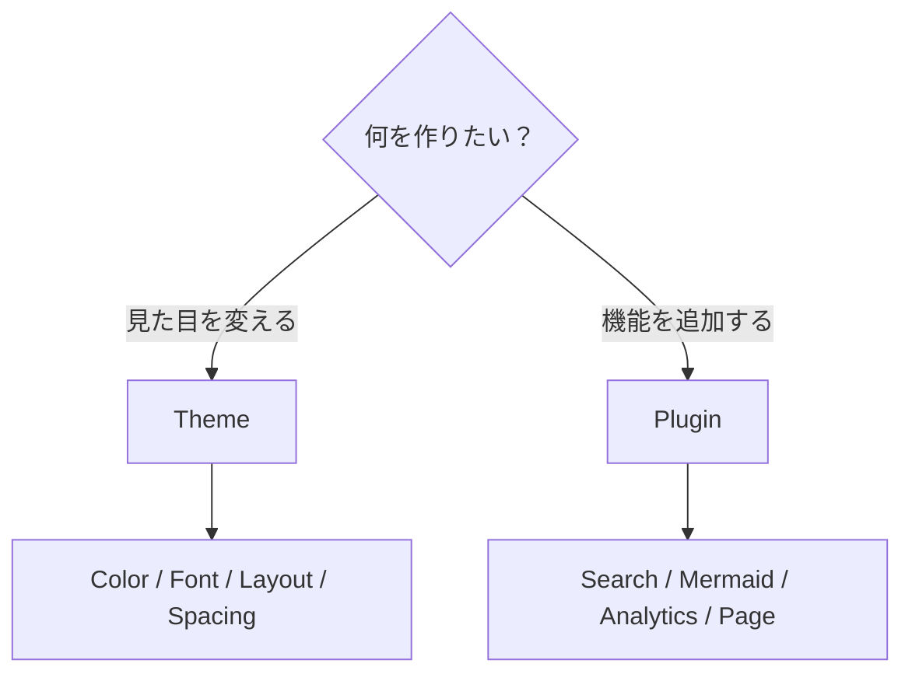
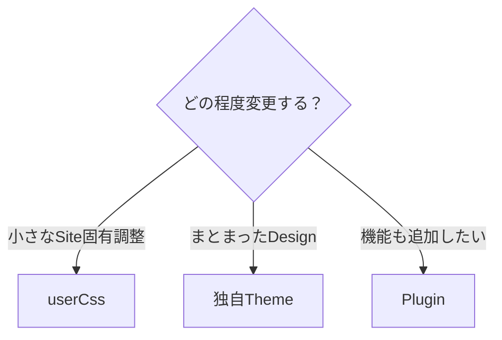
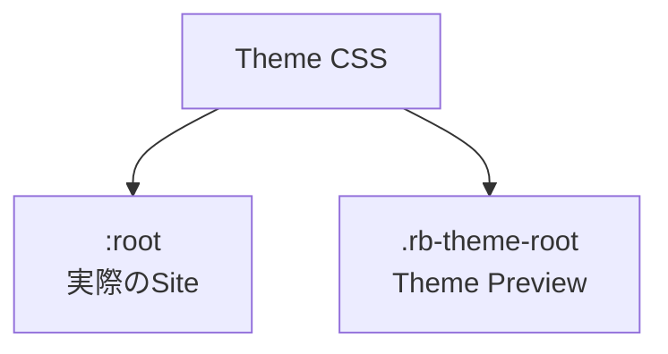
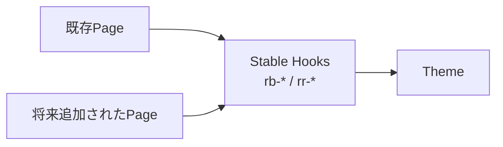
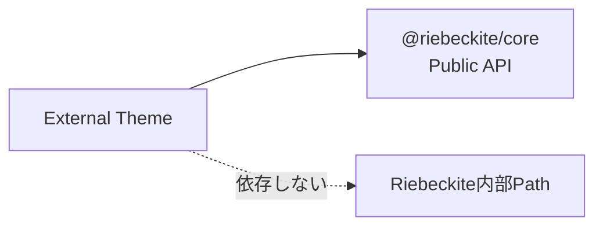
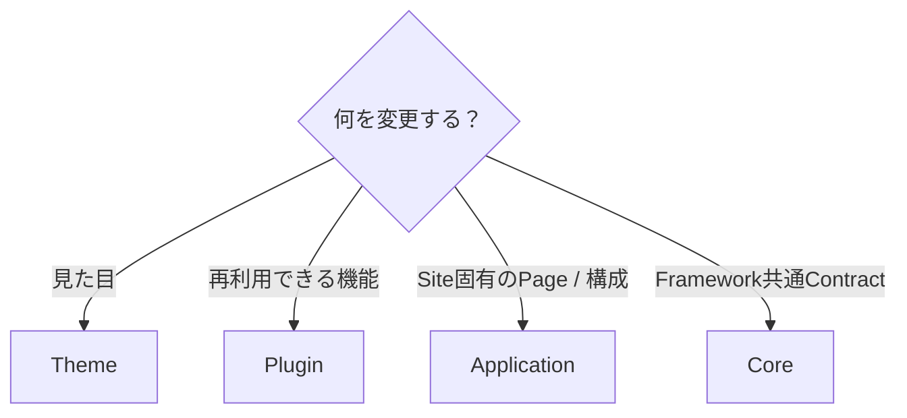

# はじめてのテーマ作成

Riebeckite の Theme は、Site の**見た目を変更する仕組み**です。

たとえば、

- 配色
- フォント
- 文字サイズ
- 余白
- 記事幅
- Layout
- Light / Dark Mode

などを変更できます。

一方で、Theme から新しい機能を追加することはできません。



検索、図表、Markdown の拡張などを追加したい場合は、[はじめてのプラグイン作成](../plugins/writing-a-plugin.ja.md) を参照してください。

この Guide では、

```text id="br3nd6"
既存Themeを少し調整
        ↓
Site内にThemeを作る
        ↓
CSSを書く
        ↓
Light / Darkに対応
        ↓
必要ならPackageとして配布
```

の順に進めます。

# まずは Theme を作る必要があるか確認する

少しだけ見た目を変えたい場合は、新しい Theme を作る必要はありません。

たとえば、

```text id="b83ut7"
記事幅を少し変えたい
文字サイズを調整したい
Site固有のCSSを追加したい
```

程度なら、既存 Theme の `userCss` を利用できます。

一方、

```text id="71uv2w"
独自の配色を作りたい
Typographyを一式設計したい
複数Siteで再利用したい
他の利用者へ配布したい
```

場合は Theme として作るのが向いています。



# 1. 組み込み Theme を調整する

最も簡単なのは、既存 Theme に Option と `userCss` を指定する方法です。

たとえば Default Theme を調整します。

```ts id="ih0etb"
// riebeckite.config.ts
import { defaultTheme } from "@riebeckite/theme-default";

export default defineConfig({
  theme: defaultTheme({
    colorMode: "light",
    typography: "system",
    userCss: ["/extensions/custom.css"],
  }),

  // ...
});
```

ここでは、

```text id="14l98v"
colorMode
  → light

typography
  → system

userCss
  → /extensions/custom.css
```

を指定しています。

`userCss` は Theme の CSS より後に読み込まれるため、Site 固有の小さな上書きに利用できます。

たとえば、

```css id="q11q8v"
.rb-article {
  font-size: 1.05rem;
}
```

のような調整ができます。

これだけで目的を達成できるなら、独自 Theme を作る必要はありません。

# 2. 最小の Theme を作る

独自 Theme は `defineTheme` で定義します。

`defineTheme` は `@riebeckite/core` から Import します。

最初から npm Package を作る必要はありません。

まずは Site の中に、

```text id="byvcr1"
my-site/
├─ extensions/
│  ├─ local-theme.ts
│  └─ theme.css
│
├─ riebeckite.config.ts
└─ package.json
```

のように置いて作れます。

## Theme を定義する

`extensions/local-theme.ts` を作ります。

```ts id="bs4dkd"
// extensions/local-theme.ts
import { defineTheme } from "@riebeckite/core";

export function localTheme() {
  return defineTheme({
    name: "local",
    styles: [
      {
        moduleSpecifier: "/extensions/theme.css",
      },
    ],
  });
}
```

最小構成では、

```text id="dbwgoq"
name
  → Themeの識別子

styles
  → Themeが使うStylesheet
```

を指定します。

`styles[].moduleSpecifier` には、Host Bundler が解決できる Module Specifier を指定します。

Site 内 Theme なら、

```text id="42dg5e"
/extensions/theme.css
```

のように指定できます。

# 3. Site で Theme を使う

作成した `localTheme` を `riebeckite.config.ts` から読み込みます。

```ts id="91cdvs"
// riebeckite.config.ts
import { defineConfig } from "@riebeckite/core";
import { localTheme } from "./extensions/local-theme";

export default defineConfig({
  theme: localTheme(),

  // ...
});
```

これで、

```text id="kpcf2q"
local-theme.ts
      ↓
localTheme()
      ↓
defineTheme()
      ↓
riebeckite.config.ts
      ↓
Site
```

という形で独自 Theme が利用されます。

# 4. Theme の CSS を書く

次に、

```text id="mx8gdm"
extensions/theme.css
```

へ実際の Style を書きます。

Theme の CSS では、Riebeckite が提供する、

- Semantic Token
- Stable CSS Hook

を利用します。

最小の例は次のようになります。

```css id="j5jkvb"
:is(:root, .rb-theme-root)[data-theme-name="local"] .rb-site {
  background: var(--rb-color-paper);
  color: var(--rb-color-ink);
}

:is(:root, .rb-theme-root)[data-theme-name="local"] .rb-article {
  max-width: var(--rb-layout-article-max);
}
```

最初は少し長く見えますが、それぞれに役割があります。

```text id="ehn64e"
[data-theme-name="local"]
  → このThemeだけに適用する

.rb-site / .rb-article
  → Riebeckiteの安定したCSS Hook

--rb-*
  → RiebeckiteのSemantic Token
```

# Theme Root Selector

Theme の Style は、Theme Root の内側に限定します。

基本形は、

```css id="5t9k0r"
:is(:root, .rb-theme-root)[data-theme-name="<name>"]
```

です。

`<name>` には `defineTheme` で指定した `name` を入れます。

今回なら、

```ts id="2ukjvx"
name: "local"
```

なので、

```css id="u27p4e"
:is(:root, .rb-theme-root)[data-theme-name="local"]
```

となります。

## なぜ `:root` と `.rb-theme-root` の両方がある？

この Selector は、実際の Site と Theme Preview の両方で同じ CSS を利用するためのものです。



実際の Site では、Application が Document Root に、

```html id="tfjfs9"
<html data-theme-name="local">
```

のような Theme 情報を付けます。

Theme Preview では、

```html id="xwskmw"
<div
  class="rb-theme-root"
  data-theme-name="local"
>
```

のような任意の Container 内で Theme を表示できます。

そのため Theme CSS は、

```css id="7xf9zn"
:is(:root, .rb-theme-root)[data-theme-name="local"]
```

を Root として書きます。

# Semantic Token を使う

Theme では、色や Layout の値を直接あちこちへ書くのではなく、Semantic Token を利用します。

Riebeckite の共通 Token は、

```text id="f0yh64"
--rb-*
```

という名前です。

たとえば、

```css id="m5h77c"
color: var(--rb-color-ink);
background: var(--rb-color-paper);
```

のように利用します。

```text id="w2v0ss"
paper
  → 背景

ink
  → 主な文字

accent
  → 強調

border
  → 境界線
```

のように、具体的な色ではなく**役割**を表す Token になっています。

これが Semantic Token です。

Theme 全体で同じ意味の色を共有できるため、

```text id="bcv48d"
#ffffff
#111111
#888888
```

のような値を各 Component に直接書き散らすより、Theme を管理しやすくなります。

Token の正確な一覧は [Theme API](../reference/theme-api.ja.md) を参照してください。

# Stable Hook を使う

Riebeckite の共通 UI には、

```text id="lq35s3"
rb-*
```

という Stable Hook があります。

たとえば、

```css id="2jhw92"
.rb-site
.rb-article
```

などです。

Plugin が提供する UI では、

```text id="qg0kb3"
rr-<feature>
```

形式の Stable Hook を利用します。

Theme は、特定の Route や Page Type ID に依存するのではなく、こうした Stable Hook を対象に Style を書きます。

```text id="v5o69k"
避ける

特定Route
特定Page Type ID
内部Component構造

        ↓

使う

rb-* Stable Hook
rr-<feature> Stable Hook
--rb-* Semantic Token
```

これによって、Theme を作った時点では存在していなかった Page Type にも、共通の Design を適用しやすくなります。

# なぜ Page Type ごとに CSS を書かない？

Plugin は独自の Page Type を追加できます。

そのため Theme 側で、

```text id="70qh6b"
home
article
explore
tags
...
```

のように Page Type を列挙してしまうと、新しい Plugin が Page を追加するたびに Theme の変更が必要になります。

代わりに、

```text id="myo7di"
Page Type
     ↓
Framework / PluginのStable Hook
     ↓
Theme
```

という関係にします。



Theme が Page の種類ではなく Semantic Hook を見ることで、新しい Page Type とも疎結合にできます。

# 5. Light / Dark Mode に対応する

Color Mode に対応する場合は、3つの状態を考えます。

```text id="k24wdk"
light
dark
system
```

基本形は次のようになります。

```css id="c9pm84"
:is(:root, .rb-theme-root)[data-theme-name="local"] {
  /* light */
}

:is(:root, .rb-theme-root)[data-theme-name="local"][data-theme="dark"] {
  /* dark */
}

@media (prefers-color-scheme: dark) {
  :is(:root, .rb-theme-root)[data-theme-name="local"]:not([data-theme]) {
    /* system でOSがdark */
  }
}
```

## Light

通常の Light Mode です。

```css id="6s0kr3"
:is(:root, .rb-theme-root)[data-theme-name="local"] {
  /* light */
}
```

## Dark

明示的に Dark Mode が選択されている場合は、

```css id="khq4ec"
:is(:root, .rb-theme-root)[data-theme-name="local"][data-theme="dark"] {
  /* dark */
}
```

で扱います。

## System

`system` では `data-theme` を付けず、OS / Browser の設定に従います。

```css id="4nrvxb"
@media (prefers-color-scheme: dark) {
  :is(:root, .rb-theme-root)[data-theme-name="local"]:not([data-theme]) {
    /* system dark */
  }
}
```

System Mode では、

```html id="k8uz2d"
data-theme=""
```

ではなく、**`data-theme` Attribute 自体が存在しません**。

そのため、

```css id="dh4axr"
:not([data-theme])
```

で判定します。

# 6. アクセシビリティを確認する

Theme は見た目を変更するため、アクセシビリティにも影響します。

特に、

- 本文と背景の Contrast
- Link が本文と区別できるか
- Keyboard 操作中の Focus が見えるか
- Light Mode / Dark Mode の両方で読めるか
- Hover だけに情報を依存していないか

などを確認してください。

Theme は単に「きれいに見える」だけではなく、Content を読みやすい状態に保つ必要があります。

詳しくは [アクセシビリティ](../accessibility.ja.md) を参照してください。

# 7. CSS の読み込み順を理解する

Riebeckite では CSS の読み込み順が決まっています。

Theme CSS は `userCss` より前に適用されます。

概念的には、

```text id="tl3h0p"
Framework / Application
        ↓
Plugin Style
        ↓
Theme Style
        ↓
ConfigによるToken
        ↓
userCss
```

という順になります。

そのため、

```text id="8i6rvp"
Theme
  → 再利用できる基本Design

userCss
  → Site固有の最終調整
```

という役割分担ができます。

Theme 側で Site 固有の上書きまで抱え込む必要はありません。

正確な Cascade は [Theme API](../reference/theme-api.ja.md) を参照してください。

# 8. Browser で確認する

Theme を作ったら Development Server を起動します。

```sh id="p90emf"
npm exec riebeckite dev
```

実際の記事を開いて、

- 本文
- 見出し
- Link
- Code Block
- Table
- List
- Image
- Plugin UI
- Light Mode
- Dark Mode

などを確認します。

特定の Demo Page だけではなく、実際の記事でも確認してください。

# 9. Riebeckite の検証を実行する

設定に問題がないか確認します。

```sh id="mbllje"
npm exec riebeckite check
npm exec riebeckite doctor
npm exec riebeckite inspect config
npm exec riebeckite build
```

それぞれの役割は次のとおりです。

| Command | 確認すること |
| --- | --- |
| `check` | Config や Theme の解決が正しいか |
| `doctor` | Site 全体に問題がないか |
| `inspect config` | 解決済み Theme 設定 |
| `build` | 実際に Site を生成できるか |

`check` / `doctor` / `inspect` は読み取り専用です。

これらの Command が Theme File を自動で修正することはありません。

# 10. 配布用 Package にする

Site 内 Theme として問題なく動作したら、必要に応じて Package として配布できます。

Riebeckite Repository 内では、

```text id="c7gzq8"
packages/themes/minimal/
```

が構成例になります。

```text id="5j0p0f"
packages/themes/minimal/
├─ src/
│  └─ index.ts
├─ styles/
│  └─ theme.css
├─ package.json
├─ README_ja.md
└─ README.md
```

`src/index.ts` では Theme Factory を公開します。

```ts id="a6e4vn"
import { defineTheme } from "@riebeckite/core";

export function myTheme() {
  return defineTheme({
    name: "my-theme",
    styles: [
      {
        moduleSpecifier: "@example/riebeckite-theme/style.css",
      },
    ],
  });
}
```

Package では Stylesheet を、

```text id="hhg9pd"
./style.css
```

のような Public Export として公開します。

# 外部 Theme の依存関係

配布する Theme は、

```text id="n1cn77"
@riebeckite/core
```

の Public API に依存します。

Riebeckite Monorepo 内部の、

```text id="ohs3aa"
packages/...
src/...
../../...
```

のような Path に依存させないでください。



外部利用者が npm から Theme をインストールした場合でも動作する構成にします。

# Theme 独自 Option

Theme 固有の設定が必要な場合は、その Theme の Factory Option として定義します。

たとえば、

```ts id="w8b3zk"
myTheme({
  // Theme固有Option
});
```

のような形です。

Theme 固有の都合だけで Core の共通 Config を増やすのは避けます。

```text id="bwrfbx"
Riebeckite全体で共通
  → Core Contract

そのThemeだけで必要
  → Theme Factory Option
```

という境界で考えます。

# Theme がしてはいけないこと

Theme の責任は Presentation です。

そのため、

```text id="1txwn9"
Routeを追加する
Pageを追加する
Pluginを追加・削除する
JavaScriptの機能を追加する
DOMを変換する
Islandを追加する
ContentManagerを操作する
Filesystemを読む
```

といった処理は Theme に入れません。

必要な責務に応じて、



と分けます。

# 最小の完成形

最小の Site 内 Theme は2ファイルで作れます。

```text id="wub30o"
extensions/
├─ local-theme.ts
└─ theme.css
```

`local-theme.ts` の中身は次のとおりです。

```ts id="f2e0yg"
import { defineTheme } from "@riebeckite/core";

export function localTheme() {
  return defineTheme({
    name: "local",
    styles: [
      {
        moduleSpecifier: "/extensions/theme.css",
      },
    ],
  });
}
```

`theme.css` の中身は次のとおりです。

```css id="0nvzz5"
:is(:root, .rb-theme-root)[data-theme-name="local"] .rb-site {
  background: var(--rb-color-paper);
  color: var(--rb-color-ink);
}

:is(:root, .rb-theme-root)[data-theme-name="local"] .rb-article {
  max-width: var(--rb-layout-article-max);
}
```

そして `riebeckite.config.ts` から、

```ts id="hcg2hm"
import { localTheme } from "./extensions/local-theme";

export default defineConfig({
  theme: localTheme(),
});
```

と指定します。

これが Riebeckite Theme の最小構成です。

# まとめ

Theme を作るときは、最初から Package 化する必要はありません。

```text id="ypbhk"
少しだけ変更
  → userCss

独自Designを作る
  → Site内Theme

再利用・配布したい
  → Theme Package
```

Theme の CSS では、

```text id="doxcc6"
--rb-*
  → Semantic Token

rb-*
  → Framework Stable Hook

rr-<feature>
  → Plugin Stable Hook

Theme Root Selector
  → ThemeのStyleを適用する範囲
```

を利用します。

そして、**Theme が Page Type や内部 Component の構造を知りすぎない**ことが最も重要です。

```text id="3p18me"
Page Type
     ↓
Stable Hook / Semantic Token
     ↓
Theme
```

という境界を保つことで、新しい Plugin や Page Type が追加されても利用できる Theme を作れます。

## 関連資料

- [Theme](./README.ja.md) — Theme の選択と利用方法
- [テーマ作成の詳細](../framework/theme-system.ja.md) — Option、Token、Hook、Cascade、配布を含む詳しい設計
- [Theme API](../reference/theme-api.ja.md) — `defineTheme` と Theme の公開 Contract
- [はじめてのプラグイン作成](../plugins/writing-a-plugin.ja.md) — 機能を追加する場合
- [Plugin API](../reference/plugin-api.ja.md) — Plugin の公開 Contract
- [アクセシビリティ](../accessibility.ja.md) — Theme 作成時のアクセシビリティ
