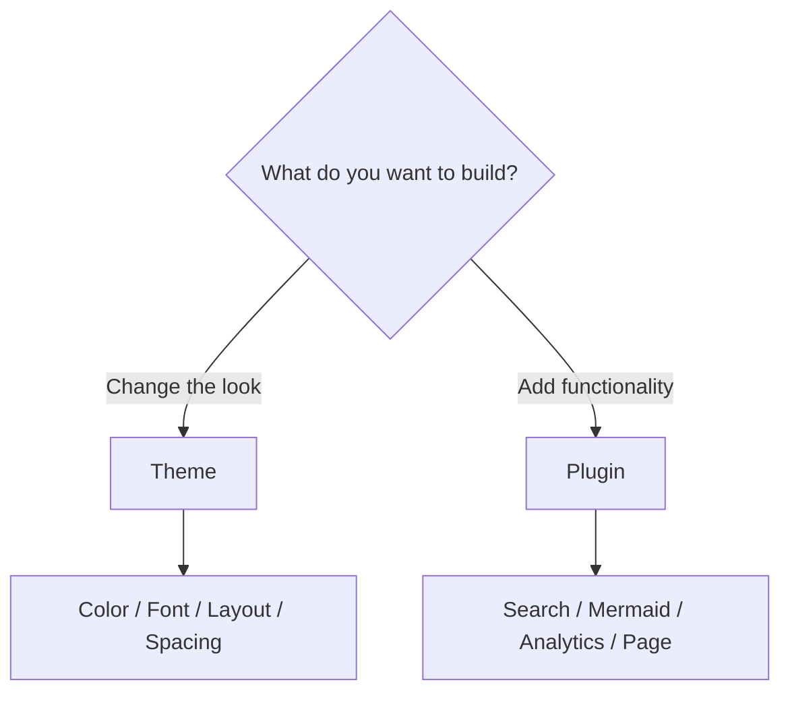
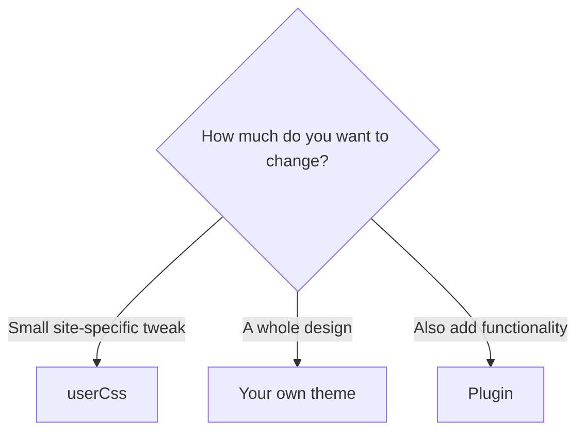
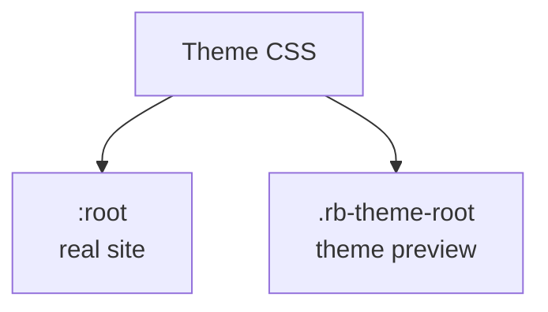
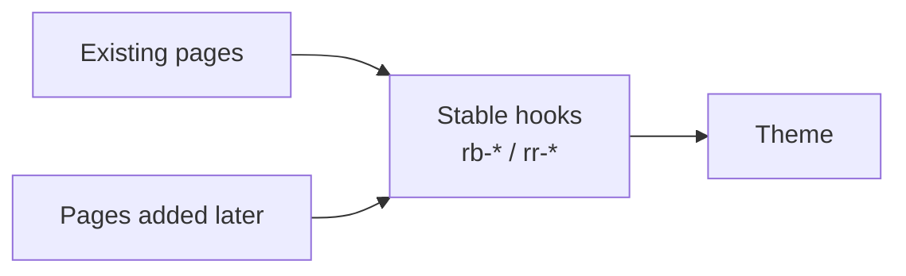
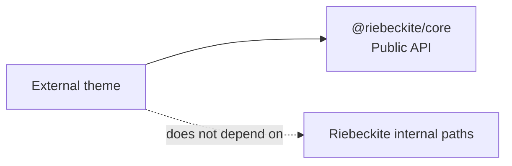
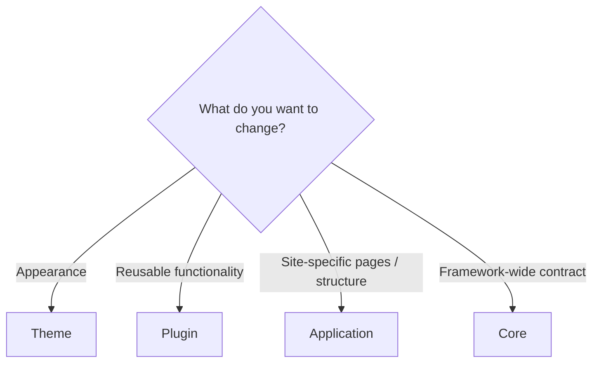

# Your First Theme

A theme changes how a site **looks** (colors, typography, layout). It cannot add features. For features, see [Your first plugin](../plugins/writing-a-plugin.md). A theme must also work for Page Types it does not know: style stable hooks and semantic tokens, not a list of route or Page Type IDs.



This guide goes in this order:

```text
adjust a built-in theme
        ↓
create a theme inside the site
        ↓
write the CSS
        ↓
support light / dark
        ↓
package it for distribution if needed
```

## Do you need a theme?

If you only want a small visual change, you do not need a new theme. A tweak such as the following can use the built-in theme's `userCss`:

```text
change the article width slightly
adjust the font size
add site-specific CSS
```

Build a theme when you want to:

```text
create your own palette
design a full typography system
reuse the design across several sites
distribute it to other users
```



## 1. Adjust a built-in theme (fastest)

If you want to tweak an existing look, pass options and CSS to `defaultTheme()`:

```ts
// riebeckite.config.ts
import { defaultTheme } from "@riebeckite/theme-default";

export default defineConfig({
  theme: defaultTheme({
    colorMode: "light",      // "light" | "dark" | "system"
    typography: "system",    // "system" | "serif" | "sans"
    userCss: ["/extensions/custom.css"], // loaded last, overrides everything
  }),
  // ...
});
```

`userCss` loads after the theme CSS, so it is the right place for small site-specific overrides:

```css
.rb-article {
  font-size: 1.05rem;
}
```

If that is enough to reach your goal, you do not need to create your own theme.

## 2. Create a minimal theme

A custom theme is made with `defineTheme` (from `@riebeckite/core`). It does **not** need to be a published package — you can define it inside the site.

Start by placing it in the site:

```text
my-site/
├─ extensions/
│  ├─ local-theme.ts
│  └─ theme.css
│
├─ riebeckite.config.ts
└─ package.json
```

```ts
// extensions/local-theme.ts
import { defineTheme } from "@riebeckite/core";

export function localTheme() {
  return defineTheme({
    name: "local",
    styles: [{ moduleSpecifier: "/extensions/theme.css" }],
  });
}
```

The minimal configuration sets:

```text
name
  → the theme identifier

styles
  → the stylesheet the theme uses
```

`styles[].moduleSpecifier` must be a module specifier the host bundler can resolve. For an in-site theme, use something like `/extensions/theme.css`.

Pass it to `theme` in `riebeckite.config.ts`.

```ts
// riebeckite.config.ts
import { localTheme } from "./extensions/local-theme";

export default defineConfig({
  theme: localTheme(),
  // ...
});
```

The theme is resolved in this order:

```text
local-theme.ts
      ↓
localTheme()
      ↓
defineTheme()
      ↓
riebeckite.config.ts
      ↓
Site
```

## 3. Write the CSS

Do not hardcode colors. Use **semantic tokens (`--rb-*`) and stable hooks (`rb-*` / `rr-<feature>`)** so themes stay swappable, and scope every rule to the theme root selector. Replace `<name>` with the theme's identity name — here the theme is named `local`.

```css
/* Example: adjust background, text color, and article width */
:is(:root, .rb-theme-root)[data-theme-name="local"] .rb-site {
  background: var(--rb-color-paper);
  color: var(--rb-color-ink);
}

:is(:root, .rb-theme-root)[data-theme-name="local"] .rb-article {
  max-width: var(--rb-layout-article-max);
}
```

The selector looks long, but each part has a role:

```text
[data-theme-name="local"]
  → applies only to this theme

.rb-site / .rb-article
  → Riebeckite's stable CSS hooks

--rb-*
  → Riebeckite's semantic tokens
```

### Theme root selector

Every theme rule is scoped inside the theme root. The basic form is:

```css
:is(:root, .rb-theme-root)[data-theme-name="<name>"]
```

`<name>` is the `name` you passed to `defineTheme`. Here it is `local`, so the selector is:

```css
:is(:root, .rb-theme-root)[data-theme-name="local"]
```

The theme root selector `:is(:root, .rb-theme-root)[data-theme-name="<name>"]` matches the document root on a real site (the app sets `data-theme-name` on `<html>`) and any `class="rb-theme-root" data-theme-name="<name>"` container in a preview.

#### Why both `:root` and `.rb-theme-root`?

The selector lets the same CSS style both a real site and a theme preview:



On a real site the application puts the theme information on the document root:

```html
<html data-theme-name="local">
```

In a theme preview the theme renders inside any container:

```html
<div
  class="rb-theme-root"
  data-theme-name="local"
>
```

So the theme CSS is written with `:is(:root, .rb-theme-root)[data-theme-name="local"]` as its root.

### Use semantic tokens

Instead of scattering color and layout values through the CSS, use semantic tokens. Riebeckite's shared tokens are named `--rb-*`:

```css
color: var(--rb-color-ink);
background: var(--rb-color-paper);
```

They describe a **role**, not a concrete color:

```text
paper
  → background

ink
  → primary text

accent
  → emphasis

border
  → borders
```

Because every theme shares the same meaning for a token, the design stays consistent instead of scattering values such as `#ffffff`, `#111111`, and `#888888` through every component. For the full list of tokens, see [Theme API](../reference/theme-api.md).

### Use stable hooks

Riebeckite's shared UI exposes stable hooks named `rb-*`, for example `.rb-site` and `.rb-article`. UI provided by plugins uses hooks named `rr-<feature>`.

A theme targets these stable hooks rather than a specific route or Page Type ID:

```text
avoid

a specific route
a specific Page Type ID
internal component structure

        ↓

use

rb-* stable hooks
rr-<feature> stable hooks
--rb-* semantic tokens
```

This makes it easy to apply a common design to Page Types that did not exist when the theme was written.

#### Why not write CSS per Page Type?

Plugins can add their own Page Types. If a theme listed Page Types such as `home`, `article`, `explore`, or `tags`, every new plugin that adds a page would force a theme change. Instead, use this relationship:

```text
Page Type
     ↓
Framework / plugin stable hooks
     ↓
Theme
```



Because a theme looks at semantic hooks instead of page kinds, it stays loosely coupled to new Page Types.

Themes also own the visual accessibility contract. Keep visible focus styles, readable contrast in light and dark modes, recognizable links, scalable text, reduced-motion behavior, and non-color-only state cues. See [Accessibility](../accessibility.md).

## 4. Support Light / Dark mode

To support color modes, handle three states:

```text
light
dark
system
```

```css
:is(:root, .rb-theme-root)[data-theme-name="local"] { /* light */ }
:is(:root, .rb-theme-root)[data-theme-name="local"][data-theme="dark"] { /* dark */ }
@media (prefers-color-scheme: dark) {
  :is(:root, .rb-theme-root)[data-theme-name="local"]:not([data-theme]) { /* follows the OS (system) */ }
}
```

- **Light** is the default:

  ```css
  :is(:root, .rb-theme-root)[data-theme-name="local"] {
    /* light */
  }
  ```

- **Dark** applies when dark mode is explicitly selected:

  ```css
  :is(:root, .rb-theme-root)[data-theme-name="local"][data-theme="dark"] {
    /* dark */
  }
  ```

- **System** does not set `data-theme` at all and follows the OS / browser setting:

  ```css
  @media (prefers-color-scheme: dark) {
    :is(:root, .rb-theme-root)[data-theme-name="local"]:not([data-theme]) {
      /* system dark */
    }
  }
  ```

In system mode the attribute is not `data-theme=""`; **the `data-theme` attribute does not exist**. That is why the rule uses `:not([data-theme])`.

CSS ordering is fixed: theme CSS loads before `userCss` (which is highest priority). See [Theme System](../reference/theme-api.md) for the token and hook lists and the cascade details.

## 5. Check accessibility

A theme changes appearance, so it also affects accessibility. Check in particular:

- Contrast between body text and background
- Whether links are distinguishable from body text
- Whether keyboard focus is visible
- Whether the design is readable in both light and dark modes
- Whether information depends on hover alone

A theme must keep content readable, not merely look attractive. See [Accessibility](../accessibility.md) for details.

## 6. Understand the CSS load order

Riebeckite fixes the CSS load order. Theme CSS is applied before `userCss`:

```text
Framework / Application
        ↓
Plugin style
        ↓
Theme style
        ↓
Tokens from config
        ↓
userCss
```

That gives a clear division of labor:

```text
Theme
  → reusable base design

userCss
  → final site-specific adjustments
```

A theme does not need to carry site-specific overrides. For the exact cascade, see [Theme API](../reference/theme-api.md).

## 7. Check in the browser

Start the development server:

```sh
npm exec riebeckite dev
```

Open real articles and check:

- Body text
- Headings
- Links
- Code blocks
- Tables
- Lists
- Images
- Plugin UI
- Light mode
- Dark mode

Check real articles, not only a demo page.

## 8. Run Riebeckite's checks

Validate the configuration:

```sh
npm exec riebeckite check             # validate config and plugin resolution
npm exec riebeckite doctor            # check the whole site for problems
npm exec riebeckite inspect config    # inspect the resolved theme
npm exec riebeckite build             # check the generated output
```

Each command checks something different:

| Command | What it checks |
| --- | --- |
| `check` | Whether the config and theme resolve correctly |
| `doctor` | Whether the whole site has problems |
| `inspect config` | The resolved theme settings |
| `build` | Whether the site can actually be generated |

`check` / `doctor` / `inspect` are read-only. They never edit theme files automatically. Fix what the diagnostics say.

## 9. Package it for distribution (optional)

Once it works in a site, you can distribute it. Use `packages/themes/minimal` as a template.

```text
packages/themes/minimal/
├─ src/index.ts      ← factory that calls defineTheme
├─ styles/theme.css  ← the theme stylesheet
├─ package.json      ← exports ./style.css
├─ README_ja.md
└─ README.md
```

`src/index.ts` exposes the theme factory:

```ts
import { defineTheme } from "@riebeckite/core";

export function myTheme() {
  return defineTheme({
    name: "my-theme",
    styles: [
      {
        moduleSpecifier: "@example/riebeckite-theme/style.css",
      },
    ],
  });
}
```

The package exposes its stylesheet as a public export such as `./style.css`.

A distributed theme depends only on the public API of `@riebeckite/core`:



Never reference monorepo paths such as `packages/...`, `src/...`, or `../../...`. The theme must still work when a user installs it from npm.

## Theme-specific options

If a theme needs its own settings, define them as factory options:

```ts
myTheme({
  // theme-specific option
});
```

Avoid growing Core's shared config for a single theme's needs. Draw the boundary like this:

```text
Common to all of Riebeckite
  → Core contract

Needed only by this theme
  → theme factory option
```

Resolve theme-specific options inside the theme; do not grow the Core `ThemeConfig`.

## What a theme must not do

A theme's responsibility is presentation. Do not put these in a theme:

```text
add routes
add pages
add or remove plugins
add JavaScript behavior
transform the DOM
add islands
operate the ContentManager
read the filesystem
```

Choose the right place by responsibility:



## Minimal complete form

A minimal in-site theme needs two files:

```text
extensions/
├─ local-theme.ts
└─ theme.css
```

`local-theme.ts`:

```ts
import { defineTheme } from "@riebeckite/core";

export function localTheme() {
  return defineTheme({
    name: "local",
    styles: [
      {
        moduleSpecifier: "/extensions/theme.css",
      },
    ],
  });
}
```

`theme.css`:

```css
:is(:root, .rb-theme-root)[data-theme-name="local"] .rb-site {
  background: var(--rb-color-paper);
  color: var(--rb-color-ink);
}

:is(:root, .rb-theme-root)[data-theme-name="local"] .rb-article {
  max-width: var(--rb-layout-article-max);
}
```

Then reference it from `riebeckite.config.ts`:

```ts
import { localTheme } from "./extensions/local-theme";

export default defineConfig({
  theme: localTheme(),
});
```

That is the minimal Riebeckite theme.

## Summary

You do not need to package a theme from the start:

```text
small change
  → userCss

your own design
  → in-site theme

reuse / distribution
  → theme package
```

In theme CSS, use:

```text
--rb-*
  → semantic token

rb-*
  → framework stable hook

rr-<feature>
  → plugin stable hook

Theme root selector
  → the range the theme styles apply to
```

Most importantly, **a theme must not know too much about Page Types or internal component structure**:

```text
Page Type
     ↓
Stable hook / semantic token
     ↓
Theme
```

Keeping that boundary lets a theme keep working when new plugins or Page Types are added.

## Further reading

- [Themes in depth](../framework/theme-system.md) — the in-depth companion (options, tokens, hooks, cascade, packaging)
- [Theme System](../reference/theme-api.md) — theme contract, tokens, hooks, cascade
- [Plugin System](../reference/plugin-api.md) — the boundary with themes (features = plugins)
- [Framework Reference](../reference/README.md) — public APIs like `defineTheme`
