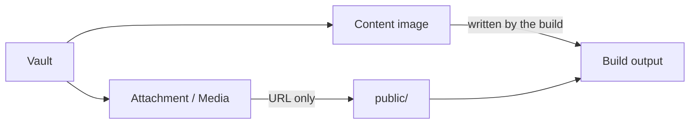

# Configuration

Create configuration with `defineConfig` and let the integration resolve it before content or plugins run. The required top-level field is `site`; optional sections are `content`, `markdown`, `theme`, and `plugins`.

```ts
import { defineConfig } from "@riebeckite/core";

export default defineConfig({
  site: { title: "My site", baseUrl: "https://example.com" },
  content: {
    directory: "content",
    exclude: ["drafts/**"],
    filters: { publishStrategy: "explicit" },
  },
  markdown: { syntaxHighlight: { theme: "github-dark" } },
  theme: { colorMode: "system", articleLayout: "article" },
  plugins: [],
});
```

## Navigation

Navigation is provided by the **`@riebeckite/plugin-navigation`** plugin, not by a top-level config section. The plugin produces a semantic model `{ primary, secondary }`, and the **Site shell renders and places it**. `primary` and `secondary` express prominence, not placement; there is no `header` or `footer` key.

```ts
import { defineConfig } from "@riebeckite/core";
import { navigation } from "@riebeckite/plugin-navigation";

export default defineConfig({
  site: { title: "My site", baseUrl: "https://example.com" },
  plugins: [navigation()],
});
```

### Zero-config derivation

Called with no arguments, the plugin derives `primary` links from the vault's **discoverable entries** (`manifest.discoverableEntries`: public and discoverable, excluding draft and non-routable content). It reuses existing Riebeckite information rather than a dedicated vault file:

- folder structure (a folder becomes a section, and nested folders become `children`)
- README / index resolution (an `index` or `README` note represents its folder and supplies the folder `href`)
- a folder without a README or index renders as a label with no link
- a root README or index never appears in the navigation
- page `title` (falling back to a formatted slug segment)
- `permalink`

It requires **no Riebeckite-specific vault file** (no `navigation.md`) and **no required frontmatter**.

Derivation follows the language being rendered. Using the language metadata written by the `l10n` plugin, entries that share a translation collapse into a single item and only the current language's `href` is used, so a page under `/ja/guide/` never mixes in `/en/...`. Vaults that do not use `l10n` keep deriving from every entry.

### Manual and supplementary links

Pass `items` to replace the derived `primary` links. Pass `secondary` for supplementary links the Site renders less prominently.

```ts
navigation({
  items: [
    { label: "Guide", href: "/guide" },
    {
      label: "Notes",
      href: "/notes/planning",
      children: [
        { label: "Planning", href: "/notes/planning" },
        { label: "Writing", href: "/notes/writing" },
      ],
    },
  ],
  secondary: [
    { label: "GitHub", href: "https://github.com/example/site", external: true },
  ],
});
```

### NavigationItem

Each link is a `NavigationItem`.

| Field | Type | Meaning |
| --- | --- | --- |
| `label` | `string` | Text shown for the link |
| `href` | `string` | Destination path or URL |
| `children` | `NavigationItem[]` | Child items, shown as a submenu |
| `external` | `boolean` | When `true`, opens in a new tab |

`label` and `href` are required on authored items. A derived folder group that has no index note renders as a label only, so `href` is optional in the derived model.

### Placement

The plugin does not decide placement; the Site shell does. In the reference Site, `primary` appears in the header and `secondary` in the footer. Some shells skip a `href: "/"` item because the site title already links home.

### Building submenus

Use `children` to nest navigation.

```ts
{
  label: "Notes",
  href: "/notes/planning",
  children: [
    { label: "Planning", href: "/notes/planning" },
    { label: "Writing", href: "/notes/writing" },
  ],
}
```

`children` render as a submenu.

### Linking to external sites

Add `external: true` for links to other sites.

```ts
{
  label: "GitHub",
  href: "https://github.com/example/site",
  external: true,
}
```

The link opens in a new tab and gets `rel="noreferrer"`.

### Marking the current page

The link for the page currently being viewed becomes active automatically.

For example, with:

```ts
{ label: "Guide", href: "/guide" }
```

the item is active on pages such as:

```text
/guide
/guide/getting-started
/en/guide
/en/guide/getting-started
```

Trailing slashes and a leading locale are normalized during matching, so you do not need to worry about differences such as `/guide/` and `/en/guide`.

An active link gets `aria-current="page"`.

An `href` that does not start with `/` (such as an external URL) and items with `external: true` are never treated as active.

### On mobile

On narrow viewports, the site navigation collapses into a `Menu` disclosure.

The content and HTML structure do not change; only the CSS presentation changes with viewport width.

### Validation

`navigation` options are validated while the plugin is loaded.

The main rules are:

- `label` is a non-empty string
- `href` is a non-empty string
- `external`, when present, is a boolean
- `children` must not contain an ancestor item

Invalid configuration fails while the plugin is loaded.

### Plugin pages are not added automatically

The plugin derives links from the vault's discoverable entries. It does not surface plugin-generated pages on its own.

For example, the following are not added automatically:

- Search
- Tag / Folder indexes
- Taxonomy pages
- Plugin page types
- Breadcrumbs
- Backlinks
- Related Posts
- Other content graph features

To show a page a plugin provides, add a link to that page in `navigation({ items })`.

For the division of responsibility between navigation and plugins, see [Customizing your site](../guides/customizing-your-site.md#navigation).

### Exported helpers and types

`@riebeckite/plugin-navigation` exports `navigation`, `buildNavigation`, `resolveSiteNavigation`, `NAVIGATION_PLUGIN_NAME`, and the types `NavigationItem`, `NavigationOptions`, and `SiteNavigation`.

## Content selection

`content.directory` selects the default filesystem location. Use `content.source` to provide a different `ContentSource`; do not configure two competing readers. `exclude` removes matching material before it becomes content. `filters.publishStrategy` controls the default publishing policy, and frontmatter can override the resolved publishing state.

### Publishing state

Publishing is resolved once in Core and exposed to plugins as two manifest views:

| View | Contains | Use for |
| --- | --- | --- |
| `manifest.publicEntries` | Routable entries: public and unlisted | page rendering and SSG paths |
| `manifest.discoverableEntries` | Public entries only | docs navigation, search, feeds, sitemap, taxonomy, graphs, backlinks, related/recent lists |

The default `publishStrategy` still applies when no explicit visibility is set.

| Frontmatter | Result |
| --- | --- |
| `visibility: public` | routable and discoverable |
| `visibility: unlisted` | routable by direct URL, but excluded from discovery surfaces |
| `visibility: draft` | not routable and not discoverable |
| `publishAt: 2026-01-01T00:00:00.000Z` | hidden before the build time, public on the first build after that time |
| no `visibility` / `publishAt` | falls back to `publishStrategy` (`explicit` requires `publish: true`; `selective` excludes `private: true` and `draft: true`) |

Malformed `visibility` or `publishAt` values fail the build instead of being guessed. Scheduled publishing is build-time only: Riebeckite does not start a runtime timer.

`exclude` is different from publishing. Excluded files never enter the content pipeline, so they are unavailable for links, metadata, graph analysis, and diagnostics. Draft, unlisted, and scheduled-before entries remain in the raw manifest for internal processing, but Core keeps them out of the route or discovery views according to the table above.

## Filesystem roots and external vaults

Riebeckite keeps the site application and its source material separate. The
following names describe different directories and must not be used
interchangeably:

| Name | Responsibility | Default / resolution base |
| --- | --- | --- |
| `appRoot` | The HonoX/Vite application: `app/`, `public/`, routes, generated styles, and build output configuration | Vite's `root` |
| `configRoot` | Directory containing `riebeckite.config.ts`, `.js`, or `.mjs` | `appRoot` |
| `contentRoot` | Absolute filesystem root for the configured content directory or Obsidian vault | `path.resolve(appRoot, content.directory)` |

`configRoot` determines where the config module is imported from. It does
**not** change the base for a relative `content.directory`: that base is always
`appRoot`. The integration resolves all three roots before running content or
plugins, and CLI commands reuse that result. Consequently, execution from a
nested directory, CI working directory, or editor task does not change which
vault is read.

### Recommended layout

Keep an Obsidian vault outside the site when it is used independently by
Obsidian, shared by multiple site applications, or stored in another Git
repository:

```text
workspace/
├─ site/
│  ├─ package.json
│  ├─ vite.config.ts
│  ├─ riebeckite.config.ts
│  ├─ app/
│  └─ public/
└─ vault/
   ├─ index.md
   ├─ notes/
   ├─ attachments/
   └─ media/
```

With this layout, the site configuration is explicit and portable:

```ts
// site/riebeckite.config.ts
import { defineConfig } from "@riebeckite/core";
import { attachment } from "@riebeckite/plugin-attachment";
import { media } from "@riebeckite/plugin-media";
import { obsidianMarkdown } from "@riebeckite/plugin-obsidian-markdown";

export default defineConfig({
  site: { title: "My notes" },
  content: {
    directory: "../vault",
    exclude: [".obsidian/**", "Templates/**"],
  },
  plugins: [obsidianMarkdown(), media(), attachment()],
});
```

An absolute `directory` is valid, but a relative path is normally easier to
move between developer machines and CI. Do not derive the value with
`process.cwd()`, and do not make `appRoot` point to the vault. The vault is
source data; Vite's application root must remain the site.

### Application-side content access

The HonoX integration resolves the content root automatically. An application
that constructs `ContentManager` for routes or islands must use the same
resolved absolute directory instead of the raw relative config value:

```ts
// site/app/config.ts
import path from "node:path";
import { fileURLToPath } from "node:url";
import { resolveConfigModule } from "@riebeckite/core";
import * as rawConfigModule from "../riebeckite.config";

const appRoot = fileURLToPath(new URL("../", import.meta.url));
const rawConfig = resolveConfigModule(rawConfigModule);

export const config = {
  ...rawConfig,
  content: {
    ...rawConfig.content,
    directory: path.resolve(appRoot, rawConfig.content.directory),
  },
};
```

Construct `ContentManager` with `config.content.directory` after this step. It
is already absolute, so resolving it against a second base is an error-prone
duplicate transformation. If `content.source` is configured, it replaces the
filesystem reader; do not use it as a second reader for the same vault.

### Attachments and media

An attachment or media file is a vault file that is **neither Markdown nor an
image**. Images in the vault are handled separately as content images, so keep
the two apart.

`obsidianMarkdown()` gives vault files logical paths relative to
`contentRoot`. For example, `![[attachments/report.pdf]]` is rendered by
`attachment()` and `![[media/interview.mp3]]` by `media()`. Their generated
URLs use this stable public shape:

```text
/assets/attachments/<logical-path-relative-to-the-vault>
```

`attachment()` reads the embedded file size from the resolved vault root and
rejects paths outside it. `media()` renders supported audio and video formats
using the same logical path.

### Asset URLs and published files

Generating a URL and publishing the file are two separate things. Assets fall
into three kinds, each published by a different owner:

|Kind|Subject|Public URL|Published by|
| --- | --- | --- | --- |
|Content image|An image in the vault|`/<logical-path-relative-to-the-vault>`|The Riebeckite build|
|Attachment / Media|A file that is neither Markdown nor an image|`/assets/attachments/<logical-path-relative-to-the-vault>`|The site application|
|Static asset|A file the site application owns|anywhere under `/`|Vite's `public/` directory|



#### Content images are published by the build

`obsidianMarkdown()` writes every image referenced from a public page as build
output. The image reaches the build output and is reachable through the
generated URL without any action from the site application, keeping its logical
path intact:

```text
assets/logo.png

↓

/assets/logo.png
```

During development the same logical path is served directly from the content
source. Images that nothing references, and images referenced only from
non-public pages, are not written.

#### Publishing attachments and media is the site's responsibility

For attachments and media, generating a URL does **not** copy the binary file
into the Vite public directory. The site application must copy only the assets
it intends to publish to `public/assets/attachments/`, preserving their logical
vault-relative paths. The reference application's
[`build_images.ts`](../../../../apps/web/scripts/build_images.ts) shows an
incremental, referenced-attachment-only implementation.

#### Static assets in `public/`

`public/` is where the site application keeps its own assets. Everything below
it is copied into the build output as-is. Keep it for site-owned files instead
of dumping every vault image or attachment there, so the published set stays
narrow.

### Vaults are not published wholesale

Do not copy the whole vault as a shortcut:

```text
vault/**
   ↓
public/**
```

That can expose private notes, images referenced only from non-public pages,
unreferenced attachments, and `.obsidian` metadata. The build emits images
referenced by published content. Attachment cards and audio/video embeds render
URLs under `/assets/attachments/<logical path>`, and the site application must
copy those files into `public/assets/attachments/` before build if you want them
served after deployment. See [Separate Content Repository](../guides/deployment/separate-content-repository.md#4-3-content-images-and-attachments-are-published-differently) for the detailed data flow.

### Verification and troubleshooting

Run the CLI from a nested application directory to prove that configuration is
not tied to the current working directory:

```sh
cd site/app
npm exec riebeckite check
npm exec riebeckite doctor
npm exec riebeckite inspect config
npm exec -- riebeckite inspect content --list
npm exec riebeckite build
```

Use the results in this order:

1. `check` validates the config and plugin contracts.
2. `doctor` reports an unreadable or invalid filesystem content source.
3. `inspect config` confirms the resolved directory.
4. `inspect content --list` confirms the expected logical paths before you
   diagnose a WikiLink or embed.
5. `build` verifies the integration and route rendering.

If `riebeckite.config.ts` intentionally lives outside the Vite application,
pass `configRoot` to `riebeckiteVite()`. Keep `appRoot` set to the site root and
keep relative `content.directory` values relative to that root.

## Plugins and themes

Plugins accept plugin inputs, including `false`, `null`, and `undefined` for conditional configuration. Resolution discards disabled/falsy inputs, orders enabled plugins stably, and checks capabilities. Theme input can be a raw theme config or a declared theme. Keep framework-specific configuration at the integration/application boundary.

Configuration errors are reported as `ConfigValidationError`; do not catch and hide them. Run `riebeckite check` after changes. Continue with [Plugin system](plugin-api.md) or [Theme system](theme-api.md) for their option contracts.
