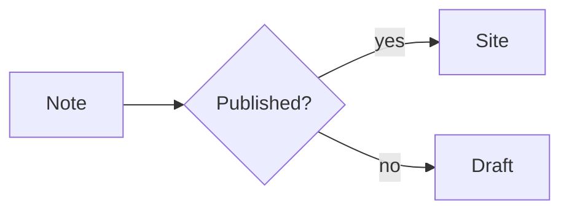
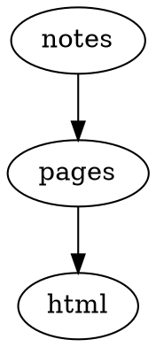

# Plugin Showcase

The plugin catalog lives in [Plugins](./README.md); this page shows what the plugins actually produce. Each section names the plugin, links to its package README, and gives a Markdown snippet.

The snippets are shown as fenced code so they read the same on GitHub and in a Riebeckite build. When this documentation is published as a Riebeckite site with the matching plugins enabled, the same source becomes a **live example** — the fence is the only thing between source and output.

> The generated `showcase` preset ships rendered examples, references, and local fixtures in a new site, so you can explore them locally right after `npx create-riebeckite --preset showcase`.

## Obsidian Markdown

### Callouts — [`obsidian-markdown`](../../../packages/plugins/obsidian-markdown/README.md)

A block quote with a `[!type]` marker becomes a styled callout panel.

````md
> [!tip] Try it
> A callout is a block quote with a `[!type]` marker. `[!info]`,
> `[!warning]`, and `[!question]` render the same way.
````

### WikiLinks and embeds — [`obsidian-markdown`](../../../packages/plugins/obsidian-markdown/README.md)

````md
Read the [[guide]] and [[index]] pages. `![[index]]` embeds the note inline.
````

## Code

### Code with a toolbar — [`code-enhance`](../../../packages/plugins/code-enhance/README.md)

Line numbers, a filename bar, line highlighting, and a copy button.

````md
```ts
// Syntax highlighting, line numbers, and a copy button
export function hello(name: string): string {
  return "Hello, " + name + "!";
}
```
````

### Code tabs — [`code-tabs`](../../../packages/plugins/code-tabs/README.md)

Adjacent `tab="..."` fences become one tabbed group; `syncTabs: true` keeps the same label in sync across groups.

````md
```ts tab="React"
const greeting = "Hello from React";
```

```js tab="Vanilla"
console.log("Hello from JavaScript");
```
````

## Diagrams and charts

### Mermaid — [`mermaid`](../../../packages/plugins/mermaid/README.md)

````md

````

### D2 — [`d2`](../../../packages/plugins/d2/README.md)

````md
```d2
site: Riebeckite
  content -> build -> deploy
```
````

### Graphviz / DOT — [`graphviz`](../../../packages/plugins/graphviz/README.md)

````md

````

### Chart.js — [`chartjs`](../../../packages/plugins/chartjs/README.md)

A `chart` JSON fence; the caption comes from the block `title`.

````md
```chart
{
  "type": "bar",
  "data": {
    "labels": ["Mon", "Tue", "Wed"],
    "datasets": [{ "label": "Visits", "data": [12, 19, 8] }]
  }
}
```
````

### Vega-Lite — [`vega-lite`](../../../packages/plugins/vega-lite/README.md)

````md
```vega-lite
{
  "title": "Revenue",
  "data": { "values": [{ "category": "A", "value": 28 }, { "category": "B", "value": 55 }] },
  "mark": "bar",
  "encoding": {
    "x": { "field": "category", "type": "nominal" },
    "y": { "field": "value", "type": "quantitative" }
  }
}
```
````

### WaveDrom — [`wavedrom`](../../../packages/plugins/wavedrom/README.md)

````md
```wavedrom
{ "signal": [
  { "name": "clk", "wave": "p......" },
  { "name": "bus", "wave": "x.34.5x", "data": "head body tail" }
] }
```
````

### Markmap — [`markmap`](../../../packages/plugins/markmap/README.md)

````md
```markmap
# Project

## Design

### Notation
### Rendering

## Delivery
```
````

### Marp slides — [`marp`](../../../packages/plugins/marp/README.md)

````md
```marp title="Intro deck"
# First slide

- a bullet

---

# Second slide
```
````

### Maps — [`map`](../../../packages/plugins/map/README.md)

A static fallback (coordinates and links) renders first, then upgrades to an interactive map when JavaScript is available.

````md
```map
center: 35.6812, 139.7671
zoom: 13
label: Tokyo Station
markers:
  - 35.6812, 139.7671 | Tokyo Station
  - 35.6586, 139.7454 | Tokyo Tower
```
````

### QR codes — [`qr-code`](../../../packages/plugins/qr-code/README.md)

Encoded entirely at build time, as inline SVG.

````md
```qr
# caption: Project page
https://example.com/
```
````

## Media

### Rich embeds — [`rich-embed`](../../../packages/plugins/rich-embed/README.md)

A URL becomes a YouTube, Vimeo, Spotify, CodePen, or Gist embed.

````md
```embed
https://www.youtube.com/watch?v=dQw4w9WgXcQ
title: Demo video
caption: A short caption
aspect: 16/9
```
````

### Gallery cards — [`gallery`](../../../packages/plugins/gallery/README.md)

````md
```gallery
columns: 3
items:
  - title: Default
    description: A clean, typographic theme.
    href: https://example.com/themes/default/
  - title: Minimal
    description: Stripped back to the essentials.
    href: https://example.com/themes/minimal/
  - title: Gruvbox
    description: A warm, high-contrast palette.
    href: https://example.com/themes/gruvbox/
```
````

## Knowledge and data

### Dataview — [`dataview`](../../../packages/plugins/dataview/README.md)

````md
```dataview
TABLE file.name AS "Name", status
FROM #project
WHERE status = "active"
SORT file.name asc
LIMIT 10
```
````

### Query — [`query`](../../../packages/plugins/query/README.md)

````md
```query
filter:
  tags:
    any: [diary]
sort:
  field: date
  order: desc
limit: 5
```
````

### Bases — [`bases`](../../../packages/plugins/bases/README.md)

````md
```base
filters:
  and:
    - file.hasTag("featured")
properties:
  file.name:
    displayName: Title
views:
  - type: table
    name: Featured
    limit: 10
```
````

### Kanban boards — [`kanban`](../../../packages/plugins/kanban/README.md)

A note whose body is `##` columns of task lists becomes a board.

````md
## Backlog

- [ ] Draft the release notes
- [ ] Link to [[index]]

## Done

- [x] Publish the fixture
````

## Features without a snippet

Some plugins are structural and cannot be shown with a single code fence. They are still part of the showcase experience:

| Plugin | What to look for |
| --- | --- |
| [`search`](../../../packages/plugins/search/README.md) | A search box that filters the site |
| [`toc`](../../../packages/plugins/toc/README.md) | A table of contents that follows the scroll position |
| [`backlinks`](../../../packages/plugins/backlinks/README.md) | A list of notes that link here |
| [`garden-explorer`](../../../packages/plugins/garden-explorer/README.md) | A graph and search explorer |
| [`taxonomy`](../../../packages/plugins/taxonomy/README.md) | Tag and folder listing pages |
| [`lightbox`](../../../packages/plugins/lightbox/README.md) | Click an image to zoom |
| [`diff`](../../../packages/plugins/diff/README.md) / [`changelog`](../../../packages/plugins/changelog/README.md) | Per-note git history |
| [`l10n`](../../../packages/plugins/l10n/README.md) | A language switcher on translated pages |
| [`color-mode`](../../../packages/plugins/color-mode/README.md) | A light / dark / system toggle |

## See also

- [Plugins](./README.md) — the full catalog
- [Writing a plugin](./writing-a-plugin.md) — build your own
- [Plugin API](../reference/plugin-api.md) — the contract these plugins share
