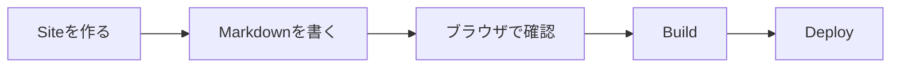
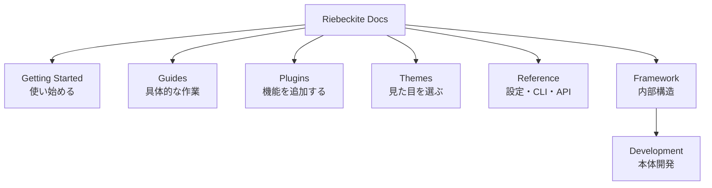
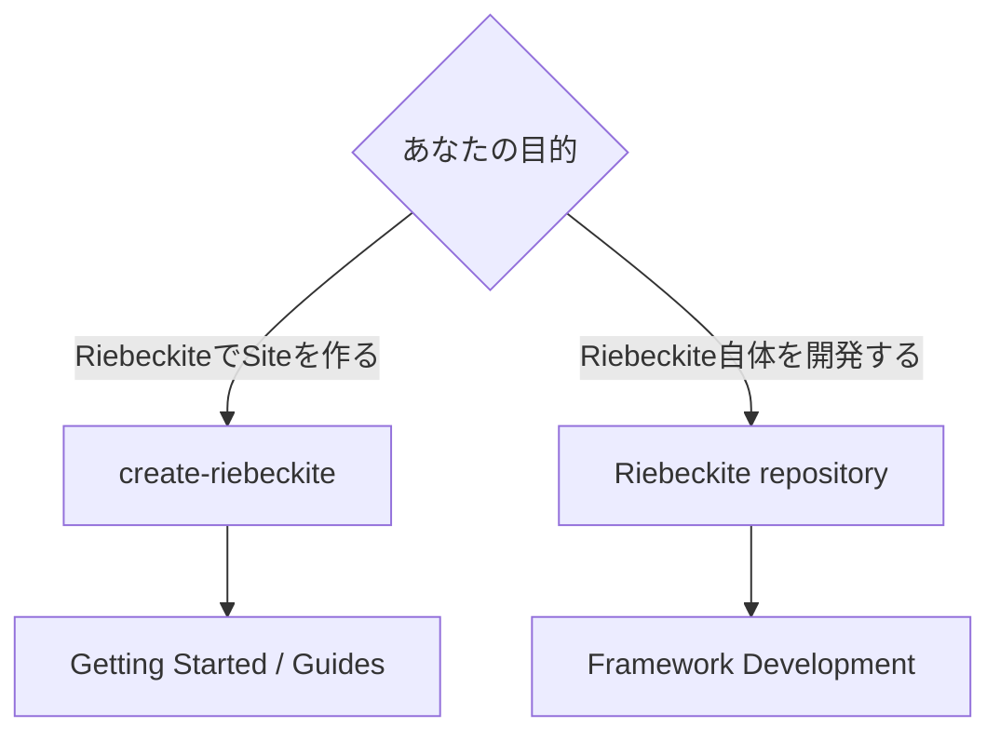
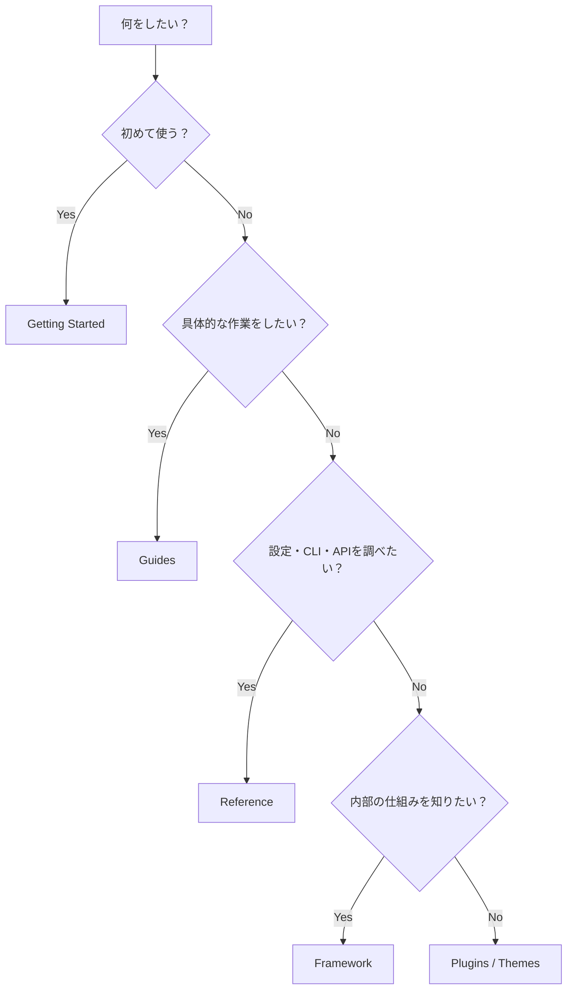

# Riebeckite ドキュメント

![[riebeckite-logo-horizontal.png]]

Riebeckite は、**Markdown や Obsidian のノートから公開サイトを作るためのフレームワーク**です。

Markdown を `content/` に置くだけのシンプルなサイトから、Plugin、Theme、多言語化、外部の Obsidian Vault を利用したサイトまで構築できます。

初めて使う場合は、Riebeckite のリポジトリを clone する必要はありません。

`create-riebeckite` から新しい Site を作成します。

## はじめる

基本的な流れは次のとおりです。



まず [Quick Start](./docs/getting-started/quick-start.md) から始めてください。

順番に進めたい場合は、

1. [Quick Start](./docs/getting-started/quick-start.md)
2. [Installation](./docs/getting-started/installation.md)
3. [First Content](./docs/getting-started/first-content.md)
4. [Presets](./docs/getting-started/presets.md)
5. [Deployment](./docs/getting-started/deployment.md)

の順で読めます。

## 基本的な使い方

Site を作成したら、基本的には次の流れで使います。

```text id="f2xd10"
create-riebeckite
      ↓
content/ に Markdown を書く
      ↓
riebeckite dev
      ↓
ブラウザで確認
      ↓
riebeckite build
      ↓
deploy
```

普段 Site を作るだけなら、Riebeckite 本体の内部構造を理解する必要はありません。

## 何をしたいですか？

目的に近いページから読めます。

| 目的 | 読むページ |
| --- | --- |
| 初めて Riebeckite を使う | [Quick Start](./docs/getting-started/quick-start.md) |
| インストール方法を確認する | [Installation](./docs/getting-started/installation.md) |
| 最初の記事を書く | [First Content](./docs/getting-started/first-content.md) |
| Site の構成を選ぶ | [Presets](./docs/getting-started/presets.md) |
| デプロイする | [Deployment](./docs/getting-started/deployment.md) |
| Deploy 先ごとの手順を確認する | [Deployment Guides](./docs/guides/deployment/README.md) |
| Markdown / Frontmatter の書き方を知る | [Writing Content](./docs/guides/writing-content.md) |
| Obsidian Vault を公開する | [Obsidian](./docs/guides/obsidian.md) |
| Content と Site を別 Repository にする | [Content Repositories](./docs/guides/content-repositories.md) |
| 多言語 Site を作る | [Localization](./docs/guides/localization.md) |
| Riebeckite を更新する | [Upgrading](./docs/guides/upgrading.md) |
| Plugin を探す | [Plugins](./docs/plugins/README.md) |
| Theme を選ぶ | [Themes](./docs/themes/README.md) |
| Accessibility の責任範囲を確認する | [Accessibility](./docs/accessibility.md) |
| Security / Trust Model を確認する | [Security Model](./docs/security.md) |
| 設定や CLI、Public API を調べる | [Reference](./docs/reference/README.md) |
| Riebeckite の内部構造を理解する | [Framework](./docs/framework/README.md) |
| Riebeckite 本体を開発する | [Framework Development](./docs/framework/development.md) |

## ドキュメントの構成

Riebeckite のドキュメントは、目的ごとに分かれています。



### Getting Started

初めて Riebeckite を使う人向けです。

Site の作成から最初の記事、Preset、Deployment までを扱います。

### Guides

具体的な目的を達成するための手順です。

たとえば、

- Obsidian Vault を使う
- Content Repository を分離する
- 多言語化する
- Riebeckite をアップグレードする
- 特定の環境へ Deploy する

といった作業を扱います。

### Plugins

Riebeckite に機能を追加する Plugin を探すためのページです。

記事表示、検索、Graph、Mermaid、Excalidraw など、必要な機能に応じて Plugin を追加できます。

### Themes

Site の見た目を変更する Theme を探すためのページです。

Theme を変更しても、Content や Plugin の機能そのものは変わりません。

### Reference

設定値、CLI Command、Public API を調べるための資料です。

「この設定は何を意味するのか」「この API は何を提供するのか」を確認したいときに利用します。

### Framework

Riebeckite の内部構造を理解したい人向けです。

Content System、Plugin System、Theme System、Build System、HonoX Integration などを説明します。

通常の Site 利用では読む必要はありません。

## Site を作る人と、本体を開発する人

Riebeckite には大きく2つの使い方があります。



### Site を作る場合

Riebeckite repository を clone しません。

`create-riebeckite` から始めます。

```text id="4s6dql"
create-riebeckite
      ↓
生成されたSite
      ↓
content/
      ↓
dev / build
      ↓
deploy
```

普段利用するのは、生成された Site 側です。

### Riebeckite 本体を開発する場合

Riebeckite 自体へ変更を加える場合だけ Repository を clone します。

この場合は、

- monorepo
- root の `pnpm` Command
- `packages/*`
- `apps/web`
- Framework Test
- External Site E2E

などを扱います。

詳しくは [Framework Development](./docs/framework/development.md) を参照してください。

`apps/web` は Riebeckite の Documentation / Reference Application であり、一般ユーザーが Site を作るための Template ではありません。

## 迷ったら

どこを読めばよいか分からない場合は、次の基準で選べます。



簡単に分けると、

```text id="84zv4s"
初めて使う
  → Getting Started

具体的な作業をする
  → Guides

機能や見た目を追加する
  → Plugins / Themes

設定・CLI・APIを調べる
  → Reference

内部構造を理解する
  → Framework

Riebeckite本体を変更する
  → Framework Development
```

です。

Coding Agent 向けの短い開発ルールは [agents](../agents/README.md) に分けています。

