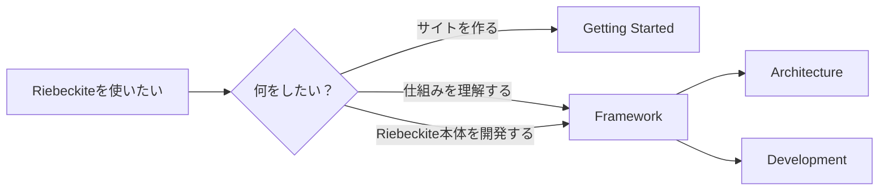
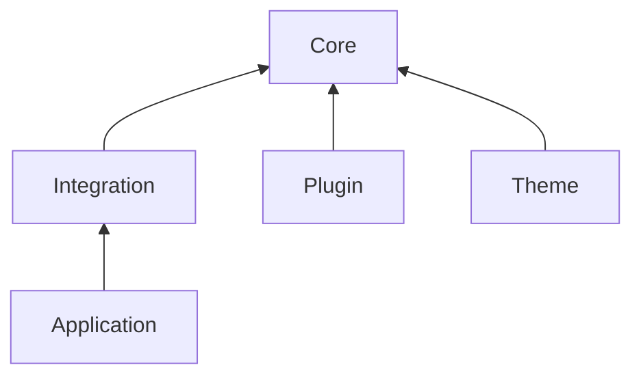

# Framework

この章では、**Riebeckite 自体がどのように動いているか**を説明します。

対象となるのは、

- Riebeckite の内部構造を理解したい人
- Plugin や Theme の仕組みを詳しく知りたい人
- Riebeckite 本体を開発・変更したい人

です。

Riebeckite を使って自分のサイトを作りたいだけなら、この章を最初から読む必要はありません。[Getting Started](../getting-started/README.md) から始めてください。



## どこから読む？

目的に合わせて、必要なページだけ読めます。

| 知りたいこと | ページ |
| --- | --- |
| Riebeckite 全体の構造 | [Architecture](./architecture.md) |
| Markdown や Content がどう処理されるか | [Content System](./content-system.md) |
| Plugin がどう動くか | [Plugin System](./plugin-system.md) |
| Plugin が独立したページを提供する仕組み | [Page System](./page-system.md) |
| Theme が見た目を変更する仕組み | [Theme System](./theme-system.md) |
| Build と Incremental Build の仕組み | [Build System](./build-system.md) |
| Riebeckite と HonoX / Vite の接続 | [HonoX Integration](./honox-integration.md) |
| 設定や Content の問題を調べる | [Diagnostics](./diagnostics.md) |
| 解決済みの設定や状態を確認する | [Inspector](./inspector.md) |
| Log / Trace / Performance を調べる | [Observability](./observability.md) |
| Riebeckite のテストを書く・実行する | [Testing](./testing.md) |
| Riebeckite 本体を開発する | [Development](./development.md) |

## 最初に内部構造を理解したい場合

まず [Architecture](./architecture.md) を読むのがおすすめです。

Riebeckite は大きく、



という責務に分かれています。

Architecture を読んだあと、変更したい領域に応じて Content System、Plugin System、Theme System などへ進むと理解しやすくなります。

## Riebeckite 本体を開発する場合

Riebeckite repository を clone して Framework 自体を変更する場合は、[Development](./development.md) を参照してください。

Development では、

- monorepo の clone
- `pnpm install`
- root の `pnpm` コマンド
- `packages/*` の構成
- `apps/web`
- Package ごとのテスト
- Scaffold / External Site の検証

などを扱います。

```text
Riebeckite repository 自体を開発する
    → Framework / Development

Riebeckite を使ってサイトを作る
    → Getting Started
```

`apps/web` は Riebeckite の Documentation / Reference Application です。

一般ユーザーが Riebeckite を使うために `apps/web` をコピーしたり、Riebeckite monorepo を clone したりする必要はありません。

## この章の境界

Framework 章では、Riebeckite の**内部設計と Framework 開発**を扱います。

一方、

- Site の作成
- Content の追加
- Plugin / Theme の設定
- Deploy

といった通常の利用方法は [Getting Started](../getting-started/README.md) や Guides で説明します。

この境界を分けることで、Riebeckite を使うだけの人が Framework 内部の知識を覚えなくてもサイトを作れるようにしています。
