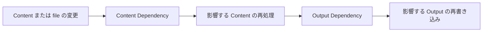

# Build Dependency Contract

Incremental Build の無効化は Core の責務です。Plugin はどの Content が影響を受けるかを計算せず、依存 state も自分では持ちません。契約を宣言すると、何を再利用するかは Core が決めます。

Plugin が関わる契約は、Content Dependency と Output Dependency の二つです。前者は `processedContentCache` で、Core がどの source Content を処理し直すかを決めます。後者は `outputDependencies` と `context.output.emit` で、Core がどの出力ファイルを書き直すかを決めます。両者は独立した契約です。

## Content Dependency

`processedContentCache` は、Plugin の処理済み Content を Build 間でどう再利用してよいかを示す契約です。

| `dependencyMode` | 意味 |
| --- | --- |
| `none` | 処理結果が source Content、frontmatter、Plugin の options、宣言した version だけに依存する。 |
| `tracked` | 他の Content や file を Core 経由で読む。Core がその読み取りを記録し、利用側だけを再処理する。 |
| `unsafe` | Git、network、時刻、process state など、Core が観測できない入力に依存する。永続的な再利用は行わない。 |

Content を変化させる Plugin が契約を宣言していない場合、その Plugin は `unsafe` 扱いです。

`version` は契約の名前です。Core は解決済みの Plugin 設定も cache key に含めます。そのため、options、hooks、version のいずれかを変えると、cache された entry は無効です。

### Core が記録する入力

Core の Content API 経由の読み取りが、安定した identity を持つ dependency になります。

| 種類 | 記録される場面 | identity |
| --- | --- | --- |
| `content` | `readContent`、`renderContent`、`renderNoteEmbed` | Content の slug |
| `file` | `contentSource.read` と `readContentSourceEntry` などの helper | file path |
| `link` | link 先が permalink に解決されたとき | link id |

`contentSource.scan()` は entry を列挙するだけで dependency を作りません。filesystem、network、時計への直接アクセスは Core から見えないため、それらの入力は `unsafe` です。

### 再利用と検証

次の Build で Core は、cache された処理済み Content を取り出したあと、記録した content、file、link の dependency をすべて読み直し、fingerprint を比べます。一つでも変わっていれば、その entry を捨てて処理し直します。

cache が省略するのは Markdown と HTML の処理だけです。post 処理の hooks（`onPostParsed`、`onPostProcessed`）と manifest の hook（`onManifestCreated`）は、cache の有無にかかわらず常に実行対象です。manifest 段階の処理はそこに置いてください。

### 影響範囲の決定

Core は各 entry の dependency identity を build state に永続化し、そこから逆引き index を作ります。dependency が変わると、依存する entry に印を付け、さらにその依存先へと無効化を伝播させます。Content が追加または削除された場合も、変わった link 先を参照していた entry は無効です。初回 Build や前回の state が無いときは、すべての note を処理します。

## Output Dependency

Output Dependency は Content Dependency とは別の契約です。種類ごとに、change set の異なる部分に反応します。

| 種類 | 影響を受ける条件 |
| --- | --- |
| `content { slug }` | その Content が変わったとき |
| `tag { tag }` | その tag を持つ Content が変わったとき |
| `folder { folder }` | その folder の Content が変わったとき |
| `global` | いずれかの Content が変わったとき |
| `unknown` | 常に。Core は全 Output の再生成も要求する。 |

宣言する場所は三つです。

| 対象 | 宣言場所 |
| --- | --- |
| Plugin page | `pageTypes[].outputDependencies` |
| manifest entry HTML を更新する Plugin | root の `outputDependencies`。Core がすべての Content Output に加算する。 |
| 生成 output | `context.output.emit(..., { dependencies })`。未宣言なら `unknown`。 |

対象が特定できる場合は `content`、`tag`、`folder` を使ってください。manifest 全体に依存する集合変換は `global` です。表現できない入力だけに `unknown` を使います。

## Plugin 作者向けのルール

- Content を変化させる Plugin はすべて `processedContentCache` を宣言します。
- 他の Content や file は Core の API 経由でのみ読み、dependency として記録させます。
- Content map を持ったり、vault を再走査したり、Plugin 固有の incremental state を保存したりしません。
- 観測できない入力がある場合は `unsafe` を使います。広い再処理は許容できますが、古い結果の再利用は許容できません。
- manifest 段階の変更と生成 output には Output Dependency を宣言します。

正確な field は [Plugin API](../reference/plugin-api.md)、Build lifecycle は [Build System](./build-system.md) を参照してください。
