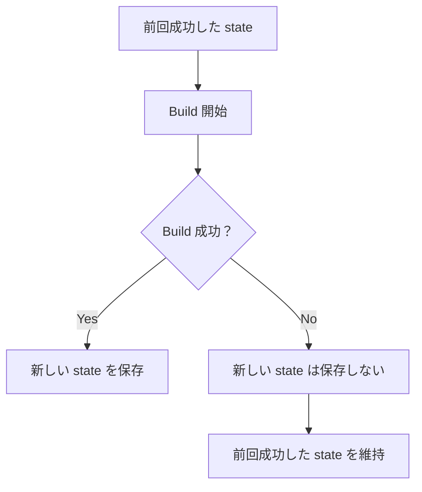
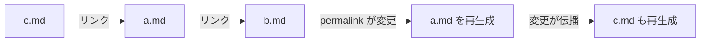

# Build System

Riebeckite の Build System は、コンテンツと設定を読み込み、プラグインによる変換を適用し、最終的なWebサイトを生成する仕組みです。

通常の build では、大きく次の処理が行われます。

1. 設定とプラグインを読み込む
2. Markdown などのコンテンツを読み込む
3. プラグインの pipeline や hooks を実行する
4. 公開するコンテンツやリンク関係を解決する
5. manifest や content graph を生成する
6. 必要なアセットや client entry を生成する
7. HonoX application を build する

Riebeckite は、前回の build 結果を利用して必要な部分だけを処理する **incremental build** にも対応しています。

## Build の流れ

明示的に build を実行すると、まず Riebeckite が config と plugin を解決します。

その後、Content Source からコンテンツを読み込み、設定された pipeline と hooks を実行します。

ここでは Markdown の変換だけでなく、たとえば次のような情報も解決されます。

- 公開されるコンテンツ
- 各コンテンツの公開パス
- コンテンツ同士のリンク
- 使用されるアセット
- プラグインが提供するページや出力

これらをもとに manifest や content graph、アセット、client entry などを生成します。

最後に HonoX integration が、Riebeckite の生成した entry を含めて application 全体を build します。

## Incremental Build

毎回すべてのコンテンツを処理すると、サイトが大きくなるほど build に時間がかかります。

そこで Riebeckite は、前回の build から変更された部分を判断し、再処理が必要なコンテンツだけを更新できるようにしています。

このために使用する情報が **incremental state** です。

state は application ごとの次のファイルに保存されます。

```text
.riebeckite/build/content-state.json
```

ただし、この state はあくまで build を高速化するための情報です。

**サイトの正しさを state に依存させてはいけません。**

たとえば、

- state が存在しない
- state の形式が現在のバージョンと互換性がない
- 前回の情報を安全に再利用できない

といった場合、Riebeckite は incremental build に固執せず、必要な処理を最初から実行します。

### Full Build

incremental state を使わず、明示的にすべてを処理したい場合は `--full` を使用します。

```sh
pnpm exec riebeckite build --full
```

これは、incremental build の結果に問題がありそうな場合の確認や、build performance の比較などにも利用できます。

### Build に失敗した場合

incremental state は **build が正常に完了した場合だけ更新されます**。

たとえば新しい build が途中で失敗しても、



という動作になります。

失敗した build の途中状態で、正常だった state を上書きすることはありません。

## 変更をどう検出するか

Riebeckite は Content Source が提供する metadata を利用して、コンテンツが変更されたかを判断します。

たとえば次の情報があります。

- `mtime`
- ファイルサイズ
- ETag
- hash

ただし、`mtime` だけを「変更されていないこと」の保証として扱ってはいけません。

Content Source が提供できる情報を使って、安全に再利用できるかを判断します。

## 依存関係の変更

あるファイル自体が変更されていなくても、そのファイルが参照しているものが変更されれば再生成が必要になる場合があります。

たとえば `a.md` が `b.md` へリンクしているとします。



ここで `b.md` の permalink が変更されると、`a.md` 自体が変更されていなくても、`a.md` 内のリンクを更新する必要があります。

そのため incremental state には、各 entry の fingerprint だけでなく依存関係も記録します。

依存関係には、たとえば次のような情報があります。

- リンク先コンテンツの permalink
- 参照しているアセットの metadata
- entry の生成結果に影響するその他の情報

依存先が変更された場合は、その影響を受ける entry も無効化して再生成します。

さらに、その entry に依存している別の entry があれば、必要に応じて変更を伝播させます。

### コンテンツの追加・削除

コンテンツの追加や削除は、単純なファイル変更より影響範囲が大きくなる場合があります。

たとえば新しい note が追加されると、それまで解決できなかった Wikiリンクが突然解決できるようになります。

追加・削除でリンク先の解決結果が変わると、そのリンク先を参照している entry も無効化の対象になります。初回 build や前回の state が無い場合だけ、すべての note が再生成されます。

## Plugin Cache

Plugin Cache は incremental state とは別の仕組みです。

プラグインが build 中の計算結果などを再利用したい場合に使用します。

Plugin Cache は次の性質を持ちます。

- plugin ごとに分離される
- JSON として保存できるデータを扱う
- 削除されても再生成できる
- build-time の最適化として利用する

つまり、Plugin Cache がなくなってもサイトを正しく build できる必要があります。

また、incremental state と Plugin Cache のどちらも、Workers runtime から変更される実行時データとして使用してはいけません。

## `.riebeckite` ディレクトリ

`.riebeckite` には、incremental state など Riebeckite が build 時に使用するデータが保存されます。

これはユーザーのコンテンツではありません。

そのため Content Source がコンテンツを探索するとき、`.riebeckite` は scan の対象外になります。

## Build 関連のコマンド

通常のプロジェクト build:

```sh
pnpm build
```

Riebeckite の content/application build:

```sh
pnpm exec riebeckite build
```

incremental state を再利用しない full build:

```sh
pnpm exec riebeckite build --full
```

full build の performance を確認する場合:

```sh
pnpm exec riebeckite profile --full
```

### Build とその他のコマンドの違い

`check`、`doctor`、`inspect` は build とは役割が異なります。

| コマンド | 主な役割 |
| --- | --- |
| `build` | コンテンツと application を build する |
| `build --full` | incremental state を再利用せず build する |
| `profile` | build の performance を調べる |
| `check` | 設定や plugin の構成を検証する |
| `doctor` | プロジェクトの health を診断する |
| `inspect` | 既存の state や解決済み情報を確認する |

`check` や `doctor` が成功しても、実際の build が成功することを完全に保証するものではありません。

また、`inspect` は既存の state を確認するためのコマンドです。state を作る目的では使用しません。

詳しいコマンドについては [CLI](../reference/cli.md)、状態の確認については [Inspector](inspector.md)、コンテンツの読み込みと解決については [Content system](content-system.md) を参照してください。

## Build System を変更するときのルール

Build System や Plugin から新しい生成物を追加するときは、「誰がその出力を管理するのか」を明確にしてください。

特に次の点を意識します。

- 生成物の所有者を明確にする
- 古い生成物をいつ削除するか決める
- validation や inspect から暗黙的にファイルを書き換えない
- cache key に結果へ影響する version や input を含める
- 安全性を確認できない cache や state は再利用しない
- 再利用できない場合は full build にフォールバックする
- build の失敗を確認できる形で報告する
- 新しい state が有効だと確認できるまで、以前の成功 state を削除しない

基本原則は、**高速化よりも build の正しさを優先すること**です。

incremental state や Plugin Cache は build を高速化するための仕組みであり、それらが存在しなくても同じ正しいサイトを生成できるようにしてください。
