# Content System

Content System は、Markdown や画像などのファイルを、Riebeckite がサイトとして扱えるコンテンツへ変換する仕組みです。

単に Markdown を HTML に変換するだけではありません。

Riebeckite が、

- このファイルは何の記事なのか
- 公開してよいのか
- どの URL で公開するのか
- 他の記事とどうつながっているのか
- Plugin によって何が追加・変更されたのか

を解決し、Site 全体から同じ情報を利用できる状態にします。

# 全体の流れ

Content System の大まかな流れは次のとおりです。

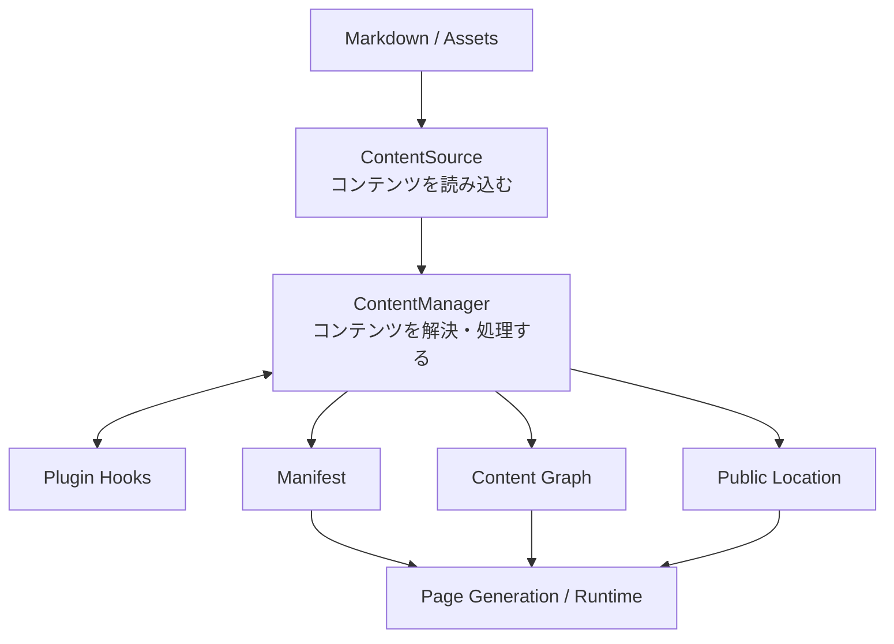

中心になるのが `ContentSource` と `ContentManager` です。

簡単に言えば、

```text id="a4xsh7"
ContentSource
  = どこからコンテンツを読むか

ContentManager
  = 読み込んだコンテンツをどう扱うか
```

という役割分担です。

# ContentSource

`ContentSource` は、Markdown やアセットを**どこから、どう読み込むか**を抽象化した API です。

通常は、

```text id="9u1ygf"
content/
```

のような `content.directory` で指定されたディレクトリから読み込みます。

しかし Content System 自体は、コンテンツが必ず Site repository 内に存在するとは考えません。

たとえば、

```text id="eynh5j"
Site Repository
└─ content/

External Repository
└─ notes/

Obsidian Vault
└─ notes/
```

のどこから取得した場合でも、最終的には `ContentSource` という同じ interface を通して ContentManager に渡します。

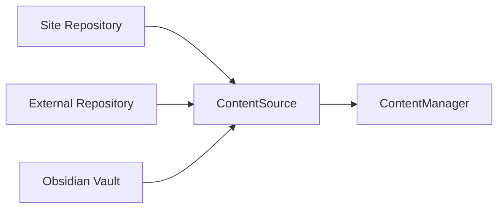

これにより、コンテンツの保存場所が変わっても、それ以降の処理を同じ仕組みで扱えます。

## 3種類の「場所」

Content System を理解するときに重要なのが、次の3つを区別することです。

| 種類 | 意味 |
| --- | --- |
| ファイルシステム上のパス | 実際にファイルが保存されている場所 |
| 論理パス | content root から見たコンテンツの識別子 |
| 公開先 | Web Site 上の URL |

たとえば、

```text id="dfblcr"
C:\projects\garden\content\posts\hello.md
```

というファイルがあったとしても、Riebeckite 内部では、

```text id="ej2j1k"
posts/hello.md
```

という論理パスとして扱えます。

さらに、実際の公開先は、

```text id="dkv7ak"
/blog/hello/
```

かもしれません。

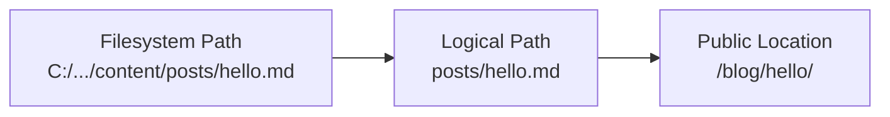

この3つを分離することで、content repository を別の repository に移しても、Site 側の URL やコンテンツ処理を同じ規則で扱えます。

# ContentManager

`ContentManager` は `ContentSource` から受け取ったコンテンツを管理し、Site で利用できる状態へ変換します。

主な役割は次のとおりです。

- Markdown の frontmatter と本文を読み込む
- コンテンツを公開するか判断する
- slug、permalink、content ID を整理する
- Plugin hooks を実行する
- 公開先を解決する
- Manifest を生成する
- Content Graph を生成する
- Query 用の index を用意する

つまり ContentManager は、Content System の中心となる orchestrator です。

## Plugin が処理に参加する

Plugin は ContentManager の lifecycle に hook できます。

代表的な hook には、

```text id="l0z0fr"
onContentLoaded
onPostParsed
onPostProcessed
onManifestCreated
```

などがあります。

概念的には次のような流れになります。

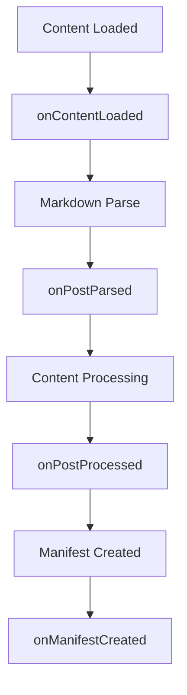

Plugin はこの lifecycle を利用してコンテンツを拡張します。

# slug / permalink / content ID

この3つは似ていますが、役割が異なります。

| 名前 | 何を表す？ | 例 |
| --- | --- | --- |
| `slug` | コンテンツの短い名前 | `hello-world` |
| `permalink` | Site 上の公開 URL | `/blog/hello-world/` |
| content ID | コンテンツそのものを安定して識別する ID | `article-01` |

特に重要なのは、**slug と公開 URL は同じものではない**という点です。

たとえば、

```text id="73lmb5"
slug
  hello-world

permalink
  /blog/hello-world/

content ID
  019abc...
```

のように、それぞれ別の目的を持ちます。

## Default Public Location

標準では `resolveDefaultContentLocation` が公開先を解決します。

基本的には、

```text id="olpxjg"
index
  ↓
/

その他
  ↓
/{slug}
```

として扱います。

ただし、これはあくまで default resolver です。

Plugin は、

```text id="sc5pbi"
resolveContentLocations
```

hook を使って公開先を追加・変更できます。

# ContentPublicLocation

`ContentPublicLocation` は、コンテンツが **Site 上のどこで公開されるか** を表します。

通常は1つの記事に1つの canonical な公開先があります。

```text id="ul2l2c"
Article
   ↓
/blog/article/
```

しかし Plugin によって、別名 URL や redirect が追加される場合があります。

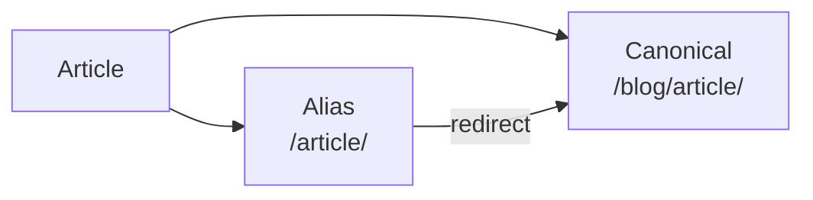

公開先はページ生成だけで使う情報ではありません。

たとえば、

- Site 内リンク
- redirect
- sitemap
- search index
- language switcher
- Content Graph

なども公開先を参照します。

そのため Riebeckite では URL を単なる文字列として各機能が独自に計算するのではなく、`ContentPublicLocation` として明示的に管理します。

# Manifest

Manifest は、**Build 時に確定したコンテンツの一覧**です。

各 entry には、たとえば次の情報が含まれます。

- 論理パス
- metadata
- 公開先
- Plugin による処理結果
- incremental build に必要な情報

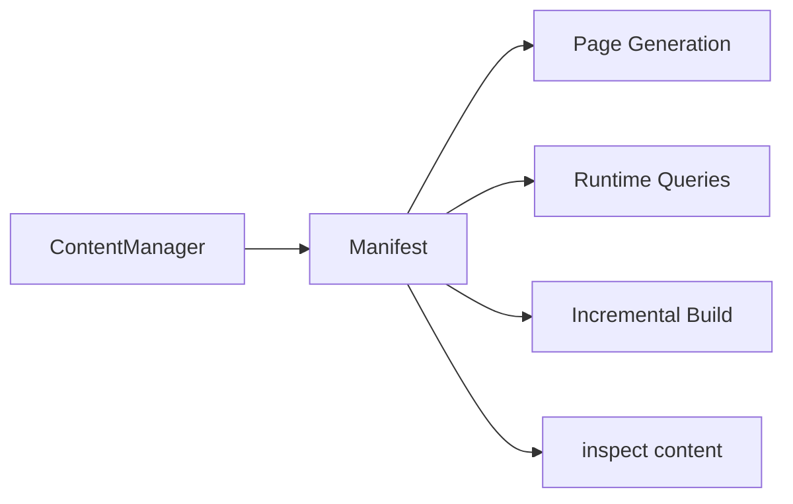

Manifest は、Content System が解決した結果を他の仕組みへ渡す重要な境界です。

各 consumer が Markdown を読み直して同じ情報を再計算するのではなく、解決済みの Manifest を利用します。

# Content Graph

Content Graph は、コンテンツ同士の関係を表します。

たとえば、

```markdown id="9o2p6a"
[[Article B]]
```

という WikiLink があれば、

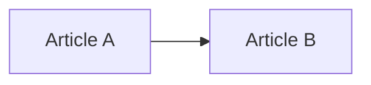

という関係を持つことができます。

この情報から backlink も扱えます。

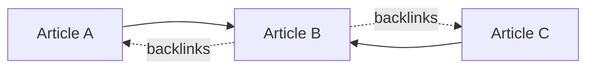

Content Graph は単なるグラフ表示用のデータではありません。

たとえば、

- WikiLink
- Markdown link
- backlinks
- taxonomy
- series
- related posts
- local graph
- garden explorer

などの基盤として利用できます。

Plugin は、

```text id="g5uz6h"
extendContentGraph
```

を使ってグラフへ情報を追加できます。

# Content Queries

Build 後のコンテンツを検索・整理するために、Query API が用意されています。

代表的な API は次のとおりです。

```text id="5yib25"
queryContentEntries
queryContentPage
groupContentEntries
```

重要なのは、これらが**ファイルを検索する API ではない**という点です。

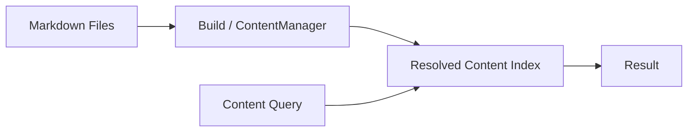

Query は、Build 時にすでに解決された index に対して実行します。

Runtime や Plugin が Markdown を直接読み直して独自に状態を再構築することは避けます。

# Content Collections

`buildContentCollections` は、複数のコンテンツを一覧として扱うための仕組みです。

たとえば、

```text id="63ph8a"
すべての記事
     ↓
日付順に並べる
     ↓
タグごとに分類する
     ↓
ページ単位に分割する
```

といった処理に利用できます。

`pageSize` を指定すると pagination も扱えます。

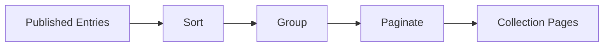

Plugin や Site Application は、この仕組みを使って記事一覧、タグ一覧などを作成できます。

# Assets

画像や添付ファイルは Markdown 本文とは別の entry として扱います。

たとえば、

```text id="0yuczl"
content/
├─ article.md
└─ images/
   └─ example.png
```

があった場合、Riebeckite はアセットの論理パスを保ちながら、Site 上で利用できる URL へ対応付けます。

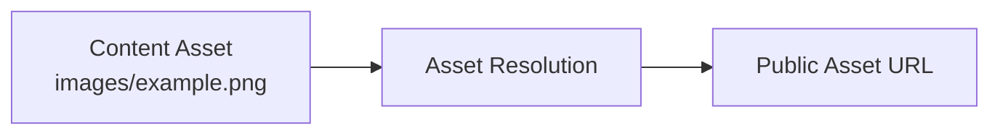

実際の URL 形式は Plugin や設定によって変わる場合があります。

重要なのは、content root の外にある任意のファイルを公開 URL に変換しないことです。

Content System の公開境界を通して、安全に公開対象を決定します。

# Content Repository を分離する場合

Site と Content を別 repository にしても、Content System の基本的な流れは変わりません。

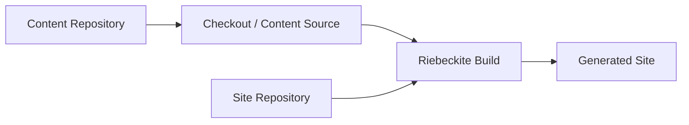

Content Repository はコンテンツを提供します。

最終的に、

- 何を公開するか
- どの Plugin を使うか
- どの URL で公開するか
- どの Site を生成するか

を決定するのは Site Repository 側の Build です。

このため、Content Repository が分離されていても ContentManager や Plugin が filesystem の配置を特別扱いする必要はありません。

# Content System の境界

Content System を変更するときは、次の原則を維持してください。

| 原則 | 理由 |
| --- | --- |
| `content.directory` は `appRoot` 基準で解決する | Site ごとに安定した基準を持つため |
| Plugin は filesystem path に依存しない | Content Source を交換可能にするため |
| 公開判定は `publishStrategy` と frontmatter に従う | 公開境界を一元化するため |
| 公開先は `ContentPublicLocation` として登録する | URL を各機能が独自計算しないため |
| Runtime は Build 済み index を利用する | Runtime から source filesystem を分離するため |
| Site Build が最終的な公開状態を決める | Content Repository と Site の責務を分離するため |

全体として重要なのは、

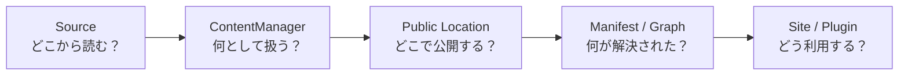

という境界を崩さないことです。

**Source は読み込み方、ContentManager はコンテンツの解決、Public Location は公開先、Manifest / Graph は解決結果を表します。**

各機能が filesystem や Markdown を独自に読み直すのではなく、この Content System を通して同じ解決結果を共有することが、Riebeckite の Content Architecture の基本です。

## 関連ページ

- [Configuration](../reference/configuration.md)
- [Plugin API](../reference/plugin-api.md)
- [Content Repositories](../guides/content-repositories.md)
- [Separate Content Repository](../guides/deployment/separate-content-repository.md)
