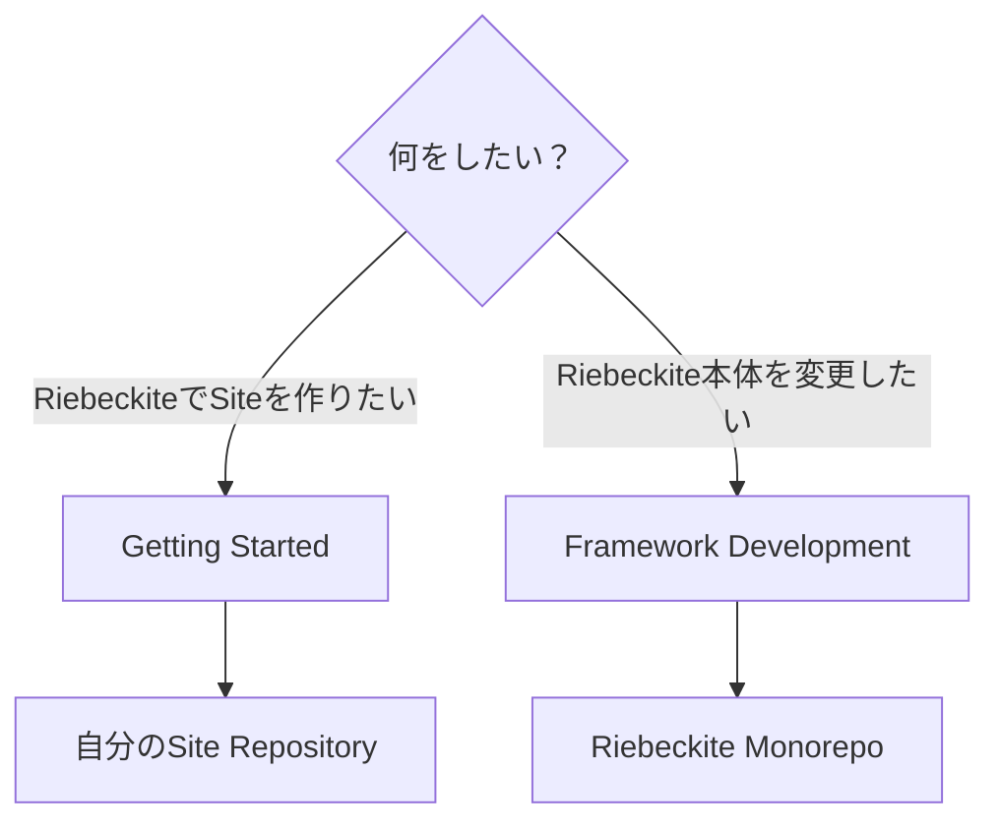
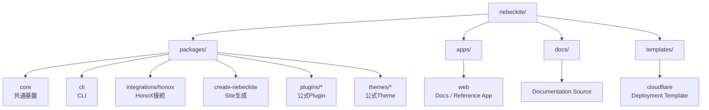
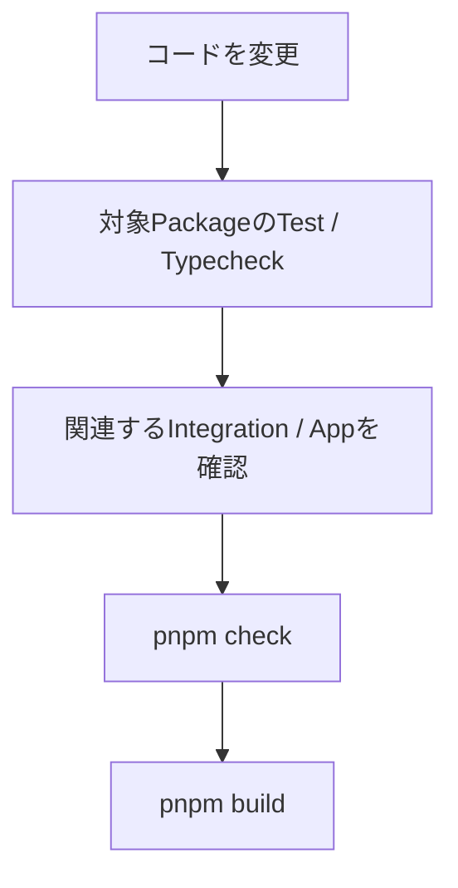
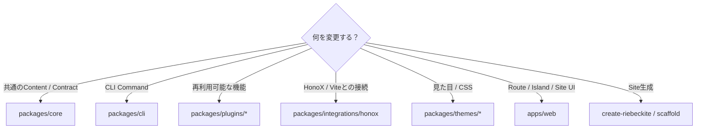
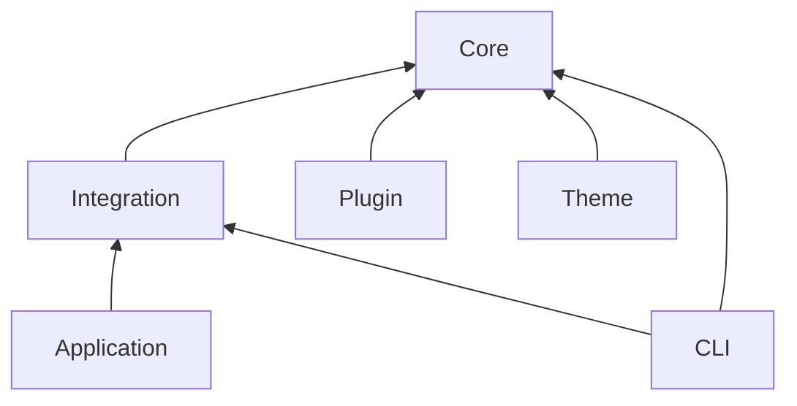
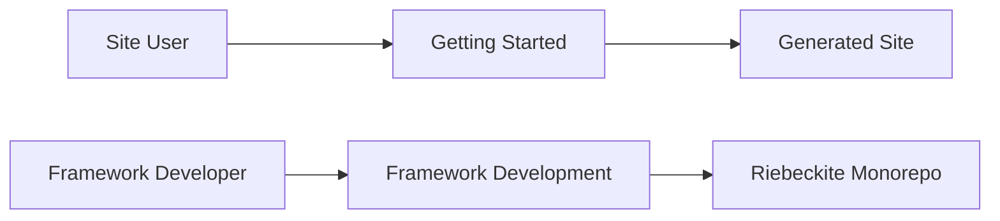

# Framework Development

このページは、**Riebeckite 本体を開発する人向け**のガイドです。

次のような変更を行う場合に、この monorepo を使用します。

- Core の機能を追加・変更する
- CLI を変更する
- HonoX Integration を変更する
- 公式 Plugin / Theme を開発する
- Site scaffold や template を変更する
- 公式ドキュメントや参照アプリを変更する

単に Riebeckite を使って自分の Site を作りたい場合は、**この repository を clone する必要はありません。**

[Getting Started](../getting-started/README.md) から Site を作成してください。



# 開発を始める

Riebeckite 本体を開発する場合は、repository を clone して依存関係をインストールします。

```bash id="vmx4gu"
git clone https://github.com/rerurate/riebeckite.git
cd riebeckite
pnpm install
pnpm build
```

これで workspace 内の package を開発できる状態になります。

## 開発サーバーを起動する

```bash id="kueg3z"
pnpm dev
```

`apps/web` の参照アプリを使って、Riebeckite の変更を実際の Site として確認できます。

`apps/web` は単なるデモではなく、Framework 開発時に Core、Plugin、Theme、Integration が正しく組み合わさることを確認するための参照アプリでもあります。

# Repository の構成

Riebeckite は pnpm workspace を使った monorepo です。

大きく次のように分かれています。



| Path | 役割 |
| --- | --- |
| `packages/core` | config、content、pipeline、Plugin、Theme、Diagnostics、Observability などの共通基盤 |
| `packages/cli` | `riebeckite` CLI |
| `packages/integrations/honox` | HonoX / Vite Integration と scaffold generator |
| `packages/create-riebeckite` | Site 作成用の公開 entrypoint |
| `packages/plugins/*` | 公式 Plugin |
| `packages/themes/*` | 公式 Theme |
| `apps/web` | 公式ドキュメント Site兼、Framework 開発用の参照アプリ |
| `docs/` | 公式ドキュメントの source |
| `templates/cloudflare` | Deployment template |

各 package の詳しい責務については [Architecture](./architecture.md) を参照してください。

# よく使うコマンド

Framework 開発でよく使用するコマンドは次のとおりです。

| コマンド | 用途 |
| --- | --- |
| `pnpm dev` | 開発用 Site を起動する |
| `pnpm build` | workspace を build する |
| `pnpm check` | repository 全体を検査する |
| `pnpm test` | test を実行する |
| `pnpm typecheck` | TypeScript の型を検査する |
| `pnpm check:docs` | Documentation を検査する |
| `pnpm check:scaffold` | 生成される Site を検査する |

## Documentation を変更した場合

```bash id="2wm0wz"
pnpm check:docs
```

Markdown link や Documentation の構造を検査します。

ドキュメントを追加・移動・削除した場合は実行してください。

## Scaffold を変更した場合

```bash id="5xutky"
pnpm check:scaffold
```

生成される Riebeckite Site が正しい構成になっているかを検査します。

たとえば、

- scaffold generator
- preset
- template
- 生成される `package.json`
- Site の初期構成

などを変更した場合に重要です。

## Package の型を確認する

```bash id="hlsudn"
pnpm typecheck
```

TypeScript の型エラーを確認します。

## 特定 Package の Test

変更した package だけを確認したい場合は `--filter` を使用できます。

```bash id="6s8dyj"
pnpm --filter <package> test
```

たとえば特定の Plugin だけを変更した場合、最初から repository 全体の test を実行するのではなく、対象 package の test から確認できます。

# 変更するときの基本的な流れ

変更内容によって必要な検証は異なりますが、基本的には **小さい範囲から確認して、最後に広い範囲を確認する** 形を推奨します。



たとえば Plugin を変更した場合は、まずその Plugin の test を実行します。

```bash id="9dvfqe"
pnpm --filter <plugin-package> test
```

問題がなければ、必要に応じて型検査や参照アプリを確認し、最後に repository 全体の検証を行います。

変更のたびに最初から最も重い command を実行する必要はありません。

# どこを変更するか

機能を追加するときは、まず責務に合った package を選びます。



判断に迷う場合は、[Architecture](./architecture.md) の責務分離を基準にしてください。

# Package の境界

Framework を変更するときは package 間の依存方向を維持してください。

大まかな依存関係は次のようになります。



特に Core から外側への逆依存を作らないことが重要です。

たとえば Core から、

```text id="7nxphg"
apps/web
packages/plugins/*
HonoX
Vite
```

などの具体的な実装へ依存させてはいけません。

Framework に依存しない contract は Core に置き、その contract を Integration や Plugin が利用します。

# Public API を使う

外部 Plugin / Theme と同じ条件で利用できる API は、公開 export から参照してください。

たとえば、

```ts id="wj3a9t"
import { ... } from "@riebeckite/core";
```

のような公開 entrypoint を使用します。

次のように package 内部へ直接依存することは避けてください。

```ts id="njjmrh"
import { ... } from "@riebeckite/core/src/...";
```

`src/**` は内部実装であり、安定した Public API ではありません。

公式 Plugin や Theme も可能な限り Public API の consumer として実装することで、外部 package から実際に利用できる contract になっていることを確認できます。

# Scaffold は独立した Site として扱う

Scaffold は Riebeckite monorepo 内でしか動かない構成にしてはいけません。

生成された Site は、

```text id="o8ss84"
create-riebeckite
       ↓
Generated Site
       ↓
npm packages
       ↓
build
```

という形で、monorepo の内部 source に依存せず動作する必要があります。

そのため scaffold を変更した場合は、workspace 内で動くだけではなく、外部 Site として成立することも確認してください。

`check:scaffold` や external-site E2E は、この境界を検証するためにあります。

# Documentation の境界

一般ユーザー向け Documentation では、Riebeckite monorepo の clone や workspace setup を前提にしません。



Site を作るユーザーと Framework を開発するユーザーでは、必要な環境が異なるためです。

monorepo 固有の command、内部 package 構成、Framework の build 方法などは、この Framework Development セクションで扱います。

# 開発時に守る境界

Framework の変更では、特に次の点を維持してください。

- Core から Application、Plugin 内部、Framework 固有実装へ逆依存しない
- 外部 Plugin / Theme が `src/**` を import しなくても実装できる Public API を維持する
- 一般ユーザー向け Documentation に monorepo setup を要求しない
- Scaffold を monorepo から独立して動作できる Site として維持する
- 変更した範囲から検証し、必要に応じて repository 全体へ検証範囲を広げる

Framework 全体の責務については [Architecture](./architecture.md)、テスト方針については [Testing](./testing.md)、CLI については [CLI](../reference/cli.md)、HonoX との接続については [HonoX Integration](./honox-integration.md) を参照してください。
