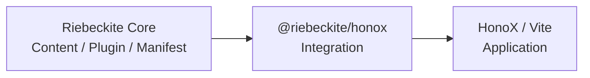
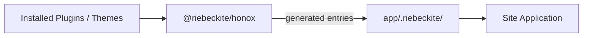
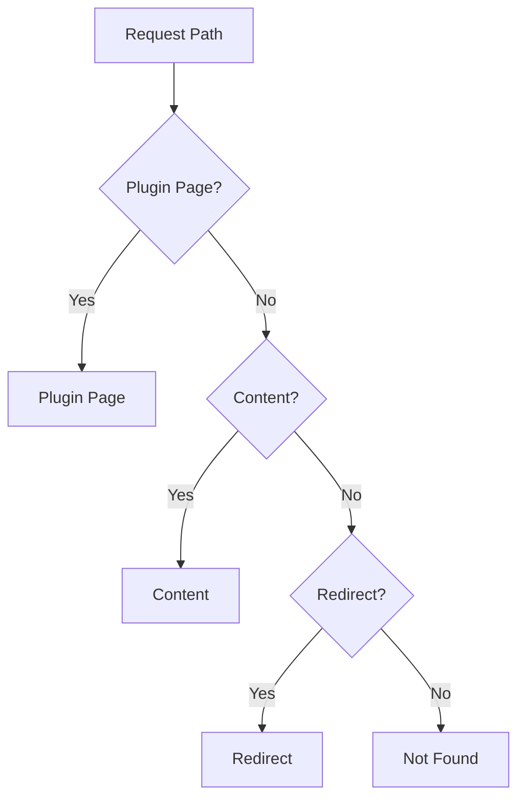
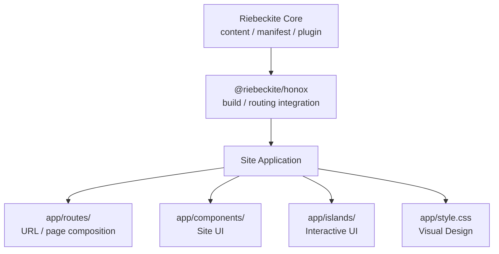
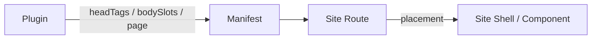
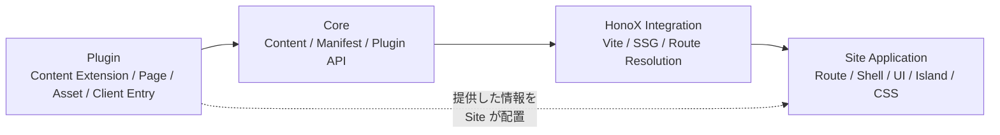

# HonoX Integration

`@riebeckite/honox` は、Riebeckite Core と HonoX / Vite を接続する integration です。

Core はコンテンツやプラグインの処理を担当しますが、HonoX の route や Vite の build 方法については知りません。

その間を接続するのが `@riebeckite/honox` です。



主に次の処理を担当します。

- application root / config の解決
- Vite の development / build
- SSG の設定
- plugin / theme の style entry 生成
- client entry の生成
- Riebeckite のコンテンツと HonoX application の接続

これにより、通常の Site は Riebeckite 内部の Vite / HonoX 設定を毎回組み立てる必要がありません。

## 基本的な使い方

通常は `vite.config.ts` で `riebeckiteVite()` を登録します。

```ts
import { riebeckiteVite } from "@riebeckite/honox";
import { defineConfig } from "vite";

export default defineConfig({
  plugins: [honox({ ... }), ...riebeckiteVite(), build()],
});
```

`riebeckiteVite()` は通常の Site 向けの higher-level helper です。

Riebeckite の Vite plugin を追加するだけでなく、次の設定もまとめて行います。

- SSG entry の設定
- extension mapping
- SSR に必要な external dependency の設定
- plugin / theme の生成 entry の接続

HonoX plugin、deployment 用 build plugin、Tailwind など、Site 自身が必要とする Vite plugin と組み合わせて利用できます。

## Root と Config

`riebeckiteVite()` では、必要に応じて次の場所を指定できます。

| Option | 意味 |
| --- | --- |
| `appRoot` | Site application の基準ディレクトリ |
| `configRoot` | Riebeckite config を探す基準 |
| `configFile` | 使用する config file |
| `workspaceRoot` | monorepo 開発時の workspace root |

通常は指定する必要はありません。

`appRoot` の既定値は Vite root、`configRoot` の既定値は `appRoot` です。

Riebeckite config は `configRoot` を基準に読み込みます。

一方、

```ts
content: {
  directory: "./content",
}
```

のような content directory は `appRoot` を基準に解決します。

`resolveHonoxApplication()` は、これらの root と解決済み config をまとめて返します。

CLI と Vite がこの共通モデルを利用することで、それぞれが異なる方法で application を解決しないようにしています。

### `workspaceRoot`

`workspaceRoot` は、Riebeckite 自体を monorepo で開発するときに source package alias を利用するための設定です。

npm から Riebeckite をインストールした通常の Site では必要ありません。

その場合は Site 自身の `node_modules` から package が解決されます。

## `.riebeckite` に生成されるファイル

Integration は application 内の

```text
app/.riebeckite/
```

へ、plugin や theme を接続するためのファイルを生成します。

たとえば plugin style や theme style、client module などです。



`.riebeckite` は integration が管理する生成物です。

**Site の source code として直接編集しないでください。**

## Lower-level API

より細かく integration を制御したい場合は、lower-level API も利用できます。

- `riebeckite`
- `riebeckiteSsg`
- `riebeckiteSsgExtensionMap`
- `createRiebeckiteSsg`

通常の Site では `riebeckiteVite()` を利用し、独自の build integration が必要な場合のみ lower-level API を利用してください。

## Site の Scaffold

`scaffoldRiebeckiteSite()` を使うと、Riebeckite Site 一式を生成できます。

```ts
scaffoldRiebeckiteSite({
  targetDirectory,
  name,
  siteTitle,
  description,
  baseUrl,
  locale,
  preset,
  overwrite,
});
```

生成されたファイルの一覧が戻り値として返されます。

### Preset

標準では次の preset を利用できます。

| Preset | 用途 |
| --- | --- |
| `starter` | 通常の実用サイト向け |
| `minimal` | 最小限の構成 |
| `showcase` | 機能や描画例を確認するための構成 |
| `empty` | ほぼ空の構成 |

独自の preset オブジェクトを渡すこともできます。

`starter` は実際の Site を作り始める場合の標準構成です。

`showcase` は機能の確認を目的としており、描画例やローカル fixture、リファレンスコンテンツなどを含みます。

生成先がすでに存在し、`overwrite` が指定されていない場合は `ScaffoldSiteError` が発生します。

`riebeckite init` と `create-riebeckite` は、この scaffold API を利用する command wrapper です。

## Routing と SSG

HonoX の runtime routing と静的生成では、同じ URL が同じページとして扱われる必要があります。

特に catch-all route がある場合、SSG の route 列挙に注意が必要です。

Riebeckite はこのために2つの helper を提供します。

### `contentRouteSsgParams`

```ts
contentRouteSsgParams(routePath, params)
```

`hono/ssg` の `ssgParams` の代わりとして使用します。

この helper は、その route 自身に属する params だけを返します。

たとえば、

```text
/:slug{.+}
```

という catch-all route があっても、

```text
/tags/:slug{.+}
```

に属するページまで横取りしません。

### `ssgEnumerableHandler`

```ts
ssgEnumerableHandler(handler)
```

`next()` を使って sibling route に処理を渡す handler を、SSG の列挙対象として残すための helper です。

Hono は middleware 形式の handler を通常 SSG の列挙対象から外すため、この差を補います。

## Plugin Page

Plugin は通常の content とは別に、独自のページを提供できます。

その場合は、

```ts
resolveContentRoute(manifest, path)
```

ではなく、

```ts
resolveRiebeckiteRoute(content, path)
```

を使用します。

SSG params には、

```ts
pluginPageSsgParams(content)
```

を追加します。

Route resolver は次の順序で URL を解決します。



Plugin Page の body は意図的に文字列として扱います。

Site が持つ既存の document frame 内へ描画し、`page.headTags` も Site の frame へ渡します。

この仕組みにより、Plugin が独自ページを提供するためだけに HonoX の route file を追加する必要はありません。

# UI Primitive

`@riebeckite/honox/ui` は UI framework ではありません。

Site が独自のデザインを作りながら、Riebeckite と共通の HTML 構造を利用するための小さな primitive set です。

公開されている主な component は次のとおりです。

- `Article`
- `ArticleLayout`
- `ArticleHeader`
- `ArticleContent`
- `ArticleMeta`
- `ArticleFooter`
- `Sidebar`

対応する `*Props` 型も公開されています。

## Stable Styling Hooks

各 primitive は次の class を stable styling hook として提供します。

| Component | Class |
| --- | --- |
| `Article` | `rb-article` |
| `ArticleLayout` | `rb-article-layout` |
| `ArticleHeader` | `rb-article-header` |
| `ArticleContent` | `rb-article-body` |
| `ArticleMeta` | `rb-article-meta` |
| `ArticleFooter` | `rb-article-footer` |
| `Sidebar` | `rb-sidebar` |

Primitive が担当するのは主に、

- semantic HTML
- stable styling hook
- `class` / `className` の合成

です。

一方、

- 記事本文の見せ方
- metadata の表示形式
- navigation
- card
- page layout
- island
- CSS

は Site Application が管理します。

## 使用例

```tsx
import {
  Article,
  ArticleContent,
  ArticleHeader,
  ArticleLayout,
  ArticleMeta,
} from "@riebeckite/honox/ui";

<Article class="prose">
  <ArticleLayout aside={<nav>…</nav>}>
    <ArticleContent>
      <ArticleHeader dangerouslySetInnerHTML={{ __html: lead }} />
      <ArticleMeta>…</ArticleMeta>
      <div dangerouslySetInnerHTML={{ __html: body }} />
    </ArticleContent>
  </ArticleLayout>
</Article>;
```

`ArticleHeader` と `ArticleContent` は、children と HTML input prop のどちらか一方だけを受け取ります。

Primitive は composition point として使用し、見た目は Site 側で定義してください。

また、

```text
@riebeckite/honox/src/
```

以下を直接 import しないでください。

公開 API として記載されていない内部 component に依存することも避けてください。

# Site Application の責務

Riebeckite Site は、最終的には通常の HonoX application です。

`@riebeckite/honox` は content と build を接続しますが、実際にユーザーが見る UI の設計は Site が管理します。



主なディレクトリの責務は次のとおりです。

| ディレクトリ | Site が持つ責務 |
| --- | --- |
| `app/routes/` | URL処理、ページ構成、redirect、response metadata |
| `app/components/` | Site 固有の UI |
| `app/islands/` | 対話 UI と client-side state |
| `app/style.css` | 色、layout、typography、extension style |

## Site Shell

```text
app/routes/_renderer.tsx
```

は Site 全体の shell です。

ここでは主に、

- document head
- navigation
- page chrome
- application client entry

などを管理します。

Route は `ContentManager` からコンテンツを取得し、

```ts
resolveRiebeckiteRoute(content, c.req.path)
```

で request URL を解決します。

その結果をどの component tree で表示するかは Site が決定します。

Riebeckite repository にある `apps/web` は実装例の1つであり、外部 Site が同じ layout を使う必要はありません。

# Plugin と Site の境界

Plugin は Site に情報や UI fragment を提供できます。

ただし、**最終的にどこへ描画するかは Site が決定します。**



## Head Tags

Plugin が document head に情報を追加したい場合は、

```ts
ContentManifestEntry.headTags
```

へ `meta` / `link` / `script` を記述します。

Plugin 自身が `<head>` を描画するわけではありません。

Site の route が、

```ts
c.set("headTags", entry.headTags ?? []);
```

として shell へ渡し、`_renderer.tsx` が描画します。

```tsx
const headTags = c.get("headTags") ?? [];

<head>
  {headTags.map((tag) =>
    tag.tag === "meta" ? <meta {...tag.attrs} /> : null,
  )}
</head>;
```

つまり、

```text
Plugin
  ↓ headTags を提供
Route
  ↓ shell へ渡す
_renderer.tsx
  ↓
<head> に描画
```

という関係です。

たとえば `@riebeckite/plugin-discord-embed` は、この仕組みを使って `theme-color` を提供します。

Plugin は `<head>` 自体や tag の並び順を所有しません。

## Body Slots

本文の途中へ Plugin の HTML を表示したい場合は、

```ts
ContentManifestEntry.bodySlots
```

を使用します。

Plugin は slot 名と HTML fragment を提供します。

たとえば、

```text
properties
```

という slot があれば、Site は、

```tsx
<Article
  content={post}
  propertiesHtml={route.entry.bodySlots?.properties}
/>
```

のように任意の位置へ配置できます。

Plugin が route や shell の構造を書き換える必要はありません。

`@riebeckite/plugin-properties` では、

```ts
render: "slot"
```

を指定すると `properties` slot を提供します。

`render: "html"` は従来どおり、生成 HTML の先頭または末尾へ直接挿入します。

# 独自 Site を作る

外部 Site でも、公開 primitive を使いながら自由に component を構成できます。

```tsx
import type { PostContent } from "@riebeckite/core";
import {
  Article,
  ArticleContent,
  ArticleLayout,
} from "@riebeckite/honox/ui";

export function SiteArticle({ post }: { post: PostContent }) {
  return (
    <Article class="site-article">
      <ArticleLayout>
        <ArticleContent html={post.html ?? ""} />
      </ArticleLayout>
    </Article>
  );
}
```

見た目は Site の CSS で定義します。

```css
@import "./.riebeckite/plugin-styles.css";
@import "./.riebeckite/theme-styles.css";

.site-article {
  max-width: 48rem;
  margin: 0 auto;
}
```

`.riebeckite` 内の生成 CSS 自体を直接編集しないでください。

## Islands

Island も通常の Site module として管理します。

```text
app/islands/
```

へ HonoX island を配置し、それを利用する route または component から import します。

hydration や client-side state は Site 内で管理します。

`app/client.ts` では、

```ts
createClient();
initRiebeckiteClient();
```

の両方を初期化します。

`initRiebeckiteClient()` は、インストールされている Plugin や Theme が提供する browser entry を起動するために使用されます。

Plugin は client entry を提供できますが、

- Site route
- shell
- component
- island
- CSS design

そのものを所有してはいけません。

# Integration の境界

Riebeckite の routing では、すでに解決された公開 URL を使用します。

基本的には、

```text
byPermalink
    ↓
redirects
```

の順で request を解決します。

filesystem path やディレクトリ構造から公開 URL を逆算しません。

また、`slug` はコンテンツを内部で検索するためのキーです。

実際に公開される URL は、解決済みの `permalink` です。

## 責務のまとめ

Riebeckite 全体では、次のように責務を分離します。



HonoX / Vite / Cloudflare 固有の処理は integration または Site Application に閉じます。

Core は HonoX routing を所有しません。

Plugin はページ、アセット、client entry などを提供できますが、Site 全体の route composition や UI 構造は所有しません。

**Core はコンテンツを扱い、Integration は HonoX と接続し、Plugin は機能を提供し、Site が最終的な表示を決める**、という境界を維持してください。

build state の扱いについては [Build system](build-system.md)、package ごとの責務については [Architecture](architecture.md) を参照してください。
