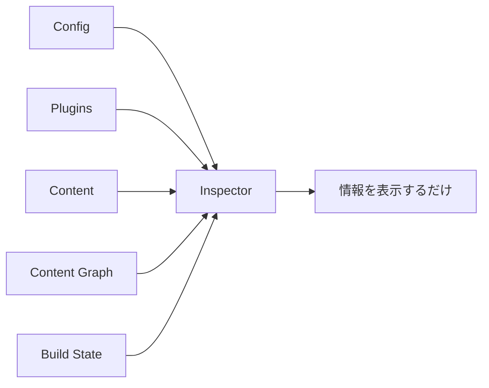
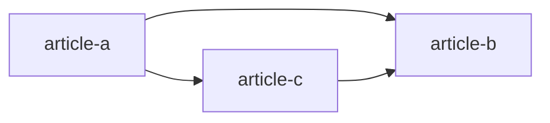
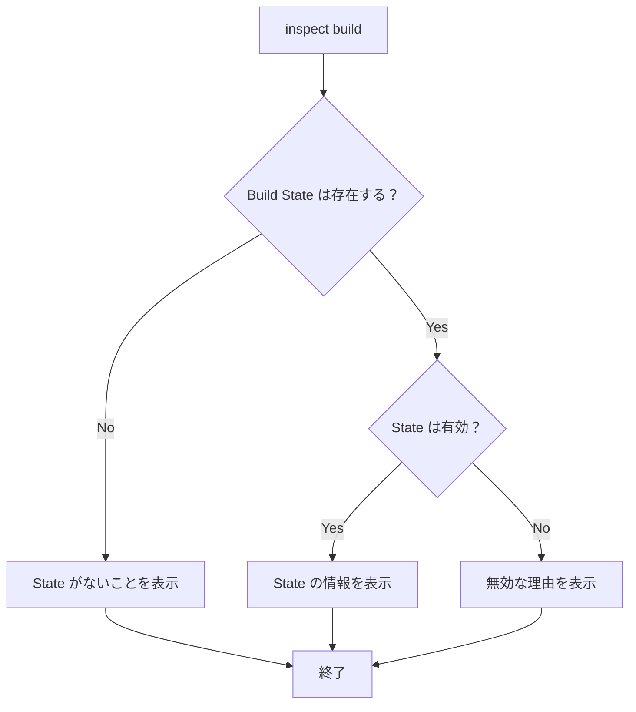
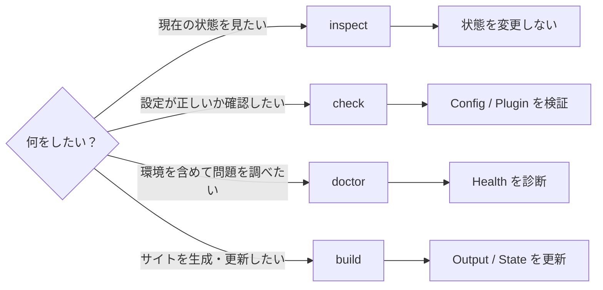

# Inspector

Inspector は、Riebeckite がすでに解決した設定やコンテンツ、Plugin、Build State を確認するための機能です。

簡単に言えば、**「Riebeckite から今どう見えているか」を調べるための読み取り専用ツール**です。

たとえば、

- 実際にどの設定が使われているか
- どの Plugin が有効になっているか
- 記事の最終的な URL は何か
- コンテンツ同士がどうつながっているか
- incremental build の state は正常か

といった情報を確認できます。



Inspector はこれらの情報を**確認するだけ**で、build や設定の変更は行いません。

## 基本的な使い方

Inspector には、確認したい対象ごとにコマンドがあります。

| コマンド | 確認できるもの |
| --- | --- |
| `riebeckite inspect config` | 解決済みの設定 |
| `riebeckite inspect plugins` | 有効になっている Plugin |
| `riebeckite inspect content --list` | 公開コンテンツと URL |
| `riebeckite inspect graph` | コンテンツ同士の関係 |
| `riebeckite inspect build` | incremental build の state |

## Config を確認する

```sh id="5zrcz3"
riebeckite inspect config
```

Riebeckite が実際に使用する **解決済みの config** を確認します。

設定ファイルに書いた値そのものではなく、既定値なども適用された後の「Riebeckite が最終的に認識している設定」を確認したいときに使用します。

たとえば、

> 設定したはずなのに期待した動作にならない

という場合に、まず実際の設定値を確認できます。

## Plugin を確認する

```sh id="4g0qba"
riebeckite inspect plugins
```

現在有効になっている Plugin を確認します。

「Plugin を追加したつもりだけれど、本当に読み込まれているのか」を調べるときなどに利用できます。

## Content を確認する

```sh id="v20yqo"
riebeckite inspect content --list
```

Riebeckite が認識しているコンテンツを一覧表示します。

各 entry について、解決済みの **canonical permalink** を確認できます。

たとえば、

```text id="iz0dn3"
content/posts/hello.md
```

というファイルがあっても、実際の公開 URL が

```text id="ewds8n"
/blog/hello/
```

であれば、Inspector では最終的に解決された `/blog/hello/` を確認できます。

つまり、filesystem 上の場所ではなく、**実際にサイトで使われる URL** を確認するための情報です。

Public Location Plugin が identity metadata を提供している場合は、コンテンツ ID とその ID がどこから取得されたかも表示します。

## Content Graph を確認する

```sh id="91iyz5"
riebeckite inspect graph
```

コンテンツ同士の関係を確認します。

たとえば、



のようなリンク関係を、Riebeckite がどのように認識しているか調べるために利用します。

リンク、backlink、graph を利用する Plugin を開発するときの確認にも使えます。

## Build State を確認する

```sh id="i6hsvx"
riebeckite inspect build
```

incremental build で利用する state の状態を確認します。

正常な state が存在する場合は、その情報を表示します。

state が利用できない場合は、その理由も確認できます。

たとえば、

- state file が存在しない
- JSON が壊れている
- state version が現在の Riebeckite に対応していない
- state の構造を認識できない

といった状態です。

重要なのは、Inspector がこれらを**修復しない**ことです。



state が壊れていても、Inspector が新しい state を作ったり、既存 state を書き換えたりすることはありません。

# Read-only の保証

Inspector は **read-only** です。

Inspector の実行によってプロジェクトの状態が変わってはいけません。

具体的には、次の処理を行いません。

- build の開始
- incremental state の書き込み
- Plugin Cache の書き込み
- asset の生成
- artifact の生成
- Vite / HonoX build
- config の自動修正

まだ一度も build しておらず、確認対象の情報が存在しない場合も、Inspector が勝手に生成することはありません。

代わりに、

> 現在はその情報が存在しない

ことを明確に表示します。

この性質により、Inspector は開発中だけでなく CI でも安全に利用できます。

# `inspect` / `check` / `doctor` / `build` の違い

Riebeckite には似た目的に見えるコマンドがありますが、それぞれ役割が異なります。



| やりたいこと | コマンド |
| --- | --- |
| 現在の解決結果を確認する | `inspect` |
| Config / Plugin が正しいか検証する | `check` |
| Environment を含めて問題を診断する | `doctor` |
| Site や Build State を生成・更新する | `build` |

迷った場合は、

**「見るだけなら `inspect`、検証なら `check`、問題調査なら `doctor`、生成するなら `build`」**

と考えると分かりやすいです。

この役割分担によって、状態を確認するだけのコマンドが cache や deployment output を意図せず変更することを防いでいます。

各コマンドの詳細は [CLI](../reference/cli.md)、診断の仕組みについては [Diagnostics](diagnostics.md)、incremental state については [Build System](build-system.md) を参照してください。
