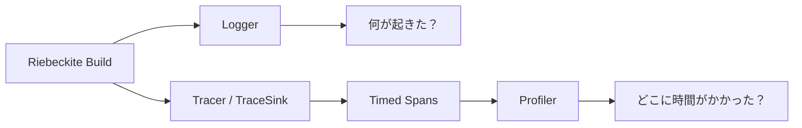
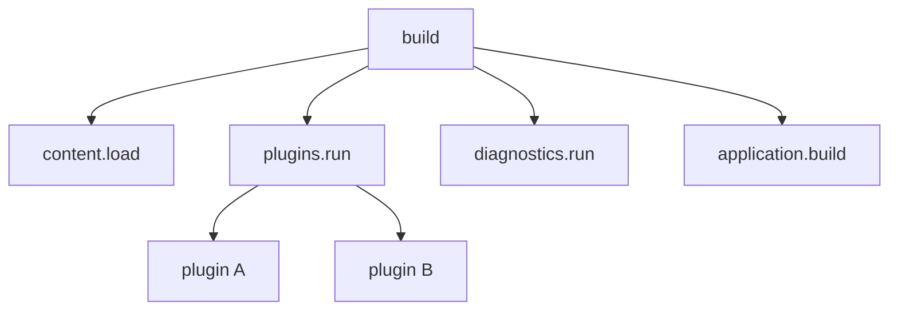
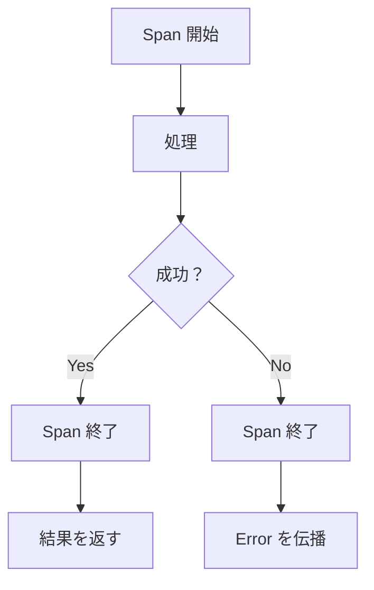
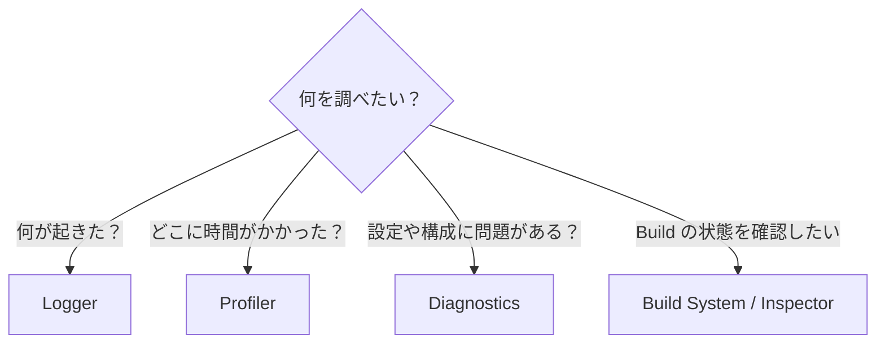

# Observability

Observability は、Riebeckite の実行中に **何が起きたのか、どこに時間がかかったのか** を調べるための仕組みです。

Riebeckite では目的の異なる3つの仕組みを分けています。

- **Logger** — 何が起きたかを知る
- **Tracer** — どの処理にどれだけ時間がかかったかを記録する
- **Profiler** — Trace をまとめて、Build のどこを調査すべきか確認する



## Logger / Tracer / Profiler の違い

| 機能 | 答える問い | 主な用途 |
| --- | --- | --- |
| Logger | 何が起きた・失敗したか | 実行状況やエラーの記録 |
| Tracer / `TraceSink` | どこで、どれだけ処理したか | 処理時間を span として記録 |
| Profiler | Build のどこを調査すべきか | Trace の集計と分析 |

たとえば Build が遅い場合、Logger に大量のメッセージを追加して原因を探すのではなく、Tracer で処理時間を記録し、Profiler でその結果を確認します。

逆に「Plugin の読み込みに失敗した」のような出来事を伝えるのは Logger の役割です。

# Trace

Trace は、Build の処理を **span** という単位に分けて処理時間を記録します。

たとえば Build が次のように実行されたとします。



`build` が親 span、その中で実行される処理が child span になります。

これにより、

> Build 全体が遅い

だけではなく、

> `plugins.run` の中の特定 Plugin に時間がかかっている

といったところまで調べられます。

## Span を作る場所

すべての関数に span を追加する必要はありません。

主に次のような、処理時間を知る意味がある境界へ追加します。

- 主要な Build phase
- Plugin の処理
- ファイル読み込みなどの I/O
- Diagnostics
- その他、独立して性能を確認したい処理

span の名前には、Build 間で比較できる安定した名前を使用します。

たとえば、

```text
content.load
plugins.run
diagnostics.run
application.build
```

のような名前です。

入力ファイル名などによって span 名そのものが毎回変化する設計は避けます。

## Span は必ず閉じる

処理が成功した場合だけでなく、失敗した場合も span を閉じます。



Trace はエラー処理の代わりではありません。

処理が失敗した場合は Trace を記録したうえで、通常の caller contract に従って error を伝播します。

Trace のためにエラーを握りつぶしてはいけません。

# 並列処理と時間

Trace を読むときに重要なのが、**処理時間の合計と実際の経過時間は同じとは限らない**という点です。

たとえば Plugin A と Plugin B が並列に実行されたとします。

```mermaid
gantt
    title Parallel Plugin Work
    dateFormat X
    axisFormat %L ms

    section Plugins
    Plugin A :a, 0, 100
    Plugin B :b, 0, 100
```



それぞれが 100ms かかった場合、

```text
Plugin A = 100ms
Plugin B = 100ms
```

なので、処理量としては合計 200ms です。

しかし2つは同時に実行されているため、実際の経過時間はおよそ 100ms です。

```text
Cumulative work = 200ms
Wall-clock time = 約100ms
```

Profiler はこの違いを維持します。

child span の時間を単純に足して、

> plugins.run = 200ms

のように表示すると、並列処理を直列処理のように見せてしまうためです。

# Profiler

Profiler は Trace を集計して、Build のどこに時間がかかっているかを確認するための機能です。

CLI から実行できます。

```sh
riebeckite profile
```

incremental state を再利用せず計測する場合は、

```sh
riebeckite profile --full
```

を使用します。

`--full` は、incremental build の影響を避けて Build 全体の performance を調べたい場合に便利です。

Profiler の目的は、

**「遅い」という事実から、次にどこを調査すればよいかを絞り込むこと**

です。

# Diagnostics の計測

Diagnostics も通常の Build phase と同じように計測されます。

Profiler には、

```text
diagnostics.run
```

span の duration が表示されます。

さらに Diagnostics が生成した finding の件数も確認できます。

- total
- error
- warning
- info

これにより、

```text
diagnostics.run
├─ duration
├─ total
├─ error
├─ warning
└─ info
```

のように、**Diagnostics にどれだけ時間がかかり、どれだけの問題が報告されたのか**を同時に確認できます。

たとえば Diagnostics が Build 時間の大部分を占めている場合、その phase をさらに調査する判断材料になります。

# 安全性

Observability は **Riebeckite の動作を観測するための仕組み**であり、Build の結果を変えてはいけません。

Instrumentation を有効にしても無効にしても、生成される Site は同じである必要があります。

また、Logger や Trace には次のような情報を記録しないでください。

- secret
- credential
- token
- 不要に機微なコンテンツ本文

観測のために必要な情報だけを記録します。

Trace や Profile の保存データも Build-time の情報です。

Cloudflare Workers などの runtime が、書き換え可能な Trace / Profile file に依存する設計にはしません。

# 問題を調査するとき

問題の種類によって使う機能を分けます。



Build が失敗している場合は Logger や Diagnostics、Build が遅い場合は Trace / Profiler、incremental build の状態を確認したい場合は Inspector と組み合わせて調査します。

Build の仕組みについては [Build System](build-system.md)、問題の報告については [Diagnostics](diagnostics.md)、現在の state を確認する場合は [Inspector](inspector.md) を参照してください。
