# プラグイン作成の詳細

このページは、Riebeckite Plugin を実際に設計・実装するときの詳細ガイドです。

初めて Plugin を作る場合は、先に [はじめてのプラグイン作成](../plugins/writing-a-plugin.md) を読んでください。

このページでは、その先に必要になる、

- どの拡張ポイントを使うか
- Plugin 同士の依存関係
- Lifecycle
- Content Pipeline
- Renderer / Page Type
- CSS / Browser 処理
- Cache / Diagnostics
- Package としての配布

までをまとめて扱います。

各型やフィールドの完全な定義を確認したい場合は [Plugin API](../reference/plugin-api.md) を参照してください。

# 1. Plugin にするべき機能

Plugin は **Riebeckite に再利用可能な機能を追加する仕組み**です。

たとえば、

- Markdown / HTML の解釈
- Content Transformation
- 独自形式の Renderer
- Browser Behavior
- Diagnostics
- HTTP Endpoint
- SEO
- 独立ページ

などを実装できます。

一方、すべての拡張を Plugin にするわけではありません。

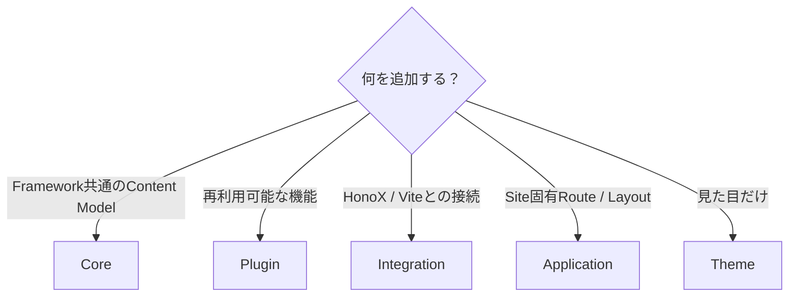

特に、

```text id="6pgq3j"
見た目だけ
  → Theme

Site 固有の Route / Layout
  → Application

HonoX / Vite との接続
  → Integration

Framework 全体の Content Model
  → Core
```

です。

「何でも Plugin にする」のではなく、その機能がどの責務に属するかを先に判断してください。

# 2. 最小の Plugin

Plugin は `definePlugin()` で定義します。

```ts id="sf8rf2"
import { definePlugin } from "@riebeckite/core";

export function examplePlugin() {
  return definePlugin({
    name: "example",
  });
}
```

Site では `riebeckite.config.ts` の `plugins` に追加します。

```ts id="32z2wh"
export default defineConfig({
  plugins: [
    examplePlugin(),
  ],
});
```

これが最小構成です。

# 3. Options を追加する

Plugin に設定が必要なら Factory の引数として受け取ります。

```ts id="m8h0dc"
type ExampleOptions = {
  enabled?: boolean;
};

export function examplePlugin(
  options: ExampleOptions = {},
) {
  return definePlugin({
    name: "example",
    options,
  });
}
```

利用側では、

```ts id="xw3gy8"
export default defineConfig({
  plugins: [
    examplePlugin({
      enabled: true,
    }),
  ],
});
```

のように指定できます。

条件付き Plugin も利用できます。

```ts id="d7esfe"
plugins: [
  condition && myPlugin(),
]
```

`false`、`null`、`undefined` は Plugin Input の解決時に除外されます。

また、

```ts id="3ud7ge"
enabled: false
```

の Plugin も実行されません。

# 4. 拡張ポイントを選ぶ

Plugin を実装するときは、必要な最小の拡張ポイントを選びます。

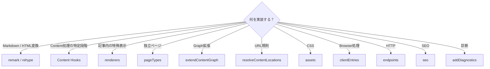

現在の主な Contract は次のとおりです。

| 領域 | API |
| --- | --- |
| Identity | `name`, `enabled`, `order`, `options` |
| Dependency | `provides`, `requires`, `optional` |
| Validation | `validateOptions` |
| Cache | `cacheVersion`, `context.cache` |
| Lifecycle | `setup`, `buildStart`, `buildEnd`, `dispose` |
| Content Hooks | `onConfigResolved`, `onContentLoaded`, `onPostParsed`, `onPostProcessed`, `onManifestCreated` |
| Public Location | `resolveContentLocations` |
| Pipeline | `remarkPlugins`, `rehypePlugins`, `extendMarkdownPipeline`, `extendHtmlPipeline` |
| Graph | `extendContentGraph` |
| Diagnostics | `addDiagnostics` |
| 本文内の描画 | `renderers` |
| 独立ページ | `pageTypes` |
| Browser | `assets`, `clientEntries` |
| HTTP | `endpoints` |
| SEO | `seo` |

Legacy / compatibility 用として `onBuildStart`、`onBuildEnd` もあります。

すべてを実装する必要はありません。

UI や output の拡張ポイントは複数あり、優劣の順列ではなく選択肢です。Markdown / HTML 変換、renderer、Page Type、body Slot、公開する Hono JSX component、client entry があります。どれを選ぶかは [UI の提供方法](../plugins/writing-a-plugin.md#ui-の提供方法) を参照してください。

# 5. Plugin の依存関係

Plugin 同士に実際の依存関係がある場合は Capability Contract を使用します。

```ts id="mdj2qn"
definePlugin({
  name: "consumer",

  provides: [
    "example.output",
  ],

  requires: [
    "content.graph",
  ],

  optional: [
    "example.optional",
  ],
});
```

それぞれ、

| Field | 意味 |
| --- | --- |
| `provides` | この Plugin が提供する Capability |
| `requires` | 必須の Capability |
| `optional` | あれば利用する Capability |

です。

Resolver は依存関係をもとに実行順を解決します。

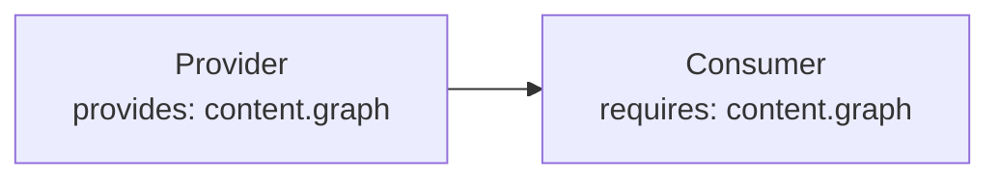

次の状態は Configuration Error になります。

- 必須 Capability がない
- Provider が重複している
- Dependency Cycle がある

`order` は依存解決前の基本順序です。

実際の依存関係を表現するために `order` を使わないでください。

# 6. Options を検証する

TypeScript の型だけでは Runtime Value を完全には保証できません。

必要な Plugin は `validateOptions` を実装します。

```text id="09xj48"
Options
   ↓
validateOptions
   ↓
Structured Issues
   ↓
riebeckite check
```

Validator は副作用を持たせません。

特に、

- Filesystem Scan
- Build
- Cache Write
- 外部状態の変更

を行わないでください。

問題は Structured Issue として返し、Config Validation からまとめて表示できるようにします。

# 7. Plugin Context

Plugin は Framework の Service を `PluginContext` から受け取ります。

基本的な Context は概念的に次のようになります。

```ts id="jrp2vo"
type PluginContext = {
  config?: ResolvedRiebeckiteConfig;
  contentIndex: Map<string, string>;
  diagnostics: Diagnostic[];
  cache: PluginCache;
  logger: Logger;
  tracer: Tracer;
};
```

Hook によって、

```text id="2t18qa"
slug
markdown
content
manifest
entries
location input
```

などが追加されます。

Plugin 内で Framework Service の Global Singleton を作るのではなく、Context から必要な Service を受け取ることを優先します。

# 8. Lifecycle

Framework Lifecycle には、

```text id="oy9iqs"
setup
buildStart
buildEnd
dispose
```

があります。

概念的には、

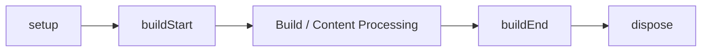

という流れになります。

`dispose` は確保した Resource の解放に使用します。

Lifecycle の実行順は、解決済み Plugin Order に従います。

Hook で Error が発生した場合は、

- Plugin 名
- Hook 名
- 元の Cause

が分かる形で上位へ伝播させてください。

# 9. Content Lifecycle

Content は複数の段階を通って処理されます。

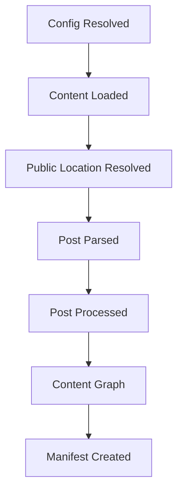

代表的な Hook は、

```text id="6idgbj"
onConfigResolved
onContentLoaded
onPostParsed
onPostProcessed
onManifestCreated
```

です。

必要な段階の Hook だけを使用してください。

たとえば Manifest にすでに存在する情報を `onContentLoaded` で独自に再構築する、といった実装は避けます。

# 10. Markdown / HTML Pipeline

Markdown や HTML の意味を変換する場合は remark / rehype を利用します。

単純な Plugin なら、

```ts id="twapvp"
definePlugin({
  name: "example",

  remarkPlugins: [
    remarkExample,
  ],

  rehypePlugins: [
    rehypeExample,
  ],
});
```

と宣言できます。

Pipeline 自体を構成する必要がある場合は、

```ts id="5fj1xn"
definePlugin({
  name: "example",

  extendMarkdownPipeline(pipeline) {
    pipeline.use(remarkExample);
  },

  extendHtmlPipeline(pipeline) {
    pipeline.use(rehypeExample);
  },
});
```

を使用します。

Markdown / HTML の意味変換を Application Component に持ち込まず、Plugin の Pipeline 処理として実装するのが基本です。

# 11. Content Graph

Content Graph を拡張する場合は `extendContentGraph` を使用します。

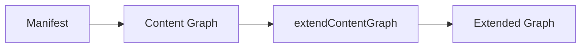

Backlinks や Graph 系機能を実装するために、Plugin が Filesystem を再走査しないでください。

すでに解決された Manifest / Content Graph を利用します。

# 12. Public Location

Content の公開 URL を変更する Plugin では `resolveContentLocations` を使用します。

最初に Core が Default Location を解決します。

```text id="dug8by"
index
  → /

その他
  → /{slug}
```

その後、解決済み Plugin Order に従って Location Hook が実行されます。

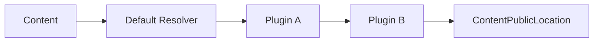

結果は `ContentPublicLocation` として、

- Manifest
- Content Graph
- Markdown Pipeline

などから利用されます。

URL Strategy は Plugin が所有します。

Core は特定 Plugin の URL 規則を知りません。

Consumer は最終的な、

```ts id="b9m3p8"
entry.permalink
```

を利用します。

Location を解決できない場合は、slug へ暗黙的に fallback せず明示的な Error とします。

# 13. Renderers

`renderers` は記事本文内の特殊な Content Target を HTML へ変換します。

たとえば、

```text id="o4apio"
Canvas
Bases
Excalidraw
Attachment
Media
```

などです。

Renderer Context には、

```text id="pbh0ss"
kind
path
raw
label
url
embed
```

と通常の `PluginContext` が含まれます。

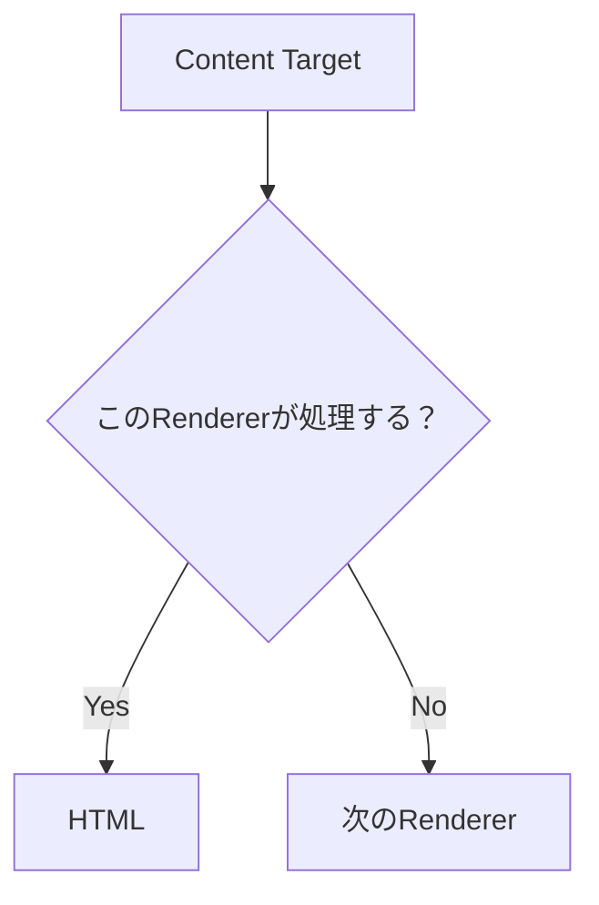

処理対象でなければ `null` を返します。

これによって複数 Renderer が同じ Pipeline に参加できます。

# 14. Page Types

独立した URL を持つ画面を Plugin が提供する場合は `pageTypes` を使用します。

たとえば、

```text id="9tlwkd"
/explore
/report
/tags/example
```

などです。

Page Type は、

- 一意な `id`
- SSG 用 `paths`
- 必要に応じた `priority`
- `resolve`

を持ちます。

Resolver は Framework 非依存の HTML Body または `null` を返します。

必要なら、

```text id="pjgd7n"
title
description
headTags
```

も返せます。

ただし Document Frame は Site Application が所有します。

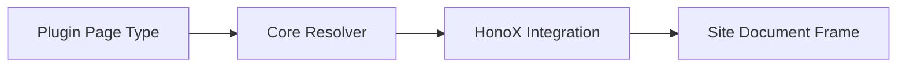

Taxonomy の一覧や Explorer のような独立画面には Page Type を使用します。

Canvas、Bases、Excalidraw のような記事本文への埋め込みには Renderer を使用します。

Plugin が HonoX Route File や Document Frame を所有しないことが重要です。

Page Type の詳しい仕組みは [Page System](./page-system.md) を参照してください。

# 15. Assets

Plugin 固有の Stylesheet は Plugin Package 内に置き、`assets` から公開します。

```ts id="b4qrvi"
assets: [
  {
    pluginName: "example",
    kind: "style",
    moduleSpecifier:
      "@riebeckite/plugin-example/style.css",
  },
]
```

Integration がこの Module Specifier を解決して Browser へ届けます。

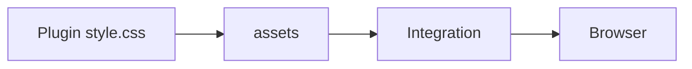

Plugin 固有 CSS を `apps/web` にコピーしたり、Browser から `/node_modules` を直接参照させたりしないでください。

# 16. CSS Hooks

再利用可能な UI を Plugin が描画する場合は、最外要素に Stable Root Hook を付けます。

Plugin / Feature Hook は、

```text id="59lz7m"
rr-<feature>
```

とします。

たとえば、

```text id="gj2f5a"
rr-search
rr-callout
rr-query
rr-code
```

です。

内部要素では BEM を利用できます。

```text id="9lq6se"
rr-search
rr-search__input
rr-search__result
rr-search--loading
```

Namespace の役割は次のとおりです。

| Namespace | 用途 |
| --- | --- |
| `rb-*` | Framework の構造 Hook |
| `--rb-*` | Framework の Semantic Token |
| `rr-*` | Plugin / Feature Hook |
| `--rr-*` | Plugin 固有 Token |

Plugin の出力を `rb-*` Namespace に置かないでください。

既存 Class がある場合は削除せず、`rr-*` Hook を追加します。

また、

```text id="21g4wg"
rr-feature__*
rr-feature--*
```

は原則として内部実装です。

Theme から利用してよい子孫 Class だけを Public Hook として文書化してください。

# 17. Client Entries

Browser 上で初期化処理が必要な場合だけ `clientEntries` を使用します。

```ts id="a8cjlk"
clientEntries: [
  {
    pluginName: "example",
    moduleSpecifier:
      "@riebeckite/plugin-example/client",
    exportName: "initExample",

    publicConfig: {
      selector: ".example",
    },
  },
]
```

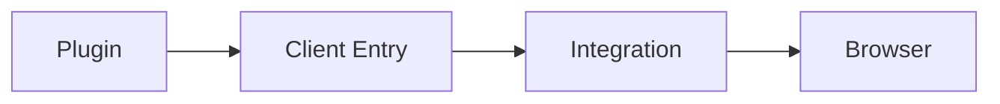

SSR / Build-time だけで完結する Plugin に Client JavaScript を追加しないでください。

`publicConfig` は Browser へ渡されるため、

- Token
- Credential
- Secret
- Private Service URL

などを含めてはいけません。

Plugin の `options` が自動的に Client へ渡されることもありません。

# 18. Endpoints / SEO

HTTP Endpoint を提供する場合は `endpoints` Contract を使用します。

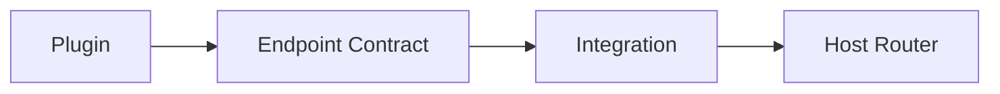

HonoX など特定の Route Framework を Plugin 本体へ直接組み込まないでください。

SEO へ参加する場合は `seo` を使用します。

たとえば Metadata や Feed に Plugin が情報を追加できます。

Application Route 側へ Plugin 固有 SEO Logic を再実装しないことが重要です。

# 19. Diagnostics

Plugin 固有の問題は `addDiagnostics` から報告します。

```ts id="1xq5te"
addDiagnostics(context) {
  return [
    {
      // Diagnostic contract
    },
  ];
}
```

診断結果は可能な限り Structured Data として返してください。

Plugin が、

```ts id="c4x89a"
console.log(...)
```

で独自の CLI Output を作るのではなく、Diagnostics または Logger を使用します。

# 20. Plugin Cache

`context.cache` は Plugin ごとに分離された Build-time Cache です。

保存するデータには次の条件があります。

- 再生成できる
- JSON Serializable
- Plugin Namespace 内で完結する
- 壊れていても安全に Cache Miss として扱える

`cacheVersion` を使って Cache Format の互換性を管理できます。

Write は Atomic に行います。

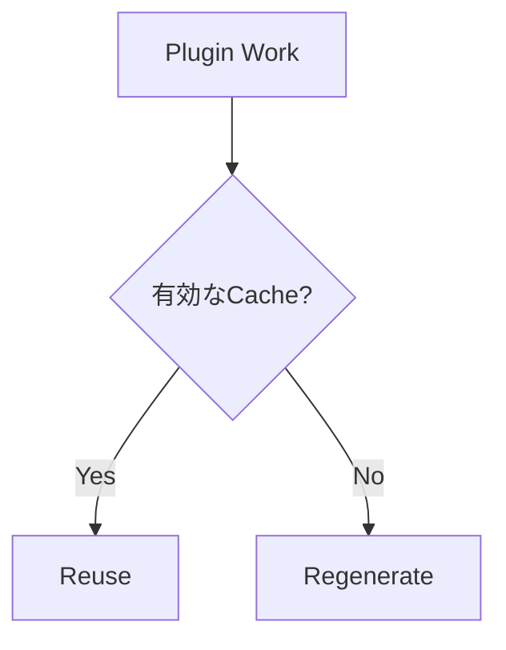

これは Runtime Database ではありません。

Cloudflare Workers などの永続 Storage として使用しないでください。

# 21. Logger / Tracer

Plugin では Framework の Logger / Tracer を利用できます。

```ts id="j7ad6k"
context.logger.info("...");

await context.tracer.span(
  "plugin.example.work",
  {
    plugin: "example",
  },
  async () => {
    // work
  },
);
```

Logger は処理内容を記録し、Tracer は処理時間などを Structured Trace として記録します。

Profiler はこの Trace を利用するため、Plugin ごとに独自の Stopwatch や Profiling System を作る必要はありません。

# 22. Site 内だけで使う Plugin

Plugin は npm に公開しなくても利用できます。

Site 内に、

```text id="17msvn"
site/
└─ extensions/
   └─ local-plugin.ts
```

のように置いて `definePlugin()` できます。

```ts id="mqm2gv"
// site/extensions/local-plugin.ts

return definePlugin({
  name: "site-local",

  assets: [
    {
      pluginName: "site-local",
      kind: "style",
      moduleSpecifier:
        "/extensions/plugin.css",
    },
  ],
});
```

Site-local Plugin も Published Plugin と同じ、

- Dependency Resolution
- Pipeline
- Hooks
- Diagnostics
- Renderer
- Page Type

などの Contract を利用します。

未公開 Plugin では `createStyleAsset()` が生成する package path は利用できません。

Host Bundler が解決できる `moduleSpecifier` を直接指定してください。

# 23. Package として配布する

Plugin を再利用可能な Package として配布する場合は、たとえば次の構成にできます。

```text id="fs7fzp"
packages/plugins/example/
├─ index.ts
├─ components/       # 必要な場合のみ
├─ client.ts         # 必要な場合のみ
├─ src/
│  ├─ remark.ts
│  ├─ rehype.ts
│  ├─ renderer.ts
│  └─ types.ts
├─ style.css         # 必要な場合のみ
├─ package.json
├─ README_ja.md
└─ README.md
```

Riebeckite repository 内では `packages/plugins/backlinks` が参考になります。

ただし、すべての Plugin に `client.ts`、`style.css`、`components/` が必要なわけではありません。

必要なものだけを作成してください。

# 24. Repository 外で配布する

外部 Plugin Package は Riebeckite monorepo の内部構造に依存させません。

基本的には、

```text id="8pn4j3"
@riebeckite/core
```

の Public API を利用します。

Plugin 自身が持つ、

```text id="svimxk"
./client
./components
./style.css
```

などは、自身の `package.json` の `exports` で公開します。

次のような Internal Import は使用しません。

```ts id="y6jy1n"
import {
  something,
} from "@riebeckite/core/src/...";
```

monorepo 内にしか存在しない相対 Path にも依存しないでください。

# 25. ESM

NodeNext / ESM Package では、Build 後の JavaScript を Node.js が実際に解決できる必要があります。

Development 時だけ TypeScript Loader が、

```text id="5k12um"
extensionless import
```

などを解決できている状態に依存しないでください。

Package の正しさは Source Code だけではなく、**Build 後の配布形式でも確認する**必要があります。

# 26. Plugin を検証する

実装後は、小さい範囲から順番に確認します。

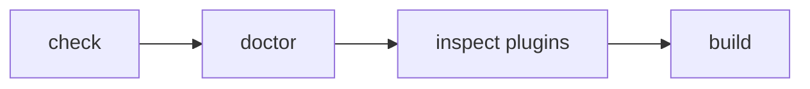

まず Configuration と Plugin Resolution を確認します。

```sh id="bgxy4d"
pnpm exec riebeckite check
```

次に Project の Health を確認します。

```sh id="8bfj5k"
pnpm exec riebeckite doctor
```

解決された Plugin を確認します。

```sh id="ad0h9x"
pnpm exec riebeckite inspect plugins
```

最後に実際の生成物まで確認します。

```sh id="f7grlr"
pnpm exec riebeckite build
```

Plugin が解決されない場合は、まず `check` の出力から、

- Import Error
- Missing Capability
- Duplicate Provider
- Dependency Cycle
- Invalid Options

などを確認してください。

# 27. 実装前の確認

Plugin を作り始める前に、最後に次の順番で考えると責務を分離しやすくなります。

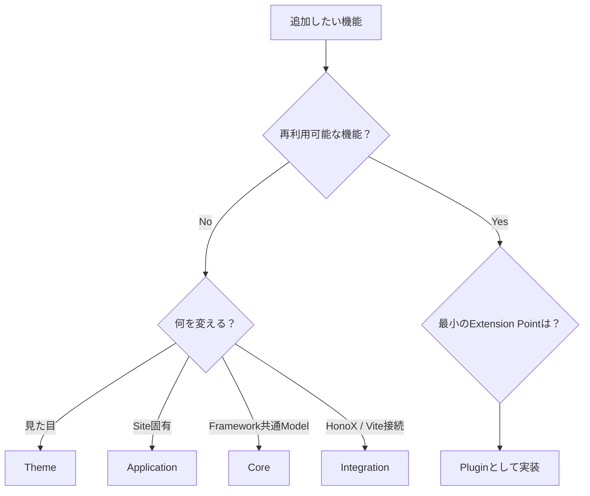

Plugin にすると決めた後も、

**その機能に本当に必要な Extension Point だけを使用する**

ことが重要です。

Filesystem を再走査する前に Manifest や Content Graph が使えないか、独自 Route を追加する前に Page Type が使えないか、Client JavaScript を追加する前に SSR / Build-time だけで完結できないかを確認してください。

これによって Plugin を小さく保ち、Core、Integration、Application との不要な結合を避けられます。

## 関連資料

- [はじめてのプラグイン作成](../plugins/writing-a-plugin.md) — 最初の Plugin を作る
- [Plugin System](./plugin-system.md) — Plugin System 全体の考え方
- [Plugin API](../reference/plugin-api.md) — API Contract
- [Page System](./page-system.md) — 独立ページ
- [Content System](./content-system.md) — Manifest / Graph / Pipeline
- [Architecture](./architecture.md) — Core / Plugin / Integration / Theme / App の責務
- [Framework Reference](../reference/README.md) — Public API
