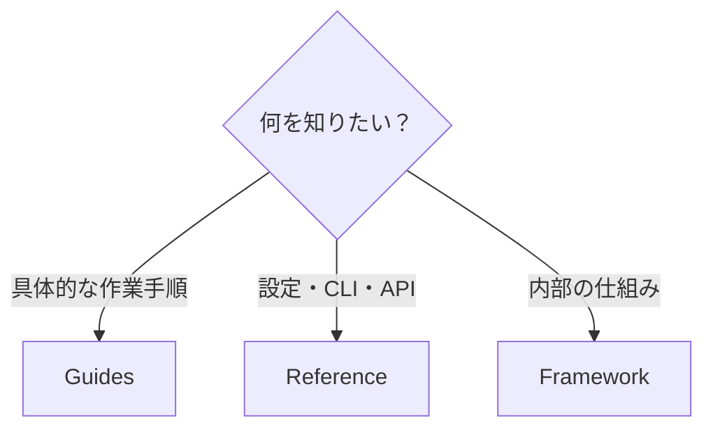
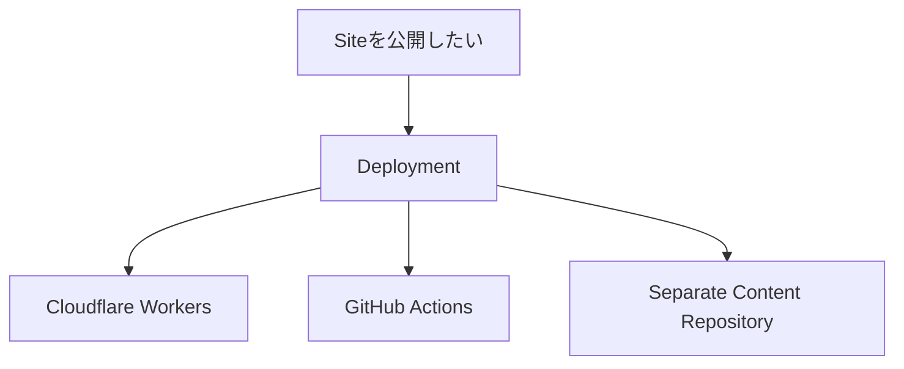

# Guides

Guides は、**「Riebeckite で何をしたいか」から手順を探すための章**です。

設定値や API の正確な仕様を確認したい場合は [Reference](../reference/README.md)、Riebeckite の内部構造を理解したい場合は [Framework](../framework/README.md) を参照してください。



初めて Riebeckite を使う場合は、Guides より先に [Getting Started](../getting-started/README.md) から始めるのがおすすめです。

## コンテンツを作る

### 記事を書く

[Writing Content](./writing-content.md)

Markdown、Frontmatter など、Riebeckite で記事を書くための基本を説明します。

### Obsidian Vault を公開する

[Obsidian](./obsidian.md)

既存の Obsidian Vault を Riebeckite の Content として利用する方法を説明します。

## サイトを構成する

### Content と Site を分ける

[Content Repositories](./content-repositories.md)

Site Application と Markdown Content を別の Repository で管理する構成について説明します。

### 多言語サイトを作る

[Localization](./localization.md)

複数言語の Content、URL、言語切り替えなどを扱う方法を説明します。

### Analytics を使う

[Analytics](./analytics.md)

Riebeckite Site に Analytics を導入する方法を説明します。

### アイコンやロゴを差し替える

[サイトのアイコンとロゴ](./branding.md)

Site 固有の favicon、ヘッダーのロゴ、リンクプレビュー画像を差し替える方法を説明します。

## デプロイする

デプロイ方法を選ぶ場合は、まず [Deployment](./deployment/README.md) を参照してください。



### Cloudflare Workers

[Cloudflare Workers](./deployment/cloudflare-workers.md)

Riebeckite Site を Cloudflare Workers へデプロイする方法を説明します。

### GitHub Actions

[GitHub Actions](./deployment/github-actions.md)

GitHub Actions を使って Build と Deployment を自動化する方法を説明します。

### Separate Content Repository

[Separate Content Repository](./deployment/separate-content-repository.md)

Content と Site が別 Repository にある場合の自動デプロイ構成を説明します。

## Riebeckite を更新する

[Upgrading](./upgrading.md)

Riebeckite の Package を新しい Version へ更新するときの手順と、変更点の確認方法を説明します。

## 目的から探す

| やりたいこと | ページ |
| --- | --- |
| Markdown で記事を書く | [Writing Content](./writing-content.md) |
| Obsidian Vault を公開する | [Obsidian](./obsidian.md) |
| Content と Site を別 Repository にする | [Content Repositories](./content-repositories.md) |
| 多言語 Site にする | [Localization](./localization.md) |
| Analytics を導入する | [Analytics](./analytics.md) |
| サイトのアイコンやロゴを差し替える | [サイトのアイコンとロゴ](./branding.md) |
| デプロイ方法を選ぶ | [Deployment](./deployment/README.md) |
| Cloudflare Workers に公開する | [Cloudflare Workers](./deployment/cloudflare-workers.md) |
| GitHub Actions で自動デプロイする | [GitHub Actions](./deployment/github-actions.md) |
| Separate Content Repository を自動デプロイする | [Separate Content Repository](./deployment/separate-content-repository.md) |
| Riebeckite をアップグレードする | [Upgrading](./upgrading.md) |

## Guides と他の章の違い

ドキュメントの役割は次のように分かれています。

```text id="3m60t7"
初めてSiteを作る
  → Getting Started

やりたい作業の手順を知る
  → Guides

Pluginを探す
  → Plugins

Themeを探す
  → Themes

設定・CLI・APIを調べる
  → Reference

内部構造を理解する
  → Framework
```

Guides では、内部実装を詳しく説明することよりも、**目的を達成するために何をすればよいか**を中心に説明します。
