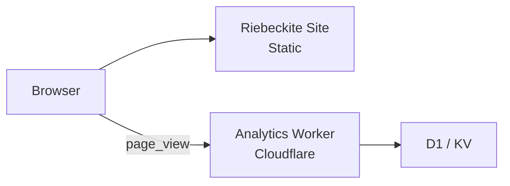
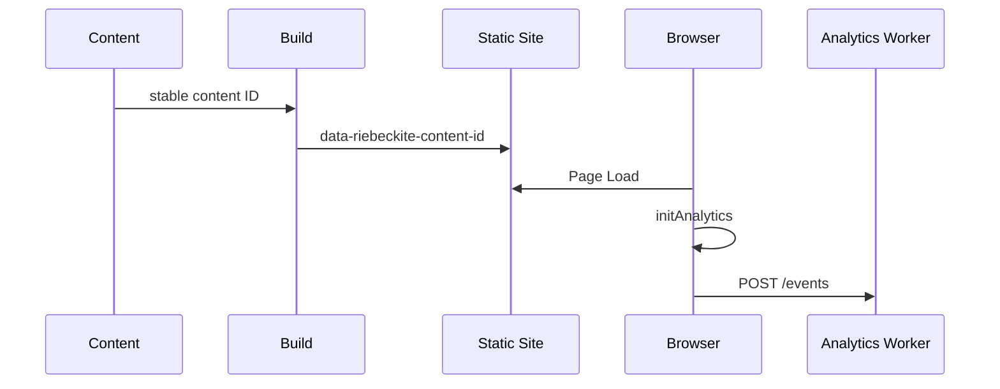
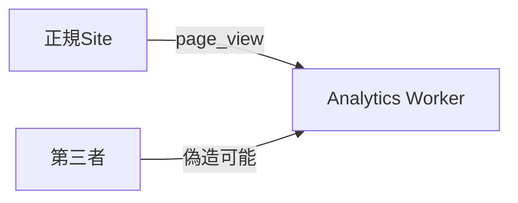
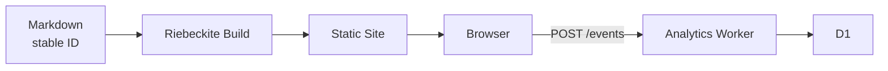
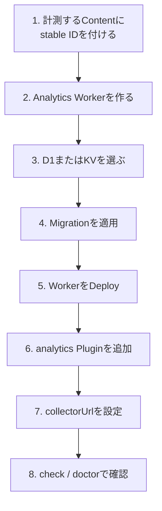

# Analytics

Riebeckite では、記事ごとの Page View を収集できます。

Analytics は、次の2つに分かれています。

| Package | 役割 |
| --- | --- |
| `@riebeckite/plugin-analytics` | Site 側で Page View を送信する |
| `@riebeckite/analytics-cloudflare` | Event を受け取り、Cloudflare 上で保存・集計する |



重要なのは、**Riebeckite Site 自体はこれまでどおり静的 Site のまま**という点です。

Analytics Worker は Site とは別にデプロイします。

Site の `wrangler.jsonc` や `main` を Analytics Worker 用に置き換える必要はありません。

## どの Package が何をする？

### `@riebeckite/plugin-analytics`

Riebeckite Site 側の Plugin です。

主に、

- 計測対象 Content の識別
- Browser からの `page_view` 送信
- `AnalyticsProvider` Contract
- Analytics Query Contract

を提供します。

Cloudflare、D1、KV、特定の Database には依存しません。

### `@riebeckite/analytics-cloudflare`

Cloudflare 上で Analytics Event を受け取るための独立した Worker Package です。

主に、

- Event の受信
- Request Validation
- CORS
- Rate Limit
- D1 / KV への保存
- Page View の読み取り API

を提供します。

```text id="w6zh3x"
Riebeckite Site
  → @riebeckite/plugin-analytics

Analytics Worker
  → @riebeckite/analytics-cloudflare
```

## 計測の仕組み

Page View は、Content の **安定した Content ID** を基準に記録します。



大きく3段階あります。

### 1. Content ID

計測対象の記事には、Frontmatter で安定した `id` を指定します。

```yaml id="5rmptb"
---
id: guide-1
---
```

互換性のため、`uid` も利用できます。

この ID は記事を識別するための値です。

URL を変更しても同じ Content として扱いたい場合があるため、

```text id="2mg98w"
/old-guide
/new-guide
```

のような URL を Analytics の Identity として使用しません。

詳しくは [Content System](../framework/content-system.md#安定-content-id) を参照してください。

### 2. Build 時にマーカーを追加する

Build 時に、安定 Content ID を持つ公開 Entry へ隠し要素が追加されます。

```html id="ly98ut"
<span
  data-riebeckite-content-id="guide-1"
></span>
```

Browser 側の Analytics はこのマーカーから Content ID を取得します。

### 3. Browser から Event を送る

`initAnalytics` は Document ごとに一度実行されます。

Content ID を取得すると、設定された `collectorUrl` へ `page_view` Event を JSON で送信します。

```json id="31i7h9"
{
  "type": "page_view",
  "contentId": "guide-1",
  "occurredAt": "2026-01-01T00:00:00.000Z",
  "path": "/guide",
  "lang": "en"
}
```

このうち Identity として使われるのは、

```text id="kkkz5n"
contentId
```

です。

`path` と `lang` は補助情報です。

安定 Content ID のない Content は計測されません。

## Page View の単位

現在の Riebeckite は静的な Document Navigation を使用します。

そのため、

```text id="bs64om"
Page Load
   ↓
initAnalytics
   ↓
page_view × 1
```

が基本です。

1回の Page Load につき1件の `page_view` を送ります。

SPA の Route Transition は自動計測しません。

## Site 側を設定する

Site では `@riebeckite/plugin-analytics` を設定します。

```ts id="74prf7"
import {
  analytics,
  MemoryAnalyticsProvider,
} from "@riebeckite/plugin-analytics";

export default defineConfig({
  // ...

  plugins: [
    analytics({
      provider:
        new MemoryAnalyticsProvider(),

      publicConfig: {
        collectorUrl:
          "https://analytics.example.com/events",
      },
    }),
  ],
});
```

主な設定は、

```text id="3g0p8e"
provider
publicConfig.collectorUrl
```

の2つです。

### `provider`

`provider` は `AnalyticsProvider` Contract を実装した Runtime です。

Provider は、

```text id="9ht8ge"
capabilities
capture
query
```

を提供します。

認証情報や Storage Binding のような非公開情報は Provider 内部に保持します。

Browser へ渡してはいけません。

### `publicConfig.collectorUrl`

`collectorUrl` は Browser が Event を送信する URL です。

```ts id="3xqf6f"
publicConfig: {
  collectorUrl:
    "https://analytics.example.com/events",
}
```

指定できるのは、

- Site-relative Path
- JSON `POST` を受け付ける HTTP(S) URL

です。

`publicConfig` は名前のとおり Browser へ公開されます。

秘密情報を含めないでください。

### `MemoryAnalyticsProvider`

`MemoryAnalyticsProvider` は、

- Test
- Local Experiment

向けです。

本番環境の永続的な Analytics Storage として使用するものではありません。

本番では Cloudflare Worker などの実際の Collector を使用します。

## 設定を確認する

Analytics Plugin の Option も通常の Plugin Validation の対象です。

たとえば、

- 不正な `provider`
- 不正な `collectorUrl`

などは、

```sh id="h5myi0"
pnpm exec riebeckite check
```

や、

```sh id="kkok81"
pnpm exec riebeckite doctor
```

で確認できます。

## AnalyticsProvider

`AnalyticsProvider` は、Provider がどの Analytics 機能に対応しているかを `capabilities` で宣言します。

主な Capability は、

```text id="31ig1c"
capture
content_page_views
popular_content
```

です。

### Event を保存する

```ts id="6ey01d"
await provider.capture(event);
```

`capture` は Page View Event を保存します。

### Content の Page View を取得する

```ts id="4gohio"
await provider.query({
  type: "content_page_views",
  contentId: "guide-1",

  timeRange: {
    from:
      "2026-01-01T00:00:00.000Z",
  },
});
```

特定 Content の合計 Page View を取得します。

期間は任意です。

### 人気 Content を取得する

```ts id="3n12mu"
await provider.query({
  type: "popular_content",
  limit: 10,
});
```

Page View をもとにしたランキングを取得します。

`limit` と期間は任意です。

### 対応していない Query

Provider が対応していない Query には、

```text id="mld6b4"
UnsupportedAnalyticsQueryError
```

を投げます。

独自 Provider を実装する場合は、

```ts id="grm9c0"
assertAnalyticsQuerySupported(
  provider,
  query,
);
```

を利用してください。

Capability / Query Helper は Package Root から Export されています。

## Cloudflare Worker を使う

Cloudflare で Event を収集する場合は、

```text id="tfv0z6"
@riebeckite/analytics-cloudflare
```

を使用します。

この Package は、

```text id="h5k4u6"
createWorker(options)
```

と Storage Adapter を提供します。

Storage の既定値はありません。

**D1 または KV のどちらか1つを明示的に選択します。**

## D1 と KV

| Storage | Event 保存 | 合計 Page View | 人気ランキング | 期間指定 |
| --- | --- | --- | --- | --- |
| D1 | ○ | ○ | ○ | ○ |
| KV | ○ | × | × | × |

### D1

D1 では、

```text id="a6w8wh"
D1AnalyticsStorage
d1Storage(db)
```

を使用します。

D1 は UTC の日単位で集計します。

SQLite の Atomic Upsert を利用し、**生の Page View Event は保存しません。**

そのため、

- `capture`
- `content_page_views`
- `popular_content`
- 日単位の期間 Query

を利用できます。

本格的に Analytics の集計結果を利用する場合はこちらを使用します。

### KV

KV では、

```text id="2dcd0g"
KvAnalyticsStorage
kvStorage(namespace)
```

を使用します。

KV は `capture` のみ対応します。

Best-effort の集計であり、同時書き込みによって Count が欠落する可能性があります。

そのため、

```text id="qefx4m"
content_page_views
popular_content
```

には対応しません。

これらの API を利用すると HTTP `501` を返します。

## D1 Worker の例

```ts id="ak02xw"
import {
  createWorker,
  d1Storage,
} from "@riebeckite/analytics-cloudflare";

export interface Env {
  ANALYTICS_DB: D1Database;
}

export default {
  fetch(
    request: Request,
    env: Env,
  ) {
    return createWorker({
      storage:
        d1Storage(env.ANALYTICS_DB),

      cors: {
        allowedOrigins: [
          "https://www.example.com",
        ],
      },
    }).fetch(request);
  },
};
```

Cloudflare の `env` は `fetch` の実行時に渡されます。

そのため Storage Binding も Request ごとに構築します。

```text id="6fak1j"
Request
   ↓
fetch(request, env)
   ↓
d1Storage(env.ANALYTICS_DB)
   ↓
createWorker(...)
```

Module Top-level で `env` を取得しようとしないでください。

## Worker の Endpoint

Analytics Worker は次の Endpoint を提供します。

| Endpoint | 内容 |
| --- | --- |
| `POST /events` | `page_view` を受信 |
| `GET /content/:contentId/page-views` | Content の Page View 合計 |
| `GET /popular` | 人気 Content |

### `POST /events`

JSON の `page_view` Payload を受け付けます。

Body の最大 Size は 8 KiB です。

成功すると、

```text id="a3pzla"
204 No Content
```

を返します。

不正な Request は拒否されます。

| 状態 | Response |
| --- | --- |
| 不正な JSON | `400` |
| 未知・不正な Field | `400` |
| JSON 以外の Content-Type | `415` |
| 8 KiB を超える Body | `413` |
| Rate Limit 超過 | `429` |

### Page View API

```text id="lv9m44"
GET /content/:contentId/page-views?from=&to=
```

特定 Content の Page View 合計を取得します。

### Popular API

```text id="ckwlsu"
GET /popular?limit=&from=&to=
```

人気 Content を取得します。

読み取り API は Storage Adapter が対応する Capability を宣言している場合だけ利用できます。

## CORS

Origin は既定で拒否されます。

そのため、通常は Site の Origin を明示します。

```ts id="esgw6e"
cors: {
  allowedOrigins: [
    "https://www.example.com",
  ],
}
```

すべての Origin から利用可能にする場合は、

```text id="l9jd7z"
"any"
```

を指定できます。

これは意図的に Public Collector として公開する場合だけ使用してください。

## CORS は認証ではない

`allowedOrigins` を設定しても、Analytics Event が信頼できるようになるわけではありません。

`Origin` は認証ではないため、第三者が許可された Origin を装って直接、

```text id="k2uh06"
POST /events
```

を送信することは可能です。



そのため、収集した Page View は**信頼できない計測データ**として扱います。

## Rate Limit

濫用を減らすため、任意で `rateLimit` を設定できます。

Rate Limit は接続元 IP ごとの固定時間窓で Request 数を制限します。

上限を超えると、

```text id="sjb59m"
429 Too Many Requests
```

を返します。

### D1 Rate Limiter

本番環境では、

```text id="w2hvbq"
D1AnalyticsRateLimiter
d1RateLimiter(...)
```

を利用できます。

```ts id="24eqz6"
d1RateLimiter(
  db,
  {
    maxRequests: 100,
    windowMs: 60_000,
  },
);
```

D1 上で Atomic Counter を管理するため、複数 Worker Isolate 間でも共有できます。

利用する場合は、

```text id="nhoy4m"
migrations/0002_analytics_rate_limits.sql
```

をデプロイ前に適用してください。

### Memory Rate Limiter

```text id="b8ct77"
MemoryAnalyticsRateLimiter
```

は Test / Local Development 用です。

Process 内の Counter しか持たないため、短命な Worker Isolate 間では共有されません。

本番環境の分散した Request を制限する用途には適していません。

## Rate Limit の限界

Rate Limit は認証機能ではありません。

できるのは主に、

```text id="ggw3ba"
単一Clientからの大量Request
        ↓
一定量まで抑える
```

ことです。

複数の接続元から分散して Event を送信したり、正規の Page View を偽造したりすることを完全には防げません。

そのため、

**CORS + Rate Limit を設定しても Analytics Data 自体を信頼済みデータとして扱わない**

ことが重要です。

## Privacy

Analytics Worker は、

```text id="hyx49s"
Cookie
User-Agent
Fingerprint
```

を読み取ったり保存したりしません。

Event に含まれる、

```text id="1mxpsk"
path
lang
```

も補助情報であり、D1 には保存されません。

Rate Limit を有効にした場合だけ、

```text id="l6fj21"
CF-Connecting-IP
```

を Rate Limit Key として読み取ります。

D1 Rate Limiter では、その Key を有効な Rate Limit Window の間だけ保存します。

## D1 を準備する

D1 Schema は Request 中に自動生成しません。

必ずデプロイ前に Migration を適用します。

```sh id="ez80bk"
pnpm exec wrangler d1 execute ANALYTICS_DB \
  --file node_modules/@riebeckite/analytics-cloudflare/migrations/0001_analytics_page_views.sql

pnpm exec wrangler d1 execute ANALYTICS_DB \
  --file node_modules/@riebeckite/analytics-cloudflare/migrations/0002_analytics_rate_limits.sql
```

1つ目は Analytics の集計用 Schema です。

2つ目は D1 Rate Limit を利用する場合に必要です。

## Worker をデプロイする

Riebeckite には Analytics Worker 用 Template があります。

```text id="2ynl7a"
templates/analytics-cloudflare/d1
templates/analytics-cloudflare/kv
```

利用する Storage に合わせて、Template を**独立した Worker Directory または Repository**へコピーします。

```text id="e2ag5w"
my-site/
  └─ Static Riebeckite Site

my-analytics/
  └─ Analytics Worker
```

Analytics Worker は専用の `main` を持ちます。

静的 Riebeckite Site の、

```text id="c24u4u"
wrangler.jsonc
main
```

を置き換えないでください。

Migration を適用したら Worker をデプロイします。

```sh id="n1m9do"
pnpm exec wrangler deploy
```

デプロイ後、Site の `collectorUrl` に Worker の `/events` を設定します。

```ts id="y8ehx2"
analytics({
  // ...

  publicConfig: {
    collectorUrl:
      "https://analytics.example.com/events",
  },
});
```

最終的な構成は次のようになります。



## Diagnostics

`@riebeckite/plugin-diagnostics` を利用している場合、Analytics Plugin が有効なのに安定 Content ID を持たない公開 Note を検出できます。

この場合、

```text id="s53jzg"
analytics-untracked
```

という `info` Diagnostic が報告されます。

たとえば、

```text id="j6n2dx"
公開記事
   ↓
stable content ID がない
   ↓
analytics-untracked
```

となります。

これによって Analytics の計測漏れを、

```sh id="vl1o09"
pnpm exec riebeckite check
pnpm exec riebeckite doctor
pnpm exec riebeckite build
```

などの Diagnostics から確認できます。

Diagnostics は Content を自動変更しません。

詳しくは [Diagnostics](../framework/diagnostics.md) を参照してください。

## 導入の流れ

初めて Analytics を導入する場合は、次の順番で進めると分かりやすくなります。



本番環境で Page View の集計やランキングを利用する場合は D1 が必要です。

KV は `capture` のみを必要とする用途に限定してください。

## まとめ

Riebeckite Analytics は、静的 Site と Analytics Backend を分離しています。

```text id="rnbq84"
Static Riebeckite Site
  ↓
@riebeckite/plugin-analytics
  ↓
page_view
  ↓
独立した Analytics Worker
  ↓
D1 / KV
```

Site は静的なまま維持され、Analytics の Storage や Cloudflare 固有処理は Site や Core に入りません。

また、

```text id="d4ph7x"
Content Identity
  → stable content ID

Public metadata
  → path / lang

Storage
  → D1 / KV

Abuse mitigation
  → CORS / Rate Limit
```

という役割を分離しています。

特に、CORS や Rate Limit は Analytics Event の正当性を保証する認証機能ではありません。収集された Page View は信頼できない計測データとして扱ってください。

### 関連資料

- [Content System](../framework/content-system.md#安定-content-id) — 安定 Content ID
- [Diagnostics](../framework/diagnostics.md) — Structured Finding と `check` / `doctor`
- [Reference](../reference/README.md) — 公開 Package と API
- [HonoX Integration](../framework/honox-integration.md) — 静的 Site の Build
- [Deployment](./deployment/README.md) — Site のデプロイ
