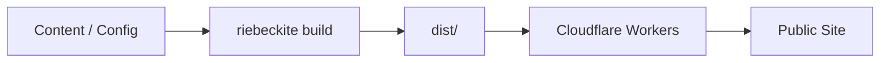
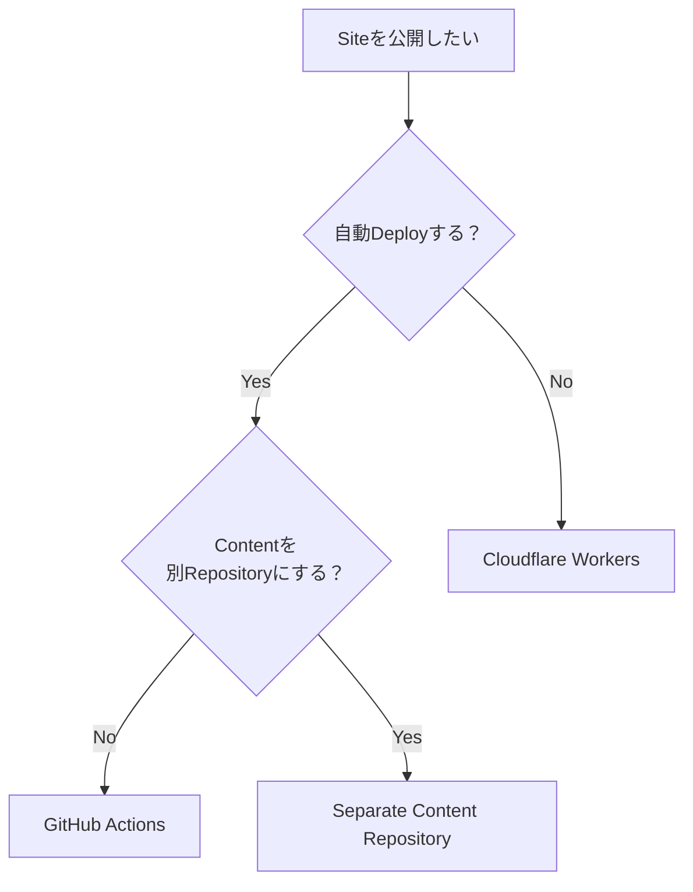

# Deployment Guides

Riebeckite で作成した Site を Cloudflare Workers へ公開するための Guide です。

基本的な流れは次のとおりです。



```sh
npm exec riebeckite build
```

を実行すると、公開用の Site が `dist/` に生成されます。

通常の静的 Site では、この `dist/` を Cloudflare Workers の Static Assets として配信します。

## どの Guide を読めばいい？

| やりたいこと | Guide |
| --- | --- |
| 手元から Cloudflare Workers へ公開したい | [Cloudflare Workers](./cloudflare-workers.md) |
| GitHub への Push から自動公開したい | [GitHub Actions](./github-actions.md) |
| Content と Site を別 Repository で運用したい | [Separate Content Repository](./separate-content-repository.md) |

初めて公開する場合は、まず [Cloudflare Workers](./cloudflare-workers.md) を読むのがおすすめです。`npm exec riebeckite deploy` を使うと、Wrangler へのログインと `wrangler.jsonc` の生成を含めて手元から公開できます。



## Build と Deploy

Riebeckite では、Build と Deploy は別の処理です。

```text
Build
  → Contentや設定から dist/ を生成する

Deploy
  → dist/ をCloudflare Workersから配信する
```

公開対象は `dist/` です。

`.riebeckite/` や Plugin Cache は Build 時に利用する状態であり、公開 Asset ではありません。

```text
dist/
  → 公開する

.riebeckite/
Plugin Cache
  → 公開しない
```

通常の静的 Site では Runtime の `main` も必要ありません。Riebeckite の Build 処理を Workers 上で実行するのではなく、Build 済みの `dist/` を配信します。

## 公開前の確認

Deploy 前には、次の順で確認できます。

```sh
npm exec riebeckite check
npm exec riebeckite doctor
npm exec riebeckite build
```

`build` が成功したら、生成された `dist/` を Deploy します。

## Deployment Guides

### Cloudflare Workers

[Cloudflare Workers](./cloudflare-workers.md)

`dist/` を Cloudflare Workers へ手元から公開する方法を説明します。`npm exec riebeckite deploy` がログインと `wrangler.jsonc` の生成を行います。

### GitHub Actions

[GitHub Actions](./github-actions.md)

Site Repository への Push から、Build と Cloudflare Workers への Deploy を自動化します。

### Separate Content Repository

[Separate Content Repository](./separate-content-repository.md)

Obsidian Vault などの Content と Site を別 Repository で管理する方法を説明します。

Private Content Repository の認証や、Content 更新から Site の Deployment を起動する方法もこちらで扱います。

## まとめ

Riebeckite の Deployment は、

```text
Content
  ↓
riebeckite build
  ↓
dist/
  ↓
Cloudflare Workers
```

と考えれば十分です。

- 手動で公開する → [Cloudflare Workers](./cloudflare-workers.md)
- Push から自動公開する → [GitHub Actions](./github-actions.md)
- Content Repository を分離する → [Separate Content Repository](./separate-content-repository.md)
