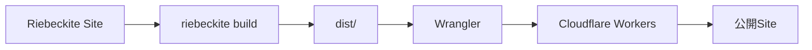
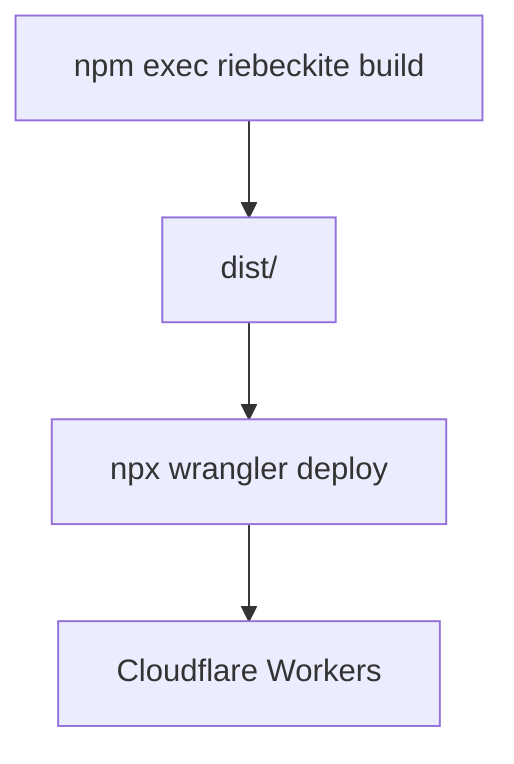
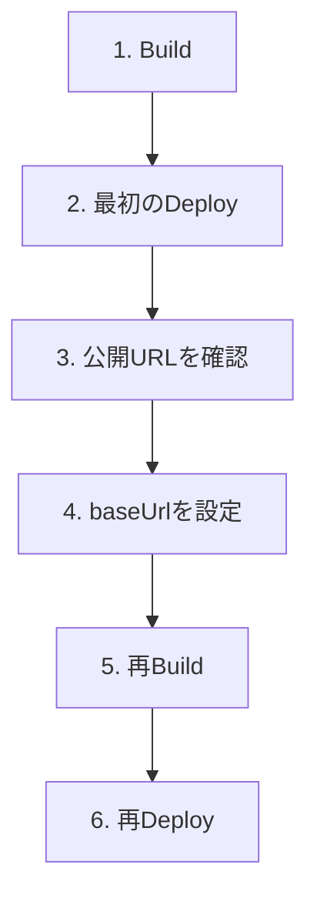
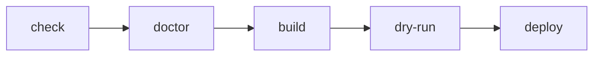
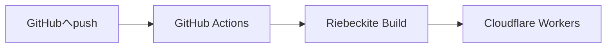
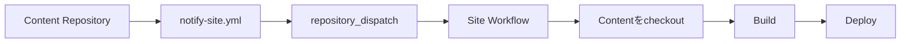

# Cloudflare Workers 公開ガイド

Riebeckite で作った Site を **Cloudflare Workers に公開する手順**を説明します。

この Guide では、まず手元から直接 Deploy します。

全体の流れは次のとおりです。



Riebeckite の通常の静的 Site では、Build で生成された `dist/` を Cloudflare Workers の Static Assets として公開します。

## 前提

Site の Directory で、依存 Package をインストールします。

```sh
npm install
```

その後、Riebeckite を Build します。

```sh
npm exec riebeckite build
```

Build に成功すると、

```text
dist/
```

が生成されます。

```text
my-site/
├─ app/
├─ content/
├─ dist/               ← 公開する
├─ riebeckite.config.ts
└─ package.json
```

Cloudflare Workers へ公開するのは、この `dist/` の内容です。

`.riebeckite/` や Plugin Cache などの Build 時の状態は公開対象ではありません。

## 1. Cloudflare アカウントを作る

まだ Cloudflare アカウントを持っていない場合は、[Cloudflare](https://www.cloudflare.com/) で作成します。

最初は無料枠で始められます。

アカウントを作成したら、次に Cloudflare Workers へ Deploy するための Wrangler を準備します。

## 2. Wrangler をインストールする

Site の Directory で実行します。

```sh
npm install -D wrangler
```

Wrangler は、Cloudflare Workers の開発や Deployment に利用する CLI です。

インストールすると、

```sh
npx wrangler
```

から実行できます。

## 3. `wrangler.jsonc` を作る

Cloudflare Workers へ何を Deploy するかを `wrangler.jsonc` で設定します。Site の Root に `wrangler.jsonc` を作り、次の内容を貼り付けてください。

```jsonc
{
  "$schema": "node_modules/wrangler/config-schema.json",
  "name": "my-riebeckite-site",
  "compatibility_date": "2026-06-09",
  "compatibility_flags": ["nodejs_compat"],
  "assets": {
    "directory": "./dist"
  }
}
```

`--github-actions` でサイトを作った場合、このファイルは生成済みです。手動で公開する場合だけ作ります。この内容は [templates/cloudflare/wrangler.jsonc](https://github.com/Rerurate514/riebeckite/blob/main/templates/cloudflare/wrangler.jsonc) と同じです。

`name` は、自分の Worker 名に変更します。

```jsonc
"name": "my-riebeckite-site"
```

`assets.directory` は、

```jsonc
"directory": "./dist"
```

のままにします。

これは、

```text
Riebeckite
    ↓
dist/ を生成
    ↓
Wrangler
    ↓
dist/ を Static Assets として公開
```

という対応になっています。

## 4. Cloudflare にログインする

Wrangler から Cloudflare へログインします。

```sh
npx wrangler login
```

Browser が開いたら、Cloudflare にログインして Wrangler からのアクセスを許可します。

これで手元の Wrangler から Cloudflare Workers へ Deploy できるようになります。

## 5. Site を公開する

まず Riebeckite を Build します。

```sh
npm exec riebeckite build
```

続いて Deploy します。

```sh
npx wrangler deploy
```



Deploy が成功すると、Wrangler に公開先の URL が表示されます。

たとえば、

```text
https://<name>.<account>.workers.dev
```

のような URL です。

表示された URL を Browser で開き、Site が表示されれば最初の Deployment は成功です。

## 6. `baseUrl` を公開 URL に合わせる

最初の Deployment で Site の URL が分かったら、`riebeckite.config.ts` の `baseUrl` を実際の公開 URL に変更します。

```ts
export default defineConfig({
  site: {
    baseUrl: "https://my-riebeckite-site.example.workers.dev",
  },

  // ...
});
```

`baseUrl` は Site の公開 URL を表します。

そのため、実際に公開する URL と一致させてください。

設定を変更したら、もう一度 Build します。

```sh
npm exec riebeckite build
```

そして再度 Deploy します。

```sh
npx wrangler deploy
```

つまり、最初の公開では次のような流れになります。



## 7. 公開前に確認する

実際に Deploy せず、Cloudflare Workers 向けの設定を確認することもできます。

### Dry Run

```sh
npx wrangler deploy --dry-run
```

実際には公開せず、Deployment の準備内容を確認します。

「まだ本番へ出したくないが、Wrangler の設定に問題がないか確認したい」という場合に利用できます。

### Wrangler Dev

```sh
npx wrangler dev
```

Cloudflare Workers での公開時に近い状態を手元で確認できます。

通常の開発中は、

```sh
npm exec riebeckite dev
```

を利用し、Cloudflare Workers 側での配信状態を確認したいときに、

```sh
npx wrangler dev
```

を使う、と考えると分かりやすくなります。

```text
普段の記事・Site開発
  → riebeckite dev

Cloudflareでの配信状態を確認
  → wrangler dev

実際に公開
  → wrangler deploy
```

## 8. 更新した Site を再公開する

一度公開した後に記事や設定を変更した場合も、手順は同じです。

```sh
npm exec riebeckite build
npx wrangler deploy
```

```text
Contentを変更
     ↓
Build
     ↓
dist/を更新
     ↓
Deploy
```

`wrangler deploy` だけでは Riebeckite の Content を再 Build しません。

そのため、Riebeckite 側を変更した場合は先に、

```sh
npm exec riebeckite build
```

を実行します。

## 9. 公開前の確認手順

本番へ Deploy する前には、次の順で確認できます。

```sh
npm exec riebeckite check
npm exec riebeckite doctor
npm exec riebeckite build
npx wrangler deploy --dry-run
npx wrangler deploy
```

それぞれの役割は次のとおりです。

| Command | 役割 |
| --- | --- |
| `riebeckite check` | Config や Plugin を検証 |
| `riebeckite doctor` | Site 全体の問題を診断 |
| `riebeckite build` | `dist/` を生成 |
| `wrangler deploy --dry-run` | Deployment 内容を確認 |
| `wrangler deploy` | Cloudflare Workers へ公開 |

問題が起きた場合は、どの段階で失敗しているかを分けて確認します。



## Build と Deploy は別の処理

Riebeckite の Build と Cloudflare の Deploy は別の処理です。

```text
Riebeckite
  → Siteを生成する

Wrangler
  → 生成されたSiteをCloudflareへ公開する
```

つまり、

```text
npm exec riebeckite build
```

が失敗する場合は Riebeckite 側を確認し、

```text
npx wrangler deploy
```

が失敗する場合は Cloudflare / Wrangler 側を確認します。

この境界を分けて考えると、Deployment の問題を調査しやすくなります。

## GitHub Actions で自動公開する

毎回、

```sh
npm exec riebeckite build
npx wrangler deploy
```

を手元で実行する代わりに、GitHub Actions から自動 Deploy することもできます。



詳しい仕組みと設定は [GitHub Actions](./github-actions.md) を参照してください。

## Site と Content が同じ Repository の場合

GitHub Actions 付きで Site を生成します。

```sh
npx create-riebeckite my-site --github-actions
```

これによって、Cloudflare Workers 用の `wrangler.jsonc` と Deployment Workflow が生成されます。

その後は Site Repository の `main` への Push から、自動 Build・Deploy できます。

## Content を別 Repository にする場合

Content と Site を別 Repository にする場合は、

```sh
npx create-riebeckite my-site --github-actions \
  --content-repository OWNER/notes \
  --site-repository OWNER/my-site
```

のように生成できます。

この構成では、

```text
OWNER/notes
  → Content Repository

OWNER/my-site
  → Site Repository
```

として分離します。

生成される構成では、

- Content Repository を `content/` へ Checkout
- `content-updated` の `repository_dispatch` を受け取る Site Workflow
- Content Repository 用の `github/notify-site.yml`

が用意されます。

`github/notify-site.yml` は Content Repository の、

```text
.github/workflows/notify-site.yml
```

へコピーします。

## 外部 Content では「取得」と「通知」が必要

Content Repository を分離した場合は、

```text
Contentを取得する
```

ことと、

```text
Content更新時にSite Workflowを起動する
```

ことは別です。



外部 Content Repository を Checkout する設定だけでは、Content Repository への Push から Site Workflow は起動しません。

Repository を分離する場合の詳しい設定は [Separate Content Repository](./separate-content-repository.md) を参照してください。

## よくある問題

### `dist/` がない

先に、

```sh
npm exec riebeckite build
```

を実行してください。

Cloudflare Workers に公開する Static Assets は `dist/` に生成されます。

### Site を更新したのに公開内容が古い

変更後にもう一度、

```sh
npm exec riebeckite build
npx wrangler deploy
```

を実行します。

`wrangler deploy` は Riebeckite の Build の代わりにはなりません。

### 公開後に URL が正しくない

`riebeckite.config.ts` の、

```ts
site: {
  baseUrl: "...",
},
```

が実際の公開 URL と一致しているか確認します。

変更した場合は再度 Build・Deploy してください。

### Riebeckite の Build で失敗する

```sh
npm exec riebeckite check
npm exec riebeckite doctor
```

で Riebeckite 側の Config や Content を確認します。

### Wrangler で失敗する

Riebeckite の `build` が成功しているなら、

```sh
npx wrangler deploy --dry-run
```

で Wrangler 側の設定を確認します。

`wrangler.jsonc` の `name` と、

```jsonc
"assets": {
  "directory": "./dist"
}
```

も確認してください。

## まとめ

Riebeckite Site を Cloudflare Workers へ公開する最小手順は、

```sh
npm install
npm install -D wrangler

npm exec riebeckite build

npx wrangler login
npx wrangler deploy
```

です。

最初の Deployment 後に公開 URL が分かったら、

```text
riebeckite.config.ts
      ↓
site.baseUrlを設定
      ↓
再Build
      ↓
再Deploy
```

します。

役割を整理すると、

```text
riebeckite build
  → dist/を作る

wrangler dev
  → Cloudflareでの配信を手元で確認する

wrangler deploy
  → dist/をCloudflare Workersへ公開する
```

となります。

自動 Deployment が必要になったら、手動 Deploy の仕組みを変えるのではなく、その一連の処理を [GitHub Actions](./github-actions.md) から実行する形に移行します。

### 次に読むもの

- [サイト公開までの最短ガイド](../../getting-started/deployment.md) — 初回公開までの最短手順
- [GitHub Actions](./github-actions.md) — GitHub への Push から自動公開する
- [Separate Content Repository](./separate-content-repository.md) — Content と Site を別 Repository で運用する
- [CLI](../../reference/cli.md) — `build`、`check`、`doctor` などの Command
