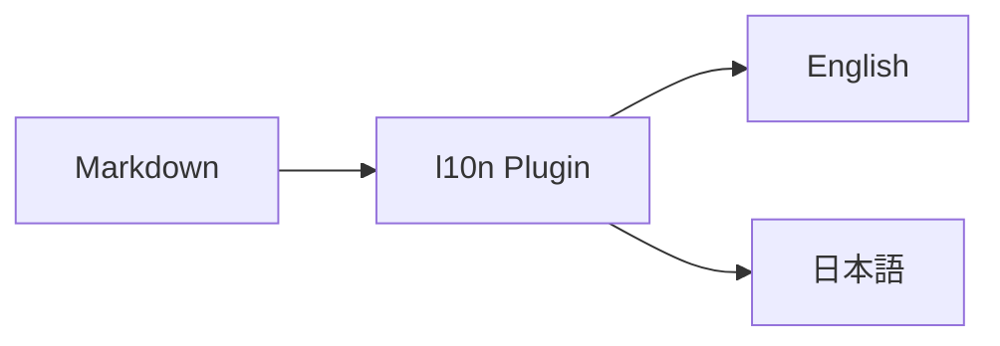
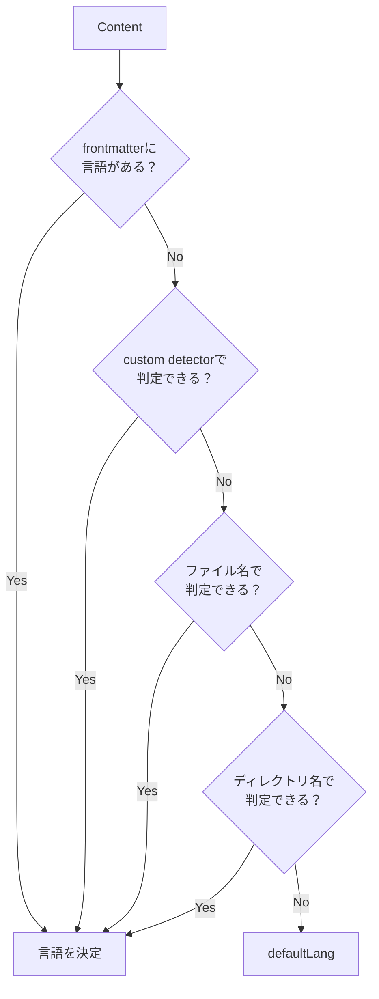
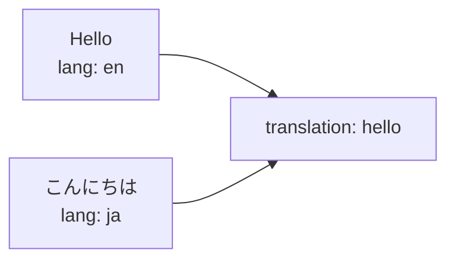
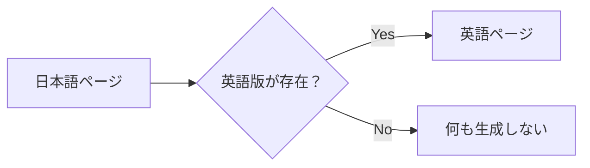
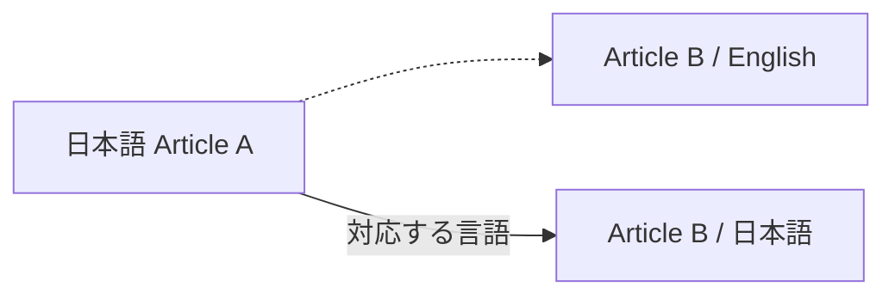
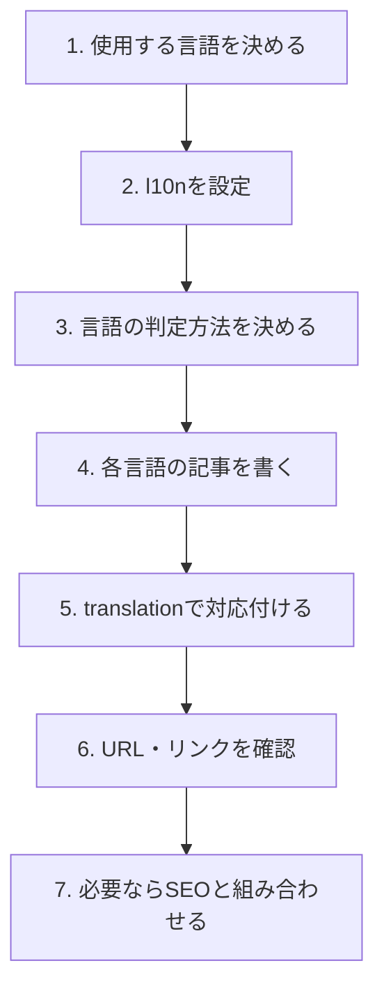

# Localization

Riebeckite では、`@riebeckite/plugin-l10n` を使って多言語 Site を構築できます。

l10n Plugin は、Content ごとの言語を判定し、

- 言語ごとの URL
- 同じ Content の翻訳版
- Site 内リンク
- 言語切り替え
- SEO と組み合わせた `hreflang`

などを扱います。



`starter` 以上の Preset では、次の7言語が設定されます。

```text
en
ja
zh-CN
es
de
fr
ko
```

すべての言語の記事を用意する必要はありません。実際に利用する言語に合わせて設定できます。

## 基本設定

`riebeckite.config.ts` に `l10n` Plugin を追加します。

```ts
import { l10n } from "@riebeckite/plugin-l10n";

export default defineConfig({
  plugins: [
    l10n({
      defaultLang: "en",
      languages: ["en", "ja"],
    }),
  ],
});
```

この例では、

```text
defaultLang
  → en

利用する言語
  → en / ja
```

となります。

`defaultLang` は、Content の言語を他の方法で判定できなかった場合にも使われます。

# Content の言語を決める

l10n Plugin は、それぞれの Content が何語なのかを判定します。

判定には優先順位があります。



優先順位は次のとおりです。

1. Frontmatter
2. Custom Detector
3. ファイル名
4. Directory 名
5. `defaultLang`

上の方法で判定できた時点で、その Content の言語が決まります。

# Frontmatter で指定する

最も明示的なのは Frontmatter の `lang` です。

```md
---
title: こんにちは
lang: ja
publish: true
---

日本語の記事です。
```

この Content は日本語として扱われます。

ファイルの場所や名前とは別に言語を明示したい場合に利用できます。

# ファイル名で分ける

同じ Directory に複数言語の記事を置く場合は、ファイル名で分ける方法が扱いやすくなります。

たとえば、

```text
README.md
README_ja.md
```

のように配置します。

`_ja` のような言語を表す部分から、Content の言語を判定できます。

この方式なら、

```text
docs/
├─ README.md
├─ README_ja.md
├─ installation.md
└─ installation_ja.md
```

のように、元の記事と翻訳版を近くに置いて管理できます。

# Directory で分ける

言語ごとに Directory を分ける構成も利用できます。

たとえば、

```text
content/
├─ en/
│  ├─ hello.md
│  └─ installation.md
│
└─ ja/
   ├─ hello.md
   └─ installation.md
```

のような構成です。

ファイル単位で言語を混在させるか、Directory 単位で分けるかは、Content の管理方法に合わせて選べます。

# 翻訳同士を対応付ける

「この日本語記事と、この英語記事は同じ Content の翻訳版」という関係は、Frontmatter の `translation` で表します。

たとえば日本語版を、

```md
---
title: こんにちは
publish: true
lang: ja
translation: hello
---

日本語の記事です。
```

とします。

対応する英語版にも同じ `translation` を指定します。

```md
---
title: Hello
publish: true
lang: en
translation: hello
---

This is the English version.
```

両方に、

```yaml
translation: hello
```

があるため、同じ Content の翻訳として扱われます。



# `lang` と `translation` の違い

この2つは役割が異なります。

| Field | 意味 |
| --- | --- |
| `lang` | このページが何語なのか |
| `translation` | どのページ同士が翻訳関係なのか |

たとえば、

```yaml
lang: ja
translation: getting-started
```

なら、

```text
このページの言語
  → 日本語

翻訳グループ
  → getting-started
```

という意味になります。

`translation` 自体は言語名ではありません。

同じ内容を表すページ同士で共通の値を使います。

# 翻訳が存在しない場合

すべての Content にすべての言語版を用意する必要はありません。

たとえば、

```text
article-a
  ├─ English
  └─ 日本語

article-b
  └─ 日本語
```

という構成も可能です。

`article-b` の英語版が存在しない場合、Riebeckite が英語ページを自動生成することはありません。



l10n Plugin は既存の翻訳関係を扱いますが、Content 自体を翻訳する機能ではありません。

# URL

l10n Plugin は Content の言語情報を使って Public URL を扱います。

つまり、多言語化は単に画面へ言語名を表示するだけではなく、

```text
Content
  ↓
言語判定
  ↓
Public Location
  ↓
URL
```

まで含めて処理されます。

Site 側でファイル名から独自に URL を組み立てるのではなく、Riebeckite が解決した Public Location を利用してください。

Public Location の仕組みについては [Content System](../framework/content-system.md) を参照してください。

# Site 内リンク

多言語 Site では、本文中のリンクも言語を考慮して扱われます。

たとえば日本語の記事から別の記事へ移動するとき、対応する日本語版が存在する場合は、その言語に対応したリンクとして扱えます。



これによって、記事本文のリンクだけ別言語のページへ戻ってしまう、といった問題を避けられます。

# 言語切り替え

同じ `translation` を持つ Content は、言語切り替えの候補になります。

たとえば、

```text
translation: hello

├─ lang: en
├─ lang: ja
└─ lang: de
```

という Content が存在すれば、それぞれを同じ Content の別言語版として扱えます。

重要なのは、**実際に存在する翻訳だけが候補になる**ことです。

存在しない言語版への Fallback Page は自動生成されません。

# SEO

SEO Plugin と組み合わせることで、翻訳関係を `hreflang` として出力できます。

概念的には、

```text
English page
   ↕
translation relationship
   ↕
日本語 page
   ↓
SEO
   ↓
hreflang
```

という関係です。

これによって Search Engine に同じ Content の別言語版であることを伝えられます。

# おすすめの構成

英語と日本語の2言語で運用する場合は、たとえば次のようにできます。

```text
content/
├─ getting-started.md
├─ getting-started_ja.md
├─ installation.md
├─ installation_ja.md
└─ faq_ja.md
```

そして翻訳関係を Frontmatter で明示します。

英語版:

```md
---
title: Getting Started
lang: en
translation: getting-started
publish: true
---
```

日本語版:

```md
---
title: はじめに
lang: ja
translation: getting-started
publish: true
---
```

翻訳がまだ存在しない `faq_ja.md` は、日本語だけで公開しても構いません。

# 導入の流れ

多言語 Site を作る場合は、次の順番で考えると分かりやすくなります。



# まとめ

Riebeckite の多言語対応では、次の3つを分けて考えると分かりやすくなります。

```text
lang
  → このContentは何語か

translation
  → どのContentと翻訳関係にあるか

Public Location
  → その言語のContentをどのURLで公開するか
```

言語は、

```text
frontmatter
    ↓
custom detector
    ↓
ファイル名
    ↓
ディレクトリ名
    ↓
defaultLang
```

の優先順位で判定されます。

翻訳関係は `translation` で明示し、実際に存在する翻訳だけを利用します。存在しない翻訳を Riebeckite が自動生成することはありません。

詳しい Option や Public API は、`@riebeckite/plugin-l10n` の Package README と [Plugin API](../reference/plugin-api.md) を参照してください。
