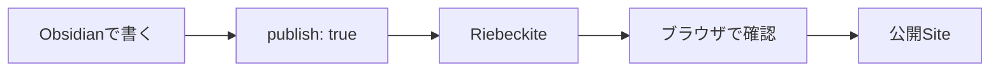
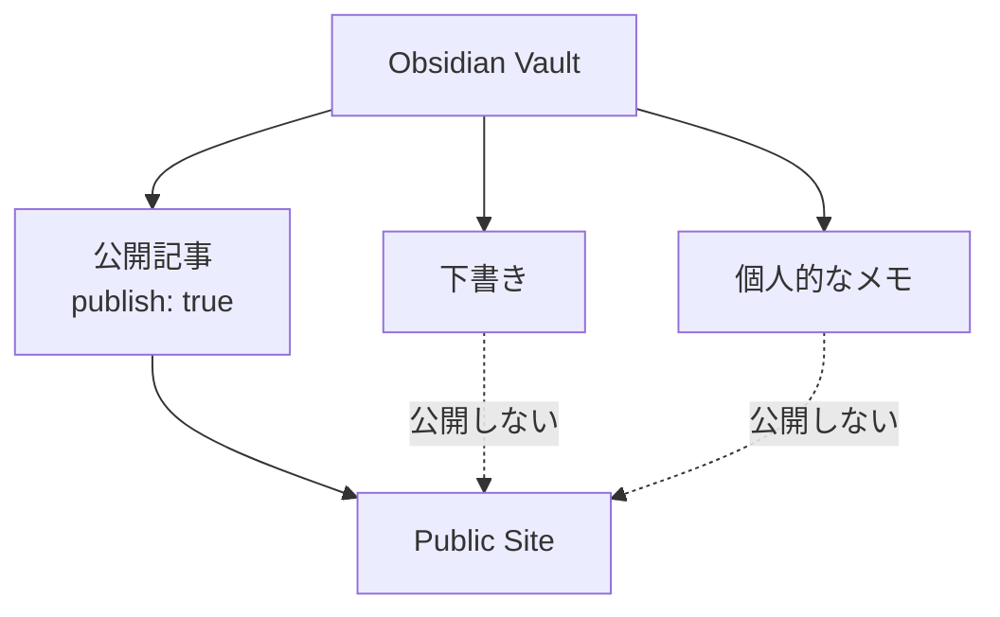
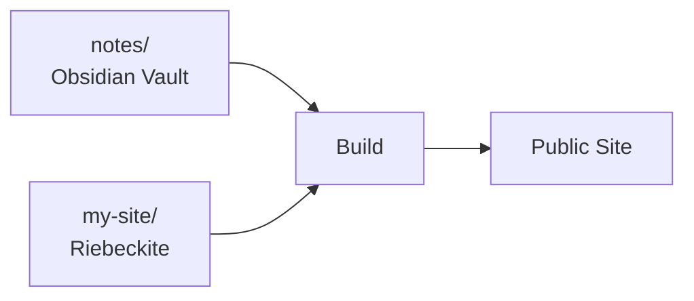
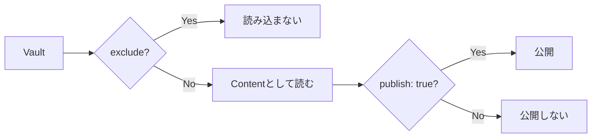
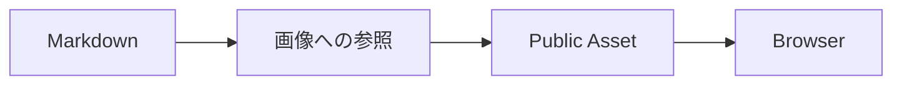
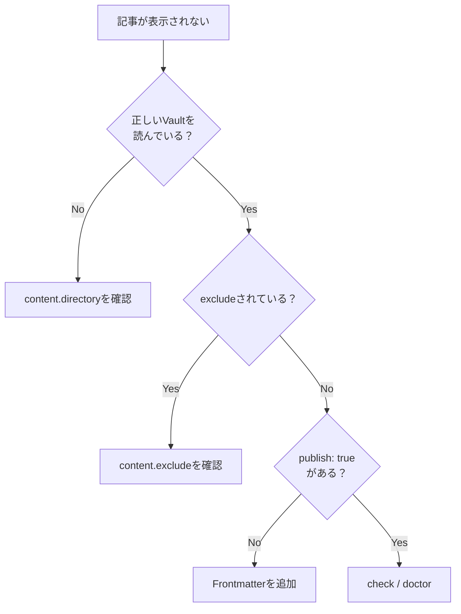
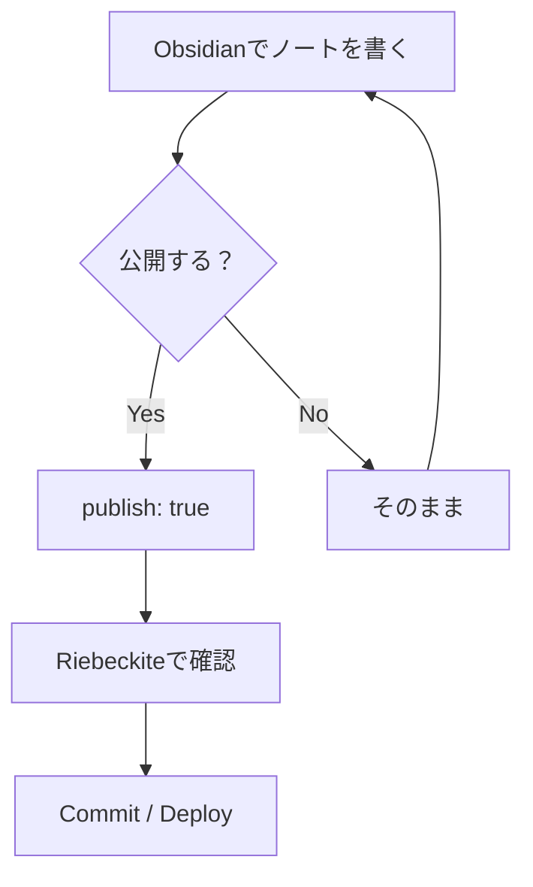

# Obsidian のノートをサイトにする

Riebeckite では、**普段使っている Obsidian Vault をそのまま記事の置き場所として利用できます。**

既存の Vault を Riebeckite 用に作り直したり、Markdown を別の形式へ変換したりする必要はありません。

基本的な流れは次のとおりです。



Riebeckite に Vault の場所を指定し、**公開したいノートだけに `publish: true` を付ける**のが基本です。

## 既存の Vault はそのまま使える

Obsidian Vault は Markdown ファイルが入ったフォルダです。

Riebeckite も指定されたフォルダから Markdown を読み込むため、`content.directory` に Vault の場所を指定すれば Content として利用できます。

たとえば、

```text id="ztw0m3"
notes/
├─ Welcome.md
├─ Programming/
│  └─ Flutter.md
├─ private/
│  └─ memo.md
└─ .obsidian/
```

という既存 Vault を、そのまま Riebeckite から読み込めます。

通常の、

```text id="52h4vi"
dev
check
doctor
inspect
build
```

を実行しても、Riebeckite が Vault の Markdown を整理したり、勝手に書き換えたりすることはありません。

ノートの編集はこれまでどおり Obsidian で行います。

## 公開するノートを選ぶ

既定の公開ルールでは、Frontmatter に、

```yaml id="mm8gy2"
publish: true
```

があるノートだけを公開します。

たとえば、

```md id="6kpm95"
---
title: 公開する記事
publish: true
---

この記事は公開されます。
```

とします。

一方、

```md id="c04z4a"
---
title: 個人的なメモ
---

これは個人的なメモです。
```

には `publish: true` がないため、公開対象になりません。



そのため、

**公開記事と個人的なノートを同じ Vault に置いたまま運用できます。**

## Vault の置き方

Vault の配置方法は、大きく2つあります。

### パターンA：Site の `content/` を Vault にする

最も簡単な方法です。

Riebeckite Site の、

```text id="bgatph"
content/
```

をそのまま Obsidian Vault として開きます。

```text id="f7zqjr"
my-site/
├─ content/              ← Obsidianで開く
│  ├─ Welcome.md
│  └─ Articles/
│     └─ FirstArticle.md
│
├─ riebeckite.config.ts
└─ package.json
```

この場合は標準設定のまま利用できます。

```ts id="7o5xhd"
content: {
  directory: "content",
},
```

初めて Riebeckite と Obsidian を組み合わせるなら、この方法が最も単純です。

```text id="ohx0fd"
my-site/content/
       ↓
Obsidian Vault
       ↓
Riebeckite Content
```

同じフォルダが両方の役割を持ちます。

## パターンB：既存 Vault を利用する

すでに Obsidian Vault がある場合は、Site の外に置いたまま利用できます。

たとえば、

```text id="k06dgu"
workspace/
├─ notes/                ← 既存のObsidian Vault
│  ├─ Welcome.md
│  ├─ Programming/
│  └─ .obsidian/
│
└─ my-site/              ← Riebeckite Site
   ├─ app/
   ├─ riebeckite.config.ts
   └─ package.json
```

という構成にします。

`my-site/riebeckite.config.ts` から Vault を指定します。

```ts id="czcujq"
content: {
  directory: "../notes",
},
```

これだけで `notes/` を Riebeckite の Content Directory として利用できます。



Vault を Site Directory へコピーする必要はありません。

Repository 自体も分離したい場合は、[記事とサイトのリポジトリ分離](./content-repositories.md) を参照してください。

## どちらを選ぶ？

迷った場合は、次の基準で選べます。

| 状況 | おすすめ |
| --- | --- |
| 初めて Riebeckite を使う | `content/` を Vault にする |
| すでに Vault がある | 既存 Vault を指定する |
| Vault と Site の Git 履歴を分けたい | Repository を分離する |
| Vault を Private Repository にしたい | Repository を分離する |

既存 Vault があるなら、Riebeckite のためだけに移動する必要はありません。

## Obsidian で記事を書く

公開する記事には、最低限 `title` と `publish` を指定します。

```md id="9y29hw"
---
title: 記事のタイトル
publish: true
---

本文を書きます。
```

本文は通常の Markdown として書けます。

```md id="wm76s7"
# 見出し

本文を書きます。

## 次の見出し

さらに本文を書きます。
```

Obsidian の WikiLink も利用できます。

```md id="5d4bby"
詳しくは [[別の記事]] を参照してください。
```

対応する Plugin が、Riebeckite の Content 情報を使って公開先のリンクを解決します。

## ファイル名と URL

ファイル名は Content の識別や既定の Public Location を決める材料になります。

たとえば、

```text id="x1m3cc"
getting-started.md
```

のような分かりやすい名前にしておくと、Vault と Site の両方で管理しやすくなります。

ただし、Riebeckite では最終的な URL は解決済みの Public Location として扱われます。

そのため、

```text id="12x76m"
ファイルの物理Path
=
常に公開URL
```

と考えないようにしてください。

Plugin や設定によって Public Location が変更される場合があります。

URL の仕組みを詳しく知りたい場合は [Content System](../framework/content-system.md) を参照してください。

## Obsidian の設定ファイル

Vault には通常、

```text id="wm1hpc"
.obsidian/
```

があります。

これは Obsidian 自体の設定であり、記事ではありません。

必要に応じて `content.exclude` から除外できます。

```ts id="0vwyam"
content: {
  directory: "../notes",

  exclude: [
    ".obsidian/**",
  ],
},
```

Template や Private Directory も Content として読み込みたくない場合は、

```ts id="xemlcl"
content: {
  directory: "../notes",

  exclude: [
    ".obsidian/**",
    "Templates/**",
    "private/**",
  ],
},
```

のように指定できます。

## `exclude` と `publish: true`

この2つは役割が異なります。



`exclude` は、

**Riebeckite に Content として読み込ませないもの**

を指定します。

`publish: true` は、

**読み込んだ Content の中から公開するもの**

を指定します。

たとえば、

```text id="z7yyqm"
.obsidian/
Templates/
private/
```

のように明らかに Site で扱わない Directory は `exclude` し、それ以外の Note は `publish: true` で公開を選ぶ、という使い方ができます。

## 非公開メモを混ぜる

Private Note や下書きを同じ Vault に置く場合は、`publish: true` を付けません。

```md id="0n1eqs"
---
title: 個人的なメモ
---

公開しない内容です。
```

既定の公開ルールなら、この Note は Site に公開されません。

一方、公開記事は、

```md id="d8iz87"
---
title: 公開記事
publish: true
---

公開する内容です。
```

とします。

Private Vault を扱う場合は、**公開するものだけを明示する**運用にすると管理しやすくなります。

## 公開記事から非公開ノートへのリンク

公開記事から、

```md id="tm0f93"
[[個人的なメモ]]
```

のように非公開 Note へリンクしてしまうことがあります。

公開前には、

```sh id="4ehd60"
npm exec riebeckite doctor
```

などで問題がないか確認してください。

Site 内リンクの整合性を診断する Plugin を利用している場合は、公開先が存在しない WikiLink なども検出できます。

## 画像と添付ファイル

画像や添付ファイルも Vault 内で管理できます。

たとえば、

```text id="tyn3v3"
notes/
├─ article.md
└─ images/
   └─ photo.jpg
```

のようにします。

Markdown からは、

```md id="mmg4ki"

```

のように参照できます。

ただし、ここでは **Markdown から画像を参照できること**と、**画像ファイル自体が公開 Site に存在すること**を分けて考える必要があります。



Vault の外にある File や、Build 後の Public Output に存在しない File は表示できません。

添付ファイルを Site へ公開する構成では、公開対象の Asset が実際に Output へ含まれていることも確認してください。

## Site を確認する

記事を書いたら、Riebeckite Site の Directory で Development Server を起動します。

```sh id="uejsnw"
npm exec riebeckite dev
```

Browser で公開対象の記事を確認します。

問題がないか確認する場合は、

```sh id="b4s9ol"
npm exec riebeckite check
npm exec riebeckite doctor
```

を実行できます。

実際に Riebeckite がどの Content を認識しているか確認したい場合は、

```sh id="h7xl6g"
npm exec -- riebeckite inspect content --list
```

を利用できます。

## 記事が表示されないとき

記事が表示されない場合は、次の順番で確認すると原因を絞りやすくなります。



解決済みの Content Directory は、

```sh id="99glhk"
npm exec riebeckite inspect config
```

で確認できます。

読み込まれている Content は、

```sh id="csgeqn"
npm exec -- riebeckite inspect content --list
```

で確認できます。

## 普段の使い方

設定が終わった後は、特別な操作はほとんど必要ありません。



つまり、普段の執筆方法はこれまでとほぼ同じです。

**Obsidian で書き、公開したい Note にだけ `publish: true` を付けます。**

Riebeckite は、その Vault を公開 Site の Content Source として利用します。

## まとめ

Obsidian と Riebeckite の関係はシンプルです。

```text id="f1sfdm"
Obsidian Vault
      ↓
Markdown
      ↓
Riebeckite
      ↓
publish: true のNote
      ↓
Public Site
```

既存 Vault を Riebeckite 用に作り直す必要はありません。

最初から始めるなら、

```text id="7vtvgj"
my-site/content/
  → Obsidian Vault
```

既存 Vault があるなら、

```text id="7w2i31"
notes/
  → 既存Vault

my-site/
  → Riebeckite Site
```

という構成が使えます。

重要なのは、**Vault の場所と公開範囲を分けて考えること**です。

- `content.directory` → どの Vault を読むか
- `exclude` → 何を Content として読まないか
- `publish: true` → 何を Site に公開するか

この3つを分けて設定すれば、普段の Obsidian Vault に非公開 Note を残したまま、必要な記事だけを Riebeckite で公開できます。

### 次に読むもの

- [記事の書き方ガイド](./writing-content.md)
- [記事とサイトのリポジトリ分離](./content-repositories.md)
- [Content System](../framework/content-system.md)
