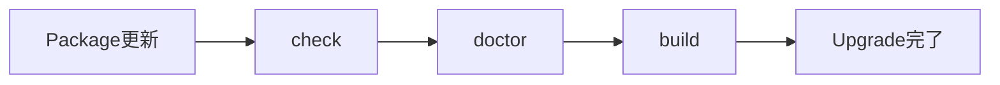
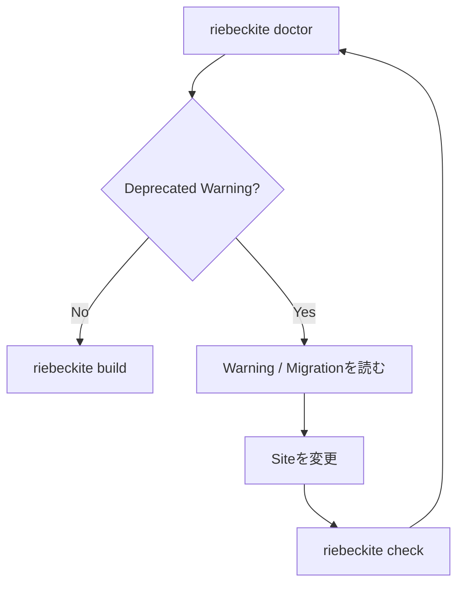
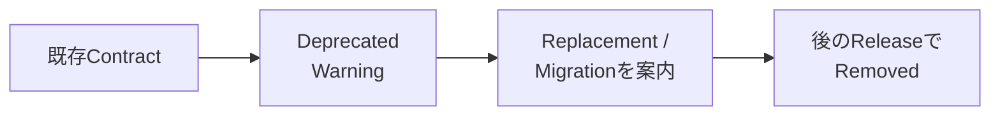
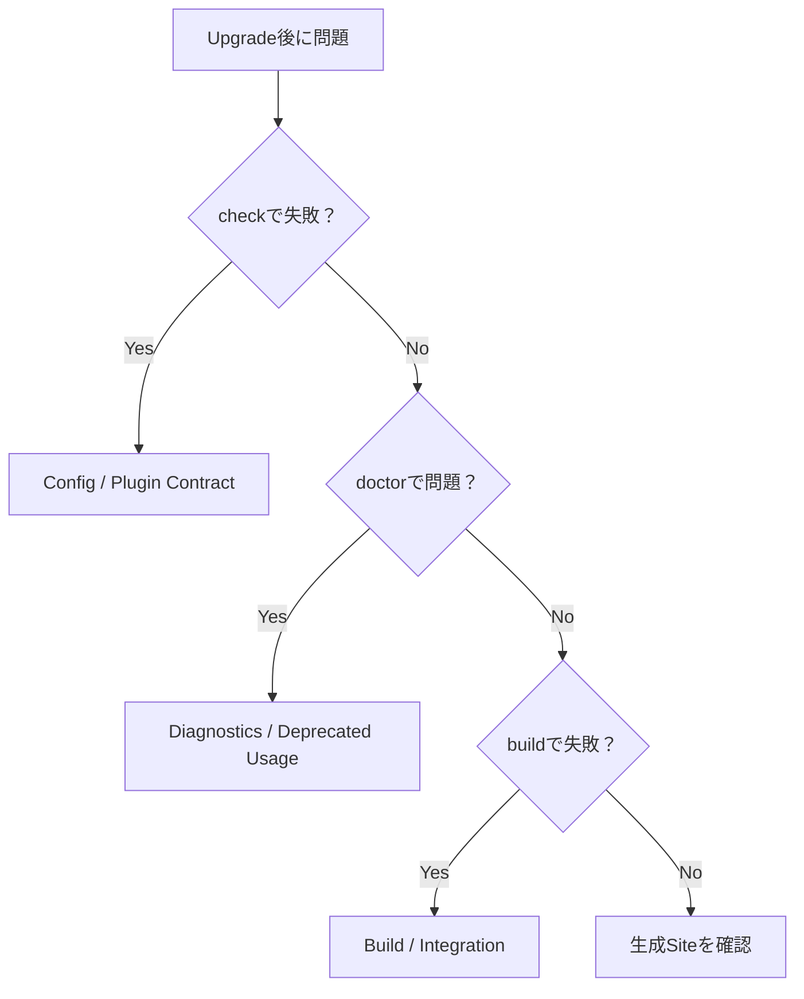

# Riebeckite をアップグレードする

既存 Site を新しい Riebeckite へ更新するときの手順です。

基本的には、

```text
現在のVersionを確認
        ↓
Packageを更新
        ↓
riebeckite check
        ↓
riebeckite doctor
        ↓
riebeckite build
        ↓
Deprecated Warningを確認
```

の順で進めます。

Riebeckite は現在 pre-1.0 です。更新時には、Package の Version を上げるだけでなく、`doctor` で Deprecated Usage がないか確認してください。

## 1. 現在の Version を確認する

まず、現在 Site で利用している Riebeckite Package を確認します。

```sh
npm ls @riebeckite/core @riebeckite/cli @riebeckite/honox
```

Plugin や Theme を利用している場合は、それらの Version も合わせて確認してください。

更新前の状態を Commit しておくと、変更点を確認したり問題が起きた場合に戻したりしやすくなります。

## 2. Riebeckite Package を更新する

Site で利用している Riebeckite Package をまとめて更新します。

対象には、

```text
@riebeckite/core
@riebeckite/cli
@riebeckite/honox
@riebeckite/plugin-*
@riebeckite/theme-*
```

などがあります。

Site が実際に利用している Package を確認し、必要なものを更新してください。

## 3. Site を検証する

Package を更新したら、普段の検証を実行します。

```sh
npm exec riebeckite check
npm exec riebeckite doctor
npm exec riebeckite build
```

それぞれ確認するものが異なります。

| Command | 主に確認すること |
| --- | --- |
| `check` | Config や Plugin Contract が正しいか |
| `doctor` | Deprecated Usage を含む Site の問題 |
| `build` | 実際に Site を生成できるか |



`check` が成功しただけで終わらせず、`doctor` と実際の `build` まで確認してください。

## Deprecated Warning を確認する

アップグレード後は、

```sh
npm exec riebeckite doctor
```

を実行します。

古い Contract を使用している場合は、`Deprecated usage` Check に Warning が表示されます。

Deprecated とは、

**現在は利用できるが、今後の推奨 Contract ではない**

という意味です。

Deprecated になっただけで、その Release から突然 Build が失敗するという意味ではありません。

```text
現在
  → まだ利用可能
  → doctorでWarning

将来
  → 削除される可能性がある
  → それまでにMigration
```

### Warning に表示される情報

Deprecated Warning には、原則として次の情報が含まれます。

- 何が Deprecated なのか
- いつ Deprecated になったか
- Replacement がある場合は何を使うか
- 必要な Migration Action
- 詳細 Documentation
- 削除予定 Version が決まっている場合はその Version

たとえば考え方としては、

```text
Deprecated:
  oldOption

Replacement:
  newOption

Action:
  configをnewOptionへ変更

Removal:
  0.x.x
```

のような情報から、必要な変更を判断します。

## Deprecated Warning が出たら

Warning に表示された対象を確認します。

変更対象になる可能性があるものには、

- Config
- Plugin API
- Theme API
- CLI Option
- Scaffold の生成物
- Package Reference

などがあります。

Replacement が示されている場合は、新しい Contract へ変更します。

Migration Documentation が示されている場合は、その手順に従ってください。

変更後、もう一度、

```sh
npm exec riebeckite check
npm exec riebeckite doctor
npm exec riebeckite build
```

を実行します。



## Warning と Error の違い

Deprecated Usage は基本的に Warning です。

そのため、Deprecated Warning だけが存在する `doctor` の結果は成功として扱われます。

一方、Error は Site を正しく扱えない問題に使用されます。

たとえば、

```text
invalid configuration
dependency の欠落
inspection を妨げる content 問題
すでに削除された API
```

などです。

| 状態 | 意味 | 対応 |
| --- | --- | --- |
| Warning | 現在は動くが確認が必要 | Migration を計画する |
| Error | 現在の Site に問題がある | Upgrade 完了前に修正する |

Deprecated Warning があるからといって、すぐに Site が動かなくなるわけではありません。

ただし削除予定 Version が示されている場合は、それまでに Migration してください。

## Deprecation Policy

Riebeckite では、API や Config の変更状態を次のように区別します。

| 用語 | 意味 |
| --- | --- |
| Deprecated | 現在は Support されているが、将来変更・削除される Contract |
| Removed | すでに Support されていない Contract |
| Breaking Change | Site 側の変更が必要になる可能性がある変更 |
| Migration | 古い Contract から新しい Contract へ移るための手順 |

### Deprecated

Deprecated になった Contract は、当面利用できます。

ただし、将来削除される可能性があるため、可能なタイミングで Migration してください。

```text
Supported
   ↓
Deprecated
   ↓
Migration期間
   ↓
Removed
```

### Removed

Removed になった Contract は、すでに Support されていません。

そのまま利用すると、

- Validation
- Build
- Runtime Check

などで失敗する可能性があります。

Deprecated Warning が出ていた Contract を長期間そのままにすると、将来の Upgrade で Removed に到達する可能性があります。

### Breaking Change

Breaking Change は、

- Site
- Config
- Plugin
- Theme
- Deployment

などの変更が必要になる可能性がある変更です。

必ずしも単純な API 名の置き換えとは限りません。

Migration Documentation がある場合は、その内容を確認してください。

## Pre-1.0 の互換性

Riebeckite は現在 pre-1.0 です。

そのため、安定版 1.x と同じ SemVer の互換期間を保証するものではありません。

ただし、Security や Correctness 上の理由がない限り、

```text
Deprecatedにする
      ↓
同じReleaseですぐ削除
```

という変更は行いません。

可能な限り、



という段階を踏みます。

つまり、利用者が新しい Contract へ移行するための期間を設ける方針です。

## Migration Note の読み方

Upgrade で問題が出た場合は、まず `doctor` を確認してください。

```sh
npm exec riebeckite doctor
```

`doctor` の Warning は、**現在の Site が実際に使用している古い要素**を直接示します。

そのため、最初からすべての Migration Documentation を読むより、

```text
doctor
   ↓
Deprecated Warning
   ↓
該当するMigration Documentation
   ↓
Siteを変更
```

という順番で確認する方が効率的です。

### Replacement がある場合

Warning に直接 Replacement が示されている場合は、それを確認します。

```text
old contract
     ↓
replacement
     ↓
new contract
```

### Replacement がない場合

すべての Breaking Change が、

```text
oldA → newA
```

のような一対一の置き換えになるとは限りません。

直接の Replacement がない場合は、無理に代替 API を探さず、Migration に記載された Action に従ってください。

たとえば、

```text
古い設定を削除する

設定方法そのものを変更する

Plugin構成を変更する

生成されたFileを更新する
```

といった Migration もあり得ます。

## Migration は自動ではない

現時点の Riebeckite には、

```sh
riebeckite migrate
```

のような自動 Migration Command はありません。

また、Site の Config や Code を自動で書き換える機能もありません。

Migration は内容を確認して手動で適用します。

```text
Warningを確認
      ↓
Migrationを読む
      ↓
手動で変更
      ↓
Diffを確認
      ↓
check / doctor / build
      ↓
Commit
```

自動で書き換えないことで、Upgrade によって Site のどこが変わったのかを利用者自身が確認できます。

## 変更は分けて Commit する

Migration を適用したら、その変更を Commit しておくと次回以降の Upgrade を確認しやすくなります。

たとえば、

```text
1. Upgrade前の状態
2. Package Version更新
3. Migration
```

を Git の履歴から追えるようにしておくと、問題が発生した場合の切り分けも容易になります。

## Upgrade で問題が起きたら

問題の種類によって確認する場所を変えます。



まず、

```sh
npm exec riebeckite check
npm exec riebeckite doctor
npm exec riebeckite build
```

のどこで問題が発生しているかを確認してください。

Deprecated Warning なら Migration、Error ならその Diagnostic が示している問題を先に解決します。

## Upgrade Checklist

Riebeckite を更新するときは、次の項目を確認します。

- 現在の Riebeckite Package Version を確認した
- Upgrade 前の変更を Commit した
- 利用している Riebeckite Package を更新した
- `riebeckite check` が成功した
- `riebeckite doctor` を確認した
- Deprecated Warning の内容を確認した
- 必要な Migration を適用した
- `riebeckite build` が成功した
- 生成された Site を確認した
- Upgrade と Migration の変更を Commit した

## まとめ

Riebeckite の Upgrade は、Package Version を変更するだけで終わりではありません。

```text
Packageを更新する
      ↓
check
      ↓
doctor
      ↓
Deprecated Usageを確認
      ↓
必要ならMigration
      ↓
build
      ↓
Siteを確認
```

という流れで確認します。

特に覚えておくとよいのは、

```text
Deprecated
  → 今は使える
  → 将来に備えてMigrationする

Removed
  → もうSupportされていない

Warning
  → 確認・Migration対象

Error
  → Upgrade完了前に修正する
```

という違いです。

Riebeckite は pre-1.0 のため Breaking Change が発生する可能性がありますが、Security や Correctness 上の理由がない限り、可能な範囲で **Deprecated → Warning / Migration → Removed** の段階を踏んで変更します。
