# Plugin System

Riebeckite Plugin は、Riebeckite の機能を Core や Site Application に直接組み込まず、再利用可能な形で追加するための仕組みです。

Plugin では、たとえば次のような機能を追加できます。

- Markdown / HTML の変換
- コンテンツの処理
- 独自形式の埋め込み表示
- 独立したページ
- CSS
- Browser 上の処理
- HTTP Endpoint
- SEO
- Diagnostics
- Content Graph の拡張

Plugin は必要な機能だけを実装します。

すべての API を使う必要はありません。

# まず何を使うか決める

Plugin を作るときは、最初に **目的に合った最小の Extension Point** を選びます。

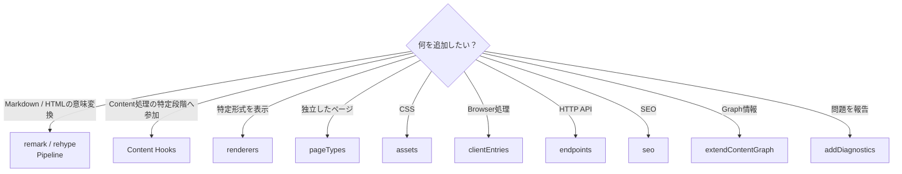

たとえば Canvas や Excalidraw を記事内へ表示するなら `renderers`、`/explore` のような独立したページを提供するなら `pageTypes` を使います。

独立画面が必要だからといって、Plugin 固有の HonoX route を追加するわけではありません。

# 最小の Plugin

最も小さい Plugin は次のように作れます。

```ts
import { definePlugin } from "@riebeckite/core";

export function examplePlugin() {
  return definePlugin({
    name: "example",
  });
}
```

Plugin に設定を持たせる場合は、factory の引数として受け取ります。

```ts
type ExampleOptions = {
  enabled?: boolean;
};

export function examplePlugin(
  options: ExampleOptions = {},
) {
  return definePlugin({
    name: "example",
    options,
  });
}
```

`definePlugin()` が Plugin の共通 contract を提供します。

# Plugin が持てる機能

`RiebeckitePlugin` には、大きく次の Extension Point があります。

| 分類 | 主な API |
| --- | --- |
| 基本情報 | `name`, `enabled`, `order`, `options` |
| 依存関係 | `provides`, `requires`, `optional` |
| 設定検証 | `validateOptions` |
| Cache | `cacheVersion`, `context.cache` |
| Lifecycle | `setup`, `buildStart`, `buildEnd`, `dispose` |
| Content | `onConfigResolved`, `onContentLoaded`, `onPostParsed`, `onPostProcessed`, `onManifestCreated` |
| 公開先 | `resolveContentLocations` |
| Markdown / HTML | `remarkPlugins`, `rehypePlugins`, `extendMarkdownPipeline`, `extendHtmlPipeline` |
| Graph | `extendContentGraph` |
| Diagnostics | `addDiagnostics` |
| 埋め込み表示 | `renderers` |
| 独立ページ | `pageTypes` |
| Browser | `assets`, `clientEntries` |
| HTTP | `endpoints` |
| SEO | `seo` |

Legacy / compatibility 用として `onBuildStart`、`onBuildEnd` も存在します。

Plugin はこの中から**必要なものだけ**を使用してください。

# Plugin の有効化

Plugin は `riebeckite.config.ts` の `plugins` へ追加します。

```ts
plugins: [
  myPlugin(),
]
```

条件付きで有効化することもできます。

```ts
plugins: [
  condition && myPlugin(),
]
```

`false`、`null`、`undefined` は Plugin の解決時に除外されます。

また、

```ts
enabled: false
```

の Plugin も実行対象になりません。

# Plugin の順序と依存関係

単純な実行順は `order` で指定できます。

ただし、Plugin 同士に実際の依存関係がある場合は `order` ではなく **Capability** を使用します。

```ts
definePlugin({
  name: "consumer",

  provides: [
    "example.output",
  ],

  requires: [
    "content.graph",
  ],

  optional: [
    "example.optional",
  ],
});
```

それぞれの意味は次のとおりです。

| Field | 意味 |
| --- | --- |
| `provides` | この Plugin が提供する機能 |
| `requires` | 必ず必要な機能 |
| `optional` | あれば利用する機能 |

Resolver は依存関係から Plugin の実行順を決定します。

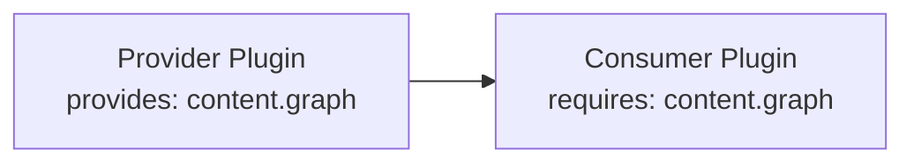

次のような状態は Configuration Error になります。

- 必須 Capability が存在しない
- 同じ Capability を複数 Plugin が提供する
- 依存関係が循環している

依存関係のない Plugin については、入力順を可能な限り維持します。

# Options Validation

TypeScript の型だけでは、実行時に渡される設定値が必ず正しいとは保証できません。

必要な Plugin は `validateOptions` を実装できます。

Validation は、

```text
Plugin Options
      ↓
validateOptions
      ↓
Structured Issues
      ↓
Config Validation
```

という流れで扱われます。

Validator は **設定の検証だけ**を行ってください。

ここで、

- filesystem scan
- Build
- Cache write
- 外部状態の変更

などを行わないでください。

問題は structured issue として返し、Riebeckite の Config Validation がまとめて表示できるようにします。

# Plugin Context

Plugin は Framework の機能を `PluginContext` から受け取ります。

基本的な Context は概念的に次のようなものです。

```ts
type PluginContext = {
  config?: ResolvedRiebeckiteConfig;
  contentIndex: Map<string, string>;
  diagnostics: Diagnostic[];
  cache: PluginCache;
  logger: Logger;
  tracer: Tracer;
};
```

Hook によって、

- `slug`
- `markdown`
- `content`
- `manifest`
- `entries`
- Public Location の入力

などが追加されます。

Plugin 内で global singleton を作るより、Context から Framework Service を受け取ることを優先してください。

# Lifecycle

Plugin には Framework 全体の Lifecycle と、Content 処理の Lifecycle があります。

Framework Lifecycle には、

```text
setup
buildStart
buildEnd
dispose
```

があります。

`dispose` は Plugin が確保した resource の解放に使用します。

Lifecycle は解決済みの Plugin 順序に従って実行されます。

Plugin 内でエラーが発生した場合は、Plugin 名と Hook が分かる状態で上位へ伝播させます。

元の `cause` を失わないことも重要です。

# Content Lifecycle

Content 処理は概念的に次の順番で進みます。

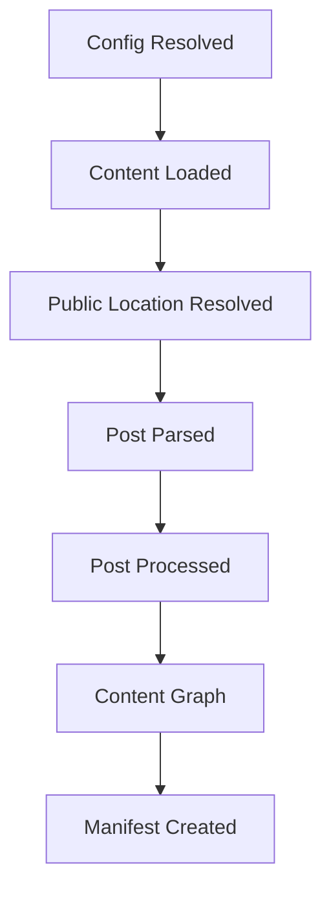

代表的な Hook として、

```text
onConfigResolved
onContentLoaded
onPostParsed
onPostProcessed
onManifestCreated
```

があります。

重要なのは、**必要な段階の Hook だけを使用すること**です。

後段ですでに得られる情報を前段で独自に再構築しないでください。

# Markdown / HTML Pipeline

Markdown や HTML の意味を変換する場合は Pipeline を使用します。

簡単な remark / rehype Plugin なら直接宣言できます。

```ts
definePlugin({
  name: "example",

  remarkPlugins: [
    remarkExample,
  ],

  rehypePlugins: [
    rehypeExample,
  ],
});
```

Pipeline 自体を構成する必要がある場合は Extension API を利用します。

```ts
definePlugin({
  name: "example",

  extendMarkdownPipeline(pipeline) {
    pipeline.use(remarkExample);
  },

  extendHtmlPipeline(pipeline) {
    pipeline.use(rehypeExample);
  },
});
```

Markdown AST や HTML AST の処理を Application Component に持ち込まず、Plugin の Pipeline 処理として実装するのが基本です。

# 処理済み Content の Build Dependency

Incremental Build の無効化は Core の責務です。Plugin は独自に affected content を計算せず、`processedContentCache` で契約を宣言します。

```ts
definePlugin({
  name: "citations",
  processedContentCache: {
    version: "citations-v1",
    dependencyMode: "tracked",
  },
  extendMarkdownPipeline(pipeline, context) {
    pipeline.use(remarkCitations, { contentSource: context.contentSource });
  },
});
```

- `none` は、処理結果が Content 本体、frontmatter、options、宣言した version だけに依存することを表します。
- `tracked` は、Pipeline が他の Content や file を読む場合に使います。`context.contentSource` 経由で読めば、Core が dependency を記録し、利用側だけを再処理します。たとえば citations Plugin は `readContentSourceEntry(context.contentSource, path)` で BibTeX file を読みます。
- `unsafe` は処理済み Content の永続的な再利用を無効にします。Content 処理を行う Plugin が契約を宣言しない場合も、同じ安全側の全 Content 再処理になります。

`tracked` の dependency は Content 処理中に取得します。Core が content/file の identity を永続化し、逆引き index から次回 Build で affected content を決定します。この用途で vault を独自に走査したり、Plugin 固有の Incremental Build state を保存したりしないでください。Framework API 経由で dependency を追跡できない場合は `unsafe` を使います。広い再処理は許容されますが、古い結果の再利用は許容されません。

これは Output Dependency とは別の契約です。`pageTypes[].outputDependencies` と `context.output.emit(..., { dependencies })` は、再生成が必要な page や生成 file を表します。ここでは `content`、`tag`、`folder`、`global`、`unknown` を使います。`unknown` は安全側として全 Output の再生成を要求します。

# Public Location

Plugin は `resolveContentLocations` を使って、コンテンツの公開先を変更できます。

最初に Core が標準の公開先を計算します。

```text
index
  → /

その他
  → /{slug}
```

その後、Plugin が順番に Public Location を解決します。

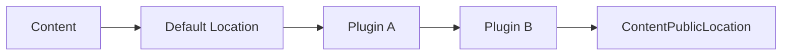

結果は `ContentPublicLocation` として Manifest、Content Graph、Markdown Pipeline などから利用されます。

URL strategy 自体は Plugin の責務です。

たとえば、

- identity field
- frontmatter ID
- hash
- URL path
- redirect

などの規則は Plugin が定義できます。

Core は特定 Plugin の URL 規則を知りません。

Consumer は最終的に解決された、

```ts
entry.permalink
```

を利用します。

slug から URL を再構築したり、特定 Plugin が有効かどうかで URL を分岐したりしないでください。

Public Location が解決できない場合も、slug へ暗黙的に fallback せず明示的なエラーとして扱います。

# Renderers

`renderers` は、特定の Content Target を Plugin 固有の HTML へ変換する仕組みです。

たとえば、

- Canvas
- Excalidraw
- Media
- Attachment

のような埋め込み表示に利用できます。

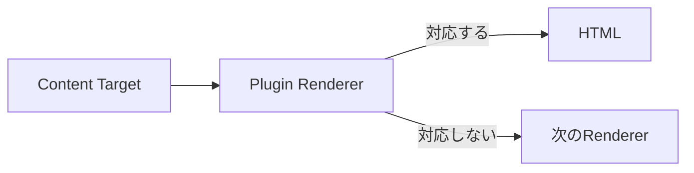

Renderer Context には、

```text
kind
path
raw
label
url
embed
```

などと通常の `PluginContext` が含まれます。

対象でなければ `null` を返し、他の Renderer に処理を委ねられるようにします。

# Body Slots

Plugin は、route を追加したり document shell を書き換えたりせずに、Site が所有する article layout の名前付き位置へ HTML fragment を提供できます。slot 名の contract は Core の `ContentBodySlot` が定義し、どの slot をどこに描画するかは Site が決めます。

標準の article layout は次の slot を認識します。

| Slot | 位置 |
| --- | --- |
| `article.after-header` | article header の直後 |
| `article.after-meta` | title / meta block の後 |
| `article.aside` | article aside 内 |
| `article.before-content` | 本文の前 |
| `article.after-content` | 本文の後 |
| `article.footer` | article footer 内 |

`ContentBodySlot` は他の文字列も受け付けるため、独自 Site は追加の slot 名を定義できます。`@riebeckite/plugin-properties` が使う `properties` は、標準 set に含まれない独自 slot の例です。

fragment は `@riebeckite/core` の `appendContentBodySlot` で提供します。通常は `onManifestCreated` などの manifest hook から呼び出します。

```ts
import { appendContentBodySlot } from "@riebeckite/core";

appendContentBodySlot(entry, "article.after-content", "<section>...</section>");
```

空の fragment は無視され、fragment は解決済み Plugin 順に蓄積されます。先に処理された Plugin の contribution は保持され、新しい fragment が末尾へ追加されます。

関連コンテンツ、履歴、ナビゲーション、backlinks など記事末尾の section には `article.footer` を使います。Plugin ごとに `order` を設定して順序を固定し、route や CSS で並べ替えません。

Site は `entry.bodySlots` を読み、各値を描画するかどうかと描画位置を決めます。

```tsx
// app/components/article/article.tsx
<ContentSlot html={props.bodySlots?.["article.after-content"]} />
```

上の `ContentSlot` は参照アプリ内の Site-local な helper であり、公開 API ではありません。slot は Site 自身の renderer が描画を選んだときだけ描画され、独自 slot 名は Site が描画を選ぶまで何もしません。Plugin は代わりに Hono JSX component を export して Site に配置を任せることもできます。詳しくは [UI の提供方法](../plugins/writing-a-plugin.md#ui-の提供方法) を参照してください。

参照アプリと scaffold の starter は標準 slot を消費します。Plugin は提供し、Site が描画します。Plugin が route、shell、描画順を変更することはありません。route レベルの contract は [Body Slots](../framework/honox-integration.md#body-slots) を参照してください。

# Page Types

`pageTypes` は Plugin が独立したページを提供するための仕組みです。

たとえば、

```text
/explore
/report
```

のようなページです。

```ts
definePlugin({
  name: "example-pages",

  pageTypes: [
    {
      id: "example.report",
      paths: ["/report"],

      resolve: ({ pathname, manifest }) =>
        pathname === "/report"
          ? {
              type: "example.report",
              pathname,
              body: `<p>${manifest.publicEntries.length}</p>`,
            }
          : null,
    },
  ],
});
```

Plugin が Application Route を直接追加する必要はありません。

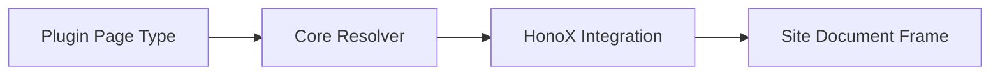

Page Type は、

- 一意な ID
- SSG path
- resolver
- 必要に応じた `priority`

を宣言します。

Page は `body` のほか、

```text
title
description
headTags
```

も返せます。

ただし、それらを最終 HTML のどこへ描画するかは Site Application が決めます。

詳しくは [Page System](../framework/page-system.md) を参照してください。

# Build Dependency

`processedContentCache` は、Core が Plugin の処理済み Content を Build 間で再利用できるかを宣言する契約です。`cacheVersion` と `context.cache` とは別のものです。

```ts
processedContentCache: {
  version: "example-v1",
  dependencyMode: "tracked",
}
```

- `none`: source Content、frontmatter、options、宣言した version だけに依存する変換です。
- `tracked`: 他の Content や file を Core 経由で読む変換です。`context.contentSource`、`readContentSourceEntry`、`renderContent`、`renderNoteEmbed` を使うと、Core が `ContentDependencyTracker` により Content/file 読み取りを自動記録します。filesystem を直接読んではいけません。
- `unsafe`: Git、network、時刻、process state など、Core が追跡できない入力です。処理済み Content の永続 Cache 再利用を安全側で無効にします。

Content Dependency は再処理する source Content を決め、Output Dependency は再出力するファイルを決めます。両者は別の契約です。Page Type は `outputDependencies` を宣言します。`onManifestCreated` で既存の manifest entry HTML を更新する Plugin は、root の `outputDependencies` を宣言すると各 Content Output に加算されます。

```ts
outputDependencies: [{ type: "global" }]

pageTypes: [{
  id: "example.report",
  paths: ["/report"],
  outputDependencies: [{ type: "tag", tag: "release" }],
  resolve: () => null,
}]
```

対象を特定できる場合は `content`、`tag`、`folder` を使います。manifest 全体に依存する集合変換は `global` を使います。表現できない入力だけに `unknown` を使ってください。`unknown` は安全側で再生成し、全 Output の再生成を要求します。依存を宣言しない Generated Output も `unknown` です。

# Content Graph

Content Graph を拡張する場合は、

```text
extendContentGraph
```

を使用します。

たとえば Backlinks や Graph 系 Plugin が独自に filesystem を scan してリンク関係を再構築するのではなく、既存の Manifest / Content Graph を利用します。

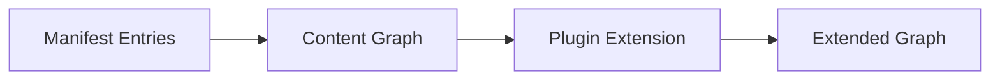

Content System がすでに解決した情報を再利用することが重要です。

# Assets

Plugin 固有の CSS は Plugin package 内に置き、`assets` で公開します。

```ts
assets: [
  {
    pluginName: "example",
    kind: "style",
    moduleSpecifier:
      "@riebeckite/plugin-example/style.css",
  },
]
```

Plugin CSS を `apps/web` へコピーしたり、Browser から `/node_modules` を直接参照させたりしないでください。

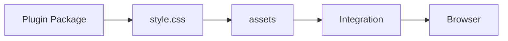

# CSS Hooks

再利用可能な Plugin UI には、最外要素へ stable な CSS Hook を付けます。

Plugin の Hook は、

```text
rr-<feature>
```

という名前を使います。

たとえば、

```text
rr-search
rr-callout
rr-query
rr-code
```

です。

内部要素は BEM 形式を使用できます。

```text
rr-search
rr-search__input
rr-search__result
rr-search--loading
```

Plugin 固有の出力を `rb-*` namespace に置かないでください。

| Namespace | 用途 |
| --- | --- |
| `rb-*` | Framework の構造 Hook |
| `--rb-*` | Framework の Semantic Design Token |
| `rr-*` | Plugin / Feature Hook |
| `--rr-*` | Plugin 固有 Token |

既存の class がある場合、`rr-*` は置き換えではなく追加します。

Theme に公開する必要がある Hook だけを stable contract として文書化してください。

Plugin の default CSS は Theme CSS より先に読み込まれるため、Theme は Plugin package を変更せずに見た目を上書きできます。

詳しくは [Theme System](./theme-api.md#stable-css-hooks) を参照してください。

# Client Entries

Browser 上で JavaScript を実行する必要がある場合だけ `clientEntries` を使用します。

```ts
clientEntries: [
  {
    pluginName: "example",
    moduleSpecifier:
      "@riebeckite/plugin-example/client",
    exportName: "initExample",
    publicConfig: {
      selector: ".example",
    },
  },
]
```

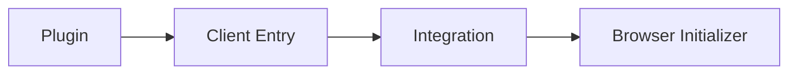

SSR / Build-time だけで完結する Plugin に Client JavaScript を追加しないでください。

`publicConfig` は Browser へ渡される公開情報です。

そのため、

- token
- credential
- private service URL
- secret

などを含めてはいけません。

Plugin の `options` が自動的に Browser へ渡されることもありません。

# HTTP Endpoints

Plugin が再利用可能な HTTP Endpoint を提供する場合は `endpoints` を使用します。

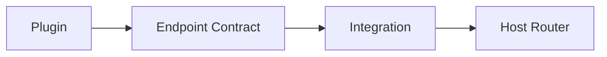

HonoX など特定の Router 実装を Plugin 本体へ直接埋め込まず、Integration が Endpoint Contract を Host Router へ接続します。

# SEO

Plugin が metadata や feed などの SEO 処理へ参加する場合は `seo` Extension Point を使用します。

Plugin 固有の SEO logic を Application Route 側へ再実装しないでください。

# Diagnostics

Plugin 固有の問題を報告する場合は `addDiagnostics` を使用します。

```ts
addDiagnostics(context) {
  return [
    {
      // Diagnostic contract
    },
  ];
}
```

診断結果は可能な限り structured data として返します。

Plugin が直接、

```ts
console.log(...)
```

で CLI 向けメッセージを出すのではなく、Diagnostics または Logger を利用してください。

# Plugin Cache

`context.cache` は Plugin ごとに分離された **Build-time Cache** です。

Cache に保存する値は、

- 再生成可能
- JSON serializable
- Plugin namespace 内で完結

している必要があります。

`cacheVersion` を使って Cache format の互換性を管理できます。

壊れた Cache は安全に Cache Miss として扱える設計にしてください。

Write は atomic に行います。

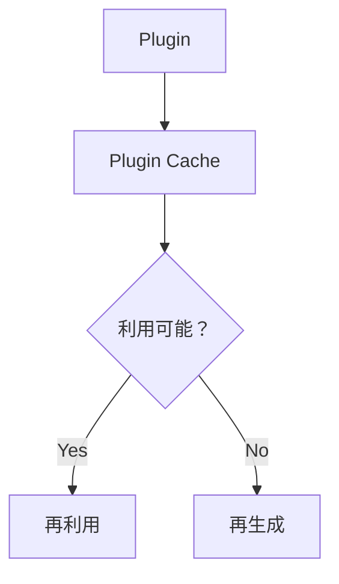

これは Cloudflare Workers などの Runtime Database ではありません。

# Logger / Tracer

Plugin から Framework の Observability を利用できます。

```ts
context.logger.info("...");

await context.tracer.span(
  "plugin.example.work",
  {
    plugin: "example",
  },
  async () => {
    // work
  },
);
```

Logger は「何が起きたか」、Tracer は「どこに時間がかかったか」を記録します。

Profiler はこの structured trace を利用するため、Plugin が独自の stopwatch や profiling system を作る必要はありません。

# Site 内だけで使う Plugin

Plugin は npm package として公開する必要はありません。

Site 内に Plugin を作ることもできます。

```ts
// site/extensions/local-plugin.ts

return definePlugin({
  name: "site-local",

  assets: [
    {
      pluginName: "site-local",
      kind: "style",
      moduleSpecifier:
        "/extensions/plugin.css",
    },
  ],
});
```

そして `riebeckite.config.ts` の `plugins` へ追加します。

Site-local Plugin でも、

- Dependency Resolution
- Pipeline Hooks
- Diagnostics
- Renderer
- Endpoint

などは package Plugin と同じ contract を利用します。

未公開 Plugin では `createStyleAsset()` が生成する package path を利用できないため、Host Bundler が解決できる `moduleSpecifier` を明示してください。

# 推奨 Package 構成

公開 Plugin は、たとえば次のように構成できます。

```text
packages/plugins/example/
├─ index.ts
├─ components/        # component を export する場合のみ
├─ client.ts          # 必要な場合のみ
├─ style.css          # 必要な場合のみ
├─ package.json
└─ src/
   ├─ remark.ts
   ├─ rehype.ts
   ├─ renderer.ts
   └─ types.ts
```

すべての Plugin がこの構造を必要とするわけではありません。

Client JavaScript や CSS が不要なら、それらのファイルも不要です。

# Repository 外で Plugin を配布する

外部 Plugin は Riebeckite monorepo の内部 path に依存しないようにします。

基本的には、

```text
@riebeckite/core
```

の公開 API を利用します。

Plugin 自身が提供する、

```text
./client
./components
./style.css
```

などは、自身の `package.json` の `exports` で公開します。

次のような import は避けてください。

```ts
import {
  something,
} from "@riebeckite/core/src/...";
```

`src/**` は Public API ではありません。

また、Riebeckite monorepo 内にしか存在しない相対 path へ依存しないでください。

公式 Plugin も可能な限り同じ Public API の consumer として実装します。

# ESM

Riebeckite の package は NodeNext / ESM を前提とします。

Build 後に Node.js が実際に解決できる import を維持してください。

Development 時の TypeScript Loader が、

```text
extensionless import
```

などを偶然解決できている状態へ依存しないことが重要です。

# Plugin に置くもの・置かないもの

Plugin に置くものは、**Riebeckite Site 間で再利用可能な機能**です。

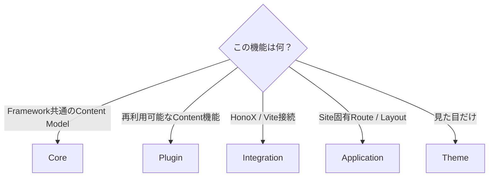

Plugin に向いているものは、

- Markdown / HTML の解釈
- 再利用可能な Content Transformation
- Plugin 固有 Renderer
- 再利用可能な Browser Behavior
- Plugin 固有 Diagnostics
- Plugin 固有 Endpoint
- SEO Extension
- 独立した Plugin Page

などです。

一方、

```text
Framework-wide Content Model
  → Core

HonoX / Vite 接続
  → Integration

Application 固有 Route / Layout
  → Site Application

見た目だけの変更
  → Theme
```

とします。

# Plugin 設計の基本

Plugin System 全体をまとめると、次のようになります。

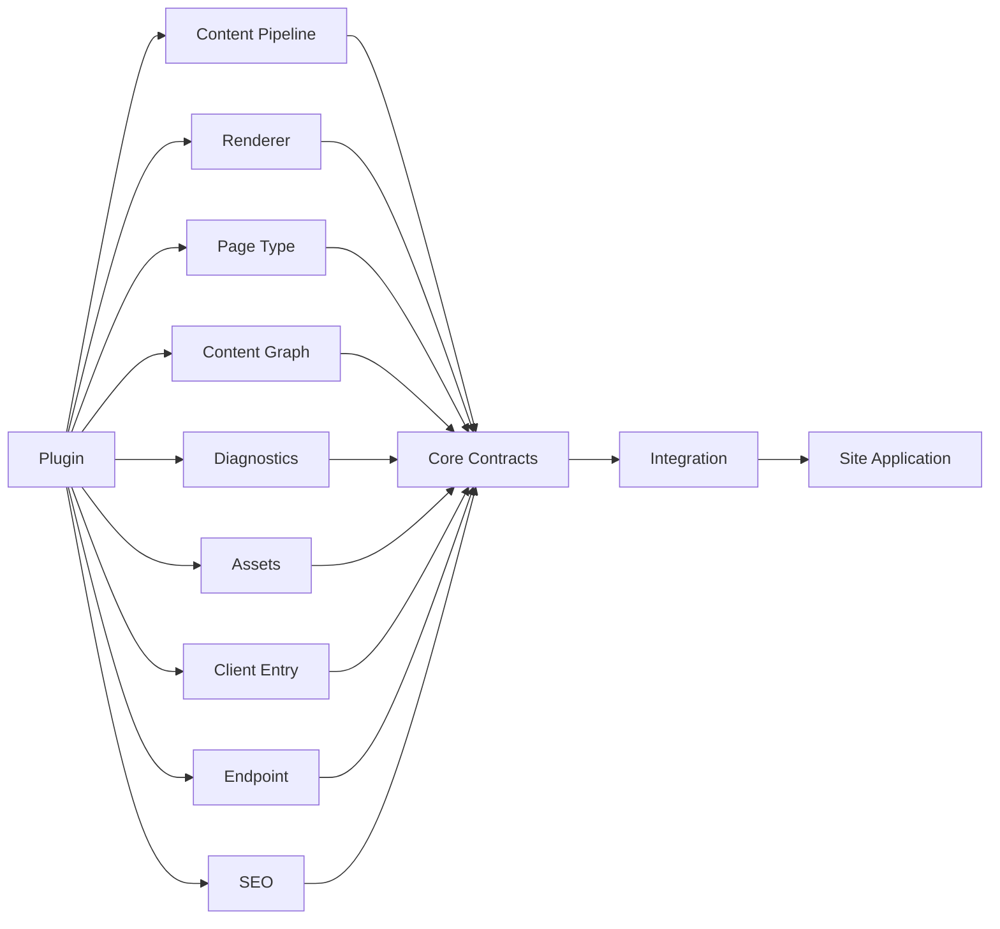

基本原則は、**必要な最小の Extension Point を使い、すでに Framework が解決した情報を Plugin 側で再構築しないこと**です。

Plugin は再利用可能な機能を提供し、Core はそのための Contract を提供します。Integration は Framework や Platform へ接続し、Site Application が最終的な Route、Document、UI を所有します。

## 関連

- [Architecture](../framework/architecture.md)
- [Content System](../framework/content-system.md)
- [Page System](../framework/page-system.md)
- [Observability](../framework/observability.md)
- [Theme System](./theme-api.md)
- [Framework Reference](./README.md)
