# 記事とサイトのリポジトリ分離 — 詳細編

このページでは、Riebeckite で **Content と Site を分離して運用するときの詳しい仕組み**を説明します。

初めて分離構成を作る場合は、先に [記事とサイトのリポジトリ分離](../content-repositories.md) を読んでください。

このページでは、そこから一歩踏み込んで、

- `appRoot` / `configRoot` / `contentRoot`
- 外部 Vault の Path 解決
- 1つの Vault を複数 Site で使う構成
- CI で別 Repository を取得する方法
- Private Repository の認証
- Git Submodule
- `publishStrategy` と `exclude`
- Attachment の公開
- 問題が起きたときの調査方法

を扱います。

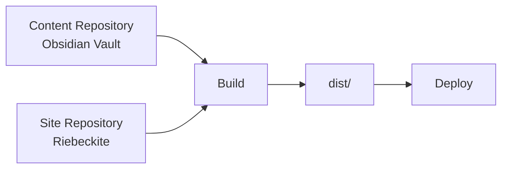

重要なのは、**Content の保存場所と、Riebeckite Application の場所は別にできる**ということです。

# 1. 外部 Vault が使える仕組み

Riebeckite では、

```ts id="2k5h0f"
content: {
  directory: "../vault",
},
```

のように、Site の外にある Directory を Content として指定できます。

この Path がどこを基準に解決されるかを理解するには、3つの Root を区別します。

| Root | 役割 | 基準 |
| --- | --- | --- |
| `appRoot` | HonoX / Vite Application | Vite の `root` |
| `configRoot` | `riebeckite.config.ts` がある Directory | 通常は `appRoot` |
| `contentRoot` | 実際に Content を読む Directory | `path.resolve(appRoot, content.directory)` |

最も重要なのは、

**相対 `content.directory` は `appRoot` を基準に解決される**

という点です。

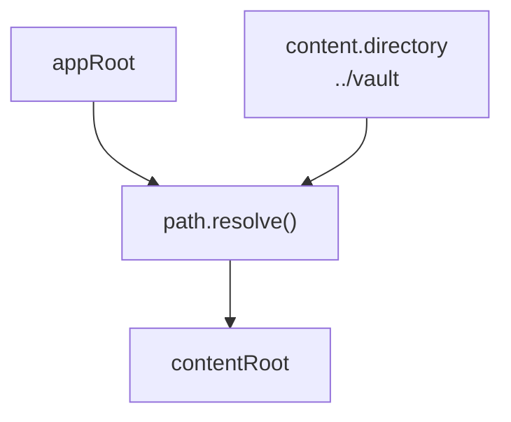

たとえば、

```text id="zmvy0v"
workspace/
├─ vault/
└─ site/          ← appRoot
   ├─ app/
   ├─ public/
   └─ riebeckite.config.ts
```

なら、

```ts id="0btcdw"
export default defineConfig({
  content: {
    directory: "../vault",
  },
});
```

と指定できます。

# `process.cwd()` は基準ではない

`content.directory` を、

```ts id="5r4v23"
process.cwd()
```

から独自に組み立てないでください。

CLI を実行した場所によって Content Root が変わってしまいます。

```text id="62ipd3"
使わない
  → process.cwd()

基準
  → appRoot
```

また、Vault を Site の外に置くために `appRoot` 自体を Vault へ変更するのも避けます。

`appRoot` は Application の Root です。

```text id="z24s1v"
appRoot
├─ app/
├─ public/
├─ route
├─ generated style
└─ build output
```

Vault は Application ではなく **Content Source** です。

```text id="u5fzdb"
Site
  → appRoot

Vault
  → contentRoot
```

として分離します。

# 2. Root が決まるまで

CLI では、まず Riebeckite Config を探します。

概念的な流れは次のとおりです。

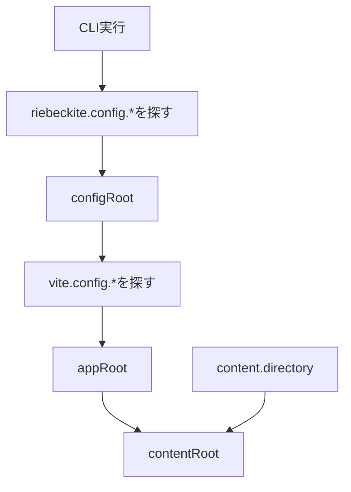

## Config を探す

CLI は実行した Working Directory から親へ、

```text id="wjavmb"
riebeckite.config.ts
riebeckite.config.js
riebeckite.config.mjs
```

を探します。

最初に見つかった Config の Directory が `configRoot` になります。

見つからなければ、

```text id="sjj16r"
Could not find riebeckite.config.*
```

で失敗します。

## `appRoot` を決める

次に `configRoot` の下から、

```text id="q74qlm"
vite.config.ts
vite.config.js
vite.config.mjs
```

を探します。

`node_modules`、`.git`、`tests` は探索対象外です。

Vite Application が見つからなければ Error になります。

複数見つかった場合も、

```text id="y62ikq"
Found multiple Vite applications
```

として失敗します。

これは Riebeckite が「どの Application を使うべきか」を一意に判断できないためです。

## `contentRoot` を決める

最後に、

```ts id="9h2i4n"
path.resolve(appRoot, content.directory)
```

によって `contentRoot` を解決します。

絶対 Path を指定した場合も、最終的には同じ Content Root として扱われます。

# Config を Application の外に置く場合

`riebeckite.config.ts` を Vite Application の外に意図的に置く構成では、`riebeckiteVite()` に、

```text id="c8kv96"
configRoot
appRoot
```

を明示できます。

ただし、その場合でも相対 `content.directory` の基準は `appRoot` です。

```text id="lpt0pf"
configRoot
   ≠
content.directoryの基準

content.directory
   ↓
appRootを基準に解決
```

# 3. Repository 構成の3パターン

Content と Site の配置は、大きく3つに分けられます。

| パターン | 構成 | 向いているケース |
| --- | --- | --- |
| A | Site と Content が同じ Repository | 最も単純な個人 Site |
| B | 同じ Repository 内で Directory を分離 | 履歴は共有しつつ場所を分けたい |
| C | Content と Site が別 Repository | Private Vault、独立した更新 |

## A. 1 Repository

```text id="1z6dgc"
blog/
├─ riebeckite.config.ts
├─ app/
├─ public/
└─ content/
   └─ index.md
```

設定は、

```ts id="fbb2ag"
content: {
  directory: "content",
},
```

です。

`create-riebeckite` で作成する基本構成です。

# B. 同じ Repository 内で分離

```text id="0xlm9v"
notes-repo/
├─ site/
│  └─ riebeckite.config.ts
│
└─ vault/
```

Site 側から、

```ts id="ejcc13"
content: {
  directory: "../vault",
},
```

と指定します。

Git Repository は同じですが、

```text id="6d3m50"
Application
Content
```

の Directory を分けられます。

# C. 別 Repository

```text id="r2wghf"
Content Repository
  → Private Vault

Site Repository
  → Public Riebeckite Site
```

という構成です。

記事を Private Repository にしたい場合や、Content と Site の更新を独立させたい場合に向いています。

CI では、Site Repository だけでなく Content Repository も取得する必要があります。

# 4. 1つの Vault を複数 Site で使う

外部 Vault は、複数の Site から利用することもできます。

```text id="uwhz12"
workspace/
├─ notes/       ← 共有Vault
├─ blog/
└─ docs/
```

それぞれ、

```ts id="a6p3yu"
content: {
  directory: "../notes",
},
```

のように設定できます。

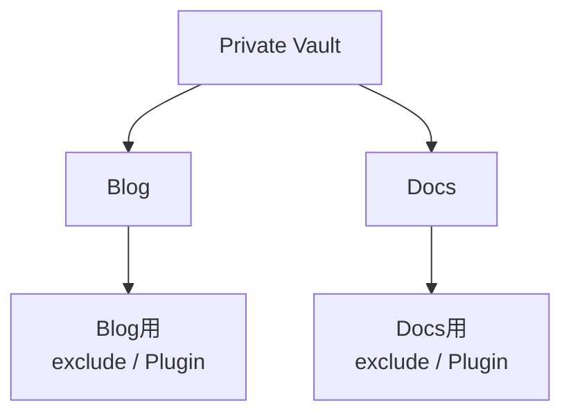

Vault は読み取り専用の Source として扱います。

各 Site はそれぞれ、

- `exclude`
- `publishStrategy`
- Plugin
- Theme
- Deployment

を独立して設定できます。

つまり、同じ Note を元にしていても、Site ごとに異なる公開範囲や見せ方を設定できます。

# 5. Private Vault の基本設定

Private Repository の Vault を使う場合は、**公開対象を明示する方式**が扱いやすくなります。

既定の、

```text id="14wd1h"
publishStrategy: explicit
```

を利用できます。

公開する Note にだけ、

```yaml id="81bl75"
publish: true
```

を指定します。

さらに、明らかに Site で利用しない Directory は `exclude` します。

```ts id="l29bqk"
content: {
  directory: "../notes",

  exclude: [
    ".obsidian/**",
    "Templates/**",
    "private/**",
  ],
},
```

考え方としては、

```text id="2psu77"
exclude
  → そもそも読み込ませない

publishStrategy
  → 読み込んだContentから公開対象を決める
```

という違いです。

# 6. `.obsidian/` の扱い

Obsidian Vault には、

```text id="4v27t6"
.obsidian/
```

があります。

これは Obsidian の設定 Directory なので、Riebeckite の Content として扱わない場合は、

```ts id="jxuwz3"
exclude: [
  ".obsidian/**",
],
```

に追加します。

Git には残しつつ Site から除外することもできます。

Obsidian の Workspace 状態だけ Git に含めたくない場合は、`.gitignore` で、

```text id="cv48fa"
.obsidian/workspace*.json
```

を除外する方法もあります。

# 7. `publishStrategy`

Riebeckite の公開判定には、

```text id="vgk6x6"
explicit
selective
```

があります。

| 値 | 公開条件 | 考え方 |
| --- | --- | --- |
| `explicit` | `publish: true` | 公開するものを選ぶ |
| `selective` | `private: true` でも `draft: true` でもない | 非公開にするものを選ぶ |

Private Vault では、既定の `explicit` が扱いやすい構成です。

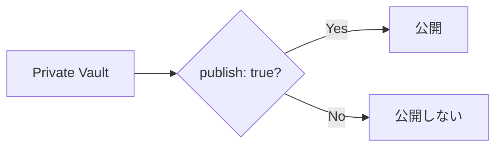

公開判定は Riebeckite の `isPublished` / `isPublishable` に集約されています。

Site 側で独自の公開判定を作らず、Riebeckite の公開規則を利用してください。

これによって、

```text id="e3z54c"
Page
Diagnostics
Asset Collection
```

などで公開判定がずれることを防げます。

# 8. `exclude` の Pattern

`exclude` は `contentRoot` からの相対 Path に対して適用されます。

Path Separator は `/` に正規化されます。

注意したいのは、Pattern が **Path 全体に Anchor される**ことです。

| Pattern | Match | Match しない |
| --- | --- | --- |
| `.obsidian/**` | `.obsidian/app.json` | `notes/.obsidian/app.json` |
| `**/.obsidian/**` | どちらにも Match | — |
| `Templates/**` | `Templates/daily.md` | `notes/Templates/daily.md` |
| `**/Templates/**` | どちらにも Match | — |
| `private/**` | `private/secret.md` | `notes/private/secret.md` |

`*` は1 Segment 内、

```text id="n6yd53"
*
```

`**` は複数 Segment をまたいで Match します。

```text id="r38f8w"
**
```

同名 Directory が Subdirectory にも現れる可能性がある場合は、

```text id="4k5csf"
**/private/**
**/templates/**
```

のように指定すると確実です。

`exclude` は Content を読み込む前に適用されます。

そのため、除外された Note は、

- Link Resolution
- Content Graph
- Query
- Publication

などにも現れません。

# 9. CI では Content を取得する必要がある

Site と Content が別 Repository の場合、Site Repository の Workflow を開始しただけでは Vault は存在しません。

```text id="s7pl0c"
GitHub Actions Runner

Site Repository
  → ある

Content Repository
  → まだない
```

そのため、Build 前に Content Repository を Checkout します。

```yaml id="c66xzk"
- name: Check out the site
  uses: actions/checkout@v4

- name: Check out the notes
  uses: actions/checkout@v4
  with:
    repository: <you>/notes
    token: ${{ secrets.RIEBECKITE_CONTENT_READ_TOKEN || github.token }}
    path: content
```

この場合、Runner 上では、

```text id="v2r5x6"
site/
├─ app/
├─ riebeckite.config.ts
└─ content/        ← Content Repository
```

という形になります。

Config も、

```ts id="m20ehm"
content: {
  directory: "content",
},
```

に合わせます。

# 10. Checkout と Deploy Trigger は別物

ここは特に重要です。

```text id="x7b6a3"
Content RepositoryをCheckoutする
        ≠
Content更新時にBuildを開始する
```

Checkout は、

**Workflow が始まった後に Content を読めるようにする設定**

です。

一方、Content Repository への Push から Site を自動 Deploy したい場合は、

**Site Workflow を開始する仕組み**

も必要です。

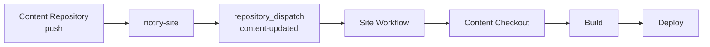

つまり、Repository を分離した自動 Deployment には、

```text id="dgwqrv"
1. Site Workflowを起動する
2. Content Repositoryを取得する
```

という2つの仕組みが必要です。

# 11. Private Repository の認証

Content Repository が Private または Internal の場合は、専用の認証が必要です。

通常の `github.token` は、現在実行中の Repository を対象とします。

別の Private Repository を読むためには、Site Repository に、

```text id="i8c2y6"
RIEBECKITE_CONTENT_READ_TOKEN
```

を登録します。

この Token は Content Repository を読むためだけに利用します。

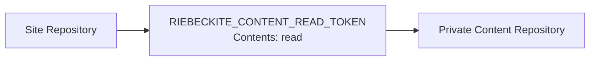

Fine-grained PAT を使う場合は、対象を Vault Repository に限定し、

```text id="6ulddm"
Contents: read
```

を与えます。

同等の Read-only GitHub App Installation Token でも構いません。

# 12. Content から Site を起動する認証

逆方向の、

```text id="12ozs6"
Content Repository
      ↓
Site Repositoryを起動
```

には別の Token を使います。

Content Repository 側に、

```text id="wq63pe"
SITE_DISPATCH_TOKEN
```

を登録します。

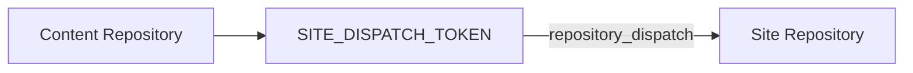

Fine-grained PAT を利用する場合は、Site Repository だけを対象に必要な権限を与えます。

元の構成では、

```text id="zyx6fq"
Contents: read and write
```

を利用します。

Classic PAT なら `repo` Scope、GitHub App Token なら `Contents: write` が必要です。

重要なのは、2つの Token の役割を混ぜないことです。

```text id="zhft93"
RIEBECKITE_CONTENT_READ_TOKEN
  → SiteからPrivate Contentを読む

SITE_DISPATCH_TOKEN
  → ContentからSiteのWorkflowを起動する
```

# 13. Content の Version を固定するか

追加 Checkout で特定の `ref` を指定しなければ、Content Repository の Default Branch の最新状態を取得できます。

記事更新をそのまま Site に反映する運用なら、この方法が扱いやすくなります。

```text id="v84yd1"
Content main
   ↓
push
   ↓
Site Workflow
   ↓
その時点の最新Content
```

既定の `fetch-depth: 1` で十分です。

一方、Site が使用する Content の Commit を明示的に固定したい場合は Git Submodule という選択肢があります。

# 14. Git Submodule を使う

Site Repository から Content Repository を Submodule として登録できます。

```sh id="d1a6sp"
cd my-site
git submodule add git@github.com:<you>/notes.git content
```

Config は、

```ts id="3b21ny"
content: {
  directory: "content",
},
```

とします。

CI では、

```yaml id="t7w03x"
uses: actions/checkout@v4
with:
  submodules: recursive
```

のように Submodule も取得します。

# Submodule の注意点

Submodule は Content Repository の **特定 Commit** を Site Repository に記録します。

そのため、

```text id="6dfjui"
Content Repositoryを更新
        ↓
SiteのSubmodule参照
        ↓
自動では変わらない
```

という特徴があります。

新しい Content を利用するには Site 側でも、

```sh id="f9tyn1"
cd content
git pull

cd ..
git add content
git commit -m "記事を更新"
```

のように参照を更新します。

`git submodule update --remote` を利用することもできますが、最終的には Site Repository 側で新しい Submodule Commit を記録する必要があります。

# 追加 Checkout と Submodule

| 観点 | 追加 Checkout | Submodule |
| --- | --- | --- |
| Content Push から自動 Deploy | Dispatch を設定すれば可能 | Site 側の参照更新が必要 |
| Content の取得先 | Workflow で決める | `content` など |
| Version | Branch の最新へ追従しやすい | Commit 単位で固定 |
| 手元の操作 | 通常の Clone で済みやすい | Submodule 操作が必要 |
| 向いているケース | Content 更新が中心 | Content Version を Site 側で固定したい |

記事を頻繁に更新する Site なら、追加 Checkout と Repository Dispatch の構成が扱いやすくなります。

Content の Version を Site Repository から厳密に固定したい場合は Submodule が利用できます。

# 15. 手元と CI の Directory

相対 `content.directory` は `appRoot` 基準です。

そのため、手元と CI で Directory 構成が違えば、設定する Path も変わります。

| 環境 | 配置 | `directory` |
| --- | --- | --- |
| 手元 | `workspace/notes` と `workspace/my-site` | `"../notes"` |
| CI | `my-site/notes` | `"notes"` |
| Submodule | `my-site/content` | `"content"` |

たとえば手元では、

```text id="b6hw5j"
workspace/
├─ notes/
└─ my-site/
```

なので、

```ts id="we09iz"
directory: "../notes"
```

となります。

一方 CI で、

```text id="17ihg4"
my-site/
├─ app/
├─ notes/
└─ riebeckite.config.ts
```

と Checkout したなら、

```ts id="44c17n"
directory: "notes"
```

です。

重要なのは、どちらも **`appRoot` から Content Root への Path** になっていることです。

可能なら、Local と CI の Layout を揃えておくと設定を単純にできます。

# 16. Attachment は自動コピーされない

Obsidian の、

```md id="uuzvg8"
![[attachments/x.png]]
```

のような Embed は、公開 URL を生成できます。

ただし、

**Vault にある File 自体が自動的に Public Directory へコピーされるわけではありません。**

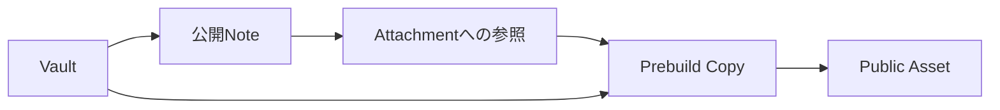

公開する Attachment は Site 側の Prebuild 処理でコピーします。

Riebeckite Repository では、

```text id="zg82a6"
apps/web/scripts/build_images.ts
```

が参照実装です。

`prebuild` から、

```text id="i8x6l5"
tsx scripts/build_images.ts
```

として実行します。

# 17. 公開する Asset だけをコピーする

Vault 全体を `public/` へコピーするのは避けてください。

参照実装では、

1. `contentRoot` 内の画像・Attachment を調べる
2. `ContentManager` で公開 Content を Build する
3. 公開 Note から参照されている Asset を集める
4. 必要な Asset だけ Public Directory へコピーする
5. Public 側に残った不要な Attachment を削除する

という流れになります。

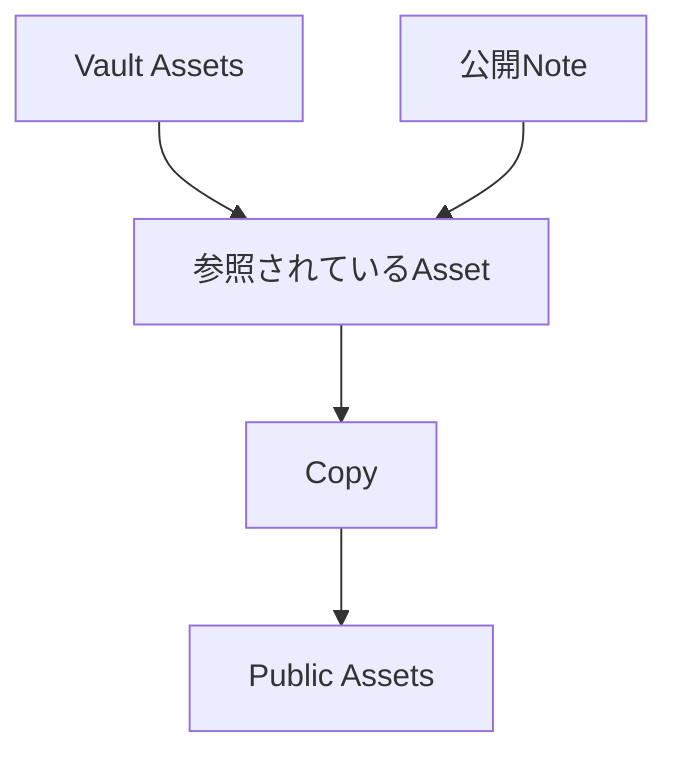

つまり、

```text id="a01vl2"
Vaultに存在する
  → コピー
```

ではなく、

```text id="fzcy4e"
公開Noteから参照されている
  → コピー
```

です。

Vault 全体をコピーすると、

- 非公開 Note の Attachment
- 未使用 Attachment
- `.obsidian` Metadata

などを誤って公開する可能性があります。

# 18. Attachment の Public URL

Attachment は安定した形式として、

```text id="6zxxa5"
/assets/attachments/<Vaultからの相対logical path>
```

を利用します。

たとえば、

```text id="9tix0h"
Vault:
attachments/diagram.png

Public URL:
/assets/attachments/attachments/diagram.png
```

のように、Vault Root からの Logical Path を基準にします。

`attachment()` は解決済み Vault Root から File Size を読み、Root 外への Path を拒否します。

`media()` も同じ Logical Path を使って Audio / Video を描画します。

Public Directory 上の物理配置と URL の対応を揃えておくことで、Build 後の 404 を避けやすくなります。

# 19. 公開境界を考える

Repository を Private にすることと、Riebeckite で何を公開するかは別の問題です。

```text id="m8k1eg"
Repository Visibility
  → Git Repositoryを誰が読めるか

Riebeckite Publication
  → Siteに何を出すか
```

Private Vault を利用していても、Build 時に誤って非公開情報を Public Output へコピーすれば公開されてしまいます。

そのため、

```text id="fvv40k"
exclude
      +
publishStrategy
      +
公開Noteだけを対象にしたAsset Copy
```

の3つを揃えて考えます。

特に Asset は Vault 全体をそのまま `public/` へコピーしないようにしてください。

# 20. 検証する

Root、Content、公開境界を確認するときは、次の順番で調べます。

```sh id="w4tr7v"
pnpm exec riebeckite check
pnpm exec riebeckite doctor
pnpm exec riebeckite inspect config
pnpm exec riebeckite inspect content --list
pnpm exec riebeckite inspect graph
pnpm exec riebeckite build
```

## `check`

```sh id="9j1jjc"
pnpm exec riebeckite check
```

Config と Plugin Contract を検証します。

## `doctor`

```sh id="cxapj6"
pnpm exec riebeckite doctor
```

読み込めない Content Source や、不正な Filesystem Content Source などを確認します。

## `inspect config`

```sh id="ph34ym"
pnpm exec riebeckite inspect config
```

まずここで、

```text id="lv98pb"
Directory
Publishing
Exclude
```

を確認します。

`Directory` は解決済みの絶対 Path です。

ここで Riebeckite が本当に目的の Vault を見ているか確認します。

## `inspect content --list`

```sh id="v3e8bp"
pnpm exec riebeckite inspect content --list
```

期待している Logical Path が Content として読み込まれているか確認します。

WikiLink や Embed を調査する前に、まず Content 自体が存在するか確認してください。

## `inspect graph`

```sh id="ll3gqv"
pnpm exec riebeckite inspect graph
```

除外したはずの Note が Graph に残っていないか確認できます。

## `build`

最後に、

```sh id="1f83u0"
pnpm exec riebeckite build
```

で Integration と Route Rendering を含む実際の Build を確認します。

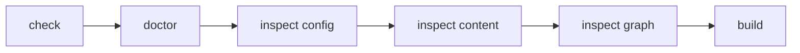

# 21. Working Directory に依存していないか確認する

Root Resolution の問題を調べる場合は、Site Root だけでなく Nested Directory から CLI を実行してみる方法もあります。

たとえば、

```sh id="kps5t4"
cd site/app

pnpm exec riebeckite inspect config
pnpm exec riebeckite inspect content --list
```

としても同じ Application / Vault が解決されることを確認します。

ただし、無関係な Directory から実行した場合は Config 自体を発見できないことがあります。

# トラブルシューティング

| 症状 | 確認すること |
| --- | --- |
| 記事が表示されない | `publish: true`、`content.exclude`、`inspect content --list` |
| `doctor` が Content Source を報告する | `inspect config` で解決済み Directory を確認 |
| `Could not find riebeckite.config.*` | CLI を Site の外から実行していないか |
| `Found multiple Vite applications` | `vite.config.*` が複数ないか |
| CI で Vault が見つからない | Content の追加 Checkout または Submodule |
| Private Vault を Checkout できない | Read Token と権限 |
| Submodule が CI にない | `submodules: recursive` |
| Submodule の記事が古い | Site 側の Submodule Commit を更新 |
| Deploy 後に画像が 404 | Prebuild Copy と Public Asset Path |
| Vault にある画像がコピーされない | 参照元 Note が公開対象か |
| Local では動くが CI では Path が違う | `appRoot` と Checkout 先 |
| `exclude` が効かない | Pattern の Anchor と `**/` |

# よくある Path の問題

Content が見つからない場合は、まず、

```text id="pyg3ml"
「今どこからCommandを実行しているか」
```

ではなく、

```text id="87zq5k"
「RiebeckiteがどのappRootを解決したか」
```

を確認します。

そのために、

```sh id="znwr0s"
pnpm exec riebeckite inspect config
```

を利用します。

相対 `content.directory` の基準は `appRoot` です。

```text id="cwrpf3"
process.cwd()
  ×

configRoot
  ×

appRoot
  ○
```

# よくある CI の問題

CI の問題は、

```text id="9trzt9"
Workflowが起動しない
```

のか、

```text id="uj6ym6"
Workflowは起動するがContentがない
```

のかを最初に分けます。

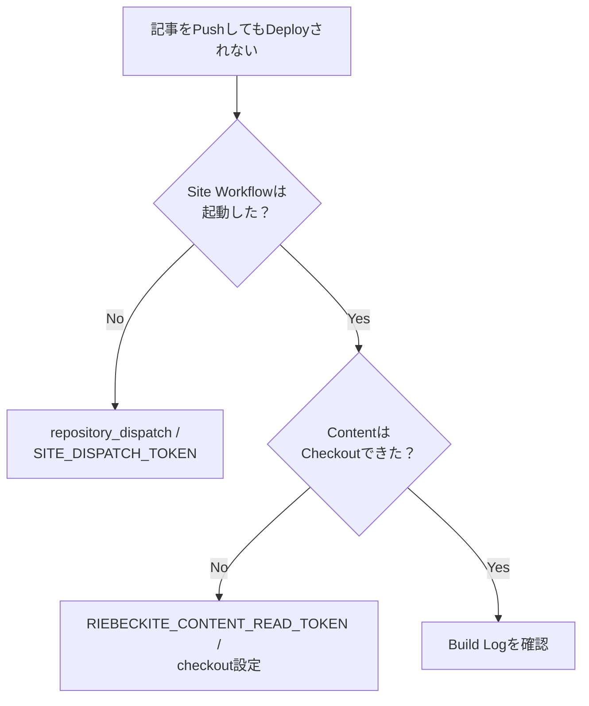

この2つは別の仕組みなので、問題を切り分けて確認してください。

# まとめ

Content と Site を分離するときは、4つの境界を分けて考えると整理しやすくなります。

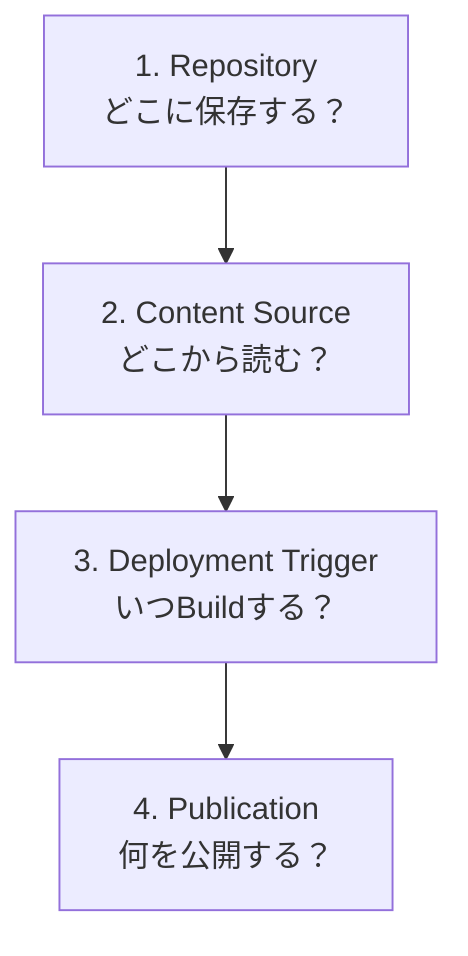

それぞれ、

```text id="t4vkse"
Repository
  → ContentとSiteをどこに保存するか

content.directory
  → RiebeckiteがどこからContentを読むか

Checkout / repository_dispatch
  → CIでどう取得し、いつBuildするか

publishStrategy / exclude / Asset Copy
  → 何をPublic Siteへ出すか
```

を担当します。

特に重要なのは、

```text id="77cb3h"
Content RepositoryをPrivateにする
        ≠
自動的に公開境界が安全になる
```

という点です。

Private Vault を利用する場合でも、`publishStrategy`、`exclude`、Asset Copy のすべてで Public Boundary を維持してください。

## 関連資料

- [記事とサイトのリポジトリ分離](../content-repositories.md) — 分離構成を最初から作る
- [Configuration](../../reference/configuration.md) — Root Resolution と外部 Vault
- [利用ガイド](../README.md) — Content / Asset の基本的な扱い
- [Cloudflare デプロイテンプレート](../../../../templates/cloudflare/README_ja.md) — Deployment Workflow
- [`tests/external-site/fixture/site`](../../../../tests/external-site/fixture/site) — 外部 Vault を利用する E2E 構成例
